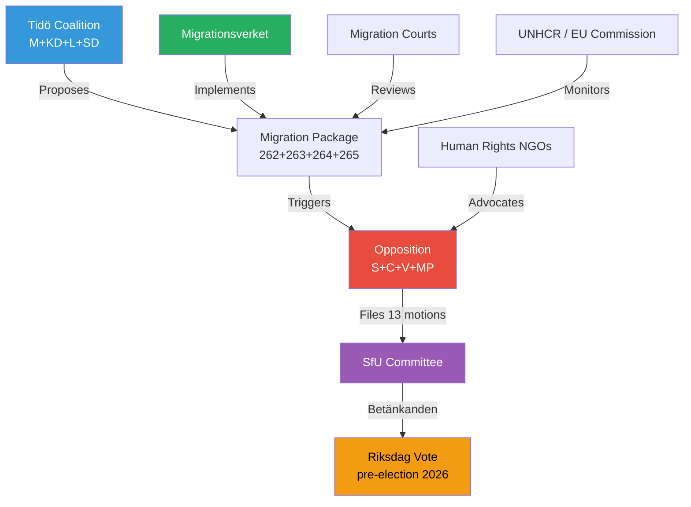

# Stakeholder Perspectives — Opposition Motions 2026-05-15

## Stakeholder Map

## Political Party Stakeholders

### Socialdemokraterna (S) — 6 motions
**Position**: Broad-based opposition to the migration package. HD024151 supports political transparency (party funding) while HD024152-155, 162 challenge migration and social policy. The S strategy appears to be defending pre-2022 standards while building election momentum through a rights-and-welfare narrative.
**Key demand** (HD024153): Reject permanent residence abolition — frame it as breaking Sweden's social compact with long-term residents.
**Electoral interest**: S polling ~30% in 2026; migration was a weakness in 2022. This batch signals S is willing to fight on migration rather than cede the ground to SD.

### Centerpartiet (C) — 5 motions
**Position**: Nuanced — supports stricter border control in principle but opposes rights violations. HD024157 (full rejection, prop. 262) and HD024160 (ECHR compliance, prop. 265) show C is not uniformly maximalist but has clear red lines on fundamental rights.
**Key demand** (HD024160): Ensure ECHR compliance in detention regulations — prop. 265 lacks sufficient judicial safeguards.
**Electoral interest**: C polling ~5-6%; finding a distinctive centrist voice between S's welfare emphasis and V/MP's rights emphasis is strategically important.

### Vänsterpartiet (V) — 5 motions
**Position**: Most oppositional — HD024167, 168, 169, 182 all call for full rejection. Malcolm Momodou Jallow's motions (HD024167-169) combine human rights and anti-detention arguments. V's ideological consistency provides left flank for the opposition bloc.
**Key demand**: Full rejection of all detention expansion and return enforcement measures.
**Electoral interest**: V polling ~7%; maximalist migration position aligns with core constituency but limits coalition utility if government seeks compromise.

### Miljöpartiet (MP) — 2 motions
**Position**: Rights-focused on migration (HD024173) and oversight-focused on defence (HD024176). MP's migration motion (HD024173) is amendatory rather than rejecting — seeks procedural safeguards on return enforcement.
**Electoral interest**: MP polls near 4% threshold; maintains distinct green/humanitarian identity through both HD024173 and HD024176.

## Institutional Stakeholders

### Migrationsverket
**Impact**: All five migration propositions directly affect Migrationsverket's mandate — expanded return powers, abolition of permanent permits (internal processing), and character assessment requirements all increase administrative burden.
**Statskontoret relevance**: Statskontoret pre-warm conducted. No directly relevant Statskontoret report found on Migrationsverket implementation capacity for this specific package as of 2026-05-15T08:00Z. Note: Statskontoret has previously published studies on migration agency efficiency (2022-2023 cycle) — those reports are relevant as background but not directly applicable to this specific package.
**Opposition position** (HD024152, S): Critiques the return mechanism as underfunded and legally vulnerable.

### Lagrådet (Council on Legislation)
**Impact**: Props. 262 and 265 (fundamental rights dimension) should trigger mandatory Lagrådet referral. Status as of 2026-05-15: Lagrådet tracking — site unreachable during this run (transient outage 2026-05-15T08:05Z). **Lagrådet: site unreachable as of 2026-05-15T08:05Z**. Referral status: pending. Expected referral window: April-May 2026 for legislation targeting autumn 2026 committee votes.

### EU Commission / UNHCR
**Impact**: Swedish migration tightening is monitored as part of EU-wide migration governance. Any ECHR-incompatible detention rules (HD024160, 167) could generate Commission infringement risk.
**Relevance**: This provides the opposition with an external validation argument in their campaign framing.

## Civil Society

**Human rights organisations** (FARR, Amnesty Sverige, Civil Rights Defenders) will mobilise against props. 262 and 265 — the abolition of permanent residence and expanded detention are their highest-priority concerns. These NGOs provide supporting evidence for the opposition's rights-based framing.

**Labour market organisations** (LO, TCO) have a sectoral interest in the migration debate — Swedish manufacturing and care sectors face documented labour shortfalls. Their position on props. 262-265 will likely be cautiously concerned about labour supply effects.
