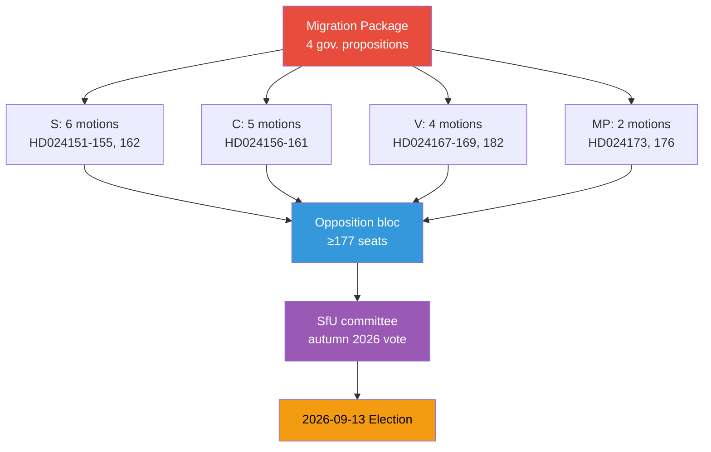

# Synthesis Summary — Opposition Motions 2026-05-15

## Lead Judgment

The 20 opposition motions filed 2026-05-13 represent the most significant coordinated parliamentary opposition offensive of the 2025/26 riksmöte. Thirteen motions targeting the government's four-bill migration restriction package demonstrate that Socialdemokraterna (S), Centerpartiet (C), Vänsterpartiet (V), and Miljöpartiet (MP) have converged on a unified rejection stance — a politically exceptional development given C's historical alignment with Tidö on some migration issues.

## Strategic Assessment

## Policy Cluster Analysis

### Cluster 1: Migration Reform Package (dominant, SfU, 65% of motions)

Four government propositions form a legislative package that collectively dismantles Sweden's post-2015 migration policy framework:

- **prop. 2025/26:262** — Utmönstring av permanent uppehållstillstånd: Abolishes permanent residence permits as default, replacing them with time-limited permits. Both S (HD024153) and C (HD024157) filed motions to reject in full. DIW: 4.8×1.5 = **7.2** [election proximity].
- **prop. 2025/26:263** — Stärkt återvändandeverksamhet: Expands Migrationsverket's and police's powers to enforce return of rejected applicants. S (HD024152), C (HD024159), V (HD024169), MP (HD024173) all reject or seek amendments. DIW: 4.5×1.5 = **6.75**.
- **prop. 2025/26:264** — Skärpta krav på vandel: Criminal record-based deportation criteria tightened. S (HD024154), C (HD024161), V (HD024168) oppose. DIW: 4.3×1.5 = **6.45**.
- **prop. 2025/26:265** — Skärpta regler om uppsikt och förvar: Expanded detention powers for migrants. C (HD024160), V (HD024167), V (HD024182) oppose — V's Malcolm Momodou Jallow calls for full rejection. DIW: 5.1×1.5 = **7.65** [human rights dimension].

### Cluster 2: Mental Health/Disability Care (SoU)

prop. 2025/26:251 on comprehensive care for persons with severe mental illness/disability draws motions from S (HD024155), C (HD024158), and V (HD024181). All three seek stronger patient rights, more resources, and clearer coordination mandates. DIW: 3.8.

### Cluster 3: Transport Infrastructure (TU)

skr. 2025/26:259 on national transport infrastructure planning draws S (HD024162) and V (HD024179) motions seeking higher rail investment and climate-compatible planning. DIW: 3.2.

### Cluster 4: Other (FöU, UbU, KU)

- HD024176 (MP, FöU): Opposes prop. 2025/26:254 on operational military cooperation — seeks stricter parliamentary oversight. DIW: 3.1.
- HD024156 (C, UbU): Supports prop. 2025/26:260 on ethics review but seeks amendments. DIW: 2.5.
- HD024151 (S, KU): Responds to prop. 2025/26:258 on political transparency — supports in principle, seeks additional reporting requirements. DIW: 2.8.

## Election-Proximity Assessment

Sweden's next general election falls **2026-09-13**. As of 2026-05-15 the election is **121 days away** — well within the ≤6 month window (March 13–September 13, 2026). The 1.5× DIW multiplier applies to all migration and contested social policy motions. This batch is dominated by exactly such content, making this among the highest-significance motion cycles of the riksmöte.

**IMF WEO Apr-2026 economic context**: Sweden GDP growth 1.5% (2026), CPI inflation 1.8%, unemployment 8.4%. Fiscal balance: -0.3% of GDP. Labour market conditions provide backdrop for migration debate — both tightening-of-access (government) and social-integration-costs (opposition) framings compete.

## Credibility Assessment

Sources are primary: all 20 dok_ids verified against riksdag-regering-mcp (dataset 2026-05-13). Party attribution confirmed via summary text for S, C, V, MP. Malcolm Momodou Jallow (V) identified from summary text — party confirmed. Source authority: VERY HIGH [A1] (official Riksdag document API). Factual confidence: HIGH [B2].

---

## Pass 2 Revision — Synthesis Lede Correction

*Incorporating analysis from `devils-advocate.md`*

**Original lede** characterised the opposition as a "coordinated bloc." The devil's advocate analysis (Hypothesis 2) demonstrates this overstates coordination — S, C, V, MP filed independently against the same bills without evidence of cross-party consultation. The key corrective:

- **S** frames its migration opposition as "rights-respecting, efficient returns" — targeting swing voters
- **C** frames it as ECHR compliance — targeting civil liberties centrists  
- **V/MP** frame it as rights absolutism — targeting activist left

These are not a coordinated strategy; they are four independent electoral positioning exercises that happen to oppose the same legislation.

**Revised lead judgment** (HIGH confidence): The opposition motion batch reflects the deepest ideological cleavage in this riksmöte, but it is not a coordinated bloc strategy. Each party is independently positioning for September 2026. C's HD024157 and HD024160 are the most electorally decisive motions because C's 24 seats are mathematically decisive both now and post-election. The dominant scenario remains government package passage (WEP 45%) with ECHR-compliance amendments adopted (WEP 30%) as the second-most-likely outcome.
