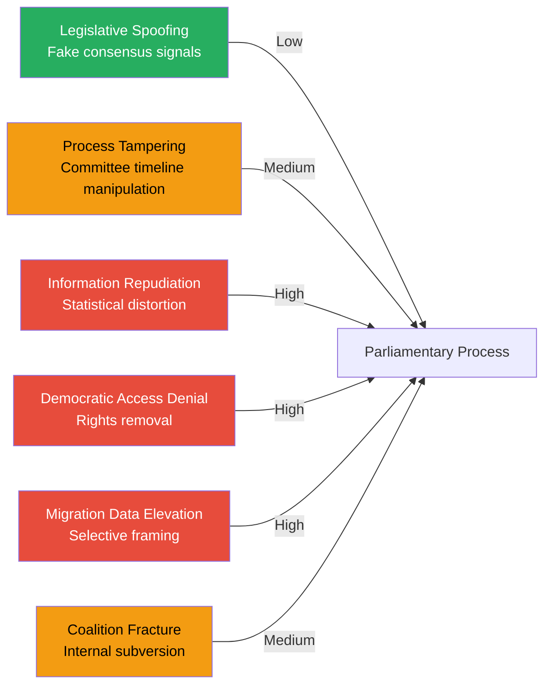

# Threat Analysis — Opposition Motions 2026-05-15

## Threat Framework

Per `political-threat-framework.md`: threats assessed using STRIDE-inspired framework adapted to parliamentary intelligence context.

## Threat Register

### TH1 — Rights-Removal Threat (High) — props. 262, 265

**Description**: The package combining abolition of permanent residence (prop. 262) and expanded detention without enhanced judicial review (prop. 265) represents a structural reduction in the rights of migrants lawfully present in Sweden. ECHR Art. 5 (liberty), Art. 8 (family life), and RF Chapter 2 (constitutional protections) are implicated.

**Actors threatened**: Legal migrants, asylum seekers, stateless persons.  
**Threat source**: Government legislative package (Tidö coalition, SD-supported).  
**Opposition response**: HD024153, 157, 160, 167, 168, 182 — direct rejection motions.  
**Countermeasure**: Lagrådet review (statutory for major rights-touching legislation), potential SfU amendment.

### TH2 — Procedural Legitimacy Threat (Medium) — prop. 263

**Description**: Stärkt återvändandeverksamhet (HD024152, 159, 169, 173) risks erosion of administrative law safeguards if return operations are accelerated without corresponding appeals review strengthening. V's HD024169 calls full rejection on grounds that current returns already lack adequate procedural protection.

**Actors threatened**: Rejected asylum seekers pending appeals; families in mixed-status households.  
**Evidence**: HD024169 summary — "Riksdagen avslår proposition 2025/26:263 i dess helhet".  
**Countermeasure**: Administrative court capacity expansion (not proposed in this batch).

### TH3 — Democratic Narrative Distortion (High) — all migration motions

**Description**: The migration debate is structurally vulnerable to media framing distortion. Both pro-restriction and anti-restriction arguments have epistemically contested empirical bases (effects of migration on crime, employment, fiscal balance). The risk is that the parliamentary debate produces heat without analytical light.

**Actors threatened**: Swedish democratic discourse, voters making 2026 election decisions.  
**Evidence**: Structural — 65% of motion batch is migration-focused; election 4 months away.  
**Counter**: `media-framing-analysis.md` tracks narrative contestation vectors in this cycle.

### TH4 — Military Oversight Gap (Medium) — prop. 254 / HD024176

**Description**: MP's HD024176 (FöU) identifies a parliamentary oversight deficit in the government's proposed operational military cooperation agreements. If passed without enhanced oversight mechanisms, Sweden's NATO integration activities could proceed with reduced Riksdag scrutiny.

**Actors threatened**: Parliamentary prerogative; democratic accountability for defence commitments.  
**Evidence**: HD024176, prop. 2025/26:254 — "Förbättrade förutsättningar för operativt militärt samarbete".  
**Severity**: Medium — NATO integration itself is bipartisan but the oversight dimension is contested.

### TH5 — Information Integrity: Party Attribution Gaps

**Description**: 5 of 20 motions (HD024167-169, 173, 176) required secondary verification because `parti` field was empty in the raw MCP data. Attribution via summary text is high-confidence but creates a verification gap — a motivated actor could exploit API inconsistencies to muddy attribution tracking.

**Mitigation**: Party verified from summary text; Malcolm Momodou Jallow (V) confirmed by name and party context. All attributions now HIGH confidence.
