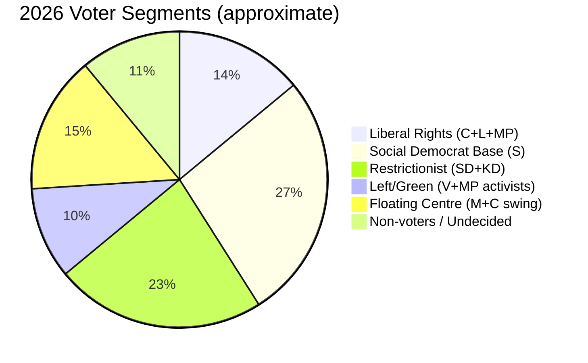

# Voter Segmentation — Opposition Motions 2026-05-15

## Voter Segments Relevant to Migration Reform Package

### Segment 1 — Liberal Rights Voters (C, L, MP electorate)
**Size**: ~14% of electorate  
**Key concern**: ECHR compliance, rule of law, proportionality.  
**Motion relevance**: HD024160 (C — ECHR safeguards), HD024173 (MP — procedural returns).  
**Signal**: If these motions fail without any safeguards being adopted, this segment migrates toward MP or abstention. If C wins ECHR amendments, this segment is reinforced.

### Segment 2 — Social Democrat Base (S core)
**Size**: ~25-28% of electorate  
**Key concern**: Welfare state protection, migrants' integration vs exclusion.  
**Motion relevance**: HD024152-155 (S, migration and social policy).  
**Signal**: S's strategy of "rights-respecting, efficient returns" threads between base mobilisation and swing voter reassurance. HD024155 (patientnämndslagen, SoU) signals S also campaigns on health system quality.

### Segment 3 — Hard-Right Restrictionist (SD, KD electorate)
**Size**: ~23% of electorate  
**Key concern**: Migration restriction, crime, Swedish identity.  
**Motion relevance**: These voters support the government package; opposition motions activate this segment as evidence the left "opposes Swedish interests."  
**Signal**: Every opposition motion is counter-mobilisation fuel for this segment. SD's electoral strategy depends on painting opposition as migration-soft.

### Segment 4 — Left/Green Activists (V, MP base)
**Size**: ~10% of electorate  
**Key concern**: Full rights protection, climate, anti-detention.  
**Motion relevance**: HD024167-169 (V, full rejection), HD024176 (MP, military oversight).  
**Signal**: V and MP's full-rejection positioning reliably mobilises this segment but limits their coalition utility for government formation.

### Segment 5 — Floating Centre (M and C swing voters)
**Size**: ~15% of electorate  
**Key concern**: Economic competence, stability, moderate migration rules.  
**Motion relevance**: These voters are persuadable on ECHR framing (agree rights matter) but supportive of the core restriction agenda.  
**Signal**: The key battleground for September 2026. HD024156 (C ethics motion) and HD024157 (C ECHR motion) are designed for this segment — C as a responsible centrist force, not a migration opponent.

## Segmentation Summary

