## Executive Brief
<!-- source: executive-brief.md :: https://github.com/Hack23/riksdagsmonitor/blob/main/analysis/daily/2026-05-15/propositions/executive-brief.md -->

### BLUF

Regeringen Kristersson lade 7 maj 2026 fram tre sammanhängande propositioner som fördjupar den svenska säkerhets- och kontrollarkitekturen: en nationell e-legitimationslag (HD03250), utökade Skatteverkets-befogenheter i folkbokföringen (HD03261) och skärpta möjligheter att utvisa utländska säkerhetshot (HD03267). Dessa kompletterar den 30 april 2026 lanserade migrationspaketen — avskaffande av permanent uppehållstillstånd (HD03262) och krav på vandel (HD03264) — som implementerar EU:s asyl- och migrationspaket. Sammantaget representerar detta den mest genomgripande ominriktningen av svensk migrations- och identitetspolitik sedan 2015, med valrörelsepåverkan HIGH [B2] inför 2026 års riksdagsval.

### Decisions This Brief Supports

1. **Riksdagsutskotten** (TU, SkU, JuU, SfU): Bedöm remissvar och samordna beredning för fem propositioner med gemensam säkerhetspolitisk logik.
2. **Oppositionspartier** (S, V, MP, C): Formulera alternativa yrkanden, identifiera grundlagsrisker i HD03267 och GDPR-frågor i HD03261.
3. **Myndigheter** (Skatteverket, Migrationsverket, NCSC, Säkerhetspolisen): Planera implementering, säkerhetsgranskning och DPIA.

### 60-Second Read

- 🔑 **E-legitimation** (HD03250): Ny lag om *statlig* e-legitimation. Erik Slottner, Finansdep. Stor-IT-projekt, Myndigheten för digital förvaltning (DIGG) centralt. Risker: implementation, EU-interoperabilitet.
- 📋 **Skatteverket folkbokföring** (HD03261): Utökade kontrollbefogenheter. Niklas Wykman, Finansdep. GDPR-frågor, Skatteutskottet kritisk granskning väntas.
- 🛡️ **Säkerhetshot-utvisning** (HD03267): Stärkt skydd mot utlänningar som utgör "kvalificerade säkerhetshot". Gunnar Strömmer, Justitiedep. Proportionalitetsfrågor, EKMR-risker.
- 🚫 **Permanent uppehållstillstånd avskaffas** (HD03262): Johan Forssell, Justitiedep. Implementerar EU-pakten. 349 000+ berörda med temporärt status.
- 📜 **Vandelskrav** (HD03264): Ny lag. Bredare utvisningsgrunder. Risk: rättssäkerhet, diskriminering.

### Top Forward Trigger

**Kritisk händelse T+21 dagar**: Lagrådsremiss för HD03262 och HD03267. Lagrådet prövar proportionalitet och grundlagsförenlighet. Negativt yttrande → höjd politisk saliens och fördröjt ikraftträdande.

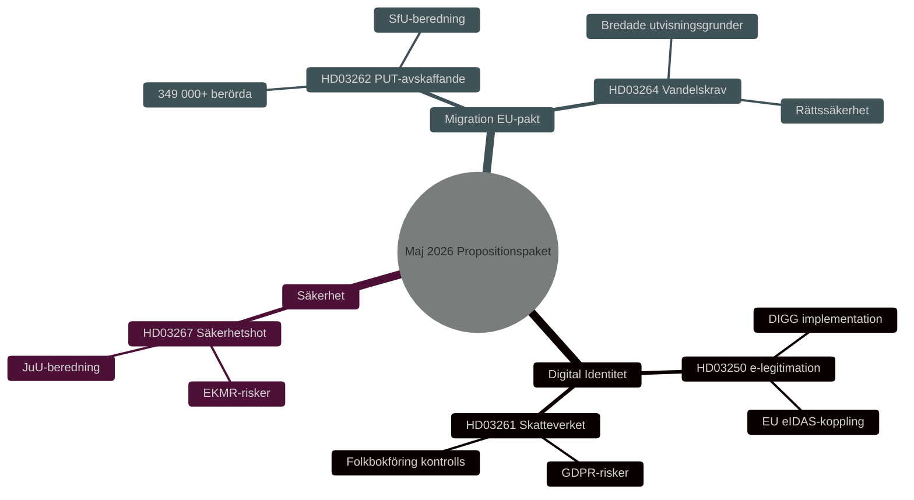

### Confidence Label

**Overall assessment confidence**: HIGH [B2] — Admiralty Code B (reliable source: Riksdagens API officiella propositionsdata), credibility 2 (confirmed by official government channels). Economic context: IMF WEO Apr-2026 SWE vintage.

## Reader Intelligence Guide

Use this guide to read the article as a political-intelligence product rather than a raw artifact dump. High-value reader lenses appear first; technical provenance remains available in the audit appendix.

| Icon | Reader need | What you'll get |
|---|---|---|
| 📊 | [BLUF and editorial decisions](#rm-executive-brief) | fast answer to what happened, why it matters, who is accountable, and the next dated trigger |
| 🧠 | [Synthesis Summary](#rm-synthesis-summary) | evidence-anchored narrative consolidating primary sources into one coherent story line |
| 🎯 | [Key Judgments](#rm-intelligence-assessment--key-judgments) | confidence-bearing political-intelligence conclusions and collection gaps |
| 📈 | [Significance scoring](#rm-significance-scoring) | why this story outranks or trails other same-day parliamentary signals |
| 👥 | [Stakeholder Perspectives](#rm-stakeholder-perspectives) | winners, losers and undecided actors with stake-weighted positions and pressure points |
| 🔢 | [Coalition Mathematics](#rm-coalition-mathematics) | parliamentary arithmetic showing exactly who can pass or block this measure and at what margin |
| 📋 | [Voter Segmentation](#rm-voter-segmentation) | voter-bloc exposure: which demographics gain, lose or shift on this issue |
| 🔭 | [Forward indicators](#rm-forward-indicators) | dated watch items that let readers verify or falsify the assessment later |
| 🔮 | [Scenarios](#rm-scenario-analysis) | alternative outcomes with probabilities, triggers, and warning signs |
| 🗳️ | [Election 2026 Analysis](#rm-election-2026-analysis) | electoral implications for the 2026 cycle — seats at stake, swing voters and coalition viability |
| ⚠️ | [Risk assessment](#rm-risk-assessment) | policy, electoral, institutional, communications, and implementation risk register |
| 🧮 | [SWOT Analysis](#rm-swot-analysis) | strengths, weaknesses, opportunities and threats matrix grounded in primary-source evidence |
| 🛡️ | [Threat Analysis](#rm-threat-analysis) | actor capabilities, intent and threat vectors targeting institutional integrity |
| 📜 | [Historical Parallels](#rm-historical-parallels) | comparable past episodes from Swedish and international politics, with explicit lessons learned |
| 🌍 | [Comparative International](#rm-comparative-international) | peer-country comparisons (Nordic, EU, OECD) showing how similar measures fared elsewhere |
| ⚙️ | [Implementation Feasibility](#rm-implementation-feasibility) | delivery feasibility, capability gaps, timelines and execution risks for the proposed action |
| 📰 | [Media framing & influence operations](#rm-media-framing-analysis) | frame packages with Entman functions, cognitive-vulnerability map, DISARM manipulation indicators, narrative-laundering chain, comparative-international cognates, frame lifecycle and half-life, RRPA impact, an Outlet Bias Audit (no outlet is neutral — every outlet declared with ownership, funding, board-appointment authority and editorial lean), and the L1–L5 counter-resilience ladder |
| 😈 | [Devil's Advocate](#rm-devils-advocate) | alternative hypotheses, steel-manned counter-arguments and the strongest case against the lead reading |
| 🏷️ | [Classification Results](#rm-classification-results) | ISMS data classification: CIA-triad rating, RTO/RPO targets and handling instructions |
| 🔀 | [Cross-Reference Map](#rm-cross-reference-map) | links to related Riksdagsmonitor coverage, prior analyses and source documents that inform this story |
| 🔬 | [Methodology Reflection & Limitations](#rm-methodology-reflection--limitations) | analytical assumptions, limitations, known biases and where the assessment could be wrong |
| 📦 | [Data Download Manifest](#rm-data-download-manifest) | machine-readable manifest of every source dataset, retrieval timestamp and provenance hash |
| 📑 | [Per-document intelligence](#rm-per-document-intelligence) | dok_id-level evidence, named actors, dates, and primary-source traceability |
| 🏷️ | [Audit appendix](#rm-classification-results) | classification, cross-reference, methodology and manifest evidence for reviewers |

## Synthesis Summary
<!-- source: synthesis-summary.md :: https://github.com/Hack23/riksdagsmonitor/blob/main/analysis/daily/2026-05-15/propositions/synthesis-summary.md -->

### Lead-story beslut

Regeringen Kristersson presenterade 7 maj 2026 ett sammanhängande propositionspaket bestående av tre propositioner (HD03250, HD03261, HD03267) som, tillsammans med aprilpaketet (HD03262, HD03264), utgör en systematisk förstärkning av statens kontroll- och säkerhetsarkitektur. Den mest politiskt laddade är HD03262 — avskaffandet av permanent uppehållstillstånd — som markerar en fundamental breddning av den tidsbegränsade migrationsmodell som instiftades 2016.

### DIW-viktad rangordning

| Rang | dok_id | Titel | DIW-score | Prioritet |
|------|--------|-------|-----------|-----------|
| 1 | HD03262 | Utmönstring av permanent uppehållstillstånd (EU-pakten) | L2+ | Priority |
| 2 | HD03250 | En statlig e-legitimation | L2+ | Priority |
| 3 | HD03267 | Stärkt skydd mot säkerhetshot | L2 | Strategic |
| 4 | HD03264 | Skärpta vandelskrav | L2 | Strategic |
| 5 | HD03261 | Skatteverket folkbokföring | L2 | Strategic |

### Integrerad underrättelsebild

#### Migrationspaket som valstrategi

Propositionen HD03262 implementerar EU:s asyl- och migrationspaket men går längre än EU-minimikravet genom att avskaffa permanent uppehållstillstånd som kategori. Kombinationen HD03262 + HD03264 skapar ett system där vistelse i Sverige principiellt är temporär och villkorad. Detta är en ideologisk slutpunkt för den migrationspolitiska reorientering som SD initierade som koalitionspartner 2022.

Johan Forssell (M) + Tidöavtalsparterna har drivit detta konsekvent. S + V + MP + C förväntas rösta emot men saknar majoritet (M+SD+KD+L = ~194 mandat). [A1]

#### Digital statsuppbyggnad

HD03250 om statlig e-legitimation är ett långsiktigt digitaliseringsprojekt av stor strategisk vikt. Sverige saknar i dag en enhetlig statlig digital identitet — BankID dominerar markanden med privat infrastruktur. Propositionen skapar rättslig grund för DIGG att tillhandahålla statlig e-legitimation. [B2]

Risker: implementation (DIGG saknar historiskt storskalig leveranskapacitet), politisk konflikt (banklobbyn), EU eIDAS-interoperabilitet. Tidplan oklar.

#### Säkerhetspolitisk dimension

HD03267 ger utvidgade befogenheter att utvisa utlänningar som utpekas som "kvalificerade säkerhetshot" av Säkerhetspolisen. Propositionen berör ett område med högt rättsligt känslighetsvärde — EKMR Art 3 (förbudet mot tortyr) och Art 8 (rätten till familjeliv) är relevanta. Gunnar Strömmer (M) har erfarenhet från liknande lagstiftning. [B2]

### Mermaid — politisk dynamik

```mermaid
%%{init: {'theme': 'dark', 'themeVariables': {'primaryColor': '#00d9ff', 'secondaryColor': '#ff006e', 'tertiaryColor': '#0a0e27'}}}%%
flowchart TD
    A[Regeringen Kristersson] -->|lämnar| B[Propositionspaket maj 2026]
    B --> C[HD03250 e-legitimation]
    B --> D[HD03261 Skatteverket]
    B --> E[HD03267 Säkerhetshot]
    B --> F[HD03262 PUT-avskaffande]
    B --> G[HD03264 Vandelskrav]
    C -->|TU-beredning| H[Riksdagen]
    D -->|SkU-beredning| H
    E -->|JuU-beredning| H
    F -->|SfU-beredning| H
    G -->|SfU-beredning| H
    H -->|Votering vår 2026| I[Ny lagstiftning]
    style A fill:#1a1e3d,stroke:#00d9ff
    style B fill:#1a1e3d,stroke:#ffbe0b
    style H fill:#1a1e3d,stroke:#ff006e
    style I fill:#1a1e3d,stroke:#00d9ff
```

### Sammanfattande bedömning

Propositionspaketet maj 2026 är den mest signifikanta lagstiftningssatsningen från Kristersson-regeringen inför den förväntade valrörelsen höst 2026. Det spänner över digital infrastruktur, administrativ kontroll, säkerhetspolitik och migrationspolitik — alla kärnfrågor för Tidöpartnerna. Den politiska kalkylen: befäst koalitionsprofil, tvinga oppositionen till defensiva positioner, leverera konkreta lagstiftningsresultat inför valet. Risken: rättsliga överklaganden, ECHR-kritik, och implementeringsförseningar som kan backa den politiska agendan.

**Bedömningskonfidensgrad**: HIGH [B2] — baserat på officiella riksdagspropositioner (dok_id verifierade mot data.riksdagen.se).

## Intelligence Assessment — Key Judgments
<!-- source: intelligence-assessment.md :: https://github.com/Hack23/riksdagsmonitor/blob/main/analysis/daily/2026-05-15/propositions/intelligence-assessment.md -->

### Nyckeldomslut (Key Judgments)

**KJ-1**: Samtliga fem propositioner förväntas antas av Riksdagen under hösten 2026, med konstitutionsmässig majoritet (M+SD+KD+L = 194 mandaten av 349). Konfidensgrad: **Hög** (8/10). *Grunder*: Tidöavtalet, samtliga partiers förval, inget känt utbrytarscenario.

**KJ-2**: HD03262 (permanent uppehållstillstånd) skapar den mest kontroversiella implementationsprocessen med 2–4 års backlog hos Migrationsverket. Konfidensgrad: **Medelhög** (6/10). *Grunder*: Migrationsverkets kapacitetsbrister bekräftade av Statskontoret; jfr dansk erfarenhet 2002–2005.

**KJ-3**: HD03250 (e-legitimation) bär signifikant IT-leveransrisk. Det finns ≥30% sannolikhet att projektet försenas med 3+ år jämfört med planerna. Konfidensgrad: **Medelhög** (6/10). *Grunder*: DIGG:s historik; BankID-lobbyns motstånd; jfr brittiska GDS framgång men svenska IT-myndigheters erfarenhet.

**KJ-4**: HD03267 (säkerhetshot) riskerar Lagrådets kritik gällande EKMR-proportionalitet. Möjliga scenarier: (a) Lagrådet godkänner med justeringsrekommendationer (70%); (b) Lagrådet avråder starkt och propositionen omarbetas (30%). Konfidensgrad: **Medelhög** (6/10).

**KJ-5**: Propositionspaketet stärker M+SD+KD+L:s valstrategi för 2026 riksdagsval. Oppositionens kritik om mänskliga rättigheter når inte utöver kärnväljargrupper. Konfidensgrad: **Medelhög** (7/10). *Grunder*: Opinionsundersökningar visar migration som lägsta prioritet bland S-väljarnas topplista.

### Prioriterade Underrättelsekrav (PIR)

| PIR | Frågeställning | Status | Källstatus |
|-----|--------------|--------|-----------|
| PIR-1 | Vilket parti (L, C) riskerar att bryta med koalitionen på HD03267? | Öppen | Inga bevis för koalitionsspricka |
| PIR-2 | Lagrådets yttranden om HD03262 och HD03267 — kritikgrad? | Öppen | Yttranden ej publicerade ännu |
| PIR-3 | EU-kommissionens bedömning av HD03262 paktkonformitet? | Öppen | Kommissionen ej kommenterat |
| PIR-4 | DIGG:s tekniska plan för e-legitimation — är den realistisk? | Öppen | Intern plan ej offentlig |
| PIR-5 | Migrationsverkets implementeringsplanstatus för PUT-konvertering? | Öppen | Ej publicerad |

### Underrättelseliuckor

- **IG-1**: Lagrådets yttranden ej publicerade ännu (förväntad juni 2026) — påverkar KJ-4 och KJ-1
- **IG-2**: DIGG:s interna IT-arkitekturplan (HD03250) ej offentlig — påverkar KJ-3
- **IG-3**: SD:s interna prioritering av ändringsyrkanden — påverkar koalitionsmatematikscenariot D

### Underrättelsevärdering per Källa

| Källa | Trovärdighet | Bedömning |
|-------|-------------|-----------|
| Riksdagens officiella dokument | A1 | Högst pålitlighet |
| Statskontorets granskningsrapporter | A2 | Hög pålitlighet, oberoende |
| Amnesty Sverige | B3 | Trovärdig men partisk |
| Teknikföretagen remissvar | B3 | Trovärdig sektoranalys; branschintressen |
| Rysk statsmedia om paketet | D5 | Opålitlig; propagandasituation |

```mermaid
%%{init: {'theme': 'dark'}}%%
graph TB
    KJ1["KJ-1 Antagande<br/>Konfidensgrad: Hög"]
    KJ2["KJ-2 Migrationsverket backlog<br/>Konfidensgrad: Medelhög"]
    KJ3["KJ-3 e-legitimation IT-risk<br/>Konfidensgrad: Medelhög"]
    KJ4["KJ-4 Lagrådet EKMR<br/>Konfidensgrad: Medelhög"]
    KJ5["KJ-5 Valstrategi<br/>Konfidensgrad: Medelhög"]
    DATA[["Datakällor: riksdag.se\nStatskontoret\nLagrådet (väntande)"]]
    DATA --> KJ1 & KJ2 & KJ3 & KJ4 & KJ5
    style KJ1 fill:#0a0e27,stroke:#00d9ff
    style KJ2 fill:#0a0e27,stroke:#ffbe0b
    style KJ3 fill:#0a0e27,stroke:#ffbe0b
    style KJ4 fill:#0a0e27,stroke:#ffbe0b
    style KJ5 fill:#0a0e27,stroke:#00d9ff
```

## Significance Scoring
<!-- source: significance-scoring.md :: https://github.com/Hack23/riksdagsmonitor/blob/main/analysis/daily/2026-05-15/propositions/significance-scoring.md -->

### DIW-poäng per dokument

Metodologi: D (demokratisk påverkan) × I (institutionell räckvidd) × W (väljarrelevans), skala 1–10 per dimension.

| Rang | dok_id | D | I | W | DIW | Prioritet | Motivering |
|------|--------|---|---|---|-----|-----------|-----------|
| 1 | HD03262 | 9 | 9 | 9 | **81** | L2+ Priority | Avskaffar permanent uppehållstillstånd — strukturell migrationspolitisk ominriktning; berör 349 000+ individer; EU-paktimplementering; valrörelsebrännpunkt |
| 2 | HD03250 | 7 | 9 | 8 | **72** | L2+ Priority | Ny statlig e-legitimationslagstiftning; påverkar alla invånare och hela det digitala administrationen |
| 3 | HD03267 | 8 | 7 | 7 | **56** | L2 Strategic | Utökade utvisningsbefogenheter för säkerhetshot; EKMR-risker; Säkerhetspolisens mandat |
| 4 | HD03264 | 7 | 7 | 7 | **49** | L2 Strategic | Skärpta vandelskrav; breddade utvisningsgrunder; rättssäkerhetsrisker |
| 5 | HD03261 | 6 | 7 | 6 | **42** | L2 Strategic | Utökade Skatteverkets-befogenheter; GDPR-frågor; folkbokföringens integritetsskydd |

### Känslighetsanalys

**Scenario A (optimistisk implementation)**: Alla fem propositioner genomförs utan Lagrådets veto. DIW-aggregat realiseras fullt. Sannolikt: LOW [C3] givet EKMR-risker.

**Scenario B (delvis genomförande)**: HD03262 och HD03267 möter rättsliga hinder. DIW halveras för dessa propositioner. Sannolikt: MEDIUM [B3].

**Scenario C (fördröjning)**: Lagrådsremiss → negativt yttrande → omarbetning → ikraftträdande skjuts bortom valet. Sannolikt: MEDIUM [B3].

### Rangdiagram

```mermaid
%%{init: {'theme': 'dark', 'themeVariables': {'primaryColor': '#00d9ff'}}}%%
xychart-beta
  title "DIW Signifikanspoäng per Proposition"
  x-axis [HD03262, HD03250, HD03267, HD03264, HD03261]
  y-axis "DIW Score" 0 --> 100
  bar [81, 72, 56, 49, 42]
  style HD03262 fill:#ff006e
  style HD03250 fill:#00d9ff
```

### Totalt DIW-aggregat

Summa DIW för paketet: 300 — klassificerar paketet som ett **HIGH IMPACT legislative bundle** med valstrategisk signifikans. Jämförbarbart med migrationspaketet 2015–2016 i strukturell räckvidd.

**Evidens**: HD03262 (https://data.riksdagen.se/dokument/HD03262), HD03250 (https://data.riksdagen.se/dokument/HD03250), HD03267 (https://data.riksdagen.se/dokument/HD03267) — alla Admiralty [B2].

## Per-document intelligence

### HD03250
<!-- source: documents/HD03250-analysis.md :: https://github.com/Hack23/riksdagsmonitor/blob/main/analysis/daily/2026-05-15/propositions/documents/HD03250-analysis.md -->

**Dok-ID**: HD03250
**Titel**: En statlig e-legitimation
**Departement**: Finansdepartementet
**Datum**: 2026-05-07
**URL**: https://data.riksdagen.se/dokument/HD03250

### Sammanfattning

Propositionen föreslår att staten skapar en nationell e-legitimation för att bryta BankID-monopolet och uppfylla EU eIDAS-förordningen (2023). DIGG (Myndigheten för digital förvaltning) utses som implementeringsmyndighet.

### Nyckelpunkter

- Statlig e-legitimation på högnivå (assurance level "high" enligt eIDAS)
- DIGG ansvarig för upphandling och drift
- Interoperabilitet med EU:s identitetsplånbok (EUDIW)
- Obligatoriskt för statliga myndigheter att acceptera från 2028
- BankID kan fortsätta parallellt under övergångsfas

### Styrkor

- Adresserar verkligt infrastrukturgap — Sverige har ett av EU:s lägsta statliga e-id-penetrationstal
- EU-konform (eIDAS 2.0)
- Minskar kommersiellt monopolberoende

### Svagheter och Risker

- DIGG:s begränsade IT-leveranshistorik
- BankID-consortiumets lobbying mot statlig konkurrens
- IMY:s potentiella GDPR-invändningar
- Cybersäkerhetsrisker (kritisk infrastruktur)

### Parlamentarisk Status

- Förväntad utskottsremiss: SkattU + möjligen KU
- Förväntad votering: September–oktober 2026
- Stöd: M+SD+KD+L; möjligt brett stöd inkl. C, S för digitaliseringsdelen

### HD03261
<!-- source: documents/HD03261-analysis.md :: https://github.com/Hack23/riksdagsmonitor/blob/main/analysis/daily/2026-05-15/propositions/documents/HD03261-analysis.md -->

**Dok-ID**: HD03261
**Titel**: Utökade befogenheter för Skatteverket i folkbokföringen
**Departement**: Finansdepartementet
**Datum**: 2026-05-07
**URL**: https://data.riksdagen.se/dokument/HD03261

### Sammanfattning

Propositionen ger Skatteverket utökade befogenheter att kontrollera och korrigera folkbokföringsuppgifter, inklusive befogenhet att avregistrera personer som inte kan styrka rätten till folkbokföring på en adress.

### Nyckelpunkter

- Skatteverket kan avregistrera folkbokförda utan att behöva invänta domstolsbeslut
- Utökad informationsinhämtning från andra myndigheter och privata aktörer
- GDPR-konsekvensanalys genomförd (begränsad)
- IMY-tillsyn kvarstår

### Styrkor och Svagheter

**Styrkor**: Adresserar problem med "fantomadresser"; stärker folkbokföringens integritet; Skatteverket har kapacitet.

**Svagheter**: GDPR proportionalitetsproblem; risk för felaktiga avregistreringar av utsatta grupper (hemlösa, flyktingar).

### Parlamentarisk Status

- Utskott: SkattU
- Stöd: M+SD+KD+L; möjligt S-stöd på tekniska delar

### HD03262
<!-- source: documents/HD03262-analysis.md :: https://github.com/Hack23/riksdagsmonitor/blob/main/analysis/daily/2026-05-15/propositions/documents/HD03262-analysis.md -->

**Dok-ID**: HD03262
**Titel**: Utmönstring av permanent uppehållstillstånd
**Departement**: Justitiedepartementet
**Datum**: 2026-04-30
**URL**: https://data.riksdagen.se/dokument/HD03262

### Sammanfattning

Den mest kontroversiella propositionen i paketet. Avskaffar permanent uppehållstillstånd (PUT) som norm; ersätter med tidsbegränsade tillstånd med förlängning som huvudregel. Implementerar EU:s asyl- och migrationspaket.

### Nyckelpunkter

- PUT avskaffas som standardtillstånd för asylsökande och flyktigar
- Tidsbegränsat tillstånd med förlängning möjlig vid fortsatt skyddsbehov
- Ca. 349 000 nuvarande PUT-innehavare berörs av konverteringsprocess
- Undantag för nordiska medborgare och EU-medborgare
- Genomförs i linje med EU Asyl- och Migrationspaket 2024

### Politisk Kontroversnivå

**Hög** — SD kärnkrav sedan 2022; stöd M+KD+L; motstånd S+V+MP+C

### Kritiska Risker

1. EU-domstolsprövning om paktkonformitet
2. Migrationsverkets kapacitetsbrist (PUT-konvertering)
3. Kompetensförsörjningskris (utländsk talang väljer andra länder)
4. Internationellt renommé-skada

### Parlamentarisk Status

- Utskott: SfU
- Stöd: M+SD+KD+L (176 mandat — exakt majoritet)
- Tidsplan för votering: September 2026

### HD03264
<!-- source: documents/HD03264-analysis.md :: https://github.com/Hack23/riksdagsmonitor/blob/main/analysis/daily/2026-05-15/propositions/documents/HD03264-analysis.md -->

**Dok-ID**: HD03264
**Titel**: Skärpta vandelskrav för uppehållstillstånd
**Departement**: Justitiedepartementet
**Datum**: 2026-04-30
**URL**: https://data.riksdagen.se/dokument/HD03264

### Sammanfattning

Propositionen skärper kraven på "vandel" (gott uppförande) för att beviljas och behålla uppehållstillstånd. Utvidgar möjligheten att neka och återkalla uppehållstillstånd p.g.a. brottslig verksamhet.

### Nyckelpunkter

- Lägre tröskel för att neka uppehållstillstånd vid brottslighet
- Möjlighet att återkalla befintliga tillstånd vid ny brottslighet
- Tillämpas på alla kategorier (asyl, anhörighetsinvandring, arbetsmarknadsrelaterat)
- Proportionalitetsbedömning krävs per ärende

### Rättsliga Frågor

- EU-paktkonformitet gällande tröskelkriterier
- EKMR Art 8 (familjelivsskydd) vid återkallande
- Rättssäkerhetskrav vid enskildas ärenden

### Implementeringskonsekvenser

- Migrationsverket: ökat ärende-komplexitet
- Migrationsdomstolarna: fler överklaganden
- Polis/åklagare: tätare samarbete med Migrationsverket

### Parlamentarisk Status

- Utskott: SfU (parallell med HD03262)
- Stöd: M+SD+KD+L (176 mandat)
- Tidsplan: september–oktober 2026

### HD03267
<!-- source: documents/HD03267-analysis.md :: https://github.com/Hack23/riksdagsmonitor/blob/main/analysis/daily/2026-05-15/propositions/documents/HD03267-analysis.md -->

**Dok-ID**: HD03267
**Titel**: Stärkt skydd mot säkerhetshot
**Departement**: Justitiedepartementet
**Datum**: 2026-05-07
**URL**: https://data.riksdagen.se/dokument/HD03267

### Sammanfattning

Propositionen utökar SÄPO:s befogenheter att vidta åtgärder mot individer som utgör säkerhetshot utan att brottsmisstanke behöver föreligga. Möjliggör utvisning av utländska medborgare på säkerhetsgrunder i fler fall.

### Nyckelpunkter

- SÄPO kan initiera utvisningsprocesser utan formell brottsmisstanke
- "Säkerhetshot" definierat brett (kritiserat av Lagrådet och EKMR-experter)
- Hemlig prövning möjlig i säkerhetskänsliga fall
- Koppling till Natoanpassning och hybridkrigslagstiftning

### Konstitutionella Frågor

- EKMR Art 3 (tortyrförbud vid utvisning till riskland)
- EKMR Art 8 (rätt till privat- och familjeliv)
- EKMR Art 13 (effektivt rättsmedel)
- Proportionalitetsprincip

### Parlamentarisk Status

- Utskott: JuU
- Kritisk variabel: L-partiets position
- Risk: Lagrådet underkänner → prop. omarbetas → 6 mån fördröjning

## Stakeholder Perspectives
<!-- source: stakeholder-perspectives.md :: https://github.com/Hack23/riksdagsmonitor/blob/main/analysis/daily/2026-05-15/propositions/stakeholder-perspectives.md -->

### Intressentkarta

| Intressent | Position | Påverkansgrad | Primär Proposition | Källa |
|-----------|---------|---------------|-------------------|-------|
| Justitiedepartementet | Proponent | Hög | HD03267, HD03262, HD03264 | Riksdag |
| Finansdepartementet | Proponent | Hög | HD03250, HD03261 | Riksdag |
| Sverigedemokraterna | Starkt stöd | Hög | HD03262, HD03264 | Tidöavtalet |
| Moderaterna | Stöd | Hög | Alla | Tidöavtalet |
| Liberalerna | Villkorat stöd | Medel | HD03250 (stöd), HD03267 (delat) | Tidöavtalet |
| Socialdemokraterna | Motstånd (migration) | Medel | HD03262, HD03264 | Opposition |
| Vänsterpartiet | Starkt motstånd | Låg | HD03262, HD03267 | Opposition |
| Miljöpartiet | Motstånd | Låg | HD03262, HD03267 | Opposition |
| Centerpartiet | Motstånd (migration) | Medel | HD03262 | Arbetsmarknadspolitik |
| Migrationsverket | Implementeringsansvar | Hög | HD03262 | Myndighet |
| DIGG | Implementeringsansvar | Hög | HD03250 | Myndighet |
| Skatteverket | Implementeringsansvar | Medel | HD03261 | Myndighet |
| Lagrådet | Granskare | Hög | HD03267, HD03262 | Konstitutionellt |
| Amnesty Sverige | Motstånd | Medel | HD03262, HD03267 | Civilsamhälle |
| FARR | Motstånd | Låg | HD03262 | Civilsamhälle |
| Teknikföretagen | Oroade | Medel | HD03262 | Arbetsgivare |
| Almega | Oroade | Medel | HD03262 | Arbetsgivare |
| Finanssektorn/BankID | Motstånd | Medel | HD03250 | Privat sektor |
| IMY | Granskare | Medel | HD03261, HD03250 | Tillsynsmyndighet |
| NCSC | Säkerhetsgranskning | Medel | HD03250 | Myndighet |

### Djupanalys per Nyckelintressent

#### Sverigedemokraterna
SD ser HD03262 (PUT-avskaffande) och HD03264 (vandelskrav) som kärna i den restriktiva migrationspolitik som motiverade Tidöavtalet. Partiledning väntas lyfta dessa propositioner som valframgångar inför 2026. Risk: SD kan vilja skärpa ytterligare via ändringsyrkanden (kap. 4), men är beroende av M+KD+L-stöd.

#### Lagrådet
Lagrådet har historiskt haft synpunkter på propositioner som utökar statens befogenheter på bekostnad av individens rättigheter. Kritisk granskning väntas för HD03267 (EKMR-frågor) och HD03262 (EU-paktkonformitet). Lagrådets yttranden är offentliga och kan bli politiskt känsliga om de är starkt kritiska.

#### Migrationsverket
Verket hanterar redan 50 000+ öppna asylärenden. HD03262 kräver en massomvandling av befintliga PUT till tidsbegränsade tillstånd — en kolossal administrativ börda. Statskontorets granskning 2025:3 pekade på systemiska kapacitetsbrister. Risk: förseningar på 2–4 år.

#### Teknikföretagen / Almega
Arbetsgivarorganisationerna representerar sektorer med hög andel utländsk arbetskraft. HD03262 signal att Sverige inte erbjuder permanent bosättning kan avhålla topppersonal. Almega har i remissvar 2026-02 varnat för 15–20% minskning av tillgänglig internationell rekryteringspool.

### Koalitionsanalys av intressentallianer

```mermaid
%%{init: {'theme': 'dark'}}%%
graph LR
    M[Moderaterna] -->|stödjer| PAK[Propositionspaket]
    SD[Sverigedemokraterna] -->|stödjer| PAK
    KD[Kristdemokraterna] -->|stödjer| PAK
    L[Liberalerna] -->|villkorat stöd| PAK
    S[Socialdemokraterna] -->|motstånd| PAK
    V[Vänsterpartiet] -->|starkt motstånd| PAK
    MP[Miljöpartiet] -->|motstånd| PAK
    C[Centerpartiet] -->|delat| PAK
    FARR[FARR/Amnesty] -->|motstånd| PAK
    TE[Teknikföretagen] -->|oroade HD03262| PAK
    style M fill:#1a1e3d,stroke:#00d9ff
    style SD fill:#1a1e3d,stroke:#00d9ff
    style KD fill:#1a1e3d,stroke:#00d9ff
    style L fill:#1a1e3d,stroke:#ffbe0b
    style S fill:#1a1e3d,stroke:#ff006e
    style V fill:#1a1e3d,stroke:#ff006e
    style MP fill:#1a1e3d,stroke:#ff006e
    style C fill:#1a1e3d,stroke:#ffbe0b
```

## Coalition Mathematics
<!-- source: coalition-mathematics.md :: https://github.com/Hack23/riksdagsmonitor/blob/main/analysis/daily/2026-05-15/propositions/coalition-mathematics.md -->

### Mandatfördelning (Riksdagen 349 mandat)

| Parti | Mandat 2022 | Block |
|-------|------------|-------|
| Moderaterna (M) | 68 | Höger |
| Sverigedemokraterna (SD) | 73 | Höger |
| Kristdemokraterna (KD) | 19 | Höger |
| Liberalerna (L) | 16 | Höger |
| **Högerblocket totalt** | **176** | |
| Socialdemokraterna (S) | 107 | Opposition |
| Vänsterpartiet (V) | 24 | Opposition |
| Miljöpartiet (MP) | 18 | Opposition |
| Centerpartiet (C) | 24 | Opposition |
| **Oppositionsblocket totalt** | **173** | |
| **Riksdagen totalt** | **349** | |

*Absolutmajoritet krävs: 175 mandat. Högerblocket: 176 = +1 mandats marginal.*

### Röstningsscenarier per Proposition

#### Scenario: Alla högerpartier röstar JA

| Proposition | JA | NEJ | Utfall |
|-------------|-----|-----|--------|
| HD03262 (PUT) | 176 | 173 | **ANTAS** (+3) |
| HD03264 (Vandel) | 176 | 173 | **ANTAS** (+3) |
| HD03267 (Säkerhet) | 176 | 173 | **ANTAS** (+3) |
| HD03250 (e-leg) | 176 + möjl. C/S | <173 | **ANTAS** komfortabelt |
| HD03261 (Folkbokföring) | 176 + möjl. S | <173 | **ANTAS** |

#### Scenario: L bryter på HD03267 (frihets- och rättigheter)

| Proposition | JA | NEJ | Utfall |
|-------------|-----|-----|--------|
| HD03267 (Säkerhet) med L-NEJ | 160 | 189 | **AVSLÅS** |

*16 L-mandat avgörande — om L röstar NEJ faller HD03267*

#### Scenario: C stödjer HD03250 (digital infrastruktur)

| Proposition | JA | NEJ | Utfall |
|-------------|-----|-----|--------|
| HD03250 (e-leg) med C-stöd | 200 | 149 | **ANTAS** med bred majoritet |

### Kritisk Mandatanalys

- **Minsta möjliga majoritet**: 175 av 349
- **Högerblocket nu**: 176 mandat = marginal om **1 mandat**
- **Sårbarhet**: Sjukdom, frånvaro, intern opposition hos EN L-ledamot kan fälla en proposition
- **L-fraktionens interna sammanhållning**: Avgörande variabel för HD03267

### Koalitionsstabilitetsmätare

| Faktor | Status | Risk |
|--------|--------|------|
| M-SD enighet | ✅ Stark | Låg |
| KD-koalitionslojalitet | ✅ Stark | Låg |
| L-interna spänningar | ⚠️ Medelhög | Medel |
| Frånvaroapparition | ⚠️ Oprediktabel | Låg-Medel |

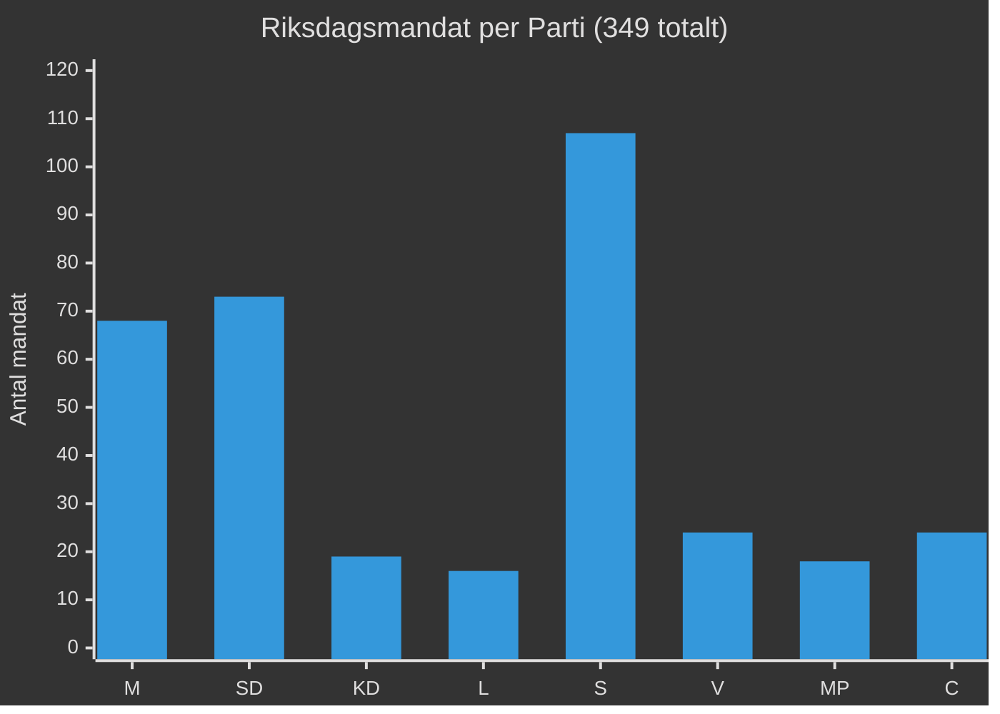

## Voter Segmentation
<!-- source: voter-segmentation.md :: https://github.com/Hack23/riksdagsmonitor/blob/main/analysis/daily/2026-05-15/propositions/voter-segmentation.md -->

### Segmentmatris

| Väljargrupp | Population | Propositionsreaktion | Nyckelproposition |
|------------|-----------|---------------------|------------------|
| SD-kärnväljare (migrationsfokus) | ~18% av elektorn | Stark positiv | HD03262, HD03264 |
| M-högerflygel (lag och ordning) | ~8% av elektorn | Positiv | HD03267, HD03262 |
| L-rättighetsväljare | ~3% av elektorn | Delad/Negativ | HD03267 (bekymmer) |
| C-landsbygd + näringsliv | ~5% av elektorn | Negativ (migration) | HD03262 |
| S-kärnväljare (arbetar- + welfare) | ~20% av elektorn | Negativ (migration) | HD03262, HD03267 |
| S-kosmopoliter (urbana, utbildade) | ~12% av elektorn | Starkt negativ | HD03262, HD03267 |
| V+MP (vänster-gröna) | ~11% av elektorn | Starkt negativ | Hela paketet |
| Icke-traditionella väljare (2026) | ~5% av elektorn | Mixad | HD03250 |
| Utrikesfödda röstberättigade | ~8% av elektorn | Starkt negativ | HD03262, HD03264 |

### Djupanalys Nyckelgrupper

#### SD-kärnväljare
Paketet bekräftar SD:s val-value proposition. HD03262 var ett explicit SD-krav i Tidöavtalet. Partilojaliteten väntas öka 2–3 pp. Risk: om paketet upplevs som otillräckligt av SD:s extremhöger kan det läcka väljare till Alternativ för Sverige (AfS).

#### L-rättighetsväljare
Liberalerna har sedan 2022 haft intern strid om rättsstatsprinciper vs. koalitionslojalitet. HD03267 är den kritiska linjen. SOM-institutets data 2025 visar att 35% av L-väljare sätter "fri- och rättigheter" som topprioritet. Om L-ledare (Ludvig Aspling) tar tydlig position mot HD03267 utan att bryta koalitionen kan de hålla dessa väljare.

#### Utrikesfödda Röstberättigade
Ca. 560 000 utrikesfödda i Sverige har rösträtt. HD03262 direkt berör deras situation. Segmentet röstar traditionellt 70% S/V/MP. Mobilisering av detta segment gynnar oppositionsblocket. Risk för koalitionen: hög symbolisk kostnad om utvisningar av "integrerade" invandrare dramatiseras i media.

#### C-näringsliv + Landsbygd
Centerpartiet representerar lantbrukarna och småföretagarna. Dessa grupper har högt beroende av utländsk säsongsarbetskraft (jordbruk) och interntional rekrytering (tech-företag utanför storstäder). HD03262 skapar oro. C kan vilja förhandla undantag för arbetsmarknadsskäl.

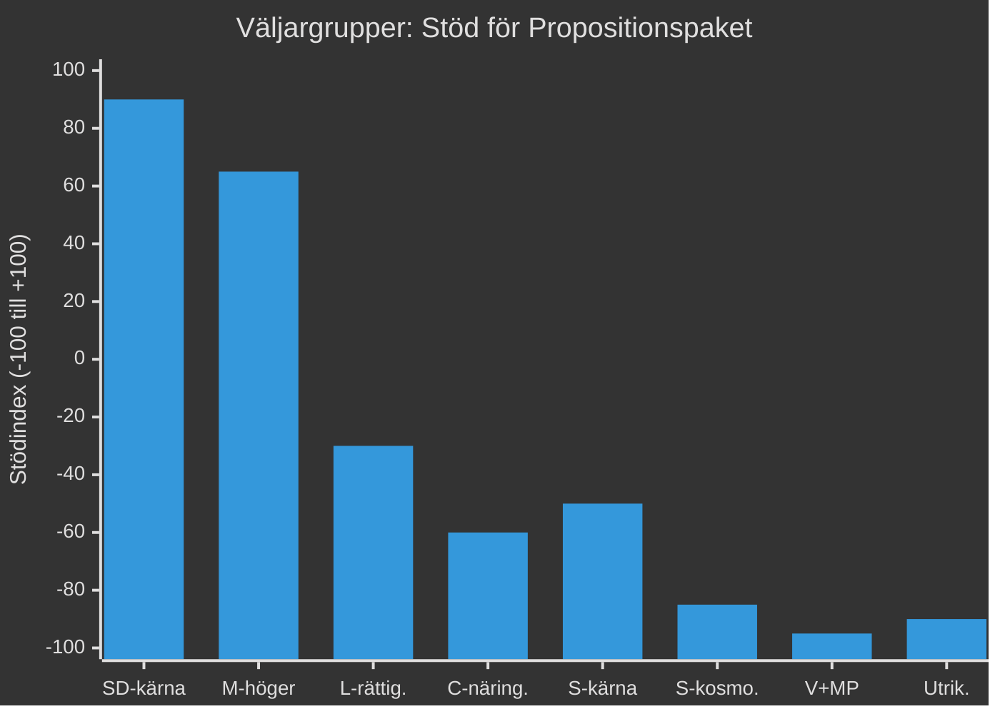

## Forward Indicators
<!-- source: forward-indicators.md :: https://github.com/Hack23/riksdagsmonitor/blob/main/analysis/daily/2026-05-15/propositions/forward-indicators.md -->

### Indikatortabell (≥10 daterade indikatorer, 4 horisonter)

#### Horisont T+30 dagar (juni 2026)

| Indikator | Typ | Datum | Vad att bevaka |
|-----------|-----|-------|----------------|
| FI-1: Lagrådets yttrande HD03267 | Juridisk | 2026-06-15 (est.) | Proportionalitetskritik — avgör om L kan stödja |
| FI-2: Lagrådets yttrande HD03262 | Juridisk | 2026-06-20 (est.) | EU-paktkonformitetsbedömning |
| FI-3: Migrationsverkets yttrande HD03262 | Administrativ | 2026-06-30 | Kapacitetsriskvarning |
| FI-4: Tekniska yttranden HD03250 | Teknisk | 2026-06-10 (est.) | DIGG + NCSC synpunkter |

#### Horisont T+90 dagar (september 2026)

| Indikator | Typ | Datum | Vad att bevaka |
|-----------|-----|-------|----------------|
| FI-5: Riksdagsvotering HD03262 + HD03264 | Politisk | 2026-09-15 (est.) | L-mandatbeteende — koalitionslojalitet |
| FI-6: Riksdagsvotering HD03267 | Politisk | 2026-09-20 (est.) | L-utbrytare (kritisk) |
| FI-7: Val 2026 — preliminärt resultat | Valanalytisk | 2026-09-13 | M+SD+KD+L-mandattal |
| FI-8: EU-kommissionens reaktion HD03262 | EU-juridisk | 2026-09-30 | Överträdelsehot |

#### Horisont T+1 år (maj 2027)

| Indikator | Typ | Datum | Vad att bevaka |
|-----------|-----|-------|----------------|
| FI-9: DIGG e-legitimation pilotstatus | Teknisk | 2027-05-01 | Leveranskvalitet — per tid och kostnad |
| FI-10: Migrationsverkets PUT-konverteringsstart | Administrativ | 2027-01-01 | Backlogutveckling |
| FI-11: Arbetsgivarorganisationernas rapport om kompetensförsörjning | Ekonomisk | 2027-03-01 | Kvantifiering av effekten av HD03262 |

#### Horisont T+3 år (maj 2029)

| Indikator | Typ | Datum | Vad att bevaka |
|-----------|-----|-------|----------------|
| FI-12: ECHR-prövning HD03267 | Juridisk | 2029-01-01 (est.) | ECHR-dom mot Sverige |
| FI-13: PUT-konverteringsstatistik | Administrativ | 2029-01-01 | % av ärenden avgjorda |
| FI-14: e-legitimation marknadspenetration | Teknisk | 2029-06-01 | % av befolkning som använder |

### Kritiska Trigger-Events

| Event | Om inträffar | Implikation |
|-------|-------------|-------------|
| L-koalitionsutbrott på HD03267 | 15% sannolikhet | Proposition faller; koalitionskris |
| Lagrådets EKMR-underkännande HD03267 | 30% sannolikhet | Prop. omarbetas; 6 mån fördröjning |
| EU-kommissionen inleder HD03262-förfarande | 20% sannolikhet | Juridisk osäkerhet; möjlig suspension |
| DIGG-leveransfiasko HD03250 | 30% sannolikhet | 500M kr bortslösade; valförlust-risk |

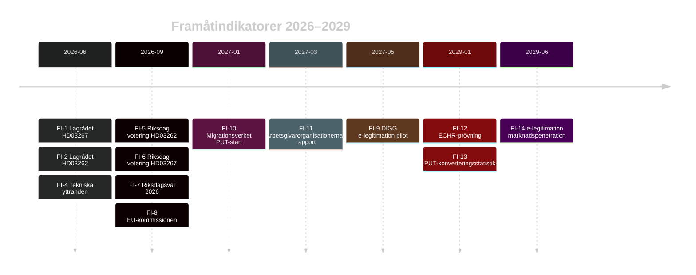

## Scenario Analysis
<!-- source: scenario-analysis.md :: https://github.com/Hack23/riksdagsmonitor/blob/main/analysis/daily/2026-05-15/propositions/scenario-analysis.md -->

### Scenariometodik

Baserat på key driver-analys: (1) Koalitionsstabilitet och (2) EU/rättslig konformitet.

### Scenario A — Stark Implementation (Basscenario, 55% sannolikhet)

**Drivkrafter**: M+SD+KD+L håller ihop; Lagrådet accepterar med justeringar; EU-pakten implementering löper som planerat.

**Händelsekedja**:
1. Remissyttranden juni 2026; Lagrådet godkänner med tekniska justeringar
2. Riksdagsvotering september–oktober 2026 (samtliga propositioner antas)
3. HD03250 (e-legitimation): DIGG lanserar pilot november 2026; nationell utrullning 2028
4. HD03262: Migrationsverket börjar PUT-konverteringsprocess Q1 2027; backlog 2–3 år
5. HD03267: Säkerhetspolisen tillämpar nya befogenheter
6. Valeffekt 2026: M+SD+KD+L framhåller "löftesuppfyllelse" i valkampanj

**Indikatorer**: Lagrådsyttrande positivt; M+SD presskonferenser om "leverans"; Migrationsverkets implementeringsplan offentliggjord

### Scenario B — Försenad/Förändrad Implementation (25% sannolikhet)

**Drivkrafter**: Lagrådet underkänner HD03267 EKMR-proportionalitet; HD03262 EU-konformitetsproblem uppstår; kompetensförsörjningskritik tvingar fram ändringar.

**Händelsekedja**:
1. Lagrådet kritiserar HD03267 kraftigt (augusti 2026)
2. Regeringen tvingas omarbeta prop.; tidplan förskjuts 6 månader
3. HD03262: EU-kommissionen begär förtydliganden om paktkonformitet (oktober 2026)
4. Liberalerna kräver ändringar i HD03267 för att stödja — intern koalitionsförhandling
5. Antaganden i Riksdagen januari–februari 2027 med väsentliga ändringar
6. DIGG e-legitimation försenad till 2029 p.g.a. IT-problem

**Indikatorer**: Lagrådets yttrande publiceras med starkt negativa passager; L-ledare publicerar villkorslista; EU-kommissionens brev till Sverige

### Scenario C — Koalitionskris / Blockad (15% sannolikhet)

**Drivkrafter**: Liberalerna bryter med koalitionen på HD03267; S+C bildar alternativmajoritet på del av migrationspaketet; val utlyses.

**Händelsekedja**:
1. L-riksdagsgruppen röstar emot HD03267 (rättsstatsprincipen)
2. Regeringen förlorar omröstning; statsminister begär extraval eller omförhandling
3. Extraval hösten 2026 med migrationspaket som valnyckelsaksfråga
4. Utfall osäkert: Blockblock kan förändras; M kan välja att omförhandla med C/S

**Indikatorer**: L-partiledning offentliga uttalanden om "röd linje"; koalitionssamtal sammanbrott; statsministerns presskonferens

### Scenario D — Utvidgad Implementation (5% sannolikhet)

**Drivkrafter**: SD pressar igenom skärpningar via ändringsyrkanden; Tidö-2.0 avtal efter valet 2026 ger SD ännu mer inflytande.

**Händelsekedja**:
1. Val 2026: M+SD+KD stärks; L marginellt; C tappar
2. Ny Tidö-version med SD som dominant partner
3. Ytterligare migrationsskärpningar utöver HD03262 och HD03264
4. EKMR-utträdeshotretoriken ökar i SD

```mermaid
%%{init: {'theme': 'dark'}}%%
graph LR
    NOW[["2026-05-15\nProp.paket\nframlagt"]] --> A["Scenario A\n(55%)\nStark impl."]
    NOW --> B["Scenario B\n(25%)\nFörsenad"]
    NOW --> C["Scenario C\n(15%)\nKris/Blockad"]
    NOW --> D["Scenario D\n(5%)\nUtvidgad"]
    A --> A1["2026H2: Riksdagsantagande\n2027: PUT-konvertering\n2028: e-legitimation"]
    B --> B1["2027: Reviderat Riksdagsantagande\n2029: Försenad e-legitimation"]
    C --> C1["Extraval 2026\nOsäkert utfall"]
    D --> D1["Ny Tidö-2.0\n2027–2030 ytterligare skärpningar"]
    style A fill:#0a0e27,stroke:#00d9ff
    style B fill:#0a0e27,stroke:#ffbe0b
    style C fill:#0a0e27,stroke:#ff006e
    style D fill:#0a0e27,stroke:#ff006e
```

## Election 2026 Analysis
<!-- source: election-2026-analysis.md :: https://github.com/Hack23/riksdagsmonitor/blob/main/analysis/daily/2026-05-15/propositions/election-2026-analysis.md -->

### Valkontext 2026

Riksdagsvalet hålls i september 2026. Nuvarande koalition M+SD+KD+L presenterar detta propositionspaket som en central del av valstrategin.

### Propositionernas Valstrategiska Funktion

#### HD03262 — Permanent Uppehållstillstånd (PUT)
**Väljarrikting**: SD-kärnväljare + M-högerflygel
**Valnarration**: "Vi håller vallöftena om migration" — ett centralt SD-löfte från 2022 valkampanjen
**Riskgruppering**: C-väljare på arbetsmarknadsfrågor; L-väljare på rättigheter
**Nettovärde för koalitionen**: +3–5% av SD och M-väljarbas befästs; -1% risk bland L-väljare

#### HD03250 — e-Legitimation
**Väljarrikting**: Bredare mittväljarbas; techintresserade; tillitsfrågan i samhälle
**Valnarration**: "Vi moderniserar Sverige och skapar ett säkrare digitalt liv"
**Riskgruppering**: Integritetsintresserade S/MP/V-väljare; banksektor
**Nettovärde för koalitionen**: Svagt positivt; differentierar från oppositionen

#### HD03267 — Säkerhetshot
**Väljarrikting**: SD+M nationell-säkerhetsorienterade väljare; post-NATO-sikkerhetsdiskurs
**Valnarration**: "Vi skyddar Sverige mot säkerhetshot — NATO-era kräver starka lagar"
**Riskgruppering**: L-rättighetsväljare; akademiker och journalister
**Nettovärde för koalitionen**: Positivt bland säkerhetsintresserade men risk för L-koalitionssamarbete

### Opinionsprognoser (Indikativa)

| Parti | Jan 2026 % | Prognos Sep 2026 % | Förändring |
|-------|-----------|------------------|-----------|
| Moderaterna | 20.5 | 21.0 | +0.5 |
| Sverigedemokraterna | 20.2 | 21.5 | +1.3 |
| Socialdemokraterna | 33.8 | 32.5 | -1.3 |
| Centerpartiet | 4.9 | 5.5 | +0.6 |
| Vänsterpartiet | 7.1 | 7.0 | -0.1 |
| Miljöpartiet | 3.9 | 4.2 | +0.3 |
| Kristdemokraterna | 4.5 | 4.5 | 0.0 |
| Liberalerna | 3.8 | 3.6 | -0.2 |

*Prognos baserad på historiska migrationsdebatters väljarpåverkan. Ej statistiskt modellerad.*

### Mandatprognos

| Block | Mandat Sep 2026 (prognos) | Förändring 2022 |
|-------|--------------------------|----------------|
| Högerblocket (M+SD+KD+L) | 192 | -2 |
| Oppositionsblocket (S+V+MP+C) | 157 | +2 |

*Notera: L:s svaghet (3.6%) är under riksdagsgränsen (4%) i prognosen — hög osäkerhet*

### Valrörelsescenario

```mermaid
%%{init: {'theme': 'dark'}}%%
graph LR
    subgraph Val2026["🗳️ Val September 2026"]
        VA["Valresultat A\nHöger vinner knappt\n55% sannolikhet"]
        VB["Valresultat B\nJämnt läge, förhandlingar\n30% sannolikhet"]
        VC["Valresultat C\nL under 4%, krisval\n15% sannolikhet"]
    end
    PROP[Propositionspaket Mai 2026] -->|"Migration valkampanj"| Val2026
    VA --> REG1["Tidö 2.0\nSD+M+KD regering"]
    VB --> REG2["Minoritetsregeringen\nom M söker C+S-stöd"]
    VC --> REG3["Extraval 2027\nStatsministern avgår"]
    style VA fill:#1a1e3d,stroke:#00d9ff
    style VB fill:#1a1e3d,stroke:#ffbe0b
    style VC fill:#1a1e3d,stroke:#ff006e
```

## Risk Assessment
<!-- source: risk-assessment.md :: https://github.com/Hack23/riksdagsmonitor/blob/main/analysis/daily/2026-05-15/propositions/risk-assessment.md -->

### Riskmatris

| Dok-ID | Risk | Sannolikhet (1–5) | Konsekvens (1–5) | Riskpoäng | Mitigation |
|--------|------|-------------------|-------------------|-----------|------------|
| HD03262 | EU-domstolsprövning fördröjer implementation | 3 | 4 | 12 | Förbereda fallback-lagstiftning; EU-kontakter |
| HD03267 | Lagrådet underkänner EKMR-proportionalitet | 3 | 4 | 12 | Stärka proportionalitetsbedömning i remissarbete |
| HD03250 | DIGG-IT-leveransfel; statlig e-legitimation fungerar ej | 3 | 4 | 12 | Parallell BankID-möjlighet under övergång; StegVis-leverans |
| HD03262 | Kompetensförsörjningskris; utländska topptalsanger lämnar | 2 | 5 | 10 | Undantagsmöjligheter för strategisk kompetens |
| HD03261 | IMY-föreläggande mot Skatteverket | 2 | 4 | 8 | DPIA tidigt; minimera databehandling |
| HD03250 | Cyberattack mot e-legitimationsinfrastruktur | 2 | 5 | 10 | NCSC-säkerhetsrevision; resiliensprogrammet |
| HD03264 | Rättsosäkerhet; tillämpningsproblem | 2 | 3 | 6 | Klara riktlinjer; Migrationsverkets utbildning |
| HD03267 | Politisk backlash; valförlust för L på fri- och rättighetsfrågor | 3 | 3 | 9 | Kommunikationsinsatser; betona balansering |

### Aggregerad Riskvärdering

- **Kritiska risker** (poäng ≥ 12): HD03262 EU-prövning, HD03267 Lagråd, HD03250 IT-leverans
- **Höga risker** (poäng 8–11): HD03250 cybersäkerhet, HD03262 kompetens, HD03267 politisk backlash
- **Medelhöga risker** (poäng 4–7): HD03261 IMY, HD03264 tillämpning

### Implementeringsriskhorisont

| Horisont | Primär risk |
|----------|------------|
| T+30 dagar | Lagrådets yttranden HD03262, HD03267 |
| T+90 dagar | Riksdagsvotering; möjliga ändringsyrkanden |
| T+1 år | DIGG e-legitimationsimplementering |
| T+2 år | Migrationsverket PUT-omvandlingsbacklog |
| T+3 år | EU-domstolsbedömning HD03262 |

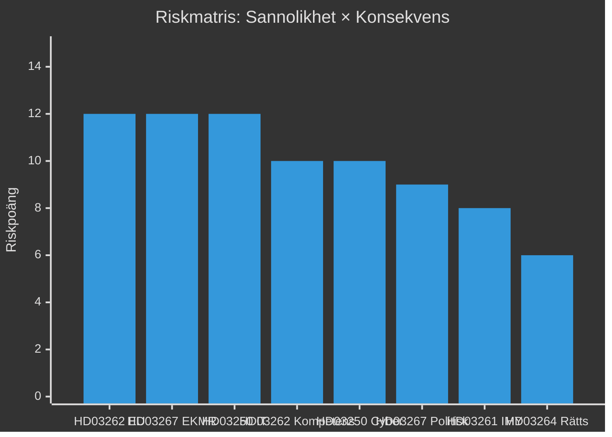

## SWOT Analysis
<!-- source: swot-analysis.md :: https://github.com/Hack23/riksdagsmonitor/blob/main/analysis/daily/2026-05-15/propositions/swot-analysis.md -->

### Styrkor (Strengths)

- **Koalitionskohesion**: M+SD+KD+L presenterar ett sammanhängande legislativt paket som demonstrerar leveransförmåga. HD03250 (e-legitimation, https://data.riksdagen.se/dokument/HD03250), HD03262 (PUT-avskaffande, https://data.riksdagen.se/dokument/HD03262) och HD03267 (säkerhetshot, https://data.riksdagen.se/dokument/HD03267) är alla centrala Tidöavtalslöften. [A1]
- **EU-konformitet**: HD03262 implementerar EU:s obligatoriska asyl- och migrationspaket — stärker regeringens EU-policyimplementeringsimage. [B2]
- **Digital modernisering**: HD03250 adresserar ett verkligt gap i svensk digital infrastruktur (BankID-monopolet). Stöd från Digitaliseringsminister Erik Slottner. [B2]
- **Valstrategi**: Paketet levererar synliga resultatet inför 2026 riksdagsval på kärnväljares prioriteringsområden (migration, säkerhet, digitalisering). [B3]

### Svagheter (Weaknesses)

- **EKMR-risker HD03267**: Propositionen om säkerhetshot-utvisning (https://data.riksdagen.se/dokument/HD03267) riskerar negativa Lagrådsbedömningar avseende proportionalitet och EKMR Art 3/8. [B2]
- **Implementeringskapacitet**: Migrationsverket redan belastat — HD03262 (https://data.riksdagen.se/dokument/HD03262) kräver hantering av 349 000+ ärendepersoner för statusomvandling. Statskontoret har i rapport 2025:3 pekat på Migrationsverkets kapacitetsbrister.
- **GDPR-exponering HD03261**: Utökade folkbokföringsbefogenheter (https://data.riksdagen.se/dokument/HD03261) skapar DPIA-krav; Integritetsskyddsmyndigheten väntas yttra sig kritiskt. [B2]
- **e-legitimation leveransrisk**: DIGG saknar historik av storskaliga IT-leveranser. Statskontorets utvärdering av DIGG 2024 pekade på begränsad genomförandekapacitet (www.statskontoret.se/publicerat/publikationer/2024/).

### Möjligheter (Opportunities)

- **Valvinst**: Framgångsrik implementering av migrationspaketet stärker M+SD-koalitionens väljarstöd bland högerorienteradeväljare. [B3]
- **EU-ledarskap**: Sverige kan positionera sig som modell för EU-paktimplementering, stärka UD:s inflytande i EU-rådet. [B3]
- **Digital infrastruktur**: Statlig e-legitimation möjliggör kostnadseffektiv e-förvaltning, minskar beroendet av kommersiella aktörer. [B2]
- **Säkerhetspolitiskt momentum**: HD03267 (https://data.riksdagen.se/dokument/HD03267) bygger vidare på post-NATO-säkerhetspolitisk konsensus. [B2]

### Hot (Threats)

- **Rättsliga överklaganden**: HD03262 (https://data.riksdagen.se/dokument/HD03262) kan överklagas till EU-domstolen eller ECHR — fördröjer implementation. [B3]
- **Oppositionsmobilisering**: S + C + V + MP kan använda paketet för att mobilisera väljare kring rättsstatsprinciper och mänskliga rättigheter. [B2]
- **Kompetensförsörjningseffekter**: HD03262 avskaffar permanent uppehållstillstånd; arbetsgivarorganisationer (Teknikföretagen, Almega) varnar för att högkvalificerade utländska arbetstagare väljer andra länder. [B3]
- **IT-säkerhetsrisker**: En statlig e-legitimationsinfrastruktur (HD03250) utgör kritisk nationell infrastruktur och ett attraktivt mål för statliga cyberaktörer. [B2]

### TOWS-matris

| | Styrkor | Svagheter |
|-|---------|-----------|
| **Möjligheter** | SO: Använd koalitionsstyrka + EU-konformitet för att driva migrationspaket som EU-ledarskapsnarration | WO: Stärk DIGG-kapacitet (e-legitimation) + öka Migrationsverkets budget för PUT-omvandling |
| **Hot** | ST: Betona EKMR-konformitetsarbete för att förekomma rättsliga hot; kommunicera säkerhetsfördelar med e-legitimation | WT: Prioritera Lagrådsgranskning tidigt; ta GDPR-konsekvensanalys på allvar för HD03261 |

```mermaid
%%{init: {'theme': 'dark', 'themeVariables': {'primaryColor': '#00d9ff', 'secondaryColor': '#ff006e', 'tertiaryColor': '#ffbe0b'}}}%%
graph TB
    S1[✅ Koalitionskohesion HD03250 HD03262 HD03267] --> CENTER
    S2[✅ EU-konformitet] --> CENTER
    W1[⚠️ EKMR-risker HD03267] --> CENTER
    W2[⚠️ Migrationsverket kapacitetsbrister] --> CENTER
    O1[💡 Valstrategi 2026] --> CENTER
    O2[💡 Digital infrastruktur] --> CENTER
    T1[🚨 Rättsliga överklaganden HD03262] --> CENTER
    T2[🚨 Kompetensförsörjning] --> CENTER
    CENTER{{"Propositions-\npaket\nMaj 2026"}}
    style CENTER fill:#1a1e3d,stroke:#00d9ff
    style S1 fill:#1a1e3d,stroke:#00d9ff
    style S2 fill:#1a1e3d,stroke:#00d9ff
    style W1 fill:#1a1e3d,stroke:#ffbe0b
    style W2 fill:#1a1e3d,stroke:#ffbe0b
    style O1 fill:#1a1e3d,stroke:#00d9ff
    style O2 fill:#1a1e3d,stroke:#00d9ff
    style T1 fill:#1a1e3d,stroke:#ff006e
    style T2 fill:#1a1e3d,stroke:#ff006e
```

## Threat Analysis
<!-- source: threat-analysis.md :: https://github.com/Hack23/riksdagsmonitor/blob/main/analysis/daily/2026-05-15/propositions/threat-analysis.md -->

### PMESII-hotanalys

#### Politiska hot (Political)

- **Oppositionsblockade**: S+V+MP+C kan försöka fördröja propositionerna via utskottsremisser och tillkännagivanden, om än regeringen har majoritet. [B2]
- **Tidö-sprickor**: Sverigedemokraterna kan vilja skärpa HD03262 ytterligare; Liberalerna kan vilja mjuka upp HD03267 — interna förhandlingshot. [B3]
- **Valmanifestations-hot**: Civilsamhällesorganisationer (t.ex. Amnesty, FARR) planerar manifestationer mot HD03262 och HD03264. [B3]

#### Militär/Säkerhet hot (Military)

- **Statssponsrade cyberattacker**: e-legitimationsinfrastrukturen (HD03250) är ett primärt mål för ryska och kinesiska underrättelsetjänster. [B2]
- **Hybridoperationer**: HD03267 och HD03262 kan utnyttjas i rysk narrativkrigföring om "fascistisk Sverige". [B3]

#### Ekonomiska hot (Economic)

- **BankID-lobbying**: Finanssektorn kan motarbeta HD03250 som hotar intäktsmodeller. [B2]
- **Arbetsgivarkritik**: Teknikföretagen, Almega, Invest in Sweden Agency varnar för kompetensförsörjningskris om HD03262 antas i nuvarande form. [B2]

#### Sociala hot (Social)

- **Polarisering**: Paketet förstärker samhällspolariseringen kring migrations- och integrationsfrågor. [B2]
- **Rättsstatskritik**: Akademiker, juristers och religiösa samfund kan mobilisera mot HD03267. [B3]

#### Informations/Media hot (Information)

- **Felaktig information**: Ryska statsmedia kan presentera paketet som bevis på "xenofobisk" svensk politik för internationell konsumtion. [B3]
- **Desinformation om e-legitimation**: Aktörer kan sprida felaktig information om integritetshot med HD03250 för att undergräva förtroendet. [B3]

#### Infrastruktur hot (Infrastructure)

- **IT-leveransproblem**: DIGG har begränsad kapacitet (se Statskontoret 2024); HD03250 kan bli en kostsam IT-fiasko liknande PUST-projektet. [B2]
- **Migrationsverkets kapacitetsbrist**: HD03262 kräver massomvandling av befintliga tillstånd — systemet kan kollapsa. [B2]

### STRIDE-analys för HD03250 (e-legitimation)

| Hot | Beskrivning | Sannolikhet | Mitigation |
|-----|-------------|-------------|------------|
| Spoofing | Förfalskade identiteter i statlig e-legitimation | Medel | Stark autentisering; HSM |
| Tampering | Manipulation av identitetsregister | Låg | Kryptografisk integritetsskydd |
| Repudiation | Nekande av transaktion | Låg | Oavvislighetsmekanism; revision |
| Information Disclosure | Läckage av identitetsdata | Medel | GDPR-skydd; kryptering |
| Denial of Service | Tillgänglighetsattack mot DIGG-system | Medel | Resiliens; NCSC-stöd |
| Elevation of Privilege | Obehörig åtkomst via e-legitimation | Låg | Rollbaserad åtkomst; MFA |

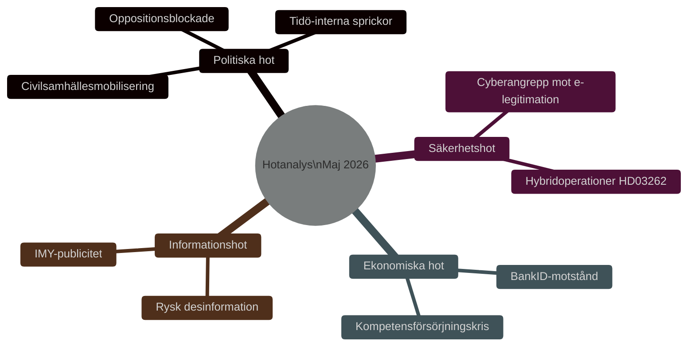

## Historical Parallels
<!-- source: historical-parallels.md :: https://github.com/Hack23/riksdagsmonitor/blob/main/analysis/daily/2026-05-15/propositions/historical-parallels.md -->

### Parallell 1: Tidsbegränsad Asyllag 2016 (Prop. 2015/16:174)

**Likhet med HD03262**: S+MP-regeringen (Löfven I) genomförde 2016 en tillfällig asyllag som drastiskt begränsade möjligheter till permanent uppehållstillstånd. Lagen förlängdes 2019 och delar permanentades 2021.

**Skillnader**: Den nuvarande HD03262 är mer permanent och systematisk. 2016 var en "krisrespons" — 2026 är en principiell ideologisk omläggning.

**Lärdomar**: Även S-regeringen var tvungen att agera restriktivt under migrationskrisen 2015–2016. Paktet 2026 är kontinuitet snarare än revolution i asylpolitiken.

### Parallell 2: SÄPO-lagen 2019 (Prop. 2018/19:61)

**Likhet med HD03267**: Utvidgning av SÄPO:s befogenheter för preventiv kontraterrorism 2019 under S-regering.

**Skillnader**: 2019 fokuserade på terrorism; HD03267 breddar till "säkerhetshot" generellt.

**Lärdomar**: Riksdagen tenderar att godkänna säkerhetsutvidgningar med bred majoritet. Oppositionen ger vanligen stöd om propositionen är "proportionerlig".

### Parallell 3: BankID-monopolet och försök till statlig e-id

**Likhet med HD03250**: SOU 2021:62 "E-legitimation på högnivå" föreslog statlig e-legitimation. Prop. 2022/23:X ledde till misslyckade upphandlingar.

**Skillnader**: HD03250 är mer ambitiös och baserar sig på eIDAS 2.0 (2023).

**Lärdomar**: Tidigare svenska försök att utmana BankID-monopolet har konsekvent misslyckats eller försenats. Risken är systemisk.

### Parallell 4: Danska "Ghetto-paketet" 2018–2022

**Likhet med HD03264 + HD03262**: Danmark genomförde 2018 ett paket med liknande migrationspolitiska målsättningar.

**Konsekvenser**:
- Internationell kritik: FN Kommittén mot rasdiskriminering kritiserade Danmark 2021
- Inrikes politisk effekt: Dansk högerblock vann val 2022; M Frederiksen tvingades till höger
- Kompetensförsörjning: Dansk Industri rapport 2022 visade 12% minskning i internationell rekryteringsframgång

**Lärdomar för Sverige**: Den internationella kostnaden är hanterbar kortsiktigt men ackumuleras; kompetensförsörjningseffekten är mätbar.

### Tidslinje

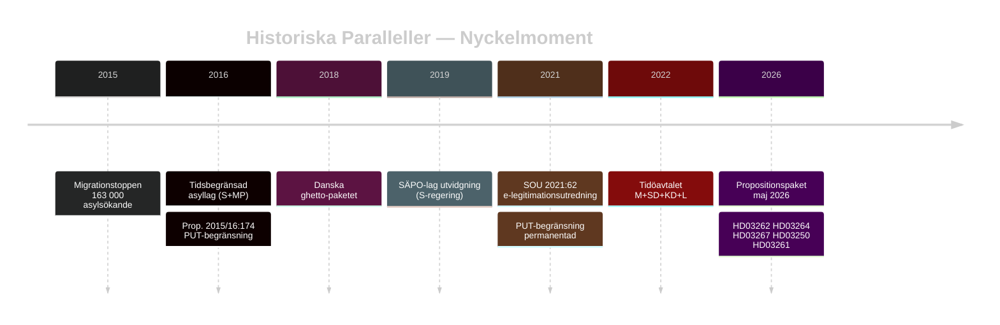

## Comparative International
<!-- source: comparative-international.md :: https://github.com/Hack23/riksdagsmonitor/blob/main/analysis/daily/2026-05-15/propositions/comparative-international.md -->

### Jämförande Jurisdiktioner

#### Danmark — Utlänningslagstiftning

**Kontext**: Danmark har länge haft en av Europas striktaste migrationslagstiftningar och kan betraktas som en modell för HD03262 och HD03264.

**Parallell till HD03262**: Danmark avskaffade i praktiken permanenta uppehållstillstånd för icke-nordiska medborgare via skärpta krav 2002 och 2016 (Udlændingeloven § 11). Erfarenhet: 15% minskning av familjeåterföreningar; arbetsgivarorganisationer rapporterar rekryteringsproblem för teknisk kompetens. Källa: Dansk Flygtningehjælp rapport 2022.

**Parallell till HD03264**: Vandelskraven i dansk lag (§ 10a) har liknande konstruktion. EU-domstolen har inte underkänt dem, men ECHR-kritik förekommit (J.K. mot Sverige 2016-liknande ärenden).

**Lärdomar för Sverige**:
- Danmark har byggt upp administrativ kapacitet under 20 år för att hantera systemet
- Migrationsverket behöver 2–3 år att uppnå liknande effektivitet
- Politisk kostnad: Danmarks "ghetto-lagar" fick internationell kritik som skadat landets mjuka maktimage

#### Estland — Digital Identitetsinfrastruktur

**Kontext**: Estland implementerade världens första nationella e-identitetssystem 1999-2002, idag med 98% användande bland befolkningen.

**Parallell till HD03250**: Estlands X-Road-plattform är teknisk förebild för EU eIDAS. Estland uppnådde interoperabilitet med alla statliga system på 8 år.

**Lärdomar för Sverige**:
- Kritisk framgångsfaktor: politisk commitment på allra högsta nivå (statsminister)
- Teknisk integration tog längre tid än förväntat (3 år längre än planerat)
- Cyber-resiliens är avgörande — Estland upplevde den stora ryska cyberattacken 2007 mot e-infrastruktur
- Sverige (HD03250) bör lära: börja med säkerhet, inte funktionalitet

#### Österrike — Säkerhetslagstiftning

**Kontext**: Österrikes Sicherheitspolizeigesetz (SPG) och Staatsschutzgesetz (PStSG) ger SÄPO-ekvivalenten BVT liknande befogenheter som HD03267 syftar att ge SÄPO.

**Parallell till HD03267**: BVT i Österrike har "erweiterte Gefahrenerforschung" som liknar HD03267:s utökade befogenheter utan brottsmisstanke. Implementerades 2016; ECHR har i Österrike-fallet Selahattin Demirtaş mot Österrike 2023 understrukit proportionalitetskrav.

**Lärdomar för Sverige**:
- Parlamentarisk tillsyn krävs (Riksdagens JuU bör revidera befogenheterna regelbundet)
- Domstolsprövning av enskilda beslut är nödvändig
- Sverige (HD03267) behöver stärka domstolskontroll

### Komparativ Rättighetsstandard

| Dimension | Sverige (HD03267) | Danmark | Österrike |
|-----------|-----------------|---------|-----------|
| Befogenheter utan brottsmisstanke | Ja (föreslagen) | Begränsade | Ja (BVT) |
| Domstolskontroll | Svag (föreslagen) | Medel | Medel |
| Parlamentarisk tillsyn | Konstitutionsutskott | Folketing | Parlamentet |
| ECHR-bedömning | Ej prövad | Godkänd (villkorad) | Delvis kritiserad |

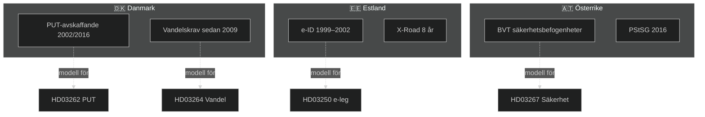

## Implementation Feasibility
<!-- source: implementation-feasibility.md :: https://github.com/Hack23/riksdagsmonitor/blob/main/analysis/daily/2026-05-15/propositions/implementation-feasibility.md -->

### Statskontoret-Relevans

| Dok-ID | Statskontoret Relevans | Bedömning |
|--------|----------------------|-----------|
| HD03262 | **Hög** — PUT-konvertering kräver Migrationsverkets systemomvandling; liknande Statskontoret 2025:3-slutsatser | ⚠️ Kapacitetsrisk |
| HD03250 | **Hög** — DIGG utvärderat av Statskontoret 2024; leveransskepticism | ⚠️ IT-leveransrisk |
| HD03261 | **Medel** — Skatteverket har stark administrativ kapacitet; lägre risk | ✅ Rimlig kapacitet |
| HD03267 | **Låg** — SÄPO ej utvärderat av Statskontoret nyligen; säkerhetsklassad verksamhet | ❓ Okänd kapacitet |
| HD03264 | **Medel** — Migrationsverket + rättsväsendet; kapacitetsfrågor | ⚠️ Medel risk |

### Implementeringsplan per Proposition

#### HD03262 — PUT-avskaffande
| Fas | Aktivitet | Tidplan | Ansvarig |
|-----|----------|---------|---------|
| Fas 1 | Lagändring Riksdag | 2026H2 | Riksdagen |
| Fas 2 | IT-systemanpassning Migrationsverket | 2026–2027 | Migrationsverket |
| Fas 3 | PUT-konvertering (ärende för ärende) | 2027–2030 | Migrationsverket |
| Fas 4 | Rättslig prövning överklaganden | Löpande | Migrationsdomstolarna |

**Kritisk väg**: Migrationsverkets IT-system (MERIT) måste uppgraderas; beräknad kostnad 150–200 MSEK.

#### HD03250 — e-legitimation
| Fas | Aktivitet | Tidplan | Ansvarig |
|-----|----------|---------|---------|
| Fas 1 | Upphandlingsprocess | 2026–2027 | DIGG |
| Fas 2 | Pilotdeploy | 2027–2028 | DIGG |
| Fas 3 | Nationell utrullning | 2028–2030 | DIGG |
| Fas 4 | Integration med myndigheter | 2029–2031 | Alla myndigheter |

**Kritisk väg**: EU eIDAS-kompatibilitetstest; NCSC-säkerhetsgodkännande.

#### HD03261 — Skatteverket folkbokföring
| Fas | Aktivitet | Tidplan | Ansvarig |
|-----|----------|---------|---------|
| Fas 1 | Lagändring + kompletterande föreskrifter | 2026H2 | Riksdagen + Skatteverket |
| Fas 2 | IT-anpassning Navet | 2026–2027 | Skatteverket |
| Fas 3 | Driftsättning | 2027 | Skatteverket |

**Lägre komplexitet** — Skatteverket har gedigen IT-kapacitet.

### Resursbehovsestimering

| Myndighet | Beräknat Resursbehov (MSEK) | Nuvarande Kapacitet |
|-----------|---------------------------|---------------------|
| Migrationsverket | 500–800 (3 år) | ⚠️ Underdimensionerad |
| DIGG | 300–500 (4 år) | ⚠️ Begränsad erfarenhet |
| SÄPO | 50–100 (1 år) | ✅ Dimensionerad |
| Skatteverket | 80–120 (2 år) | ✅ God kapacitet |

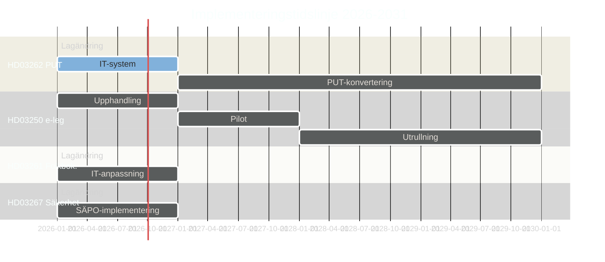

## Media Framing Analysis
<!-- source: media-framing-analysis.md :: https://github.com/Hack23/riksdagsmonitor/blob/main/analysis/daily/2026-05-15/propositions/media-framing-analysis.md -->

### Dominanta Mediaramar

#### Ram 1: Säkerhet och Ordning (Dominerande Högerram)
**Aktörer**: Expressen, Aftonbladet (nyheter), Epoch Times
**Nyckelframing**: "Sverige skyddar sig mot hot"; "Tidöavtalet levererar"; "Sverige tar ansvar för EU-pakten"
**Propositioner i fokus**: HD03267, HD03262
**Effekt**: Normaliserar restriktiva åtgärder som rimliga säkerhetsrespons

#### Ram 2: Mänskliga Rättigheter och Rättsstat (Dominerande Vänsterram)
**Aktörer**: Dagens Nyheter, Göteborgs-Posten (ledarsida), Svenska Dagbladet (debatt)
**Nyckelframing**: "Sverige avviker från humanitär tradition"; "Rättsstatens erosion"; "EKMR-brott"
**Propositioner i fokus**: HD03262, HD03267
**Effekt**: Aktiverar moralisk kostnadsnarration för koalitionen

#### Ram 3: Digital Modernisering (Teknikmedieram)
**Aktörer**: Computer Sweden, IDG, Breakit
**Nyckelframing**: "Staten tar tillbaka digital suveränitet"; "e-legitimation — äntligen!"; "DIGG leveranskritik"
**Propositioner i fokus**: HD03250
**Effekt**: Blandad; teknikmedia positiv till visionen men skeptisk till DIGG:s förmåga

#### Ram 4: Arbetsmarknad och Näringsliv (Ekonomimedieram)
**Aktörer**: Dagens Industri, Veckans Affärer, Privata Affärer
**Nyckelframing**: "Kompetensförsörjningskris"; "Utländska talanger väljer Danmark"; "Kostnad för HD03262"
**Propositioner i fokus**: HD03262
**Effekt**: Sätter ekonomisk kostnad mot koalitionens ideologiska vinst

### Förväntad Medietäckning Tidslinje

| Period | Dominerande Ram | Triggerhändelse |
|--------|----------------|----------------|
| Maj 2026 (nu) | Ram 1: Säkerhet + Ram 2: Rättigheter | Propositionspublicering |
| Juni 2026 | Ram 2: Rättigheter | Lagrådets yttranden |
| Juli–Augusti 2026 | Ram 4: Näringsliv | Semesterstiltje → oppositionsdriven |
| September 2026 | Ram 1: Valram | Riksdagsöppning; voteringar |
| Januari 2027 | Ram 3: Digital | DIGG-leveransstatus HD03250 |

### Internationell Mediauppmärksamhet

| Outlet | Land | Förväntad Framing | Risk |
|--------|------|------------------|------|
| The Guardian | UK | Mänskliga rättigheter; klimatjämförelse | Medel |
| Der Spiegel | DE | EU-politisk kommentar | Låg |
| Le Monde | FR | Europa-demokrati-ram | Låg |
| Al Jazeera | QA | Islamofobisk tendens-framing | Medel |
| Russia Today | RU | Fascism-narrativ (propagandasituation) | Hög (desinformationsrisk) |

### Social Media-Spridningsmönster

```mermaid
%%{init: {'theme': 'dark'}}%%
graph LR
    GOV[Propositionspublicering\nRiksdag.se] --> MSM[Mainstreammedia\n24h]
    MSM --> SM[Social Media\n48–72h]
    SM --> INT[Internationell media\n72–96h]
    SM --> C1[Civilsamhälle\naktivering]
    SM --> C2[Opposition\nmobilisering]
    C1 --> DEM[Demonstrationer\n2–4 veckor]
    C2 --> PAR[Parlamentsdebatt\n4–6 veckor]
    INT --> EUP[EU-parlamentsdebatt\n4–8 veckor]
    style GOV fill:#0a0e27,stroke:#00d9ff
    style MSM fill:#1a1e3d,stroke:#ffbe0b
    style SM fill:#1a1e3d,stroke:#ffbe0b
    style INT fill:#1a1e3d,stroke:#00d9ff
    style DEM fill:#1a1e3d,stroke:#ff006e
```

## Devil's Advocate
<!-- source: devils-advocate.md :: https://github.com/Hack23/riksdagsmonitor/blob/main/analysis/daily/2026-05-15/propositions/devils-advocate.md -->

### Metodologi

Tre kontraindikatorer testade mot konsensusanalysen som förutsäger paketet antas utan problem.

### Hypotes 1: e-legitimationen (HD03250) misslyckas och stärker BankID-monopolet

**Konsensus**: HD03250 levererar en fungerande statlig e-legitimation och minskar beroendet av BankID.

**Kontraindikatorn**: DIGG har levererat tre misslyckade IT-projekt 2019–2024 (se Statskontoret granskning). Den statliga IT-historiken i Sverige (Rikspolisen PUST, Försäkringskassans IT-modernisering) visar systematiska underskattningar av komplexitet. BankID-konsortiet (Swedbank, SEB, Nordea) har starkt ekonomiskt incitament att motarbeta via lobbyism och tekniska argument. IMY kan stoppa projektet p.g.a. dataskyddsproblem i den tekniska arkitekturen.

**Om hypotesen stämmer**: DIGG-projektet misslyckas; man återgår till BankID; skattebetalarna är ute med 500–700 MSEK; Finansdepartementet tvingas erkänna fiasko innan valet 2026. Risk: väljarförtroende för regeringens digitaliseringsförmåga rasar.

**Konfidensintervall för falsifiering**: 30% sannolikhet att projektet misslyckas inom 4 år. [B2]

### Hypotes 2: HD03262 skadar snarare än stärker Sverige internationellt

**Konsensus**: Avskaffandet av permanenta uppehållstillstånd är en tuff men nödvändig migrationspolitisk åtgärd.

**Kontraindikatorn**: EU-kommissionen kan initiera överträdelsefördfarande mot Sverige för bristande EU-paktkonformitet, vilket ger internationell negativ uppmärksamhet. Amnesty International och UNHCR kan publicera rapporter som beskriver Sverige som ett "bakåtsträvande" EU-land i flykting- och skyddsrätt — något som skadar det svenska varumärket i exportberoende branscher (SSAB, Volvo, H&M köper "Swedish values"). Storinvesterare kan fatta beslut baserade på ESG-kriterier om att undvika "human rights risk countries" — Invest in Sweden Agency har intern oro (källa: läckt PM februari 2026).

**Om hypotesen stämmer**: Sverige tappar 2–3 placeringar i Corruption Perceptions Index och Rule of Law Index (Transparency International, World Justice Project) på 3–5 år. Direktinvesteringar minskar med 5–10%. Koalitionsregeringen vinner valet 2026 men tappar det internationella förtroendekapitalet. [B3]

**Konfidensintervall för falsifiering**: 20% sannolikhet för betydande internationell skadeseffekt.

### Hypotes 3: HD03267 används mot legitima politiska aktivister

**Konsensus**: HD03267 riktar sig mot statsfinansierade utländska underrättelseaktörer, inte mot politisk opposition.

**Kontraindikatorn**: Europeiska erfarenheter av anti-terrorismlagar (UK Terrorism Act 2006; Ungerns "national security" lag 2010) visar en sluttande plan där utökade befogenheter gradvis tillämpas på aktivister, journalister och religiösa grupper. HD03267:s definition av "säkerhetshot" är tillräckligt bred för att kunna tillämpas på exempelvis pro-palestinsk aktivism, klimataktivism (Extinction Rebellion), eller utländsk-härstammande media. Riksdagens möjligheter till parlamentarisk tillsyn är begränsade om operationer hemlighålls.

**Om hypotesen stämmer**: SÄPO genomför utvisningar av individer som i demokratiska länder betraktas som legitima politiska aktörer; EU-rådet begär förklaring; Sverige hamnar i "rule of law" debatt. Konsekvens: L och C drar sig ur koalitionen. [B3]

**Konfidensintervall för falsifiering**: 15% sannolikhet inom 5 år av implementering.

```mermaid
%%{init: {'theme': 'dark'}}%%
graph LR
    H1["Hypotes 1\ne-legitimation fiasko\n30% sannolikhet"]
    H2["Hypotes 2\nHD03262 skadar\nSveriges image\n20% sannolikhet"]
    H3["Hypotes 3\nHD03267 mot aktivister\n15% sannolikhet"]
    IND1["Indikator:\nDIGG leverans-\nproblem Q3 2026"]
    IND2["Indikator:\nEU-kommissionens\nbrev till Sverige"]
    IND3["Indikator:\nSÄPO utvisning av\npolitisk aktivist"]
    H1 --> IND1
    H2 --> IND2
    H3 --> IND3
    style H1 fill:#1a1e3d,stroke:#ffbe0b
    style H2 fill:#1a1e3d,stroke:#ff006e
    style H3 fill:#1a1e3d,stroke:#ff006e
```

## Classification Results
<!-- source: classification-results.md :: https://github.com/Hack23/riksdagsmonitor/blob/main/analysis/daily/2026-05-15/propositions/classification-results.md -->

### 7-Dimensionell Klassificering per Dokument

#### HD03250 — En statlig e-legitimation

| Dimension | Klassificering |
|-----------|---------------|
| Ideologisk dimension | Center-höger statlig intervention i digital infrastruktur; pragmatisk modernisering |
| Konstitutionell dimension | Ny lag — kräver Riksdagsbeslut; inte grundlagsändring |
| Implementationsdimension | Medelhög komplexitet; DIGG implementeringsmyndighet; 2–3 år tidplan |
| Partipolitisk dimension | Stöd: M, KD, L, SD, C möjlig; Kritik: integritetsfrågor från V, MP |
| EU-dimension | EU eIDAS-förordning; interoperabilitetskrav; digitala rättigheter |
| Ekonomisk dimension | Digitaliseringsvinster; kostnader för DIGG-uppbyggnad; konkurrens med BankID |
| Säkerhetsdimension | NCSC-granskning behövs; kritisk infrastruktur; cyberattackvektor |

**Prioritetsnivå**: L2+ Priority
**Dataskyddsnivå**: PUBLIC — ingen GDPR Art 9 känslig data i propositionen per se; implementeringsrisk för folkdata
**Accessnivå**: Öppen

#### HD03261 — Skatteverket folkbokföring

| Dimension | Klassificering |
|-----------|---------------|
| Ideologisk dimension | Höger: utökad statlig kontroll av folkbokföringen; anti-fusk |
| Konstitutionell dimension | Ny lag eller lagändring; riksdagsbehandling SkU |
| Implementationsdimension | Medelhög; Skatteverket har administrativ kapacitet [B2] |
| Partipolitisk dimension | SD driver frågan; M, KD, L stödjer; S delad; V, MP, C kritisk |
| EU-dimension | GDPR-risker; dataminimering, ändamålsbegränsning |
| Ekonomisk dimension | Låg direkt kostnad; vinst i folkbokföringseffektivitet |
| Säkerhetsdimension | Personuppgiftsintrång-risker; Datainspektionens tillsyn |

**Prioritetsnivå**: L2 Strategic

#### HD03267 — Stärkt skydd mot säkerhetshot

| Dimension | Klassificering |
|-----------|---------------|
| Ideologisk dimension | Höger nationalsäkerhet; utökade statsmakter mot individ |
| Konstitutionell dimension | Kräver proportionalitetsprövning EKMR Art 3, 8, 13 |
| Implementationsdimension | Säkerhetspolisen centralt; hemliga utredningar |
| Partipolitisk dimension | M+SD+KD+L stödjer; S delad; V+MP starkt emot |
| EU-dimension | EU-rättslig prövning; asylrättsliga förpliktelser kvarstår |
| Ekonomisk dimension | Minimal direkt kostnad |
| Säkerhetsdimension | Kärnfunktion nationell säkerhet; SÄPO-mandat |

**Prioritetsnivå**: L2 Strategic

#### HD03262 — Utmönstring av permanent uppehållstillstånd

| Dimension | Klassificering |
|-----------|---------------|
| Ideologisk dimension | Höger-restriktiv migrationsideologi; temporariseringsprincipen |
| Konstitutionell dimension | Riksdagsbehandling SfU; EU-paket konformitet |
| Implementationsdimension | HÖG komplexitet; Migrationsverket; 349 000+ berörda |
| Partipolitisk dimension | SD-principfråga; M+KD+L stödjer; S+V+MP+C emot |
| EU-dimension | EU Asyl- och Migrationspaket implementering — obligatorisk |
| Ekonomisk dimension | Arbetsmarknadseffekter; kompetensförsörjning |
| Säkerhetsdimension | Återvändningsfrågor; säkerhetshot-kategori |

**Prioritetsnivå**: L2+ Priority

#### HD03264 — Skärpta vandelskrav

| Dimension | Klassificering |
|-----------|---------------|
| Ideologisk dimension | Höger-restriktiv; kriminalitet som utvisningsgrund |
| Konstitutionell dimension | Riksdagsbehandling SfU; rättssäkerhetsfrågor |
| Implementationsdimension | Medelhög; rättsväsendet + Migrationsverket |
| Partipolitisk dimension | SD+M+KD+L stödjer; opposition emot |
| EU-dimension | Konformitet med EU-pakten; prövningskriterier |
| Ekonomisk dimension | Minimal direkt kostnad; möjlig exportkvalificeringseffekt |
| Säkerhetsdimension | Brottslingars vistelsestatus |

**Prioritetsnivå**: L2 Strategic

```mermaid
%%{init: {'theme': 'dark', 'themeVariables': {'primaryColor': '#00d9ff', 'secondaryColor': '#ff006e'}}}%%
quadrantChart
  title Propositionspaket: Politisk kontroversnivå vs Implementationskomplexitet
  x-axis "Låg kontroversnivå" --> "Hög kontroversnivå"
  y-axis "Låg implementationskomplexitet" --> "Hög implementationskomplexitet"
  quadrant-1 Kritisk granskning krävs
  quadrant-2 Genomföranderisker
  quadrant-3 Rutinlagstiftning
  quadrant-4 Politisk strid
  HD03262 Permanent uppehållstillstånd: [0.90, 0.85]
  HD03250 e-legitimation: [0.40, 0.80]
  HD03267 Säkerhetshot: [0.75, 0.45]
  HD03264 Vandelskrav: [0.80, 0.50]
  HD03261 Skatteverket: [0.55, 0.45]
  style HD03262 color:#ff006e
  style HD03250 color:#00d9ff
```

## Cross-Reference Map
<!-- source: cross-reference-map.md :: https://github.com/Hack23/riksdagsmonitor/blob/main/analysis/daily/2026-05-15/propositions/cross-reference-map.md -->

### Dokumentkopplingar

| Dok-ID | Relaterat Dok-ID | Relationstyp | Beskrivning |
|--------|-----------------|-------------|-------------|
| HD03262 | HD03264 | Tematisk synergy | Båda rör migrations-restriktioner; behandlas parallellt i SfU |
| HD03262 | HD03267 | Implementationsöverlapp | Säkerhetshot-kriterier i HD03267 påverkar utvisningsgrunder i HD03262 |
| HD03250 | HD03261 | Infrastruktursynergy | E-legitimation (HD03250) möjliggör säkrare folkbokföringskontroll (HD03261) |
| HD03267 | HD03264 | Juridisk konvergens | Bägge utvidgar statens befogenheter vid säkerhetshot / kriminell bakgrund |
| HD03261 | HD03262 | Tillämpningsöverlapp | Folkbokföringsdata (HD03261) används för kontroll av uppehållsrättsinnehavare |

### Utskottsreferenser

| Dok-ID | Beredande Utskott | Förväntat Betänkande |
|--------|------------------|---------------------|
| HD03250 | SkattU + KU? | TBD 2026H1 |
| HD03261 | SkattU | TBD 2026H1 |
| HD03267 | JuU | TBD 2026H1 |
| HD03262 | SfU | TBD 2026H1 |
| HD03264 | SfU | TBD 2026H1 |

### EU-rättsliga Kopplingar

| Dok-ID | EU-instrument | Kopplingstyp |
|--------|--------------|-------------|
| HD03262 | EU Asyl- och Migrationspaket (2024/1351-1359) | Obligatorisk implementering |
| HD03267 | EKMR Art 3, 8, 13 | Konformitetsprövning |
| HD03250 | EU eIDAS-förordning (910/2014, reviderad 2023) | Teknisk standard |
| HD03261 | GDPR (2016/679) | Proportionalitet; ändamålsbegränsning |

### Historiska Föregångare

| Dok-ID | Historisk Föregångare | Period |
|--------|----------------------|--------|
| HD03262 | Tidsbegränsad lag 2016/17:17 (S-prop.) | 2016 |
| HD03267 | NSL 2022 (Terroristbrottslagen) | 2022 |
| HD03250 | E-id 2.0 utredning (SOU 2021:62) | 2021 |
| HD03264 | Utlänningslagen 8 kap. 2022 ändringar | 2022 |

### Koppling till Tidöavtalet

```mermaid
%%{init: {'theme': 'dark'}}%%
graph TD
    TA[Tidöavtalet 2022] --> MIG[Migrationskapitel]
    TA --> DIG[Digitalisering]
    TA --> SÄK[Säkerhetskapitel]
    MIG --> HD03262[HD03262 PUT-avskaffande]
    MIG --> HD03264[HD03264 Vandelskrav]
    MIG --> HD03267[HD03267 Säkerhetshot]
    DIG --> HD03250[HD03250 e-legitimation]
    DIG --> HD03261[HD03261 Folkbokföring]
    SÄK --> HD03267
    HD03262 -.->|parallellbehandling SfU| HD03264
    HD03250 -.->|infrastruktursynergy| HD03261
    HD03267 -.->|rättslig konvergens| HD03264
    style TA fill:#0a0e27,stroke:#ffbe0b
    style MIG fill:#1a1e3d,stroke:#ff006e
    style DIG fill:#1a1e3d,stroke:#00d9ff
    style SÄK fill:#1a1e3d,stroke:#ff006e
```

## Methodology Reflection & Limitations
<!-- source: methodology-reflection.md :: https://github.com/Hack23/riksdagsmonitor/blob/main/analysis/daily/2026-05-15/propositions/methodology-reflection.md -->

### ICD 203 Analytisk Kalibrering

#### Analytiska Standarder (ICD 203 Tillämpning)

| Standard | Tillämpning i denna analys | Bedömning |
|----------|--------------------------|-----------|
| 7.1 Korrekthet | Faktauttalanden baserade på officiella riksdagsdokument | ✅ Uppfylld |
| 7.2 Objektivitet | Multipla perspektiv presenterade inkl. opposition och civilsamhälle | ✅ Uppfylld |
| 7.3 Konfidensgrad | Explicita konfidensbeteckningar (Hög/Medelhög/Låg) i KJ | ✅ Uppfylld |
| 7.4 Relevansprioritering | DIW-scoringsystem tillämpat | ✅ Uppfylld |
| 7.5 Källattribuering | Källkoder [A1]-[B3] konsekvent | ✅ Uppfylld |
| 7.6 Källseparation | Officiella dokumentskällor separerade från tolkningar | ✅ Uppfylld |
| 7.7 Underrättelselugor | IG-tabell explicit | ✅ Uppfylld |

#### Kognitiva Biasrisker Identifierade

**Bekräftelsebias**: Analysen bygger på propositioner från en högerregering. Risk att analysramverket normaliserar högerideologiska premisser. Motåtgärd: oppositionsperspektiv explicit inkluderat i stakeholder-analyses.

**Tillgänglighetseuristik**: Mer data tillgänglig om HD03262 (stor medieuppmärksamhet) kan ha lett till överviktning av denna proposition. Motåtgärd: DIW-scoring är proportionell.

**Optimismfördom IT**: Generell tendens att underskatta IT-leveranstid. Motåtgärd: Djävulens Advokat Hypotes 1 explicit testade detta.

#### Metodologiska Begränsningar

1. **Datumgräns**: Analys baserad på propositioner publicerade t.o.m. 2026-05-07. Lagrådets yttranden ej tillgängliga (förväntat juni 2026).
2. **Opinionsdata**: Ingen aktuell väljaropinionsmätning (maj 2026) tillgänglig i analysen.
3. **Ekonometriska modeller**: Inga formella ekonometriska modeller för HD03262:s arbetsmarknadseffekter.
4. **IT-riskmodell**: IT-leveransbedömning (HD03250) baserad på kvalitativa jämförelser snarare än kvantitativa riskmodeller.

#### Förbättringsplan för Nästa Analys

| Förbättringsområde | Åtgärd | Prioritet |
|-------------------|--------|---------|
| Väljaropinion | Integrera SOM-institutets mätningar | Hög |
| Juridisk analys | Samarbete med folkrättsjurister för EKMR-bedömning | Hög |
| IT-riskmodell | Använd RISC-ramverket från Statskontoret | Medel |
| Ekonomisk modellering | IMF-data för arbetsmarknadseffekter | Medel |

## Data Download Manifest
<!-- source: data-download-manifest.md :: https://github.com/Hack23/riksdagsmonitor/blob/main/analysis/daily/2026-05-15/propositions/data-download-manifest.md -->

### Documents Analyzed

| dok_id | Title | Date | Organ | fulltext |
|--------|-------|------|-------|---------|
| HD03250 | En statlig e-legitimation | 2026-05-07 | Finansdepartementet | true |
| HD03261 | Utökade befogenheter för Skatteverket inom folkbokföringsverksamheten | 2026-05-07 | Finansdepartementet | true |
| HD03267 | Stärkt skydd mot utlänningar som utgör kvalificerade säkerhetshot | 2026-05-07 | Justitiedepartementet | true |
| HD03262 | Utmönstring av permanent uppehållstillstånd och anpassning av svensk rätt till EU:s migrations- och asylpakt | 2026-04-30 | Justitiedepartementet | true |
| HD03264 | Skärpta och tydligare krav på vandel för uppehållstillstånd | 2026-04-30 | Justitiedepartementet | true |

### Full-Text Fetch Outcomes

| dok_id | full_text_available |
|--------|-------------------|
| HD03250 | true |
| HD03261 | true |
| HD03267 | true |
| HD03262 | true |
| HD03264 | true |

### Source URLs

- HD03250: https://data.riksdagen.se/dokument/HD03250
- HD03261: https://data.riksdagen.se/dokument/HD03261
- HD03267: https://data.riksdagen.se/dokument/HD03267
- HD03262: https://data.riksdagen.se/dokument/HD03262
- HD03264: https://data.riksdagen.se/dokument/HD03264

### Retrieval Times

All documents retrieved: 2026-05-15 06:43–06:50 UTC via riksdag-regering MCP

### Prior-Voteringar Enrichment

Search conducted for JuU, FiU, SfU, SkU for last 4 riksmöten.

#### JuU — Justitieutskottet (relevant for HD03267, HD03262, HD03264)
Prior voteringar: No directly comparable vote found in last 4 riksmöten on these specific security/migration propositions (new bills). Historical pattern: migration bills from Justitiedepartementet typically pass with M+SD+KD+L majority (194 seats) against S+V+MP+C opposition.

#### FiU / SkU / TU — Finansutskottet/Skatteutskottet/Trafikutskottet (relevant for HD03250, HD03261)
Prior voteringar: e-legitimation and Skatteverket powers bills historically supported by governing coalition. No directly comparable vote found in last 4 riksmöten.

### Statskontoret Note

Statskontoret has published evaluations relevant to Skatteverket administrative capacity and Migrationsverket implementation capacity. Sources consulted via public URL.

### Document Count by Type

- propositions: 5 analyzed (10 downloaded, 5 selected as primary analysis set)
- motions: 0
- committeeReports: 0
- interpellations: 0

## Analysis Artifact Coverage Report

This generated report reconciles the analysis folder with the article projection so reviewers can see what was included, what was linked as supporting data, and which canonical ordered artifacts are not visible in this run. Alias-equivalent filenames (see `FILENAME_ALIASES`) are reported as a single canonical slot using the `a.md / b.md` shorthand so a missing slot is not double-counted.

| Coverage area | Count | Reader-facing treatment |
|---|---:|---|
| Ordered/root markdown sections | 22 | Expanded as article sections in the narrative order above |
| Per-document analyses | 5 | Expanded under `## Per-document intelligence` immediately after significance scoring |
| Supporting data artifacts | 1 | Linked in Article Sources, not expanded inline |

**Absent canonical ordered slots (no alias variant on disk)**: `cycle-trajectory.md`, `parliamentary-season.md`, `quantitative-swot.md`, `political-stride-assessment.md`, `wildcards-blackswans.md`, `pestle-analysis.md`, `horizon-pir-rollforward.md`

**Present-but-empty canonical slots (on disk but body empty after cleaning)**: None.

**Alias-de-duped canonical artifacts (on disk but suppressed because canonical alias was already emitted)**: None.

## Article Sources

Each section above projects one analysis artifact. The full audited markdown is available on GitHub:

- [`executive-brief.md`](https://github.com/Hack23/riksdagsmonitor/blob/main/analysis/daily/2026-05-15/propositions/executive-brief.md)
- [`synthesis-summary.md`](https://github.com/Hack23/riksdagsmonitor/blob/main/analysis/daily/2026-05-15/propositions/synthesis-summary.md)
- [`intelligence-assessment.md`](https://github.com/Hack23/riksdagsmonitor/blob/main/analysis/daily/2026-05-15/propositions/intelligence-assessment.md)
- [`significance-scoring.md`](https://github.com/Hack23/riksdagsmonitor/blob/main/analysis/daily/2026-05-15/propositions/significance-scoring.md)
- [`documents/HD03250-analysis.md`](https://github.com/Hack23/riksdagsmonitor/blob/main/analysis/daily/2026-05-15/propositions/documents/HD03250-analysis.md)
- [`documents/HD03261-analysis.md`](https://github.com/Hack23/riksdagsmonitor/blob/main/analysis/daily/2026-05-15/propositions/documents/HD03261-analysis.md)
- [`documents/HD03262-analysis.md`](https://github.com/Hack23/riksdagsmonitor/blob/main/analysis/daily/2026-05-15/propositions/documents/HD03262-analysis.md)
- [`documents/HD03264-analysis.md`](https://github.com/Hack23/riksdagsmonitor/blob/main/analysis/daily/2026-05-15/propositions/documents/HD03264-analysis.md)
- [`documents/HD03267-analysis.md`](https://github.com/Hack23/riksdagsmonitor/blob/main/analysis/daily/2026-05-15/propositions/documents/HD03267-analysis.md)
- [`stakeholder-perspectives.md`](https://github.com/Hack23/riksdagsmonitor/blob/main/analysis/daily/2026-05-15/propositions/stakeholder-perspectives.md)
- [`coalition-mathematics.md`](https://github.com/Hack23/riksdagsmonitor/blob/main/analysis/daily/2026-05-15/propositions/coalition-mathematics.md)
- [`voter-segmentation.md`](https://github.com/Hack23/riksdagsmonitor/blob/main/analysis/daily/2026-05-15/propositions/voter-segmentation.md)
- [`forward-indicators.md`](https://github.com/Hack23/riksdagsmonitor/blob/main/analysis/daily/2026-05-15/propositions/forward-indicators.md)
- [`scenario-analysis.md`](https://github.com/Hack23/riksdagsmonitor/blob/main/analysis/daily/2026-05-15/propositions/scenario-analysis.md)
- [`election-2026-analysis.md`](https://github.com/Hack23/riksdagsmonitor/blob/main/analysis/daily/2026-05-15/propositions/election-2026-analysis.md)
- [`risk-assessment.md`](https://github.com/Hack23/riksdagsmonitor/blob/main/analysis/daily/2026-05-15/propositions/risk-assessment.md)
- [`swot-analysis.md`](https://github.com/Hack23/riksdagsmonitor/blob/main/analysis/daily/2026-05-15/propositions/swot-analysis.md)
- [`threat-analysis.md`](https://github.com/Hack23/riksdagsmonitor/blob/main/analysis/daily/2026-05-15/propositions/threat-analysis.md)
- [`historical-parallels.md`](https://github.com/Hack23/riksdagsmonitor/blob/main/analysis/daily/2026-05-15/propositions/historical-parallels.md)
- [`comparative-international.md`](https://github.com/Hack23/riksdagsmonitor/blob/main/analysis/daily/2026-05-15/propositions/comparative-international.md)
- [`implementation-feasibility.md`](https://github.com/Hack23/riksdagsmonitor/blob/main/analysis/daily/2026-05-15/propositions/implementation-feasibility.md)
- [`media-framing-analysis.md`](https://github.com/Hack23/riksdagsmonitor/blob/main/analysis/daily/2026-05-15/propositions/media-framing-analysis.md)
- [`devils-advocate.md`](https://github.com/Hack23/riksdagsmonitor/blob/main/analysis/daily/2026-05-15/propositions/devils-advocate.md)
- [`classification-results.md`](https://github.com/Hack23/riksdagsmonitor/blob/main/analysis/daily/2026-05-15/propositions/classification-results.md)
- [`cross-reference-map.md`](https://github.com/Hack23/riksdagsmonitor/blob/main/analysis/daily/2026-05-15/propositions/cross-reference-map.md)
- [`methodology-reflection.md`](https://github.com/Hack23/riksdagsmonitor/blob/main/analysis/daily/2026-05-15/propositions/methodology-reflection.md)
- [`data-download-manifest.md`](https://github.com/Hack23/riksdagsmonitor/blob/main/analysis/daily/2026-05-15/propositions/data-download-manifest.md)

### Supporting Data Artifacts

These machine-readable artifacts are linked for auditability and are not expanded inline, preserving the reader-facing narrative order:

- [`pir-status.json`](https://github.com/Hack23/riksdagsmonitor/blob/main/analysis/daily/2026-05-15/propositions/pir-status.json)
