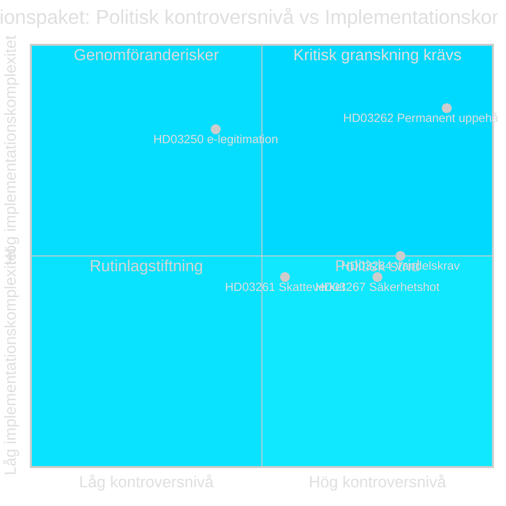

# Politisk Klassificering — Propositionspaket Maj 2026

**Author**: James Pether Sörling
**Date**: 2026-05-15

## 7-Dimensionell Klassificering per Dokument

### HD03250 — En statlig e-legitimation

| Dimension | Klassificering |
|-----------|---------------|
| Ideologisk dimension | Center-höger statlig intervention i digital infrastruktur; pragmatisk modernisering |
| Konstitutionell dimension | Ny lag — kräver Riksdagsbeslut; inte grundlagsändring |
| Implementationsdimension | Medelhög komplexitet; DIGG implementeringsmyndighet; 2–3 år tidplan |
| Partipolitisk dimension | Stöd: M, KD, L, SD, C möjlig; Kritik: integritetsfrågor från V, MP |
| EU-dimension | EU eIDAS-förordning; interoperabilitetskrav; digitala rättigheter |
| Ekonomisk dimension | Digitaliseringsvinster; kostnader för DIGG-uppbyggnad; konkurrens med BankID |
| Säkerhetsdimension | NCSC-granskning behövs; kritisk infrastruktur; cyberattackvektor |

**Prioritetsnivå**: L2+ Priority
**Dataskyddsnivå**: PUBLIC — ingen GDPR Art 9 känslig data i propositionen per se; implementeringsrisk för folkdata
**Accessnivå**: Öppen

### HD03261 — Skatteverket folkbokföring

| Dimension | Klassificering |
|-----------|---------------|
| Ideologisk dimension | Höger: utökad statlig kontroll av folkbokföringen; anti-fusk |
| Konstitutionell dimension | Ny lag eller lagändring; riksdagsbehandling SkU |
| Implementationsdimension | Medelhög; Skatteverket har administrativ kapacitet [B2] |
| Partipolitisk dimension | SD driver frågan; M, KD, L stödjer; S delad; V, MP, C kritisk |
| EU-dimension | GDPR-risker; dataminimering, ändamålsbegränsning |
| Ekonomisk dimension | Låg direkt kostnad; vinst i folkbokföringseffektivitet |
| Säkerhetsdimension | Personuppgiftsintrång-risker; Datainspektionens tillsyn |

**Prioritetsnivå**: L2 Strategic

### HD03267 — Stärkt skydd mot säkerhetshot

| Dimension | Klassificering |
|-----------|---------------|
| Ideologisk dimension | Höger nationalsäkerhet; utökade statsmakter mot individ |
| Konstitutionell dimension | Kräver proportionalitetsprövning EKMR Art 3, 8, 13 |
| Implementationsdimension | Säkerhetspolisen centralt; hemliga utredningar |
| Partipolitisk dimension | M+SD+KD+L stödjer; S delad; V+MP starkt emot |
| EU-dimension | EU-rättslig prövning; asylrättsliga förpliktelser kvarstår |
| Ekonomisk dimension | Minimal direkt kostnad |
| Säkerhetsdimension | Kärnfunktion nationell säkerhet; SÄPO-mandat |

**Prioritetsnivå**: L2 Strategic

### HD03262 — Utmönstring av permanent uppehållstillstånd

| Dimension | Klassificering |
|-----------|---------------|
| Ideologisk dimension | Höger-restriktiv migrationsideologi; temporariseringsprincipen |
| Konstitutionell dimension | Riksdagsbehandling SfU; EU-paket konformitet |
| Implementationsdimension | HÖG komplexitet; Migrationsverket; 349 000+ berörda |
| Partipolitisk dimension | SD-principfråga; M+KD+L stödjer; S+V+MP+C emot |
| EU-dimension | EU Asyl- och Migrationspaket implementering — obligatorisk |
| Ekonomisk dimension | Arbetsmarknadseffekter; kompetensförsörjning |
| Säkerhetsdimension | Återvändningsfrågor; säkerhetshot-kategori |

**Prioritetsnivå**: L2+ Priority

### HD03264 — Skärpta vandelskrav

| Dimension | Klassificering |
|-----------|---------------|
| Ideologisk dimension | Höger-restriktiv; kriminalitet som utvisningsgrund |
| Konstitutionell dimension | Riksdagsbehandling SfU; rättssäkerhetsfrågor |
| Implementationsdimension | Medelhög; rättsväsendet + Migrationsverket |
| Partipolitisk dimension | SD+M+KD+L stödjer; opposition emot |
| EU-dimension | Konformitet med EU-pakten; prövningskriterier |
| Ekonomisk dimension | Minimal direkt kostnad; möjlig exportkvalificeringseffekt |
| Säkerhetsdimension | Brottslingars vistelsestatus |

**Prioritetsnivå**: L2 Strategic

