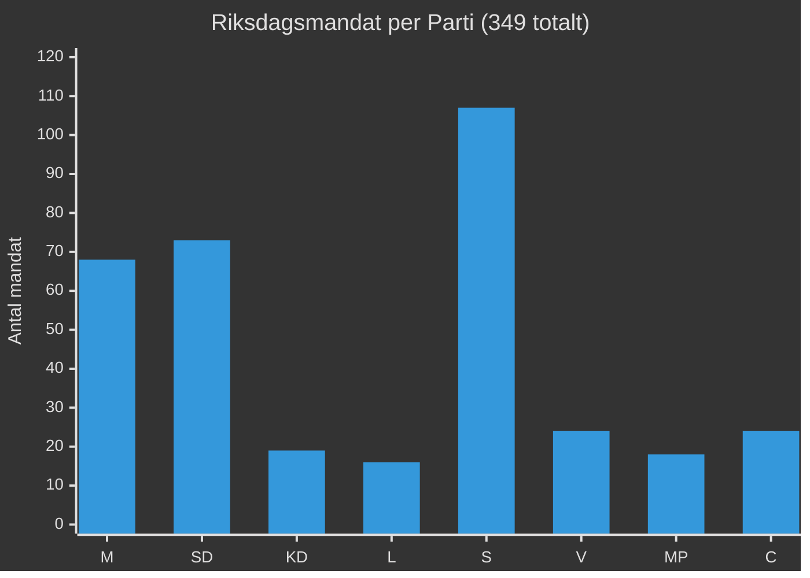

# Koalitionsmatematik — Propositionspaket Maj 2026

**Author**: James Pether Sörling
**Date**: 2026-05-15

## Mandatfördelning (Riksdagen 349 mandat)

| Parti | Mandat 2022 | Block |
|-------|------------|-------|
| Moderaterna (M) | 68 | Höger |
| Sverigedemokraterna (SD) | 73 | Höger |
| Kristdemokraterna (KD) | 19 | Höger |
| Liberalerna (L) | 16 | Höger |
| **Högerblocket totalt** | **176** | |
| Socialdemokraterna (S) | 107 | Opposition |
| Vänsterpartiet (V) | 24 | Opposition |
| Miljöpartiet (MP) | 18 | Opposition |
| Centerpartiet (C) | 24 | Opposition |
| **Oppositionsblocket totalt** | **173** | |
| **Riksdagen totalt** | **349** | |

*Absolutmajoritet krävs: 175 mandat. Högerblocket: 176 = +1 mandats marginal.*

## Röstningsscenarier per Proposition

### Scenario: Alla högerpartier röstar JA

| Proposition | JA | NEJ | Utfall |
|-------------|-----|-----|--------|
| HD03262 (PUT) | 176 | 173 | **ANTAS** (+3) |
| HD03264 (Vandel) | 176 | 173 | **ANTAS** (+3) |
| HD03267 (Säkerhet) | 176 | 173 | **ANTAS** (+3) |
| HD03250 (e-leg) | 176 + möjl. C/S | <173 | **ANTAS** komfortabelt |
| HD03261 (Folkbokföring) | 176 + möjl. S | <173 | **ANTAS** |

### Scenario: L bryter på HD03267 (frihets- och rättigheter)

| Proposition | JA | NEJ | Utfall |
|-------------|-----|-----|--------|
| HD03267 (Säkerhet) med L-NEJ | 160 | 189 | **AVSLÅS** |

*16 L-mandat avgörande — om L röstar NEJ faller HD03267*

### Scenario: C stödjer HD03250 (digital infrastruktur)

| Proposition | JA | NEJ | Utfall |
|-------------|-----|-----|--------|
| HD03250 (e-leg) med C-stöd | 200 | 149 | **ANTAS** med bred majoritet |

## Kritisk Mandatanalys

- **Minsta möjliga majoritet**: 175 av 349
- **Högerblocket nu**: 176 mandat = marginal om **1 mandat**
- **Sårbarhet**: Sjukdom, frånvaro, intern opposition hos EN L-ledamot kan fälla en proposition
- **L-fraktionens interna sammanhållning**: Avgörande variabel för HD03267

## Koalitionsstabilitetsmätare

| Faktor | Status | Risk |
|--------|--------|------|
| M-SD enighet | ✅ Stark | Låg |
| KD-koalitionslojalitet | ✅ Stark | Låg |
| L-interna spänningar | ⚠️ Medelhög | Medel |
| Frånvaroapparition | ⚠️ Oprediktabel | Låg-Medel |

