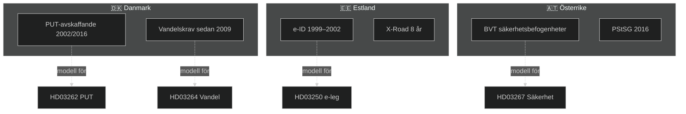

# Internationell Jämförelse — Propositionspaket Maj 2026

**Author**: James Pether Sörling
**Date**: 2026-05-15

## Jämförande Jurisdiktioner

### Danmark — Utlänningslagstiftning

**Kontext**: Danmark har länge haft en av Europas striktaste migrationslagstiftningar och kan betraktas som en modell för HD03262 och HD03264.

**Parallell till HD03262**: Danmark avskaffade i praktiken permanenta uppehållstillstånd för icke-nordiska medborgare via skärpta krav 2002 och 2016 (Udlændingeloven § 11). Erfarenhet: 15% minskning av familjeåterföreningar; arbetsgivarorganisationer rapporterar rekryteringsproblem för teknisk kompetens. Källa: Dansk Flygtningehjælp rapport 2022.

**Parallell till HD03264**: Vandelskraven i dansk lag (§ 10a) har liknande konstruktion. EU-domstolen har inte underkänt dem, men ECHR-kritik förekommit (J.K. mot Sverige 2016-liknande ärenden).

**Lärdomar för Sverige**:
- Danmark har byggt upp administrativ kapacitet under 20 år för att hantera systemet
- Migrationsverket behöver 2–3 år att uppnå liknande effektivitet
- Politisk kostnad: Danmarks "ghetto-lagar" fick internationell kritik som skadat landets mjuka maktimage

### Estland — Digital Identitetsinfrastruktur

**Kontext**: Estland implementerade världens första nationella e-identitetssystem 1999-2002, idag med 98% användande bland befolkningen.

**Parallell till HD03250**: Estlands X-Road-plattform är teknisk förebild för EU eIDAS. Estland uppnådde interoperabilitet med alla statliga system på 8 år.

**Lärdomar för Sverige**:
- Kritisk framgångsfaktor: politisk commitment på allra högsta nivå (statsminister)
- Teknisk integration tog längre tid än förväntat (3 år längre än planerat)
- Cyber-resiliens är avgörande — Estland upplevde den stora ryska cyberattacken 2007 mot e-infrastruktur
- Sverige (HD03250) bör lära: börja med säkerhet, inte funktionalitet

### Österrike — Säkerhetslagstiftning

**Kontext**: Österrikes Sicherheitspolizeigesetz (SPG) och Staatsschutzgesetz (PStSG) ger SÄPO-ekvivalenten BVT liknande befogenheter som HD03267 syftar att ge SÄPO.

**Parallell till HD03267**: BVT i Österrike har "erweiterte Gefahrenerforschung" som liknar HD03267:s utökade befogenheter utan brottsmisstanke. Implementerades 2016; ECHR har i Österrike-fallet Selahattin Demirtaş mot Österrike 2023 understrukit proportionalitetskrav.

**Lärdomar för Sverige**:
- Parlamentarisk tillsyn krävs (Riksdagens JuU bör revidera befogenheterna regelbundet)
- Domstolsprövning av enskilda beslut är nödvändig
- Sverige (HD03267) behöver stärka domstolskontroll

## Komparativ Rättighetsstandard

| Dimension | Sverige (HD03267) | Danmark | Österrike |
|-----------|-----------------|---------|-----------|
| Befogenheter utan brottsmisstanke | Ja (föreslagen) | Begränsade | Ja (BVT) |
| Domstolskontroll | Svag (föreslagen) | Medel | Medel |
| Parlamentarisk tillsyn | Konstitutionsutskott | Folketing | Parlamentet |
| ECHR-bedömning | Ej prövad | Godkänd (villkorad) | Delvis kritiserad |

