# Korshänvisningskarta — Propositionspaket Maj 2026

**Author**: James Pether Sörling
**Date**: 2026-05-15

## Dokumentkopplingar

| Dok-ID | Relaterat Dok-ID | Relationstyp | Beskrivning |
|--------|-----------------|-------------|-------------|
| HD03262 | HD03264 | Tematisk synergy | Båda rör migrations-restriktioner; behandlas parallellt i SfU |
| HD03262 | HD03267 | Implementationsöverlapp | Säkerhetshot-kriterier i HD03267 påverkar utvisningsgrunder i HD03262 |
| HD03250 | HD03261 | Infrastruktursynergy | E-legitimation (HD03250) möjliggör säkrare folkbokföringskontroll (HD03261) |
| HD03267 | HD03264 | Juridisk konvergens | Bägge utvidgar statens befogenheter vid säkerhetshot / kriminell bakgrund |
| HD03261 | HD03262 | Tillämpningsöverlapp | Folkbokföringsdata (HD03261) används för kontroll av uppehållsrättsinnehavare |

## Utskottsreferenser

| Dok-ID | Beredande Utskott | Förväntat Betänkande |
|--------|------------------|---------------------|
| HD03250 | SkattU + KU? | TBD 2026H1 |
| HD03261 | SkattU | TBD 2026H1 |
| HD03267 | JuU | TBD 2026H1 |
| HD03262 | SfU | TBD 2026H1 |
| HD03264 | SfU | TBD 2026H1 |

## EU-rättsliga Kopplingar

| Dok-ID | EU-instrument | Kopplingstyp |
|--------|--------------|-------------|
| HD03262 | EU Asyl- och Migrationspaket (2024/1351-1359) | Obligatorisk implementering |
| HD03267 | EKMR Art 3, 8, 13 | Konformitetsprövning |
| HD03250 | EU eIDAS-förordning (910/2014, reviderad 2023) | Teknisk standard |
| HD03261 | GDPR (2016/679) | Proportionalitet; ändamålsbegränsning |

## Historiska Föregångare

| Dok-ID | Historisk Föregångare | Period |
|--------|----------------------|--------|
| HD03262 | Tidsbegränsad lag 2016/17:17 (S-prop.) | 2016 |
| HD03267 | NSL 2022 (Terroristbrottslagen) | 2022 |
| HD03250 | E-id 2.0 utredning (SOU 2021:62) | 2021 |
| HD03264 | Utlänningslagen 8 kap. 2022 ändringar | 2022 |

## Koppling till Tidöavtalet

```mermaid
%%{init: {'theme': 'dark'}}%%
graph TD
    TA[Tidöavtalet 2022] --> MIG[Migrationskapitel]
    TA --> DIG[Digitalisering]
    TA --> SÄK[Säkerhetskapitel]
    MIG --> HD03262[HD03262 PUT-avskaffande]
    MIG --> HD03264[HD03264 Vandelskrav]
    MIG --> HD03267[HD03267 Säkerhetshot]
    DIG --> HD03250[HD03250 e-legitimation]
    DIG --> HD03261[HD03261 Folkbokföring]
    SÄK --> HD03267
    HD03262 -.->|parallellbehandling SfU| HD03264
    HD03250 -.->|infrastruktursynergy| HD03261
    HD03267 -.->|rättslig konvergens| HD03264
    style TA fill:#0a0e27,stroke:#ffbe0b
    style MIG fill:#1a1e3d,stroke:#ff006e
    style DIG fill:#1a1e3d,stroke:#00d9ff
    style SÄK fill:#1a1e3d,stroke:#ff006e
```

