# Djävulens Advokat — Propositionspaket Maj 2026

**Author**: James Pether Sörling
**Date**: 2026-05-15

## Metodologi

Tre kontraindikatorer testade mot konsensusanalysen som förutsäger paketet antas utan problem.

## Hypotes 1: e-legitimationen (HD03250) misslyckas och stärker BankID-monopolet

**Konsensus**: HD03250 levererar en fungerande statlig e-legitimation och minskar beroendet av BankID.

**Kontraindikatorn**: DIGG har levererat tre misslyckade IT-projekt 2019–2024 (se Statskontoret granskning). Den statliga IT-historiken i Sverige (Rikspolisen PUST, Försäkringskassans IT-modernisering) visar systematiska underskattningar av komplexitet. BankID-konsortiet (Swedbank, SEB, Nordea) har starkt ekonomiskt incitament att motarbeta via lobbyism och tekniska argument. IMY kan stoppa projektet p.g.a. dataskyddsproblem i den tekniska arkitekturen.

**Om hypotesen stämmer**: DIGG-projektet misslyckas; man återgår till BankID; skattebetalarna är ute med 500–700 MSEK; Finansdepartementet tvingas erkänna fiasko innan valet 2026. Risk: väljarförtroende för regeringens digitaliseringsförmåga rasar.

**Konfidensintervall för falsifiering**: 30% sannolikhet att projektet misslyckas inom 4 år. [B2]

## Hypotes 2: HD03262 skadar snarare än stärker Sverige internationellt

**Konsensus**: Avskaffandet av permanenta uppehållstillstånd är en tuff men nödvändig migrationspolitisk åtgärd.

**Kontraindikatorn**: EU-kommissionen kan initiera överträdelsefördfarande mot Sverige för bristande EU-paktkonformitet, vilket ger internationell negativ uppmärksamhet. Amnesty International och UNHCR kan publicera rapporter som beskriver Sverige som ett "bakåtsträvande" EU-land i flykting- och skyddsrätt — något som skadar det svenska varumärket i exportberoende branscher (SSAB, Volvo, H&M köper "Swedish values"). Storinvesterare kan fatta beslut baserade på ESG-kriterier om att undvika "human rights risk countries" — Invest in Sweden Agency har intern oro (källa: läckt PM februari 2026).

**Om hypotesen stämmer**: Sverige tappar 2–3 placeringar i Corruption Perceptions Index och Rule of Law Index (Transparency International, World Justice Project) på 3–5 år. Direktinvesteringar minskar med 5–10%. Koalitionsregeringen vinner valet 2026 men tappar det internationella förtroendekapitalet. [B3]

**Konfidensintervall för falsifiering**: 20% sannolikhet för betydande internationell skadeseffekt.

## Hypotes 3: HD03267 används mot legitima politiska aktivister

**Konsensus**: HD03267 riktar sig mot statsfinansierade utländska underrättelseaktörer, inte mot politisk opposition.

**Kontraindikatorn**: Europeiska erfarenheter av anti-terrorismlagar (UK Terrorism Act 2006; Ungerns "national security" lag 2010) visar en sluttande plan där utökade befogenheter gradvis tillämpas på aktivister, journalister och religiösa grupper. HD03267:s definition av "säkerhetshot" är tillräckligt bred för att kunna tillämpas på exempelvis pro-palestinsk aktivism, klimataktivism (Extinction Rebellion), eller utländsk-härstammande media. Riksdagens möjligheter till parlamentarisk tillsyn är begränsade om operationer hemlighålls.

**Om hypotesen stämmer**: SÄPO genomför utvisningar av individer som i demokratiska länder betraktas som legitima politiska aktörer; EU-rådet begär förklaring; Sverige hamnar i "rule of law" debatt. Konsekvens: L och C drar sig ur koalitionen. [B3]

**Konfidensintervall för falsifiering**: 15% sannolikhet inom 5 år av implementering.

```mermaid
%%{init: {'theme': 'dark'}}%%
graph LR
    H1["Hypotes 1\ne-legitimation fiasko\n30% sannolikhet"]
    H2["Hypotes 2\nHD03262 skadar\nSveriges image\n20% sannolikhet"]
    H3["Hypotes 3\nHD03267 mot aktivister\n15% sannolikhet"]
    IND1["Indikator:\nDIGG leverans-\nproblem Q3 2026"]
    IND2["Indikator:\nEU-kommissionens\nbrev till Sverige"]
    IND3["Indikator:\nSÄPO utvisning av\npolitisk aktivist"]
    H1 --> IND1
    H2 --> IND2
    H3 --> IND3
    style H1 fill:#1a1e3d,stroke:#ffbe0b
    style H2 fill:#1a1e3d,stroke:#ff006e
    style H3 fill:#1a1e3d,stroke:#ff006e
```

