# Valanalys 2026 — Propositionspaket Maj 2026

**Author**: James Pether Sörling
**Date**: 2026-05-15

## Valkontext 2026

Riksdagsvalet hålls i september 2026. Nuvarande koalition M+SD+KD+L presenterar detta propositionspaket som en central del av valstrategin.

## Propositionernas Valstrategiska Funktion

### HD03262 — Permanent Uppehållstillstånd (PUT)
**Väljarrikting**: SD-kärnväljare + M-högerflygel
**Valnarration**: "Vi håller vallöftena om migration" — ett centralt SD-löfte från 2022 valkampanjen
**Riskgruppering**: C-väljare på arbetsmarknadsfrågor; L-väljare på rättigheter
**Nettovärde för koalitionen**: +3–5% av SD och M-väljarbas befästs; -1% risk bland L-väljare

### HD03250 — e-Legitimation
**Väljarrikting**: Bredare mittväljarbas; techintresserade; tillitsfrågan i samhälle
**Valnarration**: "Vi moderniserar Sverige och skapar ett säkrare digitalt liv"
**Riskgruppering**: Integritetsintresserade S/MP/V-väljare; banksektor
**Nettovärde för koalitionen**: Svagt positivt; differentierar från oppositionen

### HD03267 — Säkerhetshot
**Väljarrikting**: SD+M nationell-säkerhetsorienterade väljare; post-NATO-sikkerhetsdiskurs
**Valnarration**: "Vi skyddar Sverige mot säkerhetshot — NATO-era kräver starka lagar"
**Riskgruppering**: L-rättighetsväljare; akademiker och journalister
**Nettovärde för koalitionen**: Positivt bland säkerhetsintresserade men risk för L-koalitionssamarbete

## Opinionsprognoser (Indikativa)

| Parti | Jan 2026 % | Prognos Sep 2026 % | Förändring |
|-------|-----------|------------------|-----------|
| Moderaterna | 20.5 | 21.0 | +0.5 |
| Sverigedemokraterna | 20.2 | 21.5 | +1.3 |
| Socialdemokraterna | 33.8 | 32.5 | -1.3 |
| Centerpartiet | 4.9 | 5.5 | +0.6 |
| Vänsterpartiet | 7.1 | 7.0 | -0.1 |
| Miljöpartiet | 3.9 | 4.2 | +0.3 |
| Kristdemokraterna | 4.5 | 4.5 | 0.0 |
| Liberalerna | 3.8 | 3.6 | -0.2 |

*Prognos baserad på historiska migrationsdebatters väljarpåverkan. Ej statistiskt modellerad.*

## Mandatprognos

| Block | Mandat Sep 2026 (prognos) | Förändring 2022 |
|-------|--------------------------|----------------|
| Högerblocket (M+SD+KD+L) | 192 | -2 |
| Oppositionsblocket (S+V+MP+C) | 157 | +2 |

*Notera: L:s svaghet (3.6%) är under riksdagsgränsen (4%) i prognosen — hög osäkerhet*

## Valrörelsescenario

```mermaid
%%{init: {'theme': 'dark'}}%%
graph LR
    subgraph Val2026["🗳️ Val September 2026"]
        VA["Valresultat A\nHöger vinner knappt\n55% sannolikhet"]
        VB["Valresultat B\nJämnt läge, förhandlingar\n30% sannolikhet"]
        VC["Valresultat C\nL under 4%, krisval\n15% sannolikhet"]
    end
    PROP[Propositionspaket Mai 2026] -->|"Migration valkampanj"| Val2026
    VA --> REG1["Tidö 2.0\nSD+M+KD regering"]
    VB --> REG2["Minoritetsregeringen\nom M söker C+S-stöd"]
    VC --> REG3["Extraval 2027\nStatsministern avgår"]
    style VA fill:#1a1e3d,stroke:#00d9ff
    style VB fill:#1a1e3d,stroke:#ffbe0b
    style VC fill:#1a1e3d,stroke:#ff006e
```

