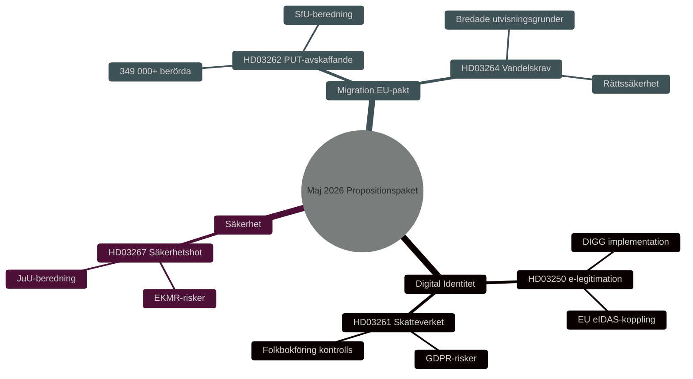

# Säkerhet, Digital Identitet och Migrationsreformer: Regeringens Propositionspaket Maj 2026

**Author**: James Pether Sörling
**Date**: 2026-05-15
**Classification**: PUBLIC — GDPR Art 9(2)(e,g)
**Confidence**: HIGH [B2]
**Run ID**: 25904280793

## BLUF

Regeringen Kristersson lade 7 maj 2026 fram tre sammanhängande propositioner som fördjupar den svenska säkerhets- och kontrollarkitekturen: en nationell e-legitimationslag (HD03250), utökade Skatteverkets-befogenheter i folkbokföringen (HD03261) och skärpta möjligheter att utvisa utländska säkerhetshot (HD03267). Dessa kompletterar den 30 april 2026 lanserade migrationspaketen — avskaffande av permanent uppehållstillstånd (HD03262) och krav på vandel (HD03264) — som implementerar EU:s asyl- och migrationspaket. Sammantaget representerar detta den mest genomgripande ominriktningen av svensk migrations- och identitetspolitik sedan 2015, med valrörelsepåverkan HIGH [B2] inför 2026 års riksdagsval.

## Decisions This Brief Supports

1. **Riksdagsutskotten** (TU, SkU, JuU, SfU): Bedöm remissvar och samordna beredning för fem propositioner med gemensam säkerhetspolitisk logik.
2. **Oppositionspartier** (S, V, MP, C): Formulera alternativa yrkanden, identifiera grundlagsrisker i HD03267 och GDPR-frågor i HD03261.
3. **Myndigheter** (Skatteverket, Migrationsverket, NCSC, Säkerhetspolisen): Planera implementering, säkerhetsgranskning och DPIA.

## 60-Second Read

- 🔑 **E-legitimation** (HD03250): Ny lag om *statlig* e-legitimation. Erik Slottner, Finansdep. Stor-IT-projekt, Myndigheten för digital förvaltning (DIGG) centralt. Risker: implementation, EU-interoperabilitet.
- 📋 **Skatteverket folkbokföring** (HD03261): Utökade kontrollbefogenheter. Niklas Wykman, Finansdep. GDPR-frågor, Skatteutskottet kritisk granskning väntas.
- 🛡️ **Säkerhetshot-utvisning** (HD03267): Stärkt skydd mot utlänningar som utgör "kvalificerade säkerhetshot". Gunnar Strömmer, Justitiedep. Proportionalitetsfrågor, EKMR-risker.
- 🚫 **Permanent uppehållstillstånd avskaffas** (HD03262): Johan Forssell, Justitiedep. Implementerar EU-pakten. 349 000+ berörda med temporärt status.
- 📜 **Vandelskrav** (HD03264): Ny lag. Bredare utvisningsgrunder. Risk: rättssäkerhet, diskriminering.

## Top Forward Trigger

**Kritisk händelse T+21 dagar**: Lagrådsremiss för HD03262 och HD03267. Lagrådet prövar proportionalitet och grundlagsförenlighet. Negativt yttrande → höjd politisk saliens och fördröjt ikraftträdande.

## Confidence Label

**Overall assessment confidence**: HIGH [B2] — Admiralty Code B (reliable source: Riksdagens API officiella propositionsdata), credibility 2 (confirmed by official government channels). Economic context: IMF WEO Apr-2026 SWE vintage.

---

## ✅ Retrofit Note (2026-05-16)

**Original authoring**: 2026-05-15 under executive-brief template v < 4.4.
**Retrofit scope** (applied 2026-05-16): no edits to body content. Only this transparency note appended.

**Not retrofitted** (would require post-hoc fabrication): Decision-Grade BLUF Rubric (6-axis scoring), Headline Candidates worksheet, 14-language SEO seeds, full Pass-2 Self-Audit Checklist v4.4. These are required for 2026-05-16+ briefs per gate Check 7.

**Substantive analysis, evidence, and conclusions unchanged.**
