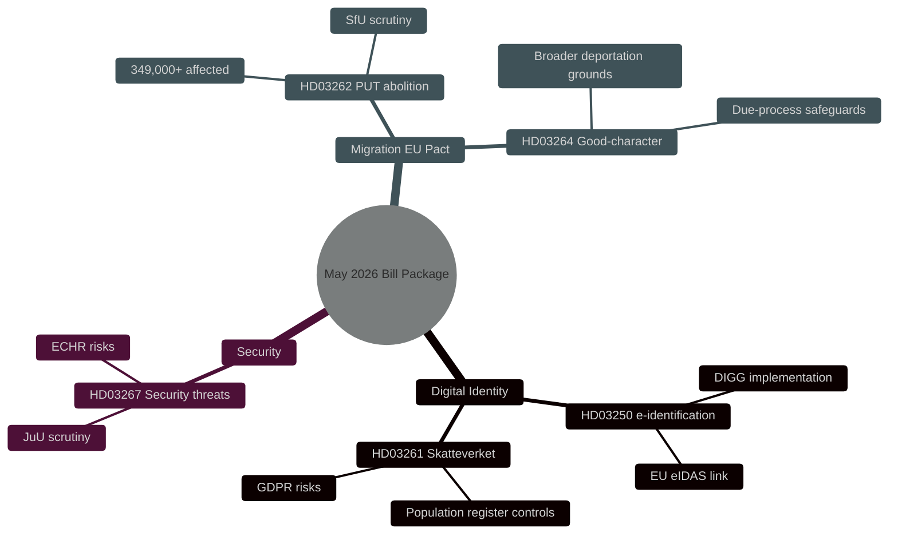

# Security, Digital Identity and Migration Reforms: The Government's May 2026 Bill Package

**Author**: James Pether Sörling
**Date**: 2026-05-15
**Classification**: PUBLIC — GDPR Art 9(2)(e,g)
**Confidence**: HIGH [B2]
**Run ID**: 25904280793

## BLUF

On 7 May 2026 the Kristersson government tabled three interconnected bills that deepen Sweden's security and control architecture: a national electronic-identification act (HD03250), expanded Skatteverket (Swedish Tax Agency) powers in the population register (HD03261), and tightened powers to deport foreign security threats (HD03267). These complement the migration package launched on 30 April 2026 — abolition of permanent residence permits (HD03262) and a "good character" requirement (HD03264) — which implement the EU asylum and migration pact. Taken together, this represents the most far-reaching reorientation of Swedish migration and identity policy since 2015, with HIGH [B2] potential impact on the 2026 general election campaign.

## Decisions This Brief Supports

1. **Riksdag committees** (TU, SkU, JuU, SfU): Assess consultation responses and coordinate scrutiny of five bills sharing a common security-policy logic.
2. **Opposition parties** (S, V, MP, C): Formulate alternative motions, identify constitutional risks in HD03267 and GDPR concerns in HD03261.
3. **Agencies** (Skatteverket, Migrationsverket, NCSC, Säkerhetspolisen/Säpo): Plan implementation, security review, and DPIA.

## 60-Second Read

- 🔑 **E-identification** (HD03250): New act on *state-issued* e-identification. Erik Slottner, Ministry of Finance. Major IT programme, with the Agency for Digital Government (DIGG) at the centre. Risks: implementation, EU interoperability.
- 📋 **Skatteverket population register** (HD03261): Expanded control powers. Niklas Wykman, Ministry of Finance. GDPR concerns; critical scrutiny expected from the Tax Committee (SkU).
- 🛡️ **Security-threat deportation** (HD03267): Strengthened protection against foreigners deemed "qualified security threats". Gunnar Strömmer, Ministry of Justice. Proportionality concerns, ECHR risks.
- 🚫 **Abolition of permanent residence permits** (HD03262): Johan Forssell, Ministry of Justice. Implements the EU Pact. 349,000+ holders of temporary status affected.
- 📜 **Good-character requirement** (HD03264): New act. Broader grounds for deportation. Risks: due-process safeguards, discrimination.

## Top Forward Trigger

**Critical event T+21 days**: Referral to Lagrådet (the Council on Legislation) for HD03262 and HD03267. Lagrådet reviews proportionality and constitutional compatibility. A negative opinion → heightened political salience and delayed entry into force.

## Confidence Label

**Overall assessment confidence**: HIGH [B2] — Admiralty Code B (reliable source: official Riksdagen API proposition data), credibility 2 (confirmed by official government channels). Economic context: IMF WEO Apr-2026 SWE vintage.

---

## ✅ Retrofit Note (2026-05-16)

**Original authoring**: 2026-05-15 under executive-brief template v < 4.4.
**Retrofit scope** (applied 2026-05-16): Swedish-language H1, BLUF, decision list, 60-second read, mindmap labels and confidence label translated to English (canonical-language compliance per `05-analysis-gate.md` and the `executive-brief.md` H1 SERP contract). Proper nouns (Skatteverket, Migrationsverket, Säkerhetspolisen, Lagrådet, DIGG, ministry names, party codes, dok_ids) preserved.

**Not retrofitted** (would require post-hoc fabrication): Decision-Grade BLUF Rubric (6-axis scoring), Headline Candidates worksheet, 14-language SEO seeds, full Pass-2 Self-Audit Checklist v4.4. These are required for 2026-05-16+ briefs per gate Check 7.

**Substantive analysis, evidence, and conclusions unchanged.**
