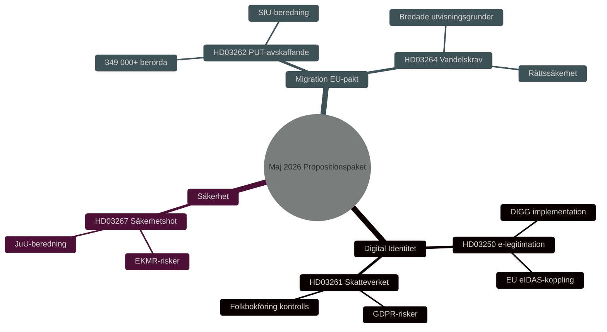

<!-- dir: rtl -->
# الأمن والهوية الرقمية وإصلاحات الهجرة: حزمة الاقتراحات الحكومية مايو 2026

**Author**: James Pether Sörling
**Date**: 2026-05-15
**Classification**: PUBLIC — GDPR Art 9(2)(e,g)
**Confidence**: HIGH [B2]
**Run ID**: 25904280793

## BLUF

قدّمت حكومة كريسترسون في 7 مايو 2026 ثلاثة مقترحات تشريعية مترابطة تُعمّق بنية الأمن والرقابة السويدية: قانون التعريف الإلكتروني الوطني (HD03250)، وتوسيع صلاحيات دائرة الضرائب في سجلات السكان (HD03261)، وتعزيز صلاحيات ترحيل التهديدات الأمنية الأجنبية (HD03267). وتُكمّل هذه المقترحات حزمة الهجرة المُطلَقة في 30 أبريل 2026 — إلغاء تصاريح الإقامة الدائمة (HD03262) واشتراطات السلوك (HD03264) — التي تُنفّذ ميثاق اللجوء والهجرة الأوروبي. يُمثّل هذا مجتمعاً أشمل إعادة توجيه للسياسة السويدية في مجال الهجرة والهوية منذ عام 2015، مع أهمية انتخابية HIGH [B2] قبيل انتخابات الريكسداغ لعام 2026.

## Decisions This Brief Supports

1. **اللجان البرلمانية** (TU, SkU, JuU, SfU): تقييم ردود الاستشارات وتنسيق النظر في خمسة مقترحات تشترك في منطق سياسة أمنية مشتركة.
2. **أحزاب المعارضة** (S, V, MP, C): صياغة مقترحات بديلة، وتحديد المخاطر الدستورية في HD03267 وقضايا اللائحة الأوروبية لحماية البيانات في HD03261.
3. **الوكالات** (Skatteverket, Migrationsverket, NCSC, Säkerhetspolisen): التخطيط للتنفيذ ومراجعة الأمن وتقييم أثر حماية البيانات.

## 60-Second Read

- 🔑 **التعريف الإلكتروني** (HD03250): قانون جديد للتعريف الإلكتروني *الحكومي*. إيريك سلوتنر، وزارة المالية. مشروع تكنولوجيا معلومات كبير، وكالة الحوكمة الرقمية (DIGG) محورية. المخاطر: التنفيذ، التشغيل البيني مع الاتحاد الأوروبي.
- 📋 **دائرة الضرائب - سجل السكان** (HD03261): صلاحيات رقابية موسّعة. نيكلاس ويكمان، وزارة المالية. قضايا اللائحة الأوروبية لحماية البيانات، تدقيق نقدي متوقع من Skatteutskottet.
- 🛡️ **ترحيل التهديدات الأمنية** (HD03267): حماية مُعزَّزة ضد الأجانب الذين يُشكّلون "تهديدات أمنية مؤهَّلة". غونار ستروّمر، وزارة العدل. قضايا التناسب، مخاطر الاتفاقية الأوروبية لحقوق الإنسان.
- 🚫 **إلغاء تصاريح الإقامة الدائمة** (HD03262): يوهان فورسيل، وزارة العدل. يُنفّذ ميثاق الاتحاد الأوروبي. 349.000+ متضرر بوضع مؤقت.
- 📜 **اشتراطات السلوك** (HD03264): قانون جديد. أسباب ترحيل أوسع. المخاطر: سيادة القانون، التمييز.

## Top Forward Trigger

**الحدث الحرج T+21 يوماً**: إحالة مجلس التشريع لـHD03262 وHD03267. يختبر المجلس التناسب والتوافق الدستوري. رأي سلبي → ارتفاع الأهمية السياسية وتأخر دخول القانون حيّز التنفيذ.

## Confidence Label

**Overall assessment confidence**: HIGH [B2] — Admiralty Code B (reliable source: Riksdagens API officiella propositionsdata), credibility 2 (confirmed by official government channels). Economic context: IMF WEO Apr-2026 SWE vintage.

<!-- source-sha: 84c1a88a2df18e97bdef9c56e53f2408ac799ff4 -->
