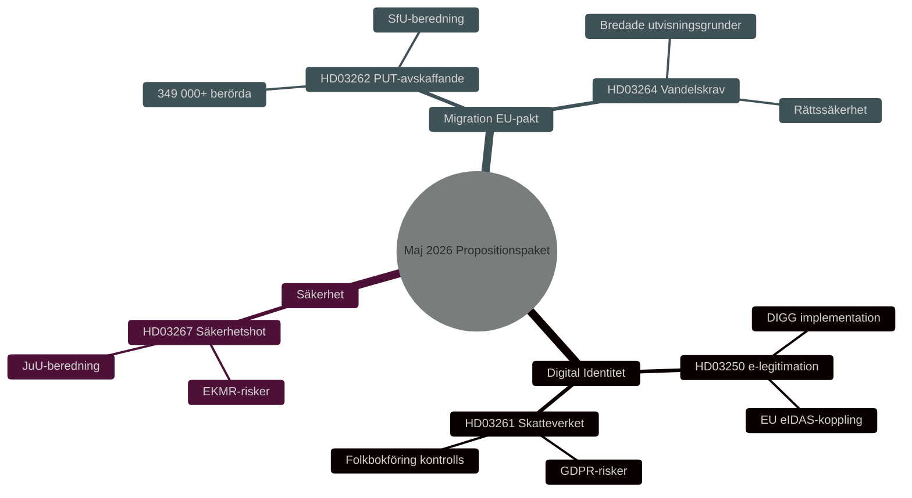

# Sikkerhed, Digital Identitet og Migrationsreformer: Regeringens Forslagspakke Maj 2026

**Author**: James Pether Sörling
**Date**: 2026-05-15
**Classification**: PUBLIC — GDPR Art 9(2)(e,g)
**Confidence**: HIGH [B2]
**Run ID**: 25904280793

## BLUF

Den 7. maj 2026 fremlagde Kristersson-regeringen tre sammenhængende lovforslag, der uddyber den svenske sikkerheds- og kontrolarkitektur: en national e-legitimationslov (HD03250), udvidede beføjelser til Skatteverket inden for folkeregistrering (HD03261) og skærpede muligheder for at udvise udenlandske sikkerhedstrusler (HD03267). Disse supplerer migrations­pakken lanceret den 30. april 2026 — afskaffelse af permanente opholdstilladelser (HD03262) og vandels­krav (HD03264) — som implementerer EU's asyl- og migrationsaftale. Samlet set repræsenterer dette den mest gennemgribende omlægning af svensk migrations- og identitetspolitik siden 2015 med HIGH [B2] valgpolitisk relevans forud for Riksdagsvalget 2026.

## Decisions This Brief Supports

1. **Parlamentariske udvalg** (TU, SkU, JuU, SfU): Vurder høringssvar og koordiner behandling af fem lovforslag med fælles sikkerhedspolitisk logik.
2. **Oppositionspartier** (S, V, MP, C): Formuler alternative beslutningsforslag, identificer forfatningsrisici i HD03267 og GDPR-spørgsmål i HD03261.
3. **Myndigheder** (Skatteverket, Migrationsverket, NCSC, Säkerhetspolisen): Planlæg implementering, sikkerhedsgennemgang og DPIA.

## 60-Second Read

- 🔑 **E-legitimation** (HD03250): Ny lov om *statslig* e-legitimation. Erik Slottner, Finansministeriet. Stort IT-projekt, Myndigheten för digital förvaltning (DIGG) centralt. Risici: implementering, EU-interoperabilitet.
- 📋 **Skatteverket folkeregistrering** (HD03261): Udvidede kontrolbeføjelser. Niklas Wykman, Finansministeriet. GDPR-spørgsmål, kritisk gennemgang forventes fra Skatteutskottet.
- 🛡️ **Sikkerhedstrussel-udvisning** (HD03267): Styrket beskyttelse mod udlændinge, der udgør "kvalificerede sikkerhedstrusler". Gunnar Strömmer, Justitsministeriet. Proportionalitetsspørgsmål, EMRK-risici.
- 🚫 **Permanente opholdstilladelser afskaffes** (HD03262): Johan Forssell, Justitsministeriet. Implementerer EU-pagten. 349.000+ berørt med midlertidig status.
- 📜 **Vandelskrav** (HD03264): Ny lov. Bredere udvisningsgrundlag. Risiko: retssikkerhed, diskrimination.

## Top Forward Trigger

**Kritisk hændelse T+21 dage**: Lovrådshenvisning for HD03262 og HD03267. Lovrådet prøver proportionalitet og grundlovsforenelighed. Negativt udtalelse → øget politisk saliens og forsinket ikrafttrædelse.

## Confidence Label

**Overall assessment confidence**: HIGH [B2] — Admiralty Code B (reliable source: Riksdagens API officiella propositionsdata), credibility 2 (confirmed by official government channels). Economic context: IMF WEO Apr-2026 SWE vintage.

<!-- source-sha: 84c1a88a2df18e97bdef9c56e53f2408ac799ff4 -->
