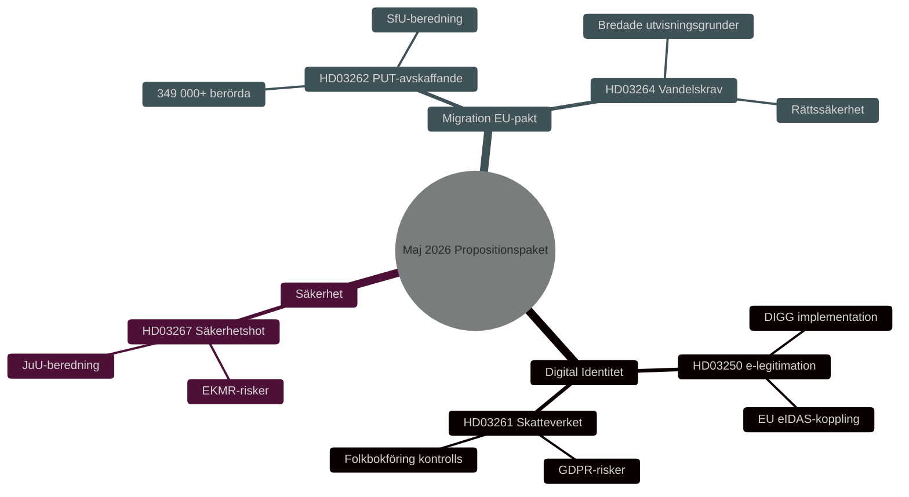

# Sicherheit, Digitale Identität und Migrationsreformen: Gesetzgebungspaket der Regierung Mai 2026

**Author**: James Pether Sörling
**Date**: 2026-05-15
**Classification**: PUBLIC — GDPR Art 9(2)(e,g)
**Confidence**: HIGH [B2]
**Run ID**: 25904280793

## BLUF

Die Regierung Kristersson legte am 7. Mai 2026 drei zusammenhängende Gesetzesvorlagen vor, die Schwedens Sicherheits- und Kontrollarchitektur vertiefen: ein nationales E-Identifikationsgesetz (HD03250), erweiterte Befugnisse des Skatteverket bei der Einwohnermelderegistrierung (HD03261) und verschärfte Möglichkeiten zur Ausweisung ausländischer Sicherheitsbedrohungen (HD03267). Diese ergänzen das am 30. April 2026 lancierte Migrationspaket — Abschaffung dauerhafter Aufenthaltsgenehmigungen (HD03262) und Anforderungen an einwandfreies Verhalten (HD03264) — das den EU-Asyl- und Migrationspakt umsetzt. Insgesamt stellt dies die umfassendste Neuausrichtung der schwedischen Migrations- und Identitätspolitik seit 2015 dar, mit HIGH [B2] Wahlrelevanz vor den Reichstagswahlen 2026.

## Decisions This Brief Supports

1. **Parlamentsausschüsse** (TU, SkU, JuU, SfU): Bewerten Sie Stellungnahmen und koordinieren Sie die Beratung von fünf Gesetzentwürfen mit gemeinsamer sicherheitspolitischer Logik.
2. **Oppositionsparteien** (S, V, MP, C): Formulieren Sie alternative Anträge, identifizieren Sie Verfassungsrisiken in HD03267 und DSGVO-Fragen in HD03261.
3. **Behörden** (Skatteverket, Migrationsverket, NCSC, Säkerhetspolisen): Planen Sie Implementierung, Sicherheitsprüfung und DPIA.

## 60-Second Read

- 🔑 **E-Identifikation** (HD03250): Neues Gesetz über *staatliche* E-Identifikation. Erik Slottner, Finanzministerium. Großes IT-Projekt, die Behörde für digitale Verwaltung (DIGG) zentral. Risiken: Implementierung, EU-Interoperabilität.
- 📋 **Skatteverket Melderegistrierung** (HD03261): Erweiterte Kontrollbefugnisse. Niklas Wykman, Finanzministerium. DSGVO-Fragen, kritische Prüfung durch Skatteutskottet erwartet.
- 🛡️ **Ausweisung von Sicherheitsbedrohungen** (HD03267): Stärkerer Schutz gegen Ausländer, die „qualifizierte Sicherheitsbedrohungen" darstellen. Gunnar Strömmer, Justizministerium. Verhältnismäßigkeitsfragen, EMRK-Risiken.
- 🚫 **Dauerhafte Aufenthaltsgenehmigungen abgeschafft** (HD03262): Johan Forssell, Justizministerium. Setzt EU-Pakt um. 349.000+ Betroffene mit temporärem Status.
- 📜 **Verhaltensanforderungen** (HD03264): Neues Gesetz. Breitere Ausweisungsgründe. Risiko: Rechtssicherheit, Diskriminierung.

## Top Forward Trigger

**Kritisches Ereignis T+21 Tage**: Lagrådsremiss für HD03262 und HD03267. Der Gesetzgebungsrat prüft Verhältnismäßigkeit und Verfassungskonformität. Negative Stellungnahme → erhöhte politische Salienz und verzögertes Inkrafttreten.

## Confidence Label

**Overall assessment confidence**: HIGH [B2] — Admiralty Code B (reliable source: Riksdagens API officiella propositionsdata), credibility 2 (confirmed by official government channels). Economic context: IMF WEO Apr-2026 SWE vintage.

<!-- source-sha: 84c1a88a2df18e97bdef9c56e53f2408ac799ff4 -->
