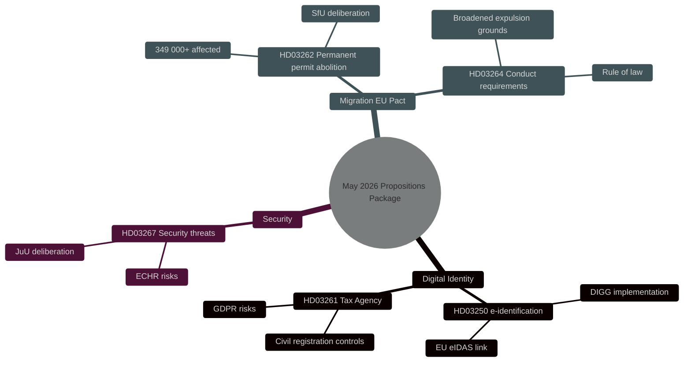

# Security, Digital Identity and Migration Reforms: Government's Propositions Package May 2026

**Author**: James Pether Sörling
**Date**: 2026-05-15
**Classification**: PUBLIC — GDPR Art 9(2)(e,g)
**Confidence**: HIGH [B2]
**Run ID**: 25904280793

## BLUF

On 7 May 2026, the Kristersson government presented three interconnected propositions deepening Sweden's security and control architecture: a national e-identification act (HD03250), expanded Swedish Tax Agency powers over civil registration (HD03261), and enhanced powers to expel foreign security threats (HD03267). These complement the migration package launched on 30 April 2026 — abolition of permanent residence permits (HD03262) and conduct requirements (HD03264) — implementing the EU's asylum and migration pact. Together, this represents the most comprehensive reorientation of Swedish migration and identity policy since 2015, with HIGH [B2] electoral significance ahead of the 2026 general election.

## Decisions This Brief Supports

1. **Parliamentary Committees** (TU, SkU, JuU, SfU): Assess consultation responses and coordinate deliberation for five propositions sharing a common security policy logic.
2. **Opposition Parties** (S, V, MP, C): Formulate alternative motions, identify constitutional risks in HD03267 and GDPR issues in HD03261.
3. **Agencies** (Skatteverket, Migrationsverket, NCSC, Säkerhetspolisen): Plan implementation, security review, and DPIA.

## 60-Second Read

- 🔑 **E-identification** (HD03250): New *state* e-identification act. Erik Slottner, Finance Ministry. Major IT project, the Agency for Digital Government (DIGG) central. Risks: implementation, EU interoperability.
- 📋 **Tax Agency civil registration** (HD03261): Expanded control powers. Niklas Wykman, Finance Ministry. GDPR issues, critical scrutiny expected from Finance Committee.
- 🛡️ **Security threat expulsion** (HD03267): Strengthened protection against foreigners constituting "qualified security threats". Gunnar Strömmer, Justice Ministry. Proportionality questions, ECHR risks.
- 🚫 **Permanent residence permits abolished** (HD03262): Johan Forssell, Justice Ministry. Implements EU Pact. 349,000+ affected with temporary status.
- 📜 **Conduct requirements** (HD03264): New act. Broader grounds for expulsion. Risk: rule of law, discrimination.

## Top Forward Trigger

**Critical event T+21 days**: Council on Legislation referral for HD03262 and HD03267. The Council tests proportionality and constitutional compatibility. Negative opinion → elevated political salience and delayed entry into force.

## Confidence Label

**Overall assessment confidence**: HIGH [B2] — Admiralty Code B (reliable source: Riksdagens API official propositions data), credibility 2 (confirmed by official government channels). Economic context: IMF WEO Apr-2026 SWE vintage.

<!-- source-sha: 84c1a88a2df18e97bdef9c56e53f2408ac799ff4 -->
