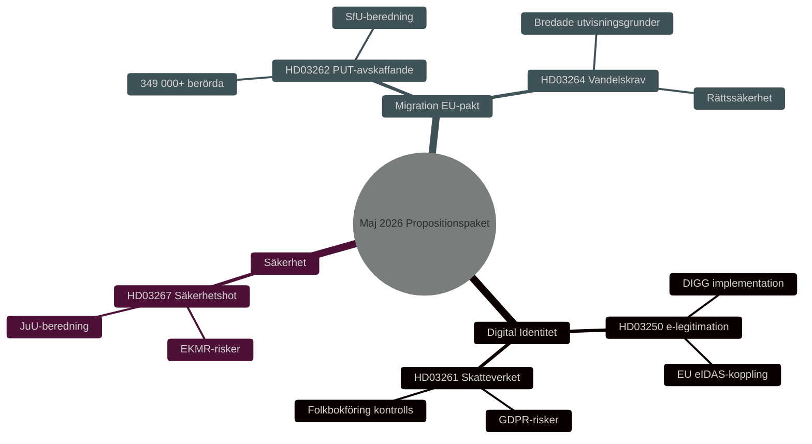

# Seguridad, Identidad Digital y Reformas Migratorias: Paquete Legislativo del Gobierno Mayo 2026

**Author**: James Pether Sörling
**Date**: 2026-05-15
**Classification**: PUBLIC — GDPR Art 9(2)(e,g)
**Confidence**: HIGH [B2]
**Run ID**: 25904280793

## BLUF

El gobierno Kristersson presentó el 7 de mayo de 2026 tres proposiciones interconectadas que profundizan la arquitectura de seguridad y control de Suecia: una ley nacional de identificación electrónica (HD03250), poderes ampliados de la Agencia Tributaria en el registro civil (HD03261) y capacidades reforzadas para expulsar amenazas de seguridad extranjeras (HD03267). Estas complementan el paquete migratorio lanzado el 30 de abril de 2026 — abolición de permisos de residencia permanentes (HD03262) y requisitos de conducta (HD03264) — que implementa el pacto europeo de asilo y migración. En conjunto, esto representa la reorientación más integral de la política sueca de migración e identidad desde 2015, con relevancia electoral HIGH [B2] ante las elecciones al Riksdag de 2026.

## Decisions This Brief Supports

1. **Comités parlamentarios** (TU, SkU, JuU, SfU): Evaluar respuestas a consultas y coordinar deliberación de cinco proposiciones con lógica de política de seguridad común.
2. **Partidos de oposición** (S, V, MP, C): Formular mociones alternativas, identificar riesgos constitucionales en HD03267 y cuestiones RGPD en HD03261.
3. **Agencias** (Skatteverket, Migrationsverket, NCSC, Säkerhetspolisen): Planificar implementación, revisión de seguridad y DPIA.

## 60-Second Read

- 🔑 **Identificación electrónica** (HD03250): Nueva ley de identificación electrónica *estatal*. Erik Slottner, Ministerio de Hacienda. Gran proyecto IT, la Agencia para la Gobernanza Digital (DIGG) central. Riesgos: implementación, interoperabilidad UE.
- 📋 **Skatteverket registro civil** (HD03261): Poderes de control ampliados. Niklas Wykman, Ministerio de Hacienda. Cuestiones RGPD, escrutinio crítico esperado del Skatteutskottet.
- 🛡️ **Expulsión de amenazas de seguridad** (HD03267): Protección reforzada contra extranjeros que constituyen "amenazas de seguridad cualificadas". Gunnar Strömmer, Ministerio de Justicia. Cuestiones de proporcionalidad, riesgos CEDH.
- 🚫 **Permisos de residencia permanentes abolidos** (HD03262): Johan Forssell, Ministerio de Justicia. Implementa el Pacto UE. 349.000+ afectados con estatus temporal.
- 📜 **Requisitos de conducta** (HD03264): Nueva ley. Motivos de expulsión más amplios. Riesgo: Estado de derecho, discriminación.

## Top Forward Trigger

**Evento crítico T+21 días**: Remisión al Consejo de Legislación para HD03262 y HD03267. El Consejo prueba proporcionalidad y conformidad constitucional. Dictamen negativo → mayor saliencia política e entrada en vigor retrasada.

## Confidence Label

**Overall assessment confidence**: HIGH [B2] — Admiralty Code B (reliable source: Riksdagens API officiella propositionsdata), credibility 2 (confirmed by official government channels). Economic context: IMF WEO Apr-2026 SWE vintage.

<!-- source-sha: 84c1a88a2df18e97bdef9c56e53f2408ac799ff4 -->
