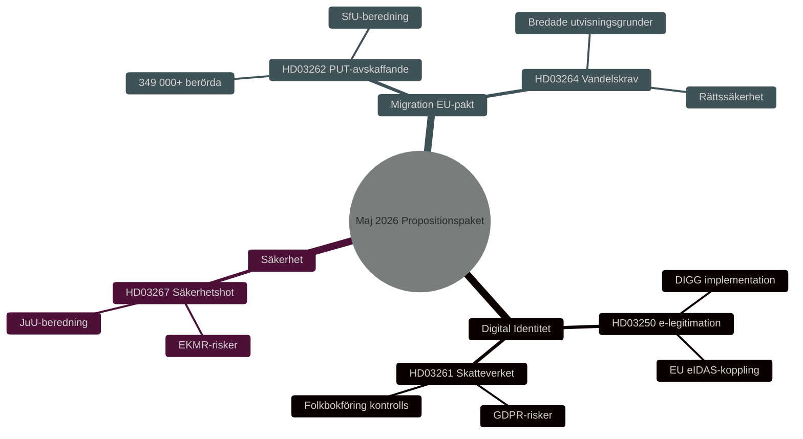

# Turvallisuus, Digitaalinen Henkilöllisyys ja Maahanmuuttouudistukset: Hallituksen Lakipaketti Toukokuu 2026

**Author**: James Pether Sörling
**Date**: 2026-05-15
**Classification**: PUBLIC — GDPR Art 9(2)(e,g)
**Confidence**: HIGH [B2]
**Run ID**: 25904280793

## BLUF

Kristersson-hallitus esitti 7. toukokuuta 2026 kolme toisiinsa liittyvää lakiesitystä, jotka syventävät Ruotsin turvallisuus- ja valvonta-arkkitehtuuria: kansallinen sähköisen tunnistamisen laki (HD03250), Verohallinnon laajennetut toimivaltuudet väestökirjanpidossa (HD03261) sekä tehostetut mahdollisuudet karkottaa ulkomaiset turvallisuusuhkat (HD03267). Nämä täydentävät 30. huhtikuuta 2026 käynnistettyä maahanmuuttopakettia — pysyvien oleskelulupien lakkauttaminen (HD03262) ja nuhteettomuusvaatimukset (HD03264) — jotka toteuttavat EU:n turvapaikan ja maahanmuuton paktia. Kokonaisuudessaan tämä edustaa Ruotsin maahanmuutto- ja henkilöllisyyspolitiikan perusteellisinta uudelleensuuntausta vuoden 2015 jälkeen, vaalipoliittinen merkittävyys HIGH [B2] vuoden 2026 valtiopäivävaaleissa.

## Decisions This Brief Supports

1. **Parlamentin valiokunnat** (TU, SkU, JuU, SfU): Arvioi lausuntoyhteenvedot ja koordinoi viiden yhteisellä turvallisuuspoliittisella logiikalla varustetun lakiesityksen käsittely.
2. **Oppositiopuolueet** (S, V, MP, C): Muotoile vaihtoehtoisia esityksiä, tunnista perustuslailliset riskit HD03267:ssä ja GDPR-kysymykset HD03261:ssä.
3. **Virastot** (Skatteverket, Migrationsverket, NCSC, Säkerhetspolisen): Suunnittele käyttöönotto, turvallisuustarkastus ja DPIA.

## 60-Second Read

- 🔑 **Sähköinen tunnistaminen** (HD03250): Uusi laki *valtion* sähköisestä tunnistamisesta. Erik Slottner, Valtiovarainministeriö. Laaja IT-hanke, Myndigheten för digital förvaltning (DIGG) keskeinen. Riskit: käyttöönotto, EU-yhteentoimivuus.
- 📋 **Verohallinto väestökirjanpito** (HD03261): Laajennetut valvontatoimivaltuudet. Niklas Wykman, Valtiovarainministeriö. GDPR-kysymykset, kriittinen tarkastelu odotettavissa Skatteutskottetilta.
- 🛡️ **Turvallisuusuhkan karkottaminen** (HD03267): Tehostettu suoja ulkomaalaisia vastaan, jotka muodostavat "merkittäviä turvallisuusuhkia". Gunnar Strömmer, Oikeusministeriö. Suhteellisuuskysymykset, EIS-riskit.
- 🚫 **Pysyvät oleskeluluvat lakkautetaan** (HD03262): Johan Forssell, Oikeusministeriö. Toteuttaa EU-paktia. 349 000+ henkilöä tilapäisen statuksen piirissä.
- 📜 **Nuhteettomuusvaatimukset** (HD03264): Uusi laki. Laajemmat karkottamisperusteet. Riski: oikeusturva, syrjintä.

## Top Forward Trigger

**Kriittinen tapahtuma T+21 päivää**: Lakineuvoston lausuntopyyntö HD03262:lle ja HD03267:lle. Lakineuvosto testaa suhteellisuuden ja perustuslainmukaisuuden. Kielteinen lausunto → noussut poliittinen salieenssi ja viivästynyt voimaantulo.

## Confidence Label

**Overall assessment confidence**: HIGH [B2] — Admiralty Code B (reliable source: Riksdagens API officiella propositionsdata), credibility 2 (confirmed by official government channels). Economic context: IMF WEO Apr-2026 SWE vintage.

<!-- source-sha: 84c1a88a2df18e97bdef9c56e53f2408ac799ff4 -->
