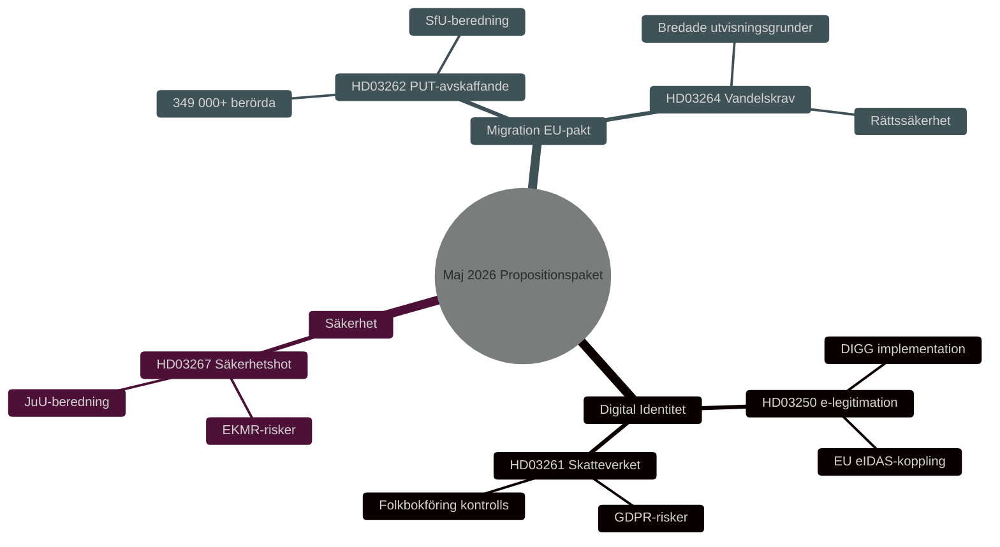

# Sécurité, Identité Numérique et Réformes Migratoires : Paquet Législatif du Gouvernement Mai 2026

**Author**: James Pether Sörling
**Date**: 2026-05-15
**Classification**: PUBLIC — GDPR Art 9(2)(e,g)
**Confidence**: HIGH [B2]
**Run ID**: 25904280793

## BLUF

Le gouvernement Kristersson a présenté le 7 mai 2026 trois propositions interconnectées approfondissant l'architecture sécuritaire et de contrôle suédoise : une loi nationale sur l'e-identification (HD03250), des pouvoirs élargis de l'Agence fiscale en matière d'enregistrement civil (HD03261) et des capacités renforcées d'expulsion des menaces sécuritaires étrangères (HD03267). Celles-ci complètent le paquet migratoire lancé le 30 avril 2026 — abolition des permis de séjour permanents (HD03262) et exigences de moralité (HD03264) — mettant en œuvre le pacte européen sur l'asile et la migration. Ensemble, cela représente la réorientation la plus globale de la politique suédoise en matière de migration et d'identité depuis 2015, avec une pertinence électorale HIGH [B2] avant les élections au Riksdag de 2026.

## Decisions This Brief Supports

1. **Commissions parlementaires** (TU, SkU, JuU, SfU) : Évaluer les réponses aux consultations et coordonner l'examen de cinq propositions partageant une logique de politique sécuritaire commune.
2. **Partis d'opposition** (S, V, MP, C) : Formuler des motions alternatives, identifier les risques constitutionnels dans HD03267 et les questions RGPD dans HD03261.
3. **Agences** (Skatteverket, Migrationsverket, NCSC, Säkerhetspolisen) : Planifier l'implémentation, l'audit sécurité et le DPIA.

## 60-Second Read

- 🔑 **E-identification** (HD03250) : Nouvelle loi sur l'e-identification *étatique*. Erik Slottner, Ministère des Finances. Grand projet IT, l'Agence pour la gouvernance numérique (DIGG) centrale. Risques : implémentation, interopérabilité UE.
- 📋 **Skatteverket enregistrement civil** (HD03261) : Pouvoirs de contrôle élargis. Niklas Wykman, Ministère des Finances. Questions RGPD, examen critique attendu du Skatteutskottet.
- 🛡️ **Expulsion des menaces sécuritaires** (HD03267) : Protection renforcée contre les étrangers constituant des « menaces sécuritaires qualifiées ». Gunnar Strömmer, Ministère de la Justice. Questions de proportionnalité, risques CEDH.
- 🚫 **Permis de séjour permanents abolis** (HD03262) : Johan Forssell, Ministère de la Justice. Implémente le pacte UE. 349 000+ concernés avec statut temporaire.
- 📜 **Exigences de moralité** (HD03264) : Nouvelle loi. Motifs d'expulsion élargis. Risque : État de droit, discrimination.

## Top Forward Trigger

**Événement critique T+21 jours** : Remise au Conseil de la législation pour HD03262 et HD03267. Le Conseil teste la proportionnalité et la conformité constitutionnelle. Avis négatif → saillance politique accrue et entrée en vigueur retardée.

## Confidence Label

**Overall assessment confidence**: HIGH [B2] — Admiralty Code B (reliable source: Riksdagens API officiella propositionsdata), credibility 2 (confirmed by official government channels). Economic context: IMF WEO Apr-2026 SWE vintage.

<!-- source-sha: 84c1a88a2df18e97bdef9c56e53f2408ac799ff4 -->
