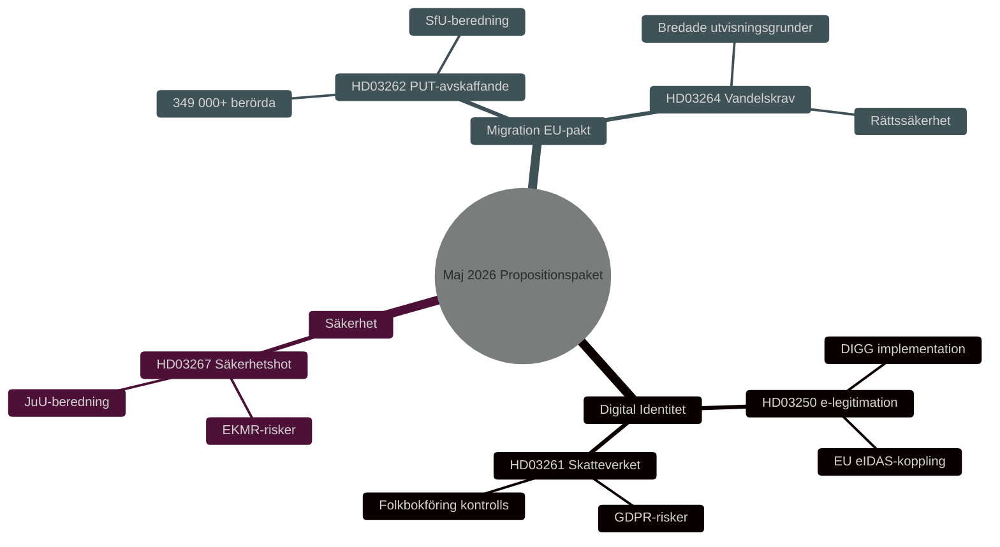

<!-- dir: rtl -->
# ביטחון, זהות דיגיטלית ורפורמות הגירה: חבילת הצעות החוק הממשלתית מאי 2026

**Author**: James Pether Sörling
**Date**: 2026-05-15
**Classification**: PUBLIC — GDPR Art 9(2)(e,g)
**Confidence**: HIGH [B2]
**Run ID**: 25904280793

## BLUF

ממשלת קריסטרסון הגישה ב-7 במאי 2026 שלוש הצעות חוק מקושרות המעמיקות את ארכיטקטורת הביטחון והבקרה של שוודיה: חוק לאומי לזיהוי אלקטרוני (HD03250), הרחבת סמכויות רשות המסים ברישום האוכלוסין (HD03261) וחיזוק יכולות גירוש איומי ביטחון זרים (HD03267). אלה משלימות את חבילת ההגירה שהושקה ב-30 באפריל 2026 — ביטול היתרי שהייה קבועים (HD03262) ודרישות התנהגות (HD03264) — המיישמת את האמנה האירופית בנושא מקלט והגירה. יחד, זהו השינוי המקיף ביותר במדיניות ההגירה והזהות השוודית מאז 2015, עם רלוונטיות בחירותית HIGH [B2] לקראת בחירות הריקסדאג 2026.

## Decisions This Brief Supports

1. **ועדות פרלמנטריות** (TU, SkU, JuU, SfU): הערך תגובות להתייעצויות ותאם דיון בחמש הצעות חוק החולקות לוגיקת מדיניות ביטחון משותפת.
2. **מפלגות אופוזיציה** (S, V, MP, C): נסח הצעות חלופיות, זהה סיכונים חוקתיים ב-HD03267 ושאלות GDPR ב-HD03261.
3. **רשויות** (Skatteverket, Migrationsverket, NCSC, Säkerhetspolisen): תכנן יישום, ביקורת ביטחוני ו-DPIA.

## 60-Second Read

- 🔑 **זיהוי אלקטרוני** (HD03250): חוק חדש לזיהוי אלקטרוני *ממלכתי*. אריק סלוטנר, משרד האוצר. פרויקט IT גדול, הסוכנות לממשל דיגיטלי (DIGG) מרכזית. סיכונים: יישום, יכולת פעולה הדדית עם האיחוד האירופי.
- 📋 **רשות המסים - רישום אוכלוסין** (HD03261): הרחבת סמכויות בקרה. ניקלאס ויקמן, משרד האוצר. שאלות GDPR, ביקורת ביקורתית צפויה מ-Skatteutskottet.
- 🛡️ **גירוש איומי ביטחון** (HD03267): הגנה מחוזקת מפני זרים המהווים "איומי ביטחון מוסמכים". גונאר סטרוֹמר, משרד המשפטים. שאלות מידתיות, סיכוני ECHR.
- 🚫 **ביטול היתרי שהייה קבועים** (HD03262): יוהאן פורסל, משרד המשפטים. מיישם אמנה אירופית. 349,000+ מושפעים עם מעמד זמני.
- 📜 **דרישות התנהגות** (HD03264): חוק חדש. עילות גירוש מורחבות. סיכון: שלטון החוק, אפליה.

## Top Forward Trigger

**אירוע קריטי T+21 ימים**: הפניה למועצת החקיקה עבור HD03262 ו-HD03267. המועצה בוחנת מידתיות ותאימות חוקתית. חוות דעת שלילית → עלייה בסליינס הפוליטי ועיכוב כניסה לתוקף.

## Confidence Label

**Overall assessment confidence**: HIGH [B2] — Admiralty Code B (reliable source: Riksdagens API officiella propositionsdata), credibility 2 (confirmed by official government channels). Economic context: IMF WEO Apr-2026 SWE vintage.

<!-- source-sha: 84c1a88a2df18e97bdef9c56e53f2408ac799ff4 -->
