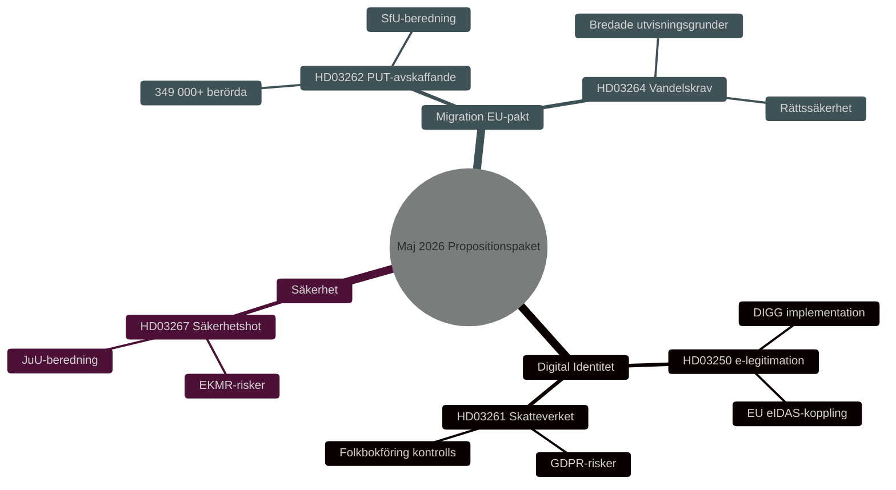

# 安全保障・デジタル身元確認・移民改革：政府法案パッケージ 2026年5月

**Author**: James Pether Sörling
**Date**: 2026-05-15
**Classification**: PUBLIC — GDPR Art 9(2)(e,g)
**Confidence**: HIGH [B2]
**Run ID**: 25904280793

## BLUF

クリスターション政府は2026年5月7日、スウェーデンの安全保障・管理体制を深化させる3つの相互連関した法案を提出した：国家電子ID法（HD03250）、住民登録に関する税務署の権限拡大（HD03261）、外国人安全保障上の脅威に対する追放権限の強化（HD03267）。これらは2026年4月30日に打ち出された移民パッケージ — 永住許可の廃止（HD03262）と品行要件（HD03264）— を補完し、EU難民移民協定を実施するものである。総じて、2015年以降最も包括的なスウェーデン移民・身元確認政策の転換を表し、2026年国会選挙を前に HIGH [B2] の選挙的重要性を持つ。

## Decisions This Brief Supports

1. **議会委員会**（TU, SkU, JuU, SfU）：意見募集への回答を評価し、共通の安全保障政策論理を持つ5法案の審議を調整する。
2. **野党**（S, V, MP, C）：代替動議を策定し、HD03267の憲法上のリスクおよびHD03261のGDPR問題を特定する。
3. **機関**（Skatteverket, Migrationsverket, NCSC, Säkerhetspolisen）：実施・安全保障レビュー・DPIAを計画する。

## 60-Second Read

- 🔑 **電子ID**（HD03250）：*国家* 電子ID新法。エリック・スロットナー、財務省。大規模ITプロジェクト、デジタル行政庁（DIGG）中心。リスク：実施、EU相互運用性。
- 📋 **税務署住民登録**（HD03261）：管理権限拡大。ニクラス・ウィクマン、財務省。GDPR問題、Skatteutskottetによる批判的審査が予想される。
- 🛡️ **安全保障上の脅威追放**（HD03267）：「資格ある安全保障上の脅威」を構成する外国人に対する強化された保護。グンナル・ストロンマー、法務省。比例原則問題、ECHR上のリスク。
- 🚫 **永住許可廃止**（HD03262）：ヨハン・フォルセル、法務省。EU協定を実施。349,000人以上が一時的地位に影響。
- 📜 **品行要件**（HD03264）：新法。より広い追放根拠。リスク：法の支配、差別。

## Top Forward Trigger

**T+21日の重大イベント**：HD03262およびHD03267の立法評議会付託。評議会が比例原則と合憲性を審査。否定的意見 → 政治的顕著性の上昇と施行の遅延。

## Confidence Label

**Overall assessment confidence**: HIGH [B2] — Admiralty Code B (reliable source: Riksdagens API officiella propositionsdata), credibility 2 (confirmed by official government channels). Economic context: IMF WEO Apr-2026 SWE vintage.

<!-- source-sha: 84c1a88a2df18e97bdef9c56e53f2408ac799ff4 -->
