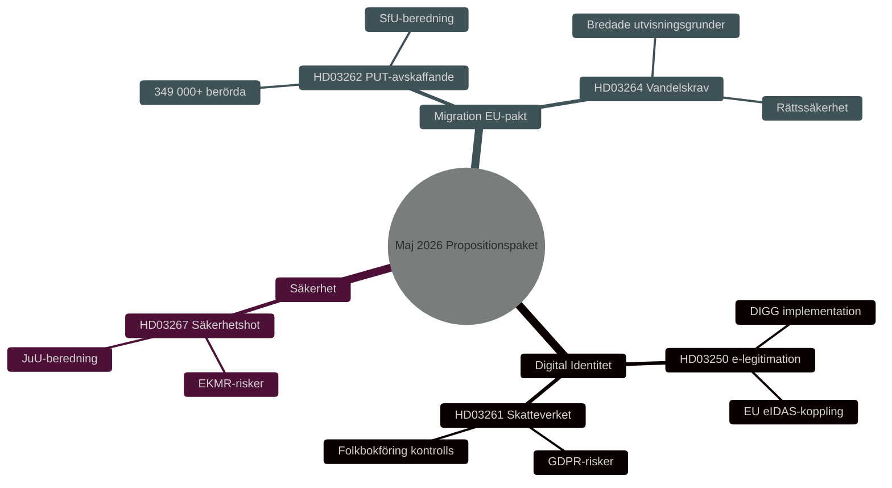

# 안보·디지털 신원확인·이민 개혁: 정부 법안 패키지 2026년 5월

**Author**: James Pether Sörling
**Date**: 2026-05-15
**Classification**: PUBLIC — GDPR Art 9(2)(e,g)
**Confidence**: HIGH [B2]
**Run ID**: 25904280793

## BLUF

크리스터손 정부는 2026년 5월 7일 스웨덴의 안보·통제 체계를 심화시키는 3개의 상호연관 법안을 제출했다: 국가 전자신원확인법(HD03250), 주민등록 관련 세무청 권한 확대(HD03261), 외국인 안보 위협 추방 권한 강화(HD03267). 이는 2026년 4월 30일 출범한 이민 패키지 — 영주권 폐지(HD03262) 및 품행 요건(HD03264) — 을 보완하며 EU 망명·이민 협약을 이행하는 것이다. 종합적으로 이는 2015년 이후 스웨덴 이민·신원확인 정책의 가장 포괄적인 전환을 나타내며, 2026년 국회 선거를 앞두고 HIGH [B2]의 선거적 중요성을 갖는다.

## Decisions This Brief Supports

1. **의회 위원회** (TU, SkU, JuU, SfU): 의견 수렴 응답을 평가하고 공통 안보 정책 논리를 가진 5개 법안의 심의를 조율한다.
2. **야당** (S, V, MP, C): 대안 발의안을 작성하고, HD03267의 헌법적 위험 및 HD03261의 GDPR 문제를 식별한다.
3. **기관** (Skatteverket, Migrationsverket, NCSC, Säkerhetspolisen): 이행·보안 검토·DPIA를 계획한다.

## 60-Second Read

- 🔑 **전자신원확인** (HD03250): 새로운 *국가* 전자신원확인법. 에리크 슬로트네르, 재무부. 대형 IT 프로젝트, 디지털행정청(DIGG) 중심. 위험: 이행, EU 상호운용성.
- 📋 **세무청 주민등록** (HD03261): 통제 권한 확대. 니클라스 위크만, 재무부. GDPR 문제, Skatteutskottet의 비판적 검토 예상.
- 🛡️ **안보 위협 추방** (HD03267): "자격 있는 안보 위협"을 구성하는 외국인에 대한 강화된 보호. 군나르 스트뢰메르, 법무부. 비례원칙 문제, ECHR 위험.
- 🚫 **영주권 폐지** (HD03262): 요한 포르셀, 법무부. EU 협약 이행. 349,000명 이상 임시 지위 영향.
- 📜 **품행 요건** (HD03264): 신법. 더 넓은 추방 근거. 위험: 법치주의, 차별.

## Top Forward Trigger

**T+21일 중대 사건**: HD03262 및 HD03267에 대한 입법위원회 회부. 위원회가 비례성과 합헌성을 심사. 부정적 의견 → 정치적 현저성 상승 및 발효 지연.

## Confidence Label

**Overall assessment confidence**: HIGH [B2] — Admiralty Code B (reliable source: Riksdagens API officiella propositionsdata), credibility 2 (confirmed by official government channels). Economic context: IMF WEO Apr-2026 SWE vintage.

<!-- source-sha: 84c1a88a2df18e97bdef9c56e53f2408ac799ff4 -->
