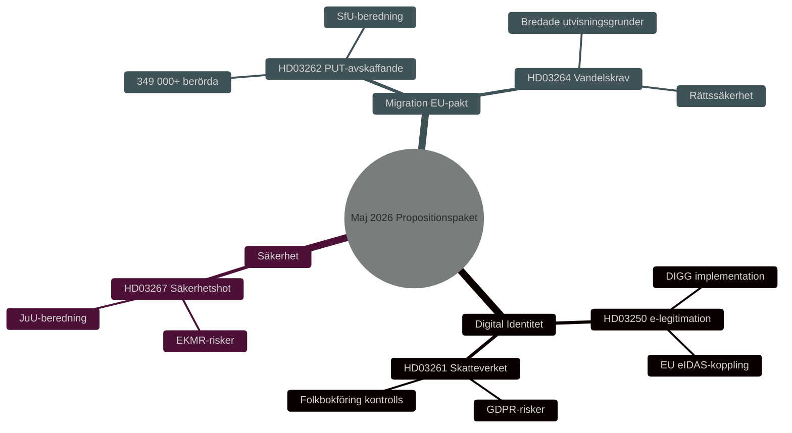

# Veiligheid, Digitale Identiteit en Migratiehervormingen: Wetgevingspakket Regering Mei 2026

**Author**: James Pether Sörling
**Date**: 2026-05-15
**Classification**: PUBLIC — GDPR Art 9(2)(e,g)
**Confidence**: HIGH [B2]
**Run ID**: 25904280793

## BLUF

De regering-Kristersson presenteerde op 7 mei 2026 drie onderling verbonden wetgevingsvoorstellen die Zweden's veiligheids- en controlearchitectuur verdiepen: een nationale e-identificatiewet (HD03250), uitgebreide bevoegdheden van de Belastingdienst bij de burgerregistratie (HD03261) en versterkte mogelijkheden om buitenlandse veiligheidsrisico's uit te wijzen (HD03267). Deze vullen het op 30 april 2026 gelanceerde migratiepakket aan — afschaffing van permanente verblijfsvergunningen (HD03262) en gedragseisen (HD03264) — dat het EU-asiel- en migratiepact implementeert. Samen vertegenwoordigt dit de meest omvattende heroriëntering van het Zweedse migratie- en identiteitsbeleid sinds 2015, met HIGH [B2] electorale relevantie voor de Riksdag-verkiezingen van 2026.

## Decisions This Brief Supports

1. **Parlementaire commissies** (TU, SkU, JuU, SfU): Beoordeel reacties op consultaties en coördineer beraadslaging van vijf voorstellen met gemeenschappelijke veiligheidsbeleidlogica.
2. **Oppositiepartijen** (S, V, MP, C): Formuleer alternatieve moties, identificeer constitutionele risico's in HD03267 en AVG-vragen in HD03261.
3. **Agentschappen** (Skatteverket, Migrationsverket, NCSC, Säkerhetspolisen): Plan implementatie, veiligheidsreview en DPIA.

## 60-Second Read

- 🔑 **E-identificatie** (HD03250): Nieuwe wet op *staatse* e-identificatie. Erik Slottner, Ministerie van Financiën. Groot IT-project, de Dienst voor Digitaal Bestuur (DIGG) centraal. Risico's: implementatie, EU-interoperabiliteit.
- 📋 **Skatteverket burgerregistratie** (HD03261): Uitgebreide controlebevoegdheden. Niklas Wykman, Ministerie van Financiën. AVG-vragen, kritisch onderzoek verwacht van Skatteutskottet.
- 🛡️ **Uitwijzing veiligheidsrisico's** (HD03267): Versterkte bescherming tegen buitenlanders die "gekwalificeerde veiligheidsrisico's" vormen. Gunnar Strömmer, Ministerie van Justitie. Proportionaliteitsvragen, EVRM-risico's.
- 🚫 **Permanente verblijfsvergunningen afgeschaft** (HD03262): Johan Forssell, Ministerie van Justitie. Implementeert EU-pact. 349.000+ betrokkenen met tijdelijke status.
- 📜 **Gedragseisen** (HD03264): Nieuwe wet. Bredere uitwijzingsgronden. Risico: rechtszekerheid, discriminatie.

## Top Forward Trigger

**Kritieke gebeurtenis T+21 dagen**: Lagrådsremiss voor HD03262 en HD03267. De Wetgevingsraad toetst proportionaliteit en grondwettigheid. Negatief advies → verhoogde politieke saliantie en vertraagde inwerkingtreding.

## Confidence Label

**Overall assessment confidence**: HIGH [B2] — Admiralty Code B (reliable source: Riksdagens API officiella propositionsdata), credibility 2 (confirmed by official government channels). Economic context: IMF WEO Apr-2026 SWE vintage.

<!-- source-sha: 84c1a88a2df18e97bdef9c56e53f2408ac799ff4 -->
