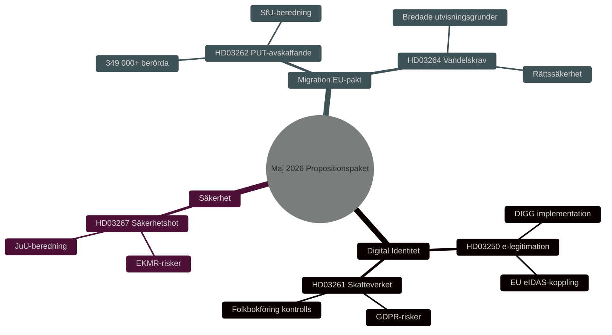

# Sikkerhet, Digital Identitet og Migrasjonsreformer: Regjeringens Forslagspakke Mai 2026

**Author**: James Pether Sörling
**Date**: 2026-05-15
**Classification**: PUBLIC — GDPR Art 9(2)(e,g)
**Confidence**: HIGH [B2]
**Run ID**: 25904280793

## BLUF

Den 7. mai 2026 la Kristersson-regjeringen frem tre sammenkoblede proposisjoner som utdyper den svenske sikkerhets- og kontrollarkitekturen: en nasjonal e-legitimasjonslov (HD03250), utvidede fullmakter til Skatteverket innen folkeregistrering (HD03261) og skjerpede muligheter til å utvise utenlandske sikkerhetstrusler (HD03267). Disse supplerer migrasjonspakken lansert 30. april 2026 — avskaffelse av permanente oppholdstillatelser (HD03262) og vandelskrav (HD03264) — som implementerer EUs asyl- og migrasjonspakt. Samlet representerer dette den mest gjennomgripende omleggingen av svensk migrasjons- og identitetspolitikk siden 2015, med HIGH [B2] valgpolitisk relevans foran stortingsvalget 2026.

## Decisions This Brief Supports

1. **Parlamentariske komiteer** (TU, SkU, JuU, SfU): Vurder høringsinnspill og koordiner behandling av fem proposisjoner med felles sikkerhetspolitisk logikk.
2. **Opposisjonspartier** (S, V, MP, C): Formuler alternative forslag, identifiser grunnlovsrisikoer i HD03267 og GDPR-spørsmål i HD03261.
3. **Myndigheter** (Skatteverket, Migrationsverket, NCSC, Säkerhetspolisen): Planlegg implementering, sikkerhetsgjennomgang og DPIA.

## 60-Second Read

- 🔑 **E-legitimasjon** (HD03250): Ny lov om *statlig* e-legitimasjon. Erik Slottner, Finansdepartementet. Stort IT-prosjekt, Myndigheten för digital förvaltning (DIGG) sentralt. Risikoer: implementering, EU-interoperabilitet.
- 📋 **Skatteverket folkeregistrering** (HD03261): Utvidede kontrollbefullmakter. Niklas Wykman, Finansdepartementet. GDPR-spørsmål, kritisk granskning forventes fra Skatteutskottet.
- 🛡️ **Sikkerhetstrusselutvisning** (HD03267): Styrket beskyttelse mot utlendinger som utgjør "kvalifiserte sikkerhetstrusler". Gunnar Strömmer, Justisdepartementet. Proporsjonalitetsspørsmål, EMK-risikoer.
- 🚫 **Permanente oppholdstillatelser avskaffes** (HD03262): Johan Forssell, Justisdepartementet. Implementerer EU-pakten. 349 000+ berørt med midlertidig status.
- 📜 **Vandelskrav** (HD03264): Ny lov. Bredere utvisningsgrunnlag. Risiko: rettssikkerhet, diskriminering.

## Top Forward Trigger

**Kritisk hendelse T+21 dager**: Lovrådshenvisning for HD03262 og HD03267. Lovrådet prøver proporsjonalitet og grunnlovsforenelighet. Negativt uttalelse → økt politisk saliens og forsinket ikrafttredelse.

## Confidence Label

**Overall assessment confidence**: HIGH [B2] — Admiralty Code B (reliable source: Riksdagens API officiella propositionsdata), credibility 2 (confirmed by official government channels). Economic context: IMF WEO Apr-2026 SWE vintage.

<!-- source-sha: 84c1a88a2df18e97bdef9c56e53f2408ac799ff4 -->
