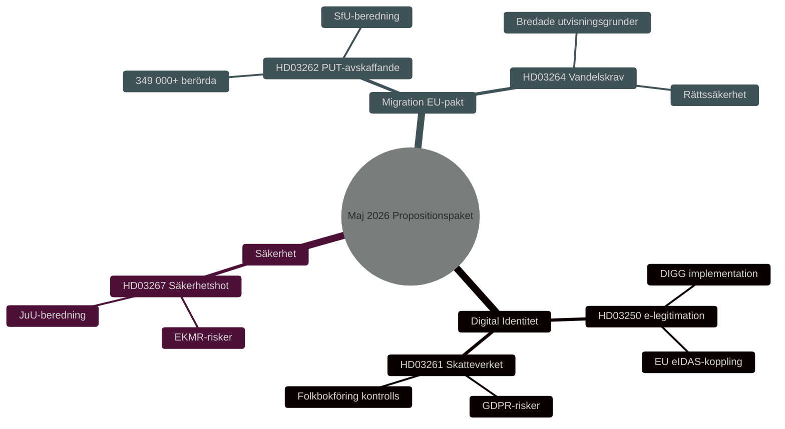

# 安全、数字身份与移民改革：政府法案包 2026年5月

**Author**: James Pether Sörling
**Date**: 2026-05-15
**Classification**: PUBLIC — GDPR Art 9(2)(e,g)
**Confidence**: HIGH [B2]
**Run ID**: 25904280793

## BLUF

克里斯特松政府于2026年5月7日提交了三项相互关联的法案，深化瑞典安全与管控体系：国家电子身份认证法（HD03250）、税务局在户籍登记方面的扩展权限（HD03261）以及加强驱逐外国安全威胁的能力（HD03267）。这些法案补充了2026年4月30日推出的移民包——废除永久居留许可（HD03262）和行为要求（HD03264）——以落实欧盟庇护与移民协定。综合来看，这是自2015年以来瑞典移民与身份政策最全面的重新定向，在2026年国会选举前具有HIGH [B2]的选举重要性。

## Decisions This Brief Supports

1. **议会委员会**（TU, SkU, JuU, SfU）：评估咨询回应，协调具有共同安全政策逻辑的五项法案审议。
2. **反对党**（S, V, MP, C）：制定替代动议，识别HD03267中的宪法风险和HD03261中的GDPR问题。
3. **机构**（Skatteverket, Migrationsverket, NCSC, Säkerhetspolisen）：规划实施、安全审查和DPIA。

## 60-Second Read

- 🔑 **电子身份认证**（HD03250）：新的*国家*电子身份认证法。埃里克·斯洛特纳，财政部。大型IT项目，数字治理局（DIGG）为核心。风险：实施、欧盟互操作性。
- 📋 **税务局户籍登记**（HD03261）：扩大管控权限。尼克拉斯·威克曼，财政部。GDPR问题，预计Skatteutskottet将进行批判性审查。
- 🛡️ **驱逐安全威胁**（HD03267）：加强对构成"合格安全威胁"的外国人的保护。冈纳·斯特龙默，司法部。比例性问题，ECHR风险。
- 🚫 **废除永久居留许可**（HD03262）：约翰·福塞尔，司法部。落实欧盟协定。349,000+人受临时身份影响。
- 📜 **行为要求**（HD03264）：新法。更广泛的驱逐依据。风险：法治、歧视。

## Top Forward Trigger

**T+21天关键事件**：HD03262和HD03267提交立法委员会。委员会审查比例性和合宪性。负面意见 → 政治显著性上升，生效延迟。

## Confidence Label

**Overall assessment confidence**: HIGH [B2] — Admiralty Code B (reliable source: Riksdagens API officiella propositionsdata), credibility 2 (confirmed by official government channels). Economic context: IMF WEO Apr-2026 SWE vintage.

<!-- source-sha: 84c1a88a2df18e97bdef9c56e53f2408ac799ff4 -->
