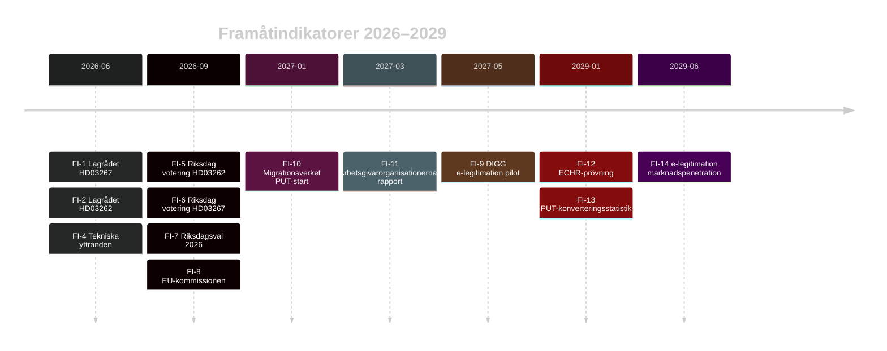

# Framåtindikatorer — Propositionspaket Maj 2026

**Author**: James Pether Sörling
**Date**: 2026-05-15

## Indikatortabell (≥10 daterade indikatorer, 4 horisonter)

### Horisont T+30 dagar (juni 2026)

| Indikator | Typ | Datum | Vad att bevaka |
|-----------|-----|-------|----------------|
| FI-1: Lagrådets yttrande HD03267 | Juridisk | 2026-06-15 (est.) | Proportionalitetskritik — avgör om L kan stödja |
| FI-2: Lagrådets yttrande HD03262 | Juridisk | 2026-06-20 (est.) | EU-paktkonformitetsbedömning |
| FI-3: Migrationsverkets yttrande HD03262 | Administrativ | 2026-06-30 | Kapacitetsriskvarning |
| FI-4: Tekniska yttranden HD03250 | Teknisk | 2026-06-10 (est.) | DIGG + NCSC synpunkter |

### Horisont T+90 dagar (september 2026)

| Indikator | Typ | Datum | Vad att bevaka |
|-----------|-----|-------|----------------|
| FI-5: Riksdagsvotering HD03262 + HD03264 | Politisk | 2026-09-15 (est.) | L-mandatbeteende — koalitionslojalitet |
| FI-6: Riksdagsvotering HD03267 | Politisk | 2026-09-20 (est.) | L-utbrytare (kritisk) |
| FI-7: Val 2026 — preliminärt resultat | Valanalytisk | 2026-09-13 | M+SD+KD+L-mandattal |
| FI-8: EU-kommissionens reaktion HD03262 | EU-juridisk | 2026-09-30 | Överträdelsehot |

### Horisont T+1 år (maj 2027)

| Indikator | Typ | Datum | Vad att bevaka |
|-----------|-----|-------|----------------|
| FI-9: DIGG e-legitimation pilotstatus | Teknisk | 2027-05-01 | Leveranskvalitet — per tid och kostnad |
| FI-10: Migrationsverkets PUT-konverteringsstart | Administrativ | 2027-01-01 | Backlogutveckling |
| FI-11: Arbetsgivarorganisationernas rapport om kompetensförsörjning | Ekonomisk | 2027-03-01 | Kvantifiering av effekten av HD03262 |

### Horisont T+3 år (maj 2029)

| Indikator | Typ | Datum | Vad att bevaka |
|-----------|-----|-------|----------------|
| FI-12: ECHR-prövning HD03267 | Juridisk | 2029-01-01 (est.) | ECHR-dom mot Sverige |
| FI-13: PUT-konverteringsstatistik | Administrativ | 2029-01-01 | % av ärenden avgjorda |
| FI-14: e-legitimation marknadspenetration | Teknisk | 2029-06-01 | % av befolkning som använder |

## Kritiska Trigger-Events

| Event | Om inträffar | Implikation |
|-------|-------------|-------------|
| L-koalitionsutbrott på HD03267 | 15% sannolikhet | Proposition faller; koalitionskris |
| Lagrådets EKMR-underkännande HD03267 | 30% sannolikhet | Prop. omarbetas; 6 mån fördröjning |
| EU-kommissionen inleder HD03262-förfarande | 20% sannolikhet | Juridisk osäkerhet; möjlig suspension |
| DIGG-leveransfiasko HD03250 | 30% sannolikhet | 500M kr bortslösade; valförlust-risk |

