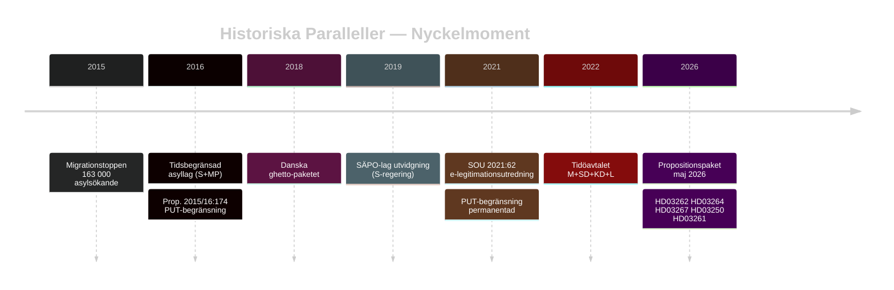

# Historiska Paralleller — Propositionspaket Maj 2026

**Author**: James Pether Sörling
**Date**: 2026-05-15

## Parallell 1: Tidsbegränsad Asyllag 2016 (Prop. 2015/16:174)

**Likhet med HD03262**: S+MP-regeringen (Löfven I) genomförde 2016 en tillfällig asyllag som drastiskt begränsade möjligheter till permanent uppehållstillstånd. Lagen förlängdes 2019 och delar permanentades 2021.

**Skillnader**: Den nuvarande HD03262 är mer permanent och systematisk. 2016 var en "krisrespons" — 2026 är en principiell ideologisk omläggning.

**Lärdomar**: Även S-regeringen var tvungen att agera restriktivt under migrationskrisen 2015–2016. Paktet 2026 är kontinuitet snarare än revolution i asylpolitiken.

## Parallell 2: SÄPO-lagen 2019 (Prop. 2018/19:61)

**Likhet med HD03267**: Utvidgning av SÄPO:s befogenheter för preventiv kontraterrorism 2019 under S-regering.

**Skillnader**: 2019 fokuserade på terrorism; HD03267 breddar till "säkerhetshot" generellt.

**Lärdomar**: Riksdagen tenderar att godkänna säkerhetsutvidgningar med bred majoritet. Oppositionen ger vanligen stöd om propositionen är "proportionerlig".

## Parallell 3: BankID-monopolet och försök till statlig e-id

**Likhet med HD03250**: SOU 2021:62 "E-legitimation på högnivå" föreslog statlig e-legitimation. Prop. 2022/23:X ledde till misslyckade upphandlingar.

**Skillnader**: HD03250 är mer ambitiös och baserar sig på eIDAS 2.0 (2023).

**Lärdomar**: Tidigare svenska försök att utmana BankID-monopolet har konsekvent misslyckats eller försenats. Risken är systemisk.

## Parallell 4: Danska "Ghetto-paketet" 2018–2022

**Likhet med HD03264 + HD03262**: Danmark genomförde 2018 ett paket med liknande migrationspolitiska målsättningar.

**Konsekvenser**:
- Internationell kritik: FN Kommittén mot rasdiskriminering kritiserade Danmark 2021
- Inrikes politisk effekt: Dansk högerblock vann val 2022; M Frederiksen tvingades till höger
- Kompetensförsörjning: Dansk Industri rapport 2022 visade 12% minskning i internationell rekryteringsframgång

**Lärdomar för Sverige**: Den internationella kostnaden är hanterbar kortsiktigt men ackumuleras; kompetensförsörjningseffekten är mätbar.

## Tidslinje

