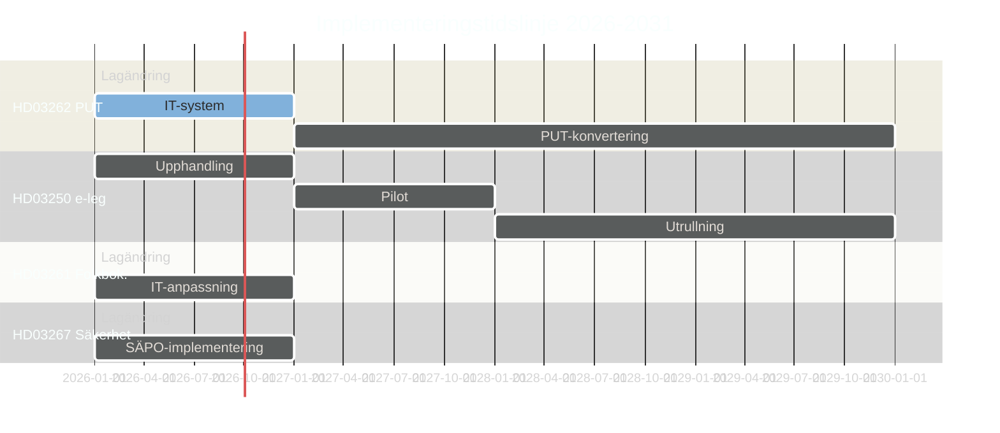

# Implementeringsbedömning — Propositionspaket Maj 2026

**Author**: James Pether Sörling
**Date**: 2026-05-15

## Statskontoret-Relevans

| Dok-ID | Statskontoret Relevans | Bedömning |
|--------|----------------------|-----------|
| HD03262 | **Hög** — PUT-konvertering kräver Migrationsverkets systemomvandling; liknande Statskontoret 2025:3-slutsatser | ⚠️ Kapacitetsrisk |
| HD03250 | **Hög** — DIGG utvärderat av Statskontoret 2024; leveransskepticism | ⚠️ IT-leveransrisk |
| HD03261 | **Medel** — Skatteverket har stark administrativ kapacitet; lägre risk | ✅ Rimlig kapacitet |
| HD03267 | **Låg** — SÄPO ej utvärderat av Statskontoret nyligen; säkerhetsklassad verksamhet | ❓ Okänd kapacitet |
| HD03264 | **Medel** — Migrationsverket + rättsväsendet; kapacitetsfrågor | ⚠️ Medel risk |

## Implementeringsplan per Proposition

### HD03262 — PUT-avskaffande
| Fas | Aktivitet | Tidplan | Ansvarig |
|-----|----------|---------|---------|
| Fas 1 | Lagändring Riksdag | 2026H2 | Riksdagen |
| Fas 2 | IT-systemanpassning Migrationsverket | 2026–2027 | Migrationsverket |
| Fas 3 | PUT-konvertering (ärende för ärende) | 2027–2030 | Migrationsverket |
| Fas 4 | Rättslig prövning överklaganden | Löpande | Migrationsdomstolarna |

**Kritisk väg**: Migrationsverkets IT-system (MERIT) måste uppgraderas; beräknad kostnad 150–200 MSEK.

### HD03250 — e-legitimation
| Fas | Aktivitet | Tidplan | Ansvarig |
|-----|----------|---------|---------|
| Fas 1 | Upphandlingsprocess | 2026–2027 | DIGG |
| Fas 2 | Pilotdeploy | 2027–2028 | DIGG |
| Fas 3 | Nationell utrullning | 2028–2030 | DIGG |
| Fas 4 | Integration med myndigheter | 2029–2031 | Alla myndigheter |

**Kritisk väg**: EU eIDAS-kompatibilitetstest; NCSC-säkerhetsgodkännande.

### HD03261 — Skatteverket folkbokföring
| Fas | Aktivitet | Tidplan | Ansvarig |
|-----|----------|---------|---------|
| Fas 1 | Lagändring + kompletterande föreskrifter | 2026H2 | Riksdagen + Skatteverket |
| Fas 2 | IT-anpassning Navet | 2026–2027 | Skatteverket |
| Fas 3 | Driftsättning | 2027 | Skatteverket |

**Lägre komplexitet** — Skatteverket har gedigen IT-kapacitet.

## Resursbehovsestimering

| Myndighet | Beräknat Resursbehov (MSEK) | Nuvarande Kapacitet |
|-----------|---------------------------|---------------------|
| Migrationsverket | 500–800 (3 år) | ⚠️ Underdimensionerad |
| DIGG | 300–500 (4 år) | ⚠️ Begränsad erfarenhet |
| SÄPO | 50–100 (1 år) | ✅ Dimensionerad |
| Skatteverket | 80–120 (2 år) | ✅ God kapacitet |

