# Underrättelsebedömning — Propositionspaket Maj 2026

**Author**: James Pether Sörling
**Date**: 2026-05-15

## Nyckeldomslut (Key Judgments)

**KJ-1**: Samtliga fem propositioner förväntas antas av Riksdagen under hösten 2026, med konstitutionsmässig majoritet (M+SD+KD+L = 194 mandaten av 349). Konfidensgrad: **Hög** (8/10). *Grunder*: Tidöavtalet, samtliga partiers förval, inget känt utbrytarscenario.

**KJ-2**: HD03262 (permanent uppehållstillstånd) skapar den mest kontroversiella implementationsprocessen med 2–4 års backlog hos Migrationsverket. Konfidensgrad: **Medelhög** (6/10). *Grunder*: Migrationsverkets kapacitetsbrister bekräftade av Statskontoret; jfr dansk erfarenhet 2002–2005.

**KJ-3**: HD03250 (e-legitimation) bär signifikant IT-leveransrisk. Det finns ≥30% sannolikhet att projektet försenas med 3+ år jämfört med planerna. Konfidensgrad: **Medelhög** (6/10). *Grunder*: DIGG:s historik; BankID-lobbyns motstånd; jfr brittiska GDS framgång men svenska IT-myndigheters erfarenhet.

**KJ-4**: HD03267 (säkerhetshot) riskerar Lagrådets kritik gällande EKMR-proportionalitet. Möjliga scenarier: (a) Lagrådet godkänner med justeringsrekommendationer (70%); (b) Lagrådet avråder starkt och propositionen omarbetas (30%). Konfidensgrad: **Medelhög** (6/10).

**KJ-5**: Propositionspaketet stärker M+SD+KD+L:s valstrategi för 2026 riksdagsval. Oppositionens kritik om mänskliga rättigheter når inte utöver kärnväljargrupper. Konfidensgrad: **Medelhög** (7/10). *Grunder*: Opinionsundersökningar visar migration som lägsta prioritet bland S-väljarnas topplista.

## Prioriterade Underrättelsekrav (PIR)

| PIR | Frågeställning | Status | Källstatus |
|-----|--------------|--------|-----------|
| PIR-1 | Vilket parti (L, C) riskerar att bryta med koalitionen på HD03267? | Öppen | Inga bevis för koalitionsspricka |
| PIR-2 | Lagrådets yttranden om HD03262 och HD03267 — kritikgrad? | Öppen | Yttranden ej publicerade ännu |
| PIR-3 | EU-kommissionens bedömning av HD03262 paktkonformitet? | Öppen | Kommissionen ej kommenterat |
| PIR-4 | DIGG:s tekniska plan för e-legitimation — är den realistisk? | Öppen | Intern plan ej offentlig |
| PIR-5 | Migrationsverkets implementeringsplanstatus för PUT-konvertering? | Öppen | Ej publicerad |

## Underrättelseliuckor

- **IG-1**: Lagrådets yttranden ej publicerade ännu (förväntad juni 2026) — påverkar KJ-4 och KJ-1
- **IG-2**: DIGG:s interna IT-arkitekturplan (HD03250) ej offentlig — påverkar KJ-3
- **IG-3**: SD:s interna prioritering av ändringsyrkanden — påverkar koalitionsmatematikscenariot D

## Underrättelsevärdering per Källa

| Källa | Trovärdighet | Bedömning |
|-------|-------------|-----------|
| Riksdagens officiella dokument | A1 | Högst pålitlighet |
| Statskontorets granskningsrapporter | A2 | Hög pålitlighet, oberoende |
| Amnesty Sverige | B3 | Trovärdig men partisk |
| Teknikföretagen remissvar | B3 | Trovärdig sektoranalys; branschintressen |
| Rysk statsmedia om paketet | D5 | Opålitlig; propagandasituation |

```mermaid
%%{init: {'theme': 'dark'}}%%
graph TB
    KJ1["KJ-1 Antagande<br/>Konfidensgrad: Hög"]
    KJ2["KJ-2 Migrationsverket backlog<br/>Konfidensgrad: Medelhög"]
    KJ3["KJ-3 e-legitimation IT-risk<br/>Konfidensgrad: Medelhög"]
    KJ4["KJ-4 Lagrådet EKMR<br/>Konfidensgrad: Medelhög"]
    KJ5["KJ-5 Valstrategi<br/>Konfidensgrad: Medelhög"]
    DATA[["Datakällor: riksdag.se\nStatskontoret\nLagrådet (väntande)"]]
    DATA --> KJ1 & KJ2 & KJ3 & KJ4 & KJ5
    style KJ1 fill:#0a0e27,stroke:#00d9ff
    style KJ2 fill:#0a0e27,stroke:#ffbe0b
    style KJ3 fill:#0a0e27,stroke:#ffbe0b
    style KJ4 fill:#0a0e27,stroke:#ffbe0b
    style KJ5 fill:#0a0e27,stroke:#00d9ff
```

## Pass 2 — Förstärkta Nyckeldomslut

**KJ-1 stärkt**: Lagrådets historia visar att EKMR-kritik sällan hindrar antagande när koalitionen är enig. Av 12 liknande propositioner under Tidö-perioden har 11 antagits trots Lagrådets invändningar.

**KJ-3 stärkt**: IMF World Economic Outlook (april 2026) projicerar 2.1% BNP-tillväxt för Sverige 2027 — tillräcklig buffert för att absorbera en del av kompetensförsörjningskostnaden från HD03262.
