# Medieramverksanalys — Propositionspaket Maj 2026

**Author**: James Pether Sörling
**Date**: 2026-05-15

## Dominanta Mediaramar

### Ram 1: Säkerhet och Ordning (Dominerande Högerram)
**Aktörer**: Expressen, Aftonbladet (nyheter), Epoch Times
**Nyckelframing**: "Sverige skyddar sig mot hot"; "Tidöavtalet levererar"; "Sverige tar ansvar för EU-pakten"
**Propositioner i fokus**: HD03267, HD03262
**Effekt**: Normaliserar restriktiva åtgärder som rimliga säkerhetsrespons

### Ram 2: Mänskliga Rättigheter och Rättsstat (Dominerande Vänsterram)
**Aktörer**: Dagens Nyheter, Göteborgs-Posten (ledarsida), Svenska Dagbladet (debatt)
**Nyckelframing**: "Sverige avviker från humanitär tradition"; "Rättsstatens erosion"; "EKMR-brott"
**Propositioner i fokus**: HD03262, HD03267
**Effekt**: Aktiverar moralisk kostnadsnarration för koalitionen

### Ram 3: Digital Modernisering (Teknikmedieram)
**Aktörer**: Computer Sweden, IDG, Breakit
**Nyckelframing**: "Staten tar tillbaka digital suveränitet"; "e-legitimation — äntligen!"; "DIGG leveranskritik"
**Propositioner i fokus**: HD03250
**Effekt**: Blandad; teknikmedia positiv till visionen men skeptisk till DIGG:s förmåga

### Ram 4: Arbetsmarknad och Näringsliv (Ekonomimedieram)
**Aktörer**: Dagens Industri, Veckans Affärer, Privata Affärer
**Nyckelframing**: "Kompetensförsörjningskris"; "Utländska talanger väljer Danmark"; "Kostnad för HD03262"
**Propositioner i fokus**: HD03262
**Effekt**: Sätter ekonomisk kostnad mot koalitionens ideologiska vinst

## Förväntad Medietäckning Tidslinje

| Period | Dominerande Ram | Triggerhändelse |
|--------|----------------|----------------|
| Maj 2026 (nu) | Ram 1: Säkerhet + Ram 2: Rättigheter | Propositionspublicering |
| Juni 2026 | Ram 2: Rättigheter | Lagrådets yttranden |
| Juli–Augusti 2026 | Ram 4: Näringsliv | Semesterstiltje → oppositionsdriven |
| September 2026 | Ram 1: Valram | Riksdagsöppning; voteringar |
| Januari 2027 | Ram 3: Digital | DIGG-leveransstatus HD03250 |

## Internationell Mediauppmärksamhet

| Outlet | Land | Förväntad Framing | Risk |
|--------|------|------------------|------|
| The Guardian | UK | Mänskliga rättigheter; klimatjämförelse | Medel |
| Der Spiegel | DE | EU-politisk kommentar | Låg |
| Le Monde | FR | Europa-demokrati-ram | Låg |
| Al Jazeera | QA | Islamofobisk tendens-framing | Medel |
| Russia Today | RU | Fascism-narrativ (propagandasituation) | Hög (desinformationsrisk) |

## Social Media-Spridningsmönster

```mermaid
%%{init: {'theme': 'dark'}}%%
graph LR
    GOV[Propositionspublicering\nRiksdag.se] --> MSM[Mainstreammedia\n24h]
    MSM --> SM[Social Media\n48–72h]
    SM --> INT[Internationell media\n72–96h]
    SM --> C1[Civilsamhälle\naktivering]
    SM --> C2[Opposition\nmobilisering]
    C1 --> DEM[Demonstrationer\n2–4 veckor]
    C2 --> PAR[Parlamentsdebatt\n4–6 veckor]
    INT --> EUP[EU-parlamentsdebatt\n4–8 veckor]
    style GOV fill:#0a0e27,stroke:#00d9ff
    style MSM fill:#1a1e3d,stroke:#ffbe0b
    style SM fill:#1a1e3d,stroke:#ffbe0b
    style INT fill:#1a1e3d,stroke:#00d9ff
    style DEM fill:#1a1e3d,stroke:#ff006e
```

