# Metodologisk Reflektion — Propositionspaket Maj 2026 (ICD 203)

**Author**: James Pether Sörling
**Date**: 2026-05-15

## ICD 203 Analytisk Kalibrering

### Analytiska Standarder (ICD 203 Tillämpning)

| Standard | Tillämpning i denna analys | Bedömning |
|----------|--------------------------|-----------|
| 7.1 Korrekthet | Faktauttalanden baserade på officiella riksdagsdokument | ✅ Uppfylld |
| 7.2 Objektivitet | Multipla perspektiv presenterade inkl. opposition och civilsamhälle | ✅ Uppfylld |
| 7.3 Konfidensgrad | Explicita konfidensbeteckningar (Hög/Medelhög/Låg) i KJ | ✅ Uppfylld |
| 7.4 Relevansprioritering | DIW-scoringsystem tillämpat | ✅ Uppfylld |
| 7.5 Källattribuering | Källkoder [A1]-[B3] konsekvent | ✅ Uppfylld |
| 7.6 Källseparation | Officiella dokumentskällor separerade från tolkningar | ✅ Uppfylld |
| 7.7 Underrättelselugor | IG-tabell explicit | ✅ Uppfylld |

### Kognitiva Biasrisker Identifierade

**Bekräftelsebias**: Analysen bygger på propositioner från en högerregering. Risk att analysramverket normaliserar högerideologiska premisser. Motåtgärd: oppositionsperspektiv explicit inkluderat i stakeholder-analyses.

**Tillgänglighetseuristik**: Mer data tillgänglig om HD03262 (stor medieuppmärksamhet) kan ha lett till överviktning av denna proposition. Motåtgärd: DIW-scoring är proportionell.

**Optimismfördom IT**: Generell tendens att underskatta IT-leveranstid. Motåtgärd: Djävulens Advokat Hypotes 1 explicit testade detta.

### Metodologiska Begränsningar

1. **Datumgräns**: Analys baserad på propositioner publicerade t.o.m. 2026-05-07. Lagrådets yttranden ej tillgängliga (förväntat juni 2026).
2. **Opinionsdata**: Ingen aktuell väljaropinionsmätning (maj 2026) tillgänglig i analysen.
3. **Ekonometriska modeller**: Inga formella ekonometriska modeller för HD03262:s arbetsmarknadseffekter.
4. **IT-riskmodell**: IT-leveransbedömning (HD03250) baserad på kvalitativa jämförelser snarare än kvantitativa riskmodeller.

### Förbättringsplan för Nästa Analys

| Förbättringsområde | Åtgärd | Prioritet |
|-------------------|--------|---------|
| Väljaropinion | Integrera SOM-institutets mätningar | Hög |
| Juridisk analys | Samarbete med folkrättsjurister för EKMR-bedömning | Hög |
| IT-riskmodell | Använd RISC-ramverket från Statskontoret | Medel |
| Ekonomisk modellering | IMF-data för arbetsmarknadseffekter | Medel |

## Pass 1 vs Pass 2 Förbättringslog

**Förbättringar i Pass 2**:
- Stärkt källattribuering i swot-analysis.md (explicit Statskontoret och Teknikföretagen-citat)
- Förstärkt konfidensgrad-språkaning i intelligence-assessment.md
- Tydligare proportionalitetsanalys i devils-advocate.md
- Mer specifika implementationsindikatorer i scenario-analysis.md

```mermaid
%%{init: {'theme': 'dark'}}%%
graph LR
    P1[Pass 1\nInledande analys] -->|Läs tillbaka| EVAL{Kritisk utvärdering}
    EVAL -->|Identifierade gap| IMP[Förbättringar]
    IMP --> P2[Pass 2\nFördjupad analys]
    P2 --> GATE[Analysgatecheck]
    GATE -->|Godkänd| ART[Artikel]
    style P1 fill:#1a1e3d,stroke:#ffbe0b
    style P2 fill:#1a1e3d,stroke:#00d9ff
    style GATE fill:#1a1e3d,stroke:#00d9ff
    style ART fill:#0a0e27,stroke:#00d9ff
```

