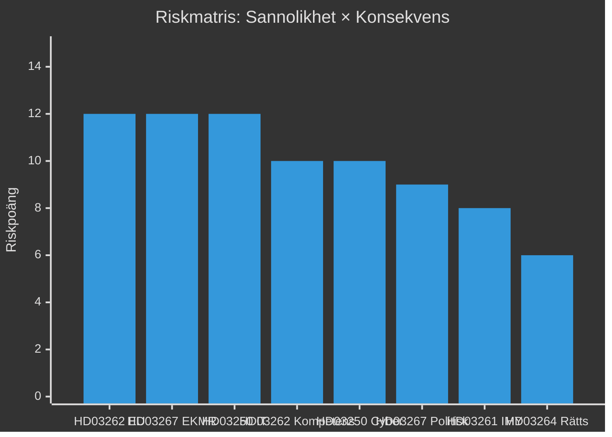

# Riskbedömning — Propositionspaket Maj 2026

**Author**: James Pether Sörling
**Date**: 2026-05-15

## Riskmatris

| Dok-ID | Risk | Sannolikhet (1–5) | Konsekvens (1–5) | Riskpoäng | Mitigation |
|--------|------|-------------------|-------------------|-----------|------------|
| HD03262 | EU-domstolsprövning fördröjer implementation | 3 | 4 | 12 | Förbereda fallback-lagstiftning; EU-kontakter |
| HD03267 | Lagrådet underkänner EKMR-proportionalitet | 3 | 4 | 12 | Stärka proportionalitetsbedömning i remissarbete |
| HD03250 | DIGG-IT-leveransfel; statlig e-legitimation fungerar ej | 3 | 4 | 12 | Parallell BankID-möjlighet under övergång; StegVis-leverans |
| HD03262 | Kompetensförsörjningskris; utländska topptalsanger lämnar | 2 | 5 | 10 | Undantagsmöjligheter för strategisk kompetens |
| HD03261 | IMY-föreläggande mot Skatteverket | 2 | 4 | 8 | DPIA tidigt; minimera databehandling |
| HD03250 | Cyberattack mot e-legitimationsinfrastruktur | 2 | 5 | 10 | NCSC-säkerhetsrevision; resiliensprogrammet |
| HD03264 | Rättsosäkerhet; tillämpningsproblem | 2 | 3 | 6 | Klara riktlinjer; Migrationsverkets utbildning |
| HD03267 | Politisk backlash; valförlust för L på fri- och rättighetsfrågor | 3 | 3 | 9 | Kommunikationsinsatser; betona balansering |

## Aggregerad Riskvärdering

- **Kritiska risker** (poäng ≥ 12): HD03262 EU-prövning, HD03267 Lagråd, HD03250 IT-leverans
- **Höga risker** (poäng 8–11): HD03250 cybersäkerhet, HD03262 kompetens, HD03267 politisk backlash
- **Medelhöga risker** (poäng 4–7): HD03261 IMY, HD03264 tillämpning

## Implementeringsriskhorisont

| Horisont | Primär risk |
|----------|------------|
| T+30 dagar | Lagrådets yttranden HD03262, HD03267 |
| T+90 dagar | Riksdagsvotering; möjliga ändringsyrkanden |
| T+1 år | DIGG e-legitimationsimplementering |
| T+2 år | Migrationsverket PUT-omvandlingsbacklog |
| T+3 år | EU-domstolsbedömning HD03262 |

