# Scenarioanalys — Propositionspaket Maj 2026

**Author**: James Pether Sörling
**Date**: 2026-05-15

## Scenariometodik

Baserat på key driver-analys: (1) Koalitionsstabilitet och (2) EU/rättslig konformitet.

## Scenario A — Stark Implementation (Basscenario, 55% sannolikhet)

**Drivkrafter**: M+SD+KD+L håller ihop; Lagrådet accepterar med justeringar; EU-pakten implementering löper som planerat.

**Händelsekedja**:
1. Remissyttranden juni 2026; Lagrådet godkänner med tekniska justeringar
2. Riksdagsvotering september–oktober 2026 (samtliga propositioner antas)
3. HD03250 (e-legitimation): DIGG lanserar pilot november 2026; nationell utrullning 2028
4. HD03262: Migrationsverket börjar PUT-konverteringsprocess Q1 2027; backlog 2–3 år
5. HD03267: Säkerhetspolisen tillämpar nya befogenheter
6. Valeffekt 2026: M+SD+KD+L framhåller "löftesuppfyllelse" i valkampanj

**Indikatorer**: Lagrådsyttrande positivt; M+SD presskonferenser om "leverans"; Migrationsverkets implementeringsplan offentliggjord

## Scenario B — Försenad/Förändrad Implementation (25% sannolikhet)

**Drivkrafter**: Lagrådet underkänner HD03267 EKMR-proportionalitet; HD03262 EU-konformitetsproblem uppstår; kompetensförsörjningskritik tvingar fram ändringar.

**Händelsekedja**:
1. Lagrådet kritiserar HD03267 kraftigt (augusti 2026)
2. Regeringen tvingas omarbeta prop.; tidplan förskjuts 6 månader
3. HD03262: EU-kommissionen begär förtydliganden om paktkonformitet (oktober 2026)
4. Liberalerna kräver ändringar i HD03267 för att stödja — intern koalitionsförhandling
5. Antaganden i Riksdagen januari–februari 2027 med väsentliga ändringar
6. DIGG e-legitimation försenad till 2029 p.g.a. IT-problem

**Indikatorer**: Lagrådets yttrande publiceras med starkt negativa passager; L-ledare publicerar villkorslista; EU-kommissionens brev till Sverige

## Scenario C — Koalitionskris / Blockad (15% sannolikhet)

**Drivkrafter**: Liberalerna bryter med koalitionen på HD03267; S+C bildar alternativmajoritet på del av migrationspaketet; val utlyses.

**Händelsekedja**:
1. L-riksdagsgruppen röstar emot HD03267 (rättsstatsprincipen)
2. Regeringen förlorar omröstning; statsminister begär extraval eller omförhandling
3. Extraval hösten 2026 med migrationspaket som valnyckelsaksfråga
4. Utfall osäkert: Blockblock kan förändras; M kan välja att omförhandla med C/S

**Indikatorer**: L-partiledning offentliga uttalanden om "röd linje"; koalitionssamtal sammanbrott; statsministerns presskonferens

## Scenario D — Utvidgad Implementation (5% sannolikhet)

**Drivkrafter**: SD pressar igenom skärpningar via ändringsyrkanden; Tidö-2.0 avtal efter valet 2026 ger SD ännu mer inflytande.

**Händelsekedja**:
1. Val 2026: M+SD+KD stärks; L marginellt; C tappar
2. Ny Tidö-version med SD som dominant partner
3. Ytterligare migrationsskärpningar utöver HD03262 och HD03264
4. EKMR-utträdeshotretoriken ökar i SD

```mermaid
%%{init: {'theme': 'dark'}}%%
graph LR
    NOW[["2026-05-15\nProp.paket\nframlagt"]] --> A["Scenario A\n(55%)\nStark impl."]
    NOW --> B["Scenario B\n(25%)\nFörsenad"]
    NOW --> C["Scenario C\n(15%)\nKris/Blockad"]
    NOW --> D["Scenario D\n(5%)\nUtvidgad"]
    A --> A1["2026H2: Riksdagsantagande\n2027: PUT-konvertering\n2028: e-legitimation"]
    B --> B1["2027: Reviderat Riksdagsantagande\n2029: Försenad e-legitimation"]
    C --> C1["Extraval 2026\nOsäkert utfall"]
    D --> D1["Ny Tidö-2.0\n2027–2030 ytterligare skärpningar"]
    style A fill:#0a0e27,stroke:#00d9ff
    style B fill:#0a0e27,stroke:#ffbe0b
    style C fill:#0a0e27,stroke:#ff006e
    style D fill:#0a0e27,stroke:#ff006e
```

