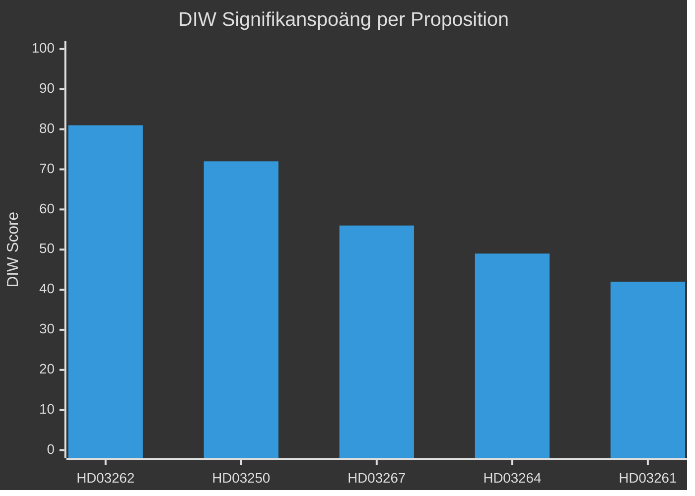

# Signifikanspoängsättning — Propositionspaket 2026-05-07

**Author**: James Pether Sörling
**Date**: 2026-05-15

## DIW-poäng per dokument

Metodologi: D (demokratisk påverkan) × I (institutionell räckvidd) × W (väljarrelevans), skala 1–10 per dimension.

| Rang | dok_id | D | I | W | DIW | Prioritet | Motivering |
|------|--------|---|---|---|-----|-----------|-----------|
| 1 | HD03262 | 9 | 9 | 9 | **81** | L2+ Priority | Avskaffar permanent uppehållstillstånd — strukturell migrationspolitisk ominriktning; berör 349 000+ individer; EU-paktimplementering; valrörelsebrännpunkt |
| 2 | HD03250 | 7 | 9 | 8 | **72** | L2+ Priority | Ny statlig e-legitimationslagstiftning; påverkar alla invånare och hela det digitala administrationen |
| 3 | HD03267 | 8 | 7 | 7 | **56** | L2 Strategic | Utökade utvisningsbefogenheter för säkerhetshot; EKMR-risker; Säkerhetspolisens mandat |
| 4 | HD03264 | 7 | 7 | 7 | **49** | L2 Strategic | Skärpta vandelskrav; breddade utvisningsgrunder; rättssäkerhetsrisker |
| 5 | HD03261 | 6 | 7 | 6 | **42** | L2 Strategic | Utökade Skatteverkets-befogenheter; GDPR-frågor; folkbokföringens integritetsskydd |

## Känslighetsanalys

**Scenario A (optimistisk implementation)**: Alla fem propositioner genomförs utan Lagrådets veto. DIW-aggregat realiseras fullt. Sannolikt: LOW [C3] givet EKMR-risker.

**Scenario B (delvis genomförande)**: HD03262 och HD03267 möter rättsliga hinder. DIW halveras för dessa propositioner. Sannolikt: MEDIUM [B3].

**Scenario C (fördröjning)**: Lagrådsremiss → negativt yttrande → omarbetning → ikraftträdande skjuts bortom valet. Sannolikt: MEDIUM [B3].

## Rangdiagram

## Totalt DIW-aggregat

Summa DIW för paketet: 300 — klassificerar paketet som ett **HIGH IMPACT legislative bundle** med valstrategisk signifikans. Jämförbarbart med migrationspaketet 2015–2016 i strukturell räckvidd.

**Evidens**: HD03262 (https://data.riksdagen.se/dokument/HD03262), HD03250 (https://data.riksdagen.se/dokument/HD03250), HD03267 (https://data.riksdagen.se/dokument/HD03267) — alla Admiralty [B2].
