# Intressentperspektiv — Propositionspaket Maj 2026

**Author**: James Pether Sörling
**Date**: 2026-05-15

## Intressentkarta

| Intressent | Position | Påverkansgrad | Primär Proposition | Källa |
|-----------|---------|---------------|-------------------|-------|
| Justitiedepartementet | Proponent | Hög | HD03267, HD03262, HD03264 | Riksdag |
| Finansdepartementet | Proponent | Hög | HD03250, HD03261 | Riksdag |
| Sverigedemokraterna | Starkt stöd | Hög | HD03262, HD03264 | Tidöavtalet |
| Moderaterna | Stöd | Hög | Alla | Tidöavtalet |
| Liberalerna | Villkorat stöd | Medel | HD03250 (stöd), HD03267 (delat) | Tidöavtalet |
| Socialdemokraterna | Motstånd (migration) | Medel | HD03262, HD03264 | Opposition |
| Vänsterpartiet | Starkt motstånd | Låg | HD03262, HD03267 | Opposition |
| Miljöpartiet | Motstånd | Låg | HD03262, HD03267 | Opposition |
| Centerpartiet | Motstånd (migration) | Medel | HD03262 | Arbetsmarknadspolitik |
| Migrationsverket | Implementeringsansvar | Hög | HD03262 | Myndighet |
| DIGG | Implementeringsansvar | Hög | HD03250 | Myndighet |
| Skatteverket | Implementeringsansvar | Medel | HD03261 | Myndighet |
| Lagrådet | Granskare | Hög | HD03267, HD03262 | Konstitutionellt |
| Amnesty Sverige | Motstånd | Medel | HD03262, HD03267 | Civilsamhälle |
| FARR | Motstånd | Låg | HD03262 | Civilsamhälle |
| Teknikföretagen | Oroade | Medel | HD03262 | Arbetsgivare |
| Almega | Oroade | Medel | HD03262 | Arbetsgivare |
| Finanssektorn/BankID | Motstånd | Medel | HD03250 | Privat sektor |
| IMY | Granskare | Medel | HD03261, HD03250 | Tillsynsmyndighet |
| NCSC | Säkerhetsgranskning | Medel | HD03250 | Myndighet |

## Djupanalys per Nyckelintressent

### Sverigedemokraterna
SD ser HD03262 (PUT-avskaffande) och HD03264 (vandelskrav) som kärna i den restriktiva migrationspolitik som motiverade Tidöavtalet. Partiledning väntas lyfta dessa propositioner som valframgångar inför 2026. Risk: SD kan vilja skärpa ytterligare via ändringsyrkanden (kap. 4), men är beroende av M+KD+L-stöd.

### Lagrådet
Lagrådet har historiskt haft synpunkter på propositioner som utökar statens befogenheter på bekostnad av individens rättigheter. Kritisk granskning väntas för HD03267 (EKMR-frågor) och HD03262 (EU-paktkonformitet). Lagrådets yttranden är offentliga och kan bli politiskt känsliga om de är starkt kritiska.

### Migrationsverket
Verket hanterar redan 50 000+ öppna asylärenden. HD03262 kräver en massomvandling av befintliga PUT till tidsbegränsade tillstånd — en kolossal administrativ börda. Statskontorets granskning 2025:3 pekade på systemiska kapacitetsbrister. Risk: förseningar på 2–4 år.

### Teknikföretagen / Almega
Arbetsgivarorganisationerna representerar sektorer med hög andel utländsk arbetskraft. HD03262 signal att Sverige inte erbjuder permanent bosättning kan avhålla topppersonal. Almega har i remissvar 2026-02 varnat för 15–20% minskning av tillgänglig internationell rekryteringspool.

## Koalitionsanalys av intressentallianer

```mermaid
%%{init: {'theme': 'dark'}}%%
graph LR
    M[Moderaterna] -->|stödjer| PAK[Propositionspaket]
    SD[Sverigedemokraterna] -->|stödjer| PAK
    KD[Kristdemokraterna] -->|stödjer| PAK
    L[Liberalerna] -->|villkorat stöd| PAK
    S[Socialdemokraterna] -->|motstånd| PAK
    V[Vänsterpartiet] -->|starkt motstånd| PAK
    MP[Miljöpartiet] -->|motstånd| PAK
    C[Centerpartiet] -->|delat| PAK
    FARR[FARR/Amnesty] -->|motstånd| PAK
    TE[Teknikföretagen] -->|oroade HD03262| PAK
    style M fill:#1a1e3d,stroke:#00d9ff
    style SD fill:#1a1e3d,stroke:#00d9ff
    style KD fill:#1a1e3d,stroke:#00d9ff
    style L fill:#1a1e3d,stroke:#ffbe0b
    style S fill:#1a1e3d,stroke:#ff006e
    style V fill:#1a1e3d,stroke:#ff006e
    style MP fill:#1a1e3d,stroke:#ff006e
    style C fill:#1a1e3d,stroke:#ffbe0b
```

