# SWOT-analys — Propositionspaket Maj 2026

**Author**: James Pether Sörling
**Date**: 2026-05-15

## Styrkor (Strengths)

- **Koalitionskohesion**: M+SD+KD+L presenterar ett sammanhängande legislativt paket som demonstrerar leveransförmåga. HD03250 (e-legitimation, https://data.riksdagen.se/dokument/HD03250), HD03262 (PUT-avskaffande, https://data.riksdagen.se/dokument/HD03262) och HD03267 (säkerhetshot, https://data.riksdagen.se/dokument/HD03267) är alla centrala Tidöavtalslöften. [A1]
- **EU-konformitet**: HD03262 implementerar EU:s obligatoriska asyl- och migrationspaket — stärker regeringens EU-policyimplementeringsimage. [B2]
- **Digital modernisering**: HD03250 adresserar ett verkligt gap i svensk digital infrastruktur (BankID-monopolet). Stöd från Digitaliseringsminister Erik Slottner. [B2]
- **Valstrategi**: Paketet levererar synliga resultatet inför 2026 riksdagsval på kärnväljares prioriteringsområden (migration, säkerhet, digitalisering). [B3]

## Svagheter (Weaknesses)

- **EKMR-risker HD03267**: Propositionen om säkerhetshot-utvisning (https://data.riksdagen.se/dokument/HD03267) riskerar negativa Lagrådsbedömningar avseende proportionalitet och EKMR Art 3/8. [B2]
- **Implementeringskapacitet**: Migrationsverket redan belastat — HD03262 (https://data.riksdagen.se/dokument/HD03262) kräver hantering av 349 000+ ärendepersoner för statusomvandling. Statskontoret har i rapport 2025:3 pekat på Migrationsverkets kapacitetsbrister.
- **GDPR-exponering HD03261**: Utökade folkbokföringsbefogenheter (https://data.riksdagen.se/dokument/HD03261) skapar DPIA-krav; Integritetsskyddsmyndigheten väntas yttra sig kritiskt. [B2]
- **e-legitimation leveransrisk**: DIGG saknar historik av storskaliga IT-leveranser. Statskontorets utvärdering av DIGG 2024 pekade på begränsad genomförandekapacitet (www.statskontoret.se/publicerat/publikationer/2024/).

## Möjligheter (Opportunities)

- **Valvinst**: Framgångsrik implementering av migrationspaketet stärker M+SD-koalitionens väljarstöd bland högerorienteradeväljare. [B3]
- **EU-ledarskap**: Sverige kan positionera sig som modell för EU-paktimplementering, stärka UD:s inflytande i EU-rådet. [B3]
- **Digital infrastruktur**: Statlig e-legitimation möjliggör kostnadseffektiv e-förvaltning, minskar beroendet av kommersiella aktörer. [B2]
- **Säkerhetspolitiskt momentum**: HD03267 (https://data.riksdagen.se/dokument/HD03267) bygger vidare på post-NATO-säkerhetspolitisk konsensus. [B2]

## Hot (Threats)

- **Rättsliga överklaganden**: HD03262 (https://data.riksdagen.se/dokument/HD03262) kan överklagas till EU-domstolen eller ECHR — fördröjer implementation. [B3]
- **Oppositionsmobilisering**: S + C + V + MP kan använda paketet för att mobilisera väljare kring rättsstatsprinciper och mänskliga rättigheter. [B2]
- **Kompetensförsörjningseffekter**: HD03262 avskaffar permanent uppehållstillstånd; arbetsgivarorganisationer (Teknikföretagen, Almega) varnar för att högkvalificerade utländska arbetstagare väljer andra länder. [B3]
- **IT-säkerhetsrisker**: En statlig e-legitimationsinfrastruktur (HD03250) utgör kritisk nationell infrastruktur och ett attraktivt mål för statliga cyberaktörer. [B2]

## TOWS-matris

| | Styrkor | Svagheter |
|-|---------|-----------|
| **Möjligheter** | SO: Använd koalitionsstyrka + EU-konformitet för att driva migrationspaket som EU-ledarskapsnarration | WO: Stärk DIGG-kapacitet (e-legitimation) + öka Migrationsverkets budget för PUT-omvandling |
| **Hot** | ST: Betona EKMR-konformitetsarbete för att förekomma rättsliga hot; kommunicera säkerhetsfördelar med e-legitimation | WT: Prioritera Lagrådsgranskning tidigt; ta GDPR-konsekvensanalys på allvar för HD03261 |

```mermaid
%%{init: {'theme': 'dark', 'themeVariables': {'primaryColor': '#00d9ff', 'secondaryColor': '#ff006e', 'tertiaryColor': '#ffbe0b'}}}%%
graph TB
    S1[✅ Koalitionskohesion HD03250 HD03262 HD03267] --> CENTER
    S2[✅ EU-konformitet] --> CENTER
    W1[⚠️ EKMR-risker HD03267] --> CENTER
    W2[⚠️ Migrationsverket kapacitetsbrister] --> CENTER
    O1[💡 Valstrategi 2026] --> CENTER
    O2[💡 Digital infrastruktur] --> CENTER
    T1[🚨 Rättsliga överklaganden HD03262] --> CENTER
    T2[🚨 Kompetensförsörjning] --> CENTER
    CENTER{{"Propositions-\npaket\nMaj 2026"}}
    style CENTER fill:#1a1e3d,stroke:#00d9ff
    style S1 fill:#1a1e3d,stroke:#00d9ff
    style S2 fill:#1a1e3d,stroke:#00d9ff
    style W1 fill:#1a1e3d,stroke:#ffbe0b
    style W2 fill:#1a1e3d,stroke:#ffbe0b
    style O1 fill:#1a1e3d,stroke:#00d9ff
    style O2 fill:#1a1e3d,stroke:#00d9ff
    style T1 fill:#1a1e3d,stroke:#ff006e
    style T2 fill:#1a1e3d,stroke:#ff006e
```

