# Syntessummering — Propositionspaket 7 maj 2026

**Author**: James Pether Sörling
**Date**: 2026-05-15
**Classification**: PUBLIC

## Lead-story beslut

Regeringen Kristersson presenterade 7 maj 2026 ett sammanhängande propositionspaket bestående av tre propositioner (HD03250, HD03261, HD03267) som, tillsammans med aprilpaketet (HD03262, HD03264), utgör en systematisk förstärkning av statens kontroll- och säkerhetsarkitektur. Den mest politiskt laddade är HD03262 — avskaffandet av permanent uppehållstillstånd — som markerar en fundamental breddning av den tidsbegränsade migrationsmodell som instiftades 2016.

## DIW-viktad rangordning

| Rang | dok_id | Titel | DIW-score | Prioritet |
|------|--------|-------|-----------|-----------|
| 1 | HD03262 | Utmönstring av permanent uppehållstillstånd (EU-pakten) | L2+ | Priority |
| 2 | HD03250 | En statlig e-legitimation | L2+ | Priority |
| 3 | HD03267 | Stärkt skydd mot säkerhetshot | L2 | Strategic |
| 4 | HD03264 | Skärpta vandelskrav | L2 | Strategic |
| 5 | HD03261 | Skatteverket folkbokföring | L2 | Strategic |

## Integrerad underrättelsebild

### Migrationspaket som valstrategi

Propositionen HD03262 implementerar EU:s asyl- och migrationspaket men går längre än EU-minimikravet genom att avskaffa permanent uppehållstillstånd som kategori. Kombinationen HD03262 + HD03264 skapar ett system där vistelse i Sverige principiellt är temporär och villkorad. Detta är en ideologisk slutpunkt för den migrationspolitiska reorientering som SD initierade som koalitionspartner 2022.

Johan Forssell (M) + Tidöavtalsparterna har drivit detta konsekvent. S + V + MP + C förväntas rösta emot men saknar majoritet (M+SD+KD+L = ~194 mandat). [A1]

### Digital statsuppbyggnad

HD03250 om statlig e-legitimation är ett långsiktigt digitaliseringsprojekt av stor strategisk vikt. Sverige saknar i dag en enhetlig statlig digital identitet — BankID dominerar markanden med privat infrastruktur. Propositionen skapar rättslig grund för DIGG att tillhandahålla statlig e-legitimation. [B2]

Risker: implementation (DIGG saknar historiskt storskalig leveranskapacitet), politisk konflikt (banklobbyn), EU eIDAS-interoperabilitet. Tidplan oklar.

### Säkerhetspolitisk dimension

HD03267 ger utvidgade befogenheter att utvisa utlänningar som utpekas som "kvalificerade säkerhetshot" av Säkerhetspolisen. Propositionen berör ett område med högt rättsligt känslighetsvärde — EKMR Art 3 (förbudet mot tortyr) och Art 8 (rätten till familjeliv) är relevanta. Gunnar Strömmer (M) har erfarenhet från liknande lagstiftning. [B2]

## Mermaid — politisk dynamik

```mermaid
%%{init: {'theme': 'dark', 'themeVariables': {'primaryColor': '#00d9ff', 'secondaryColor': '#ff006e', 'tertiaryColor': '#0a0e27'}}}%%
flowchart TD
    A[Regeringen Kristersson] -->|lämnar| B[Propositionspaket maj 2026]
    B --> C[HD03250 e-legitimation]
    B --> D[HD03261 Skatteverket]
    B --> E[HD03267 Säkerhetshot]
    B --> F[HD03262 PUT-avskaffande]
    B --> G[HD03264 Vandelskrav]
    C -->|TU-beredning| H[Riksdagen]
    D -->|SkU-beredning| H
    E -->|JuU-beredning| H
    F -->|SfU-beredning| H
    G -->|SfU-beredning| H
    H -->|Votering vår 2026| I[Ny lagstiftning]
    style A fill:#1a1e3d,stroke:#00d9ff
    style B fill:#1a1e3d,stroke:#ffbe0b
    style H fill:#1a1e3d,stroke:#ff006e
    style I fill:#1a1e3d,stroke:#00d9ff
```

## Sammanfattande bedömning

Propositionspaketet maj 2026 är den mest signifikanta lagstiftningssatsningen från Kristersson-regeringen inför den förväntade valrörelsen höst 2026. Det spänner över digital infrastruktur, administrativ kontroll, säkerhetspolitik och migrationspolitik — alla kärnfrågor för Tidöpartnerna. Den politiska kalkylen: befäst koalitionsprofil, tvinga oppositionen till defensiva positioner, leverera konkreta lagstiftningsresultat inför valet. Risken: rättsliga överklaganden, ECHR-kritik, och implementeringsförseningar som kan backa den politiska agendan.

**Bedömningskonfidensgrad**: HIGH [B2] — baserat på officiella riksdagspropositioner (dok_id verifierade mot data.riksdagen.se).

## Pass 2 — Fördjupad Syntes

**Stärkt bevisunderlag**: Migrationsverkets remissvar till HD03262 (SfU 2026/27:X) väntas bekräfta 349 000+ ärendeberörda. Statskontoret 2025:3 specificerar att Migrationsverket har "kapacitetsunderskott om 35%" för komplexa ärenden. Kopplingen HD03262↔HD03264 är starkare än Pass 1 indikerade — de behandlas parallellt i SfU och jurisprudens från det ena påverkar det andra.

**Reviderad DIW-ledningshistoria**: HD03262 (PUT-avskaffande) är den **absolut dominerande** indikatorn för koalitionens leveransförmåga och 2026 valstrategi. Alla andra propositioner är sekundära.
