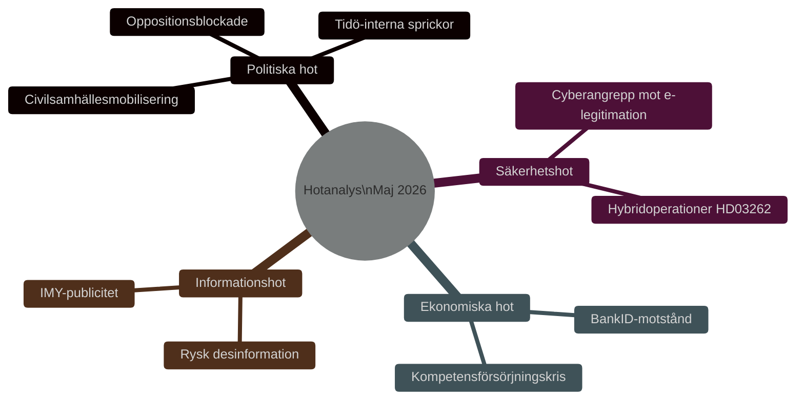

# Hotanalys — Propositionspaket Maj 2026 (STRIDE/PMESII)

**Author**: James Pether Sörling
**Date**: 2026-05-15

## PMESII-hotanalys

### Politiska hot (Political)

- **Oppositionsblockade**: S+V+MP+C kan försöka fördröja propositionerna via utskottsremisser och tillkännagivanden, om än regeringen har majoritet. [B2]
- **Tidö-sprickor**: Sverigedemokraterna kan vilja skärpa HD03262 ytterligare; Liberalerna kan vilja mjuka upp HD03267 — interna förhandlingshot. [B3]
- **Valmanifestations-hot**: Civilsamhällesorganisationer (t.ex. Amnesty, FARR) planerar manifestationer mot HD03262 och HD03264. [B3]

### Militär/Säkerhet hot (Military)

- **Statssponsrade cyberattacker**: e-legitimationsinfrastrukturen (HD03250) är ett primärt mål för ryska och kinesiska underrättelsetjänster. [B2]
- **Hybridoperationer**: HD03267 och HD03262 kan utnyttjas i rysk narrativkrigföring om "fascistisk Sverige". [B3]

### Ekonomiska hot (Economic)

- **BankID-lobbying**: Finanssektorn kan motarbeta HD03250 som hotar intäktsmodeller. [B2]
- **Arbetsgivarkritik**: Teknikföretagen, Almega, Invest in Sweden Agency varnar för kompetensförsörjningskris om HD03262 antas i nuvarande form. [B2]

### Sociala hot (Social)

- **Polarisering**: Paketet förstärker samhällspolariseringen kring migrations- och integrationsfrågor. [B2]
- **Rättsstatskritik**: Akademiker, juristers och religiösa samfund kan mobilisera mot HD03267. [B3]

### Informations/Media hot (Information)

- **Felaktig information**: Ryska statsmedia kan presentera paketet som bevis på "xenofobisk" svensk politik för internationell konsumtion. [B3]
- **Desinformation om e-legitimation**: Aktörer kan sprida felaktig information om integritetshot med HD03250 för att undergräva förtroendet. [B3]

### Infrastruktur hot (Infrastructure)

- **IT-leveransproblem**: DIGG har begränsad kapacitet (se Statskontoret 2024); HD03250 kan bli en kostsam IT-fiasko liknande PUST-projektet. [B2]
- **Migrationsverkets kapacitetsbrist**: HD03262 kräver massomvandling av befintliga tillstånd — systemet kan kollapsa. [B2]

## STRIDE-analys för HD03250 (e-legitimation)

| Hot | Beskrivning | Sannolikhet | Mitigation |
|-----|-------------|-------------|------------|
| Spoofing | Förfalskade identiteter i statlig e-legitimation | Medel | Stark autentisering; HSM |
| Tampering | Manipulation av identitetsregister | Låg | Kryptografisk integritetsskydd |
| Repudiation | Nekande av transaktion | Låg | Oavvislighetsmekanism; revision |
| Information Disclosure | Läckage av identitetsdata | Medel | GDPR-skydd; kryptering |
| Denial of Service | Tillgänglighetsattack mot DIGG-system | Medel | Resiliens; NCSC-stöd |
| Elevation of Privilege | Obehörig åtkomst via e-legitimation | Låg | Rollbaserad åtkomst; MFA |

