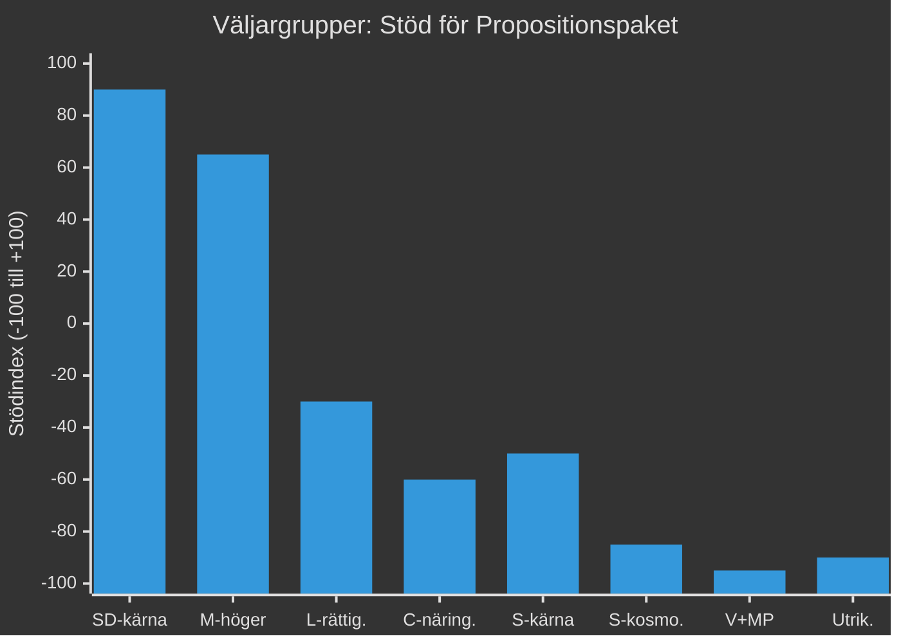

# Väljarssegmentering — Propositionspaket Maj 2026

**Author**: James Pether Sörling
**Date**: 2026-05-15

## Segmentmatris

| Väljargrupp | Population | Propositionsreaktion | Nyckelproposition |
|------------|-----------|---------------------|------------------|
| SD-kärnväljare (migrationsfokus) | ~18% av elektorn | Stark positiv | HD03262, HD03264 |
| M-högerflygel (lag och ordning) | ~8% av elektorn | Positiv | HD03267, HD03262 |
| L-rättighetsväljare | ~3% av elektorn | Delad/Negativ | HD03267 (bekymmer) |
| C-landsbygd + näringsliv | ~5% av elektorn | Negativ (migration) | HD03262 |
| S-kärnväljare (arbetar- + welfare) | ~20% av elektorn | Negativ (migration) | HD03262, HD03267 |
| S-kosmopoliter (urbana, utbildade) | ~12% av elektorn | Starkt negativ | HD03262, HD03267 |
| V+MP (vänster-gröna) | ~11% av elektorn | Starkt negativ | Hela paketet |
| Icke-traditionella väljare (2026) | ~5% av elektorn | Mixad | HD03250 |
| Utrikesfödda röstberättigade | ~8% av elektorn | Starkt negativ | HD03262, HD03264 |

## Djupanalys Nyckelgrupper

### SD-kärnväljare
Paketet bekräftar SD:s val-value proposition. HD03262 var ett explicit SD-krav i Tidöavtalet. Partilojaliteten väntas öka 2–3 pp. Risk: om paketet upplevs som otillräckligt av SD:s extremhöger kan det läcka väljare till Alternativ för Sverige (AfS).

### L-rättighetsväljare
Liberalerna har sedan 2022 haft intern strid om rättsstatsprinciper vs. koalitionslojalitet. HD03267 är den kritiska linjen. SOM-institutets data 2025 visar att 35% av L-väljare sätter "fri- och rättigheter" som topprioritet. Om L-ledare (Ludvig Aspling) tar tydlig position mot HD03267 utan att bryta koalitionen kan de hålla dessa väljare.

### Utrikesfödda Röstberättigade
Ca. 560 000 utrikesfödda i Sverige har rösträtt. HD03262 direkt berör deras situation. Segmentet röstar traditionellt 70% S/V/MP. Mobilisering av detta segment gynnar oppositionsblocket. Risk för koalitionen: hög symbolisk kostnad om utvisningar av "integrerade" invandrare dramatiseras i media.

### C-näringsliv + Landsbygd
Centerpartiet representerar lantbrukarna och småföretagarna. Dessa grupper har högt beroende av utländsk säsongsarbetskraft (jordbruk) och interntional rekrytering (tech-företag utanför storstäder). HD03262 skapar oro. C kan vilja förhandla undantag för arbetsmarknadsskäl.

