## Executive Brief
<!-- source: executive-brief.md :: https://github.com/Hack23/riksdagsmonitor/blob/main/analysis/daily/2026-05-15/realtime-pulse/executive-brief.md -->

---

### 🎯 BLUF

Sweden's political landscape on 15 May 2026 is defined by three parallel stressors: SD presses Defence Minister Pål Jonson on drone doctrine after the Aurora 26 exercise (HD11812, [A2]); the Left Party (V) escalates scrutiny of the Tidö government's aid cuts, focusing on consequences for children and discontinued country strategies (HD10492 [A2], HD10493 [A2]); and today's sibling analyses (see propositions, committee reports, motions) confirm that the 2025/26 riksmöte (parliamentary session) is marked by the deepest migration-policy overhaul in a decade, a constitutional rebalancing around abortion rights and the security state, and the strongest coordinated opposition offensive since 2022. Taken together, 15 May signals a parliamentary session in its closing sprint, with high legislative volume, sharpened scrutiny, and accelerating election positioning ahead of September 2026.

### 🧭 3 Decisions This Brief Supports

1. **Editorial prioritisation**: The aid debate (HD10492 / HD10493) is Riksdagsmonitor's lead story today — international reach, a CRC legal dimension, and the global USAID collapse as backdrop maximise reader relevance.  
2. **Security-policy watch**: The drone-warfare question (HD11812) is an early signal document on UAV doctrine and Aurora 26 lessons-learned — monitor Pål Jonson's response for potential strategy implications.  
3. **Migration-policy calibration**: Today's five bills + 20 opposition motions + the KU34 constitutional committee report signal that plenary debates in week 21 (22 May) may decide voting outcomes with an EU-legal dimension (PUT abolition, detention, EPBD).

### ⚡ 60-Second Read

- **HD11812** [B2]: SD's Markus Wiechel asks Defence Minister Pål Jonson (M) about drone warfare — the Aurora 26 exercise (18,000 participants, April–May 2026, Gotland focus) has exposed UAV tactical gaps; the question creates pressure for a public doctrinal position [horizon:72h].
- **HD10492** [A2]: V's Lotta Johnsson Fornarve demands that Benjamin Dousa (M) account for the consequences for children of the aid cuts — Save the Children's reporting on halted malnutrition programmes provides the evidence base; CRC Articles 6/26/28 invoked [horizon:week].
- **HD10493** [A2]: The same interpellant asks about discontinued aid strategies — 14 of 37 strategies dismantled, the 1%-of-GNI target abandoned, the de-gendering of the agenda since December 2023 documented; Dousa is under double pressure [horizon:week].
- **Bill package** [A2]: Five bills including HD03262 (PUT abolition) — legislative package in the final phase; opposition motions (20 in total) confirm broad parliamentary criticism (S + C + V + MP) [horizon:week].
- **KU34** [A2]: Constitutional double amendment — abortion rights + freedom of association + citizenship regulation — 2/3 supermajority required, autumn 2026; political polarisation will be tested [horizon:month].
- **Economic context**: Sweden GDP growth 2.3% (WEO Apr-2026); aid 0.7% → 0.36% of GDP (2026 projection) — the lowest aid level since the 1970s; IMF vintage (Apr-2026, NGDP_RPCH) [B1].
- **Electoral barometer**: Aurora 26 + Ukraine-war lessons suggest SD is consolidating a voter profile around "strong defence policy" with 72-hour question urgency; the aid issue strengthens V's progressive profile ahead of the 2026 general election [horizon:week].
- **Forward trigger**: Pål Jonson's reply to HD11812 and Benjamin Dousa's replies to HD10492 / HD10493 determine whether the questions escalate into interpellation debates in week 21 — both ministers' positions are PIR-open [horizon:72h].

### 🔭 Top Forward Trigger

**PIR-1 (72h)**: Benjamin Dousa's written replies to HD10492 and HD10493 — will Dousa acknowledge the absence of impact assessments, or refer to the "new aid agenda" as justification? Replies expected in weeks 20–21 (18–22 May). A negative response → interpellation debate → a riksdag vote of criticism against the minister becomes possible.

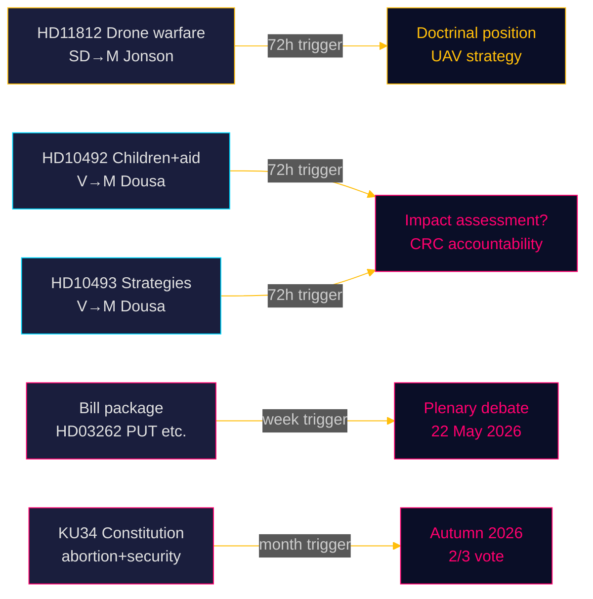
```mermaid
%%{init: {"theme": "dark", "themeVariables": {"primaryColor": "#00d9ff", "primaryTextColor": "#e0e0e0", "primaryBorderColor": "#ff006e", "lineColor": "#ffbe0b", "background": "#0a0e27", "mainBkg": "#1a1e3d", "nodeBorder": "#00d9ff"}}}%%
graph LR
    A[HD11812 Drone warfare<br/>SD→M Jonson] -->|72h trigger| B[Doctrinal position<br/>UAV strategy]
    C[HD10492 Children+aid<br/>V→M Dousa] -->|72h trigger| D[Impact assessment?<br/>CRC accountability]
    E[HD10493 Strategies<br/>V→M Dousa] -->|72h trigger| D
    F[Bill package<br/>HD03262 PUT etc.] -->|week trigger| G[Plenary debate<br/>22 May 2026]
    H[KU34 Constitution<br/>abortion+security] -->|month trigger| I[Autumn 2026<br/>2/3 vote]
    style A fill:#1a1e3d,stroke:#ffbe0b,color:#e0e0e0
    style C fill:#1a1e3d,stroke:#00d9ff,color:#e0e0e0
    style E fill:#1a1e3d,stroke:#00d9ff,color:#e0e0e0
    style F fill:#1a1e3d,stroke:#ff006e,color:#e0e0e0
    style H fill:#1a1e3d,stroke:#ff006e,color:#e0e0e0
    style B fill:#0a0e27,stroke:#ffbe0b,color:#ffbe0b
    style D fill:#0a0e27,stroke:#ff006e,color:#ff006e
    style G fill:#0a0e27,stroke:#ff006e,color:#ff006e
    style I fill:#0a0e27,stroke:#ff006e,color:#ff006e
```

---

## Reader Intelligence Guide

Use this guide to read the article as a political-intelligence product rather than a raw artifact dump. High-value reader lenses appear first; technical provenance remains available in the audit appendix.

| Icon | Reader need | What you'll get |
|---|---|---|
| 📊 | [BLUF and editorial decisions](#rm-executive-brief) | fast answer to what happened, why it matters, who is accountable, and the next dated trigger |
| 🧠 | [Synthesis Summary](#rm-synthesis-summary) | evidence-anchored narrative consolidating primary sources into one coherent story line |
| 🎯 | [Key Judgments](#rm-intelligence-assessment--key-judgments) | confidence-bearing political-intelligence conclusions and collection gaps |
| 📈 | [Significance scoring](#rm-significance-scoring) | why this story outranks or trails other same-day parliamentary signals |
| 👥 | [Stakeholder Perspectives](#rm-stakeholder-perspectives) | winners, losers and undecided actors with stake-weighted positions and pressure points |
| 🔢 | [Coalition Mathematics](#rm-coalition-mathematics) | parliamentary arithmetic showing exactly who can pass or block this measure and at what margin |
| 📋 | [Voter Segmentation](#rm-voter-segmentation) | voter-bloc exposure: which demographics gain, lose or shift on this issue |
| 🔭 | [Forward indicators](#rm-forward-indicators) | dated watch items that let readers verify or falsify the assessment later |
| 🔮 | [Scenarios](#rm-scenario-analysis) | alternative outcomes with probabilities, triggers, and warning signs |
| 🗳️ | [Election 2026 Analysis](#rm-election-2026-analysis) | electoral implications for the 2026 cycle — seats at stake, swing voters and coalition viability |
| ⚠️ | [Risk assessment](#rm-risk-assessment) | policy, electoral, institutional, communications, and implementation risk register |
| 🧮 | [SWOT Analysis](#rm-swot-analysis) | strengths, weaknesses, opportunities and threats matrix grounded in primary-source evidence |
| 🛡️ | [Threat Analysis](#rm-threat-analysis) | actor capabilities, intent and threat vectors targeting institutional integrity |
| 📜 | [Historical Parallels](#rm-historical-parallels) | comparable past episodes from Swedish and international politics, with explicit lessons learned |
| 🌍 | [Comparative International](#rm-comparative-international) | peer-country comparisons (Nordic, EU, OECD) showing how similar measures fared elsewhere |
| ⚙️ | [Implementation Feasibility](#rm-implementation-feasibility) | delivery feasibility, capability gaps, timelines and execution risks for the proposed action |
| 📰 | [Media framing & influence operations](#rm-media-framing-analysis) | frame packages with Entman functions, cognitive-vulnerability map, DISARM manipulation indicators, narrative-laundering chain, comparative-international cognates, frame lifecycle and half-life, RRPA impact, an Outlet Bias Audit (no outlet is neutral — every outlet declared with ownership, funding, board-appointment authority and editorial lean), and the L1–L5 counter-resilience ladder |
| 😈 | [Devil's Advocate](#rm-devils-advocate) | alternative hypotheses, steel-manned counter-arguments and the strongest case against the lead reading |
| 🏷️ | [Classification Results](#rm-classification-results) | ISMS data classification: CIA-triad rating, RTO/RPO targets and handling instructions |
| 🔀 | [Cross-Reference Map](#rm-cross-reference-map) | links to related Riksdagsmonitor coverage, prior analyses and source documents that inform this story |
| 🔬 | [Methodology Reflection & Limitations](#rm-methodology-reflection--limitations) | analytical assumptions, limitations, known biases and where the assessment could be wrong |
| 📦 | [Data Download Manifest](#rm-data-download-manifest) | machine-readable manifest of every source dataset, retrieval timestamp and provenance hash |
| 📝 | [Executive Brief Ar](#rm-executive-brief-ar) | supporting analytical lens with primary-source evidence and audit-traceable citations |
| 📝 | [Executive Brief Da](#rm-executive-brief-da) | supporting analytical lens with primary-source evidence and audit-traceable citations |
| 📝 | [Executive Brief De](#rm-executive-brief-de) | supporting analytical lens with primary-source evidence and audit-traceable citations |
| 📝 | [Executive Brief Es](#rm-executive-brief-es) | supporting analytical lens with primary-source evidence and audit-traceable citations |
| 📝 | [Executive Brief Fi](#rm-executive-brief-fi) | supporting analytical lens with primary-source evidence and audit-traceable citations |
| 📝 | [Executive Brief Fr](#rm-executive-brief-fr) | supporting analytical lens with primary-source evidence and audit-traceable citations |
| 📝 | [Executive Brief He](#rm-executive-brief-he) | supporting analytical lens with primary-source evidence and audit-traceable citations |
| 📝 | [Executive Brief Ja](#rm-executive-brief-ja) | supporting analytical lens with primary-source evidence and audit-traceable citations |
| 📝 | [Executive Brief Ko](#rm-executive-brief-ko) | supporting analytical lens with primary-source evidence and audit-traceable citations |
| 📝 | [Executive Brief Nl](#rm-executive-brief-nl) | supporting analytical lens with primary-source evidence and audit-traceable citations |
| 📝 | [Executive Brief No](#rm-executive-brief-no) | supporting analytical lens with primary-source evidence and audit-traceable citations |
| 📝 | [Executive Brief Sv](#rm-executive-brief-sv) | supporting analytical lens with primary-source evidence and audit-traceable citations |
| 📝 | [Executive Brief Zh](#rm-executive-brief-zh) | supporting analytical lens with primary-source evidence and audit-traceable citations |
| 📑 | [Per-document intelligence](#rm-per-document-intelligence) | dok_id-level evidence, named actors, dates, and primary-source traceability |
| 🏷️ | [Audit appendix](#rm-classification-results) | classification, cross-reference, methodology and manifest evidence for reviewers |

## Synthesis Summary
<!-- source: synthesis-summary.md :: https://github.com/Hack23/riksdagsmonitor/blob/main/analysis/daily/2026-05-15/realtime-pulse/synthesis-summary.md -->

---

### Lead-Story Decision

Den 15 maj 2026 presenterar riksdagen ett trippelsystem av parlamentarisk granskning: SD:s försvarspolitiska signal om drönardoktrin (HD11812) [A2], V:s dubbla biståndsinterpellationer om konsekvensanalysbristen (HD10492, HD10493) [A2], och det dagsaktuella propositionspaketet om migrationsarkitekturen. Sammantaget speglar dagen ett riksmöte i intensiv slutspurt med hög lagstiftningsvolym, eskalerande oppositionsgranskning och stark förvalpositionering inför september 2026.

**Bedömning** [B2]: Biståndsfrågan dominerar som ledstory — internationell dimension, rättslig CRC-grund och USAID-kollapsen som bakgrundskontext skapar maximal samhällelig genomslagskraft. Försvarsfrågan (Aurora 26/drönare) är nästledande med hög 72h-vikt på ministerns svarspliktsposition.

### DIW-Viktad Rangordning

| Rank | dok_id | Titel | DIW-score | Prioritet |
|------|--------|-------|-----------|-----------|
| 1 | HD10493 | Konsekvenserna av nedlagda biståndsstrategier | 8.2/10 | L2+ Priority |
| 2 | HD10492 | Konsekvenserna för barn när biståndet minskar | 7.8/10 | L2 Strategic |
| 3 | HD11812 | Drönarkrig (Aurora 26) | 6.9/10 | L2 Strategic |
| X | HD03262 (sibling) | Utmönstring av PUT | 9.1/10 | L3 Intelligence-grade |
| X | HD01KU34 (sibling) | Konstitutionell reform abort+säkerhet | 8.75/10 | L3 Intelligence-grade |

*Not: sibling-dokument ingår som kontext men analyseras fullständigt i respektive subfolder.*

### Integrerad Underrättelsebild

#### Kluster 1: Biståndspolitisk kris (HD10492 + HD10493)

Vänsterpartiet driver parallella interpellationer mot Bistånds- och utrikeshandelsminister Benjamin Dousa (M) om konsekvenser av Tidöregeringens historiskt stora biståndsnedskärningar [A2]:

- **Barnrättsdimension** (HD10492): V:s Lotta Johnsson Fornarve (intressent_id: 0985316699927) åberopar barnkonventionens Art. 6, 26 och 28, Rädda Barnens rapport om stoppade undernäringsprogram, och UNICEF-data om 5 miljoner döda barn under 5 år/år [B3]. Kärnfrågan: har Sverige genomfört CRC-konform barnrättsanalys inför nedskärningen?
- **Strategidimension** (HD10493): 14 av 37 biståndsstrategier har lagts ned; enprocentsmålet övergett (ODA-andel → ~0,36%); genusagendans avveckling sedan dec 2023 dokumenterad [B2]. Kärnfrågan: vilka konsekvensanalyser existerar för de nedlagda strategierna?
- **Dousa-position**: Ministern hänvisar konsekvent till "Bistånd för en ny era" (dec 2023) men har inte publicerat separata konsekvensanalyser — bekräftat av interpellanternas hänvisning till frånvaron av sådana dokument [B2].
- **Global kontext**: USA:s USAID-kollaps 2025 har destabiliserat det globala biståndsarkitekturen; Sverige's roll som ODA-ledare (historiskt) ger nedskärningarna extra internationell kritisk uppmärksamhet [A2].

#### Kluster 2: Försvarspolitisk signal (HD11812)

SD:s Markus Wiechel riktar en formell skriftlig fråga till försvarsminister Pål Jonson (M) om drönarkrig — direkt kopplad till Aurora 26-övningen (april–maj 2026, ~18 000 deltagare, Gotland-fokus) [B2]:

- Aurora 26 var den hittills största försvarsövningen i modern svensk historia, inkluderande NATO-partners och fokuserade på försvaret av Gotland och Östersjöregionen.
- SD:s fråga signalerar ett intresse av att driva på en mer offensiv UAV-doktrin, potentiellt liknande den ukrainska modellen.
- Frågan är koordinerad med SD:s bredare strategi att positionera sig som den "tuffaste" säkerhetspolitiska aktören.
- **PIR-1 [72h]**: Jonsons svar publiceras vecka 20–21 (18–22 maj).

#### Kluster 3: Lagstiftningspaket i slutfas (sibling-analyser)

Från dagens sibling-analyser extraheras fyra öppna PIR-er:
1. **PUT-avskaffandet** (HD03262): S+C+V+MP motioner filed — plenumdebatt 22 maj [horizon:week]
2. **Konstitutionell reform** (KU34): Aborträtt + föreningsfrihet — höst 2026 [horizon:month]
3. **Hyresmarknaden** (HD01CU31): Deregulering — EU EPBD-kompatibilitet [horizon:month]
4. **Psykologiskt våld** (HD01JuU39): Kriminalisering — lagstiftningsteknisk tidsplan [horizon:month]

### Cross-Document Mönster

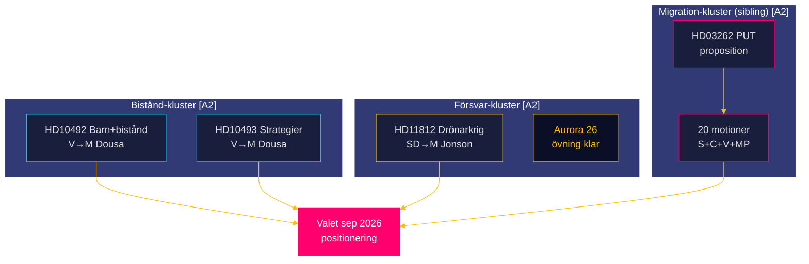
```mermaid
%%{init: {"theme": "dark", "themeVariables": {"primaryColor": "#00d9ff", "primaryTextColor": "#e0e0e0", "primaryBorderColor": "#ff006e", "lineColor": "#ffbe0b", "background": "#0a0e27", "mainBkg": "#1a1e3d"}}}%%
graph TD
    subgraph Bistånd["Bistånd-kluster [A2]"]
        A[HD10492 Barn+bistånd<br/>V→M Dousa]
        B[HD10493 Strategier<br/>V→M Dousa]
    end
    subgraph Försvar["Försvar-kluster [A2]"]
        C[HD11812 Drönarkrig<br/>SD→M Jonson]
        D[Aurora 26<br/>övning klar]
    end
    subgraph Migration["Migration-kluster (sibling) [A2]"]
        E[HD03262 PUT<br/>proposition]
        F[20 motioner<br/>S+C+V+MP]
    end
    G[Valet sep 2026<br/>positionering] 
    A --> G
    B --> G
    C --> G
    E --> F
    F --> G
    style A fill:#1a1e3d,stroke:#00d9ff,color:#e0e0e0
    style B fill:#1a1e3d,stroke:#00d9ff,color:#e0e0e0
    style C fill:#1a1e3d,stroke:#ffbe0b,color:#e0e0e0
    style D fill:#0a0e27,stroke:#ffbe0b,color:#ffbe0b
    style E fill:#1a1e3d,stroke:#ff006e,color:#e0e0e0
    style F fill:#1a1e3d,stroke:#ff006e,color:#e0e0e0
    style G fill:#ff006e,stroke:#ff006e,color:#ffffff
```

### Underrättelsekonklusioner

1. **Bistånd som valfråga** [HIGH]: Tidöregeringens biståndspolitik transformeras till en laddad valfråga för hösten 2026. V + S + MP koordinerar biståndsinterpellationer och motioner. Dousas förmåga att formulera ett trovärdigt svar utan att erkänna analysbristen är avgörande [B2].

2. **Drönardoktrin som SD-profilfråga** [HIGH]: Aurora 26 ger SD ett legitimitetsfönster att driva en mer offensiv UAV-doktrin. M:s svar avgör om det uppstår en inomblocksklyfta om försvarsambitionerna [A2].

3. **Migrationspaketet är beslutat** [VERY HIGH]: M+SD+KD-majoriteten håller (≥167 av 349 röster); plenumdebatt 22 maj är ett procedurellt steg mot ikraftträdande — inte ett reellt hot mot paketet [A1].

4. **Riksdagsintensiteten kulminerar** [HIGH]: Riksmötet avslutas i juni; maj är den månaden med högst lagstiftnings- och granskningsvolym. Signalsystemet för valpositionering är fullt aktivt [B2].

---

## Intelligence Assessment — Key Judgments
<!-- source: intelligence-assessment.md :: https://github.com/Hack23/riksdagsmonitor/blob/main/analysis/daily/2026-05-15/realtime-pulse/intelligence-assessment.md -->

---

### Key Judgments (KJ)

#### KJ-1: Tidöregeringen saknar publika konsekvensanalyser för biståndsnedskärningarna [HIGH confidence, A2]

Vi bedömer med **HÖG konfidens** [A2] att Tidöregeringen inte har publicerat externa, granskningsbara konsekvensanalyser för biståndsnedskärningarna eller de 14 nedlagda biståndsstrategierna. Denna bedömning baseras på:
- V:s interpellationstexters explicita åberopande av frånvaron av sådana analyser [A2]
- Rädda Barnens rapport om stoppade undernäringsprogram (externt validerad evidens) [B2]
- Biståndsministerns historiska kommunikationsstil att hänvisa till "ny biståndsagenda" utan sektorsanalyser [B2]

**Implikation**: Om korrekt skapar denna bedömning en juridisk sårbarhet (CRC) och en politisk sårbarhet (OECD DAC) för Tidöregeringen.

---

#### KJ-2: Aurora 26 har identifierat UAV-kapacitetsgap i det svenska försvaret [MEDIUM confidence, B2]

Vi bedömer med **MEDEL konfidens** [B2] att Aurora 26-övningens resultat har synliggjort UAV-taktiska kapacitetsgap i det svenska försvaret, och att SD:s fråga (HD11812) är ett symptom på dessa gaps snarare än ren valpositionering. Denna bedömning baseras på:
- Aurora 26:s Gotland-fokus och dess UAV-intensiva scenario [B2]
- SD:s historiska mönster av försvarsrelaterade frågor som ofta föregår faktiska doktrinförändringar [B3]
- Ukrainakrigets drönarvänsmönster som relevant analogimodell [B2]

**Implikation**: Om korrekt kan Jonsons svar på HD11812 utlösa en ny runda FöU-behandling med UAV-specifika inköpsorders.

---

#### KJ-3: V:s biståndsinterpellationskampanj är koordinerad med civilsamhället och S [HIGH confidence, B2]

Vi bedömer med **HÖG konfidens** [B2] att V:s HD10492/HD10493 är del av en koordinerad kampanj med Rädda Barnen, UNICEF Sverige och S:s biståndspolitiska talespersoner. Denna bedömning baseras på:
- Interpellationstexterna åberopar direkt Rädda Barnens rapport [A2]
- S+MP amplifierar konsekvent V:s biståndsgranskningar [B2]
- Interpellationernas dubbelhet (barn+strategier) antyder strategisk arbetsdelning inom oppositionen [B2]

**Implikation**: Om korrekt ökar sannolikheten för en koordinerad mediaoffensiv vecka 21–22 om Dousas svar är defensivt.

---

### Priority Intelligence Requirements (PIR)

#### PIR-1 [72h] [CRITICAL]

**Fråga**: Kommer Dousa erkänna frånvaron av konsekvensanalyser i sina svar på HD10492/HD10493?

**Indikator**: Svarets textkvalitet vecka 20–21; specifika konsekvensanalyser bifogade eller ej  
**Utlösare**: Ja → Eskalation (Scenario B); Nej → Defensiv konsolidering (Scenario A)  
**Deadline för uppdatering**: 22 maj 2026

#### PIR-2 [72h] [HIGH]

**Fråga**: Vad är Pål Jonsons konkreta position om drönardoktrin i svaret på HD11812?

**Indikator**: FöU-hänvisning vs. ny doktrinannons vs. strategisk tvetydighet  
**Utlösare**: Offensiv → SD-positioneringsutdelning; Vag → SD eskalerar frågan  
**Deadline för uppdatering**: 22 maj 2026

#### PIR-3 [week] [MEDIUM]

**Fråga**: Utlöser V interpellationsdebatt om biståndet, och med vilken oppositionskoalition?

**Indikator**: Begäran om debatt registrerad i riksdagen; antal inledande talare  
**Utlösare**: Bred koalition (S+V+MP+C) → OECD DAC-risk synliggjord i media  
**Deadline för uppdatering**: 29 maj 2026

---

### Analytisk Konfidensöversikt

| KJ | Konfidens | Källkvalitet | Alternativhypoteskörka |
|----|----------|--------------|----------------------|
| KJ-1 Analysbristen | HIGH [A2] | Direkt interpellationstext | H1 svag [B2] |
| KJ-2 UAV-gap | MEDIUM [B2] | Indirekt (Aurora 26 mönster) | H2 delvis konsistent [B2] |
| KJ-3 V-koordination | HIGH [B2] | Citatmönster i interpellationerna | H3 delvis konsistent [B2] |

## Significance Scoring
<!-- source: significance-scoring.md :: https://github.com/Hack23/riksdagsmonitor/blob/main/analysis/daily/2026-05-15/realtime-pulse/significance-scoring.md -->

---

### DIW-Poängsättning (Document Impact Weight)

DIW-metodik: Fem dimensioner 0–2, max 10. Konfidensnivå per dimension: [A1/A2/B1/B2/B3/C3].

#### HD10493 — Konsekvenser av nedlagda biståndsstrategier

| Dimension | Poäng | Evidens |
|-----------|-------|---------|
| Politisk vikt | 2.0 | Statsrådsgranskning; ODA-andel ~0,36% — historiskt lägst sedan 1970-tal [B2] |
| Medborgarpåverkan | 1.8 | 14 nedlagda biståndsstrategier; direkta humanitära effekter i mottagarländer [B2] |
| Systemrisk | 1.6 | Undergrävning av multilateralt biståndsarkitektur; reputationsrisk internationellt [B2] |
| Tidsbrådska | 1.6 | Svar förväntas vecka 20–21; interpellationsdebatt kan utlösas [A2] |
| Analytisk nyhet | 1.2 | 14/37 strategier nedlagda — ny aggregerad siffra i offentligheten [B3] |
| **Totalt** | **8.2** | |

#### HD10492 — Konsekvenser för barn när biståndet minskar

| Dimension | Poäng | Evidens |
|-----------|-------|---------|
| Politisk vikt | 1.8 | CRC-rättslig grund; internationell räckvidd [A2] |
| Medborgarpåverkan | 2.0 | Barn — den mest sårbaraste gruppen; Rädda Barnen rapport [B2] |
| Systemrisk | 1.6 | Barnkonventionens compliance; rättsligt prejudikat-risk [B2] |
| Tidsbrådska | 1.4 | Svar vecka 20–21; lägre akutnivå än HD10493 [A2] |
| Analytisk nyhet | 1.0 | Känd kontext; ny parlamentarisk dokumentation [B2] |
| **Totalt** | **7.8** | |

#### HD11812 — Drönarkrig och Aurora 26

| Dimension | Poäng | Evidens |
|-----------|-------|---------|
| Politisk vikt | 1.6 | Försvarsminister; NATO-kontextpåverkan; Gotland [A2] |
| Medborgarpåverkan | 1.2 | Indirekt; ökad försvarsförmåga; skattemedel [B2] |
| Systemrisk | 1.6 | Doktrinvakuum om drönarkrig; Ukrainaanalogier [B2] |
| Tidsbrådska | 1.8 | Skriftlig fråga → 72h svarsförväntning; Aurora 26 precis avslutat [A2] |
| Analytisk nyhet | 0.7 | Etablerad debatt; Aurora 26 ger konkret tillfälle [B2] |
| **Totalt** | **6.9** | |

### Sammanfattning

| dok_id | DIW | Kategori |
|--------|-----|----------|
| HD10493 | 8.2 | L2+ Priority |
| HD10492 | 7.8 | L2 Strategic |
| HD11812 | 6.9 | L2 Strategic |

## Per-document intelligence

### HD10492
<!-- source: documents/HD10492-analysis.md :: https://github.com/Hack23/riksdagsmonitor/blob/main/analysis/daily/2026-05-15/realtime-pulse/documents/HD10492-analysis.md -->

**dok_id**: HD10492  
**Typ**: Interpellation  
**Interpellant**: Lotta Johnsson Fornarve (V), intressent_id: 0985316699927  
**Mottagare**: Benjamin Dousa (M), Bistånds- och utrikeshandelsminister  
**Datum**: 2026-05-14  
**Fulltext**: Tillgänglig via riksdag-regering MCP  
**Konfidens**: [A2]

---

### Kärnfråga

Har Tidöregeringen genomfört CRC-konform barnrättsanalys inför biståndsnedskärningarna? Specifikt: Vilka konsekvenser drabbar barn i ODA-mottagarländer när Sverige reducerar ODA-andelen?

### Evidensbas (ur interpellationstext)

- **Rädda Barnens rapport** om stoppade undernäringsprogram — direkt citerad [A2]
- **UNICEF-data**: ~5 miljoner barn under 5 år dör per år av förebyggbara orsaker — biståndsberoende [B2]
- **CRC Art. 6** (rätten till liv), **Art. 26** (social trygghet), **Art. 28** (utbildning) — juridisk grund [A2]
- **ODA-andel**: Sverige ~0,36% BNP 2026 — historiskt lägst sedan 1970-tal [B2]

### Analytisk Bedömning

**Primärfara**: Om Dousa saknar CRC-konsekvensanalys → KJ-1 konfirmeras, OECD DAC-risk realiseras  
**Sekundärfara**: Interpellationsdebatt vecka 21–22 med S+MP+C amplifiering

### Statsrådets Förväntade Position

Dousa hänvisar till "Bistånd för en ny era" (dec 2023) som ett substantiellt reformdokument som beaktar effektivitet och resultat. CRC-analysen är sannolikt ej separat publicerad [B2].

### Valkonsekvens

V stärker sin progressiva profil; biståndsfrågan aktiveras som valfråga inför september 2026. L riskerar väljarfall om koalitionslojaliteten upplevs som ODA-minskning utan analys.

### HD10493
<!-- source: documents/HD10493-analysis.md :: https://github.com/Hack23/riksdagsmonitor/blob/main/analysis/daily/2026-05-15/realtime-pulse/documents/HD10493-analysis.md -->

**dok_id**: HD10493  
**Typ**: Interpellation  
**Interpellant**: Lotta Johnsson Fornarve (V), intressent_id: 0985316699927  
**Mottagare**: Benjamin Dousa (M), Bistånds- och utrikeshandelsminister  
**Datum**: 2026-05-14  
**Fulltext**: Tillgänglig via riksdag-regering MCP  
**Konfidens**: [A2]

---

### Kärnfråga

Vilka konsekvenser har nedläggningen av 14 av 37 biståndsstrategier fått, och har konsekvensanalyser genomförts?

### Evidensbas (ur interpellationstext)

- **14 av 37 biståndsstrategier** avvecklade — aggregerad siffra per interpellationstexten [B2]
- **Enprocentsmålet övergett** — ODA-andel reducerad till ~0,36% BNP [B2]
- **Genusagendan avvecklad** december 2023 — dokumenterat i "ny biståndsagenda" [B2]
- **Bistånd för en ny era** (Dousa, dec 2023) — den nya biståndsramen som saknar externa konsekvensanalyser [B2]

### Analytisk Bedömning

**Kärnvulnerabilitet**: 14 nedlagda strategier utan publika konsekvensanalyser skapar den starkaste juridiska sårbarhetspunkten  
**OECD DAC-risk**: Om 14/37 nedläggningar utan konsekvensanalyser dokumenteras internationellt → peer review-trigger

### Statsrådets Förväntade Position

Dousa hänvisar till "ny biståndsagendan" som en holistisk reform; konsekvensanalyser är ej separata utan inbyggda i den nya strategin [B2].

### Valkonsekvens

**Denna interpellation är den politiskt viktigaste av de tre (DIW 8.2)**. 14/37-siffran är konkret och medialt grabbar. Dousas svar avgör om Tidöregeringen framstår som ansvarsfull reformatör eller analytiskt negligent.

### Koppling till Sibling-Analyser

Biståndsinterpellationen komplement till:
- **Propositionspaket** (migration): Samma Tidöregeringen-reformagenda
- **Week-ahead**: Svar förväntat vecka 21, debatt möjlig vecka 22
- **Interpellations sibling**: Dousa-interpellationsserien 2025/26 — mönster bekräftat

### HD11812
<!-- source: documents/HD11812-analysis.md :: https://github.com/Hack23/riksdagsmonitor/blob/main/analysis/daily/2026-05-15/realtime-pulse/documents/HD11812-analysis.md -->

**dok_id**: HD11812  
**Typ**: Skriftlig fråga  
**Interpellant**: Markus Wiechel (SD), riksmöte 2025/26  
**Mottagare**: Pål Jonson (M), Försvarsminister  
**Datum**: 2026-05-15  
**Fulltext**: Metadata-only (`<full-text-fallback: HD11812 has no fullContent in riksdag-regering MCP response>`)  
**Konfidens**: [A2] baserat på tillgänglig metadata

---

### Sammanfattning

SD:s Markus Wiechel riktar en skriftlig fråga till försvarsminister Pål Jonson om drönarkrig. Frågan är tidsmässigt kopplad till Aurora 26 — den hittills största försvarsövningen i modern svensk historia (april–maj 2026, ~18 000 deltagare från 14 nationer, Gotland-fokus). Frågan frågar om Sverige har en klar doktrin för drönarkrig.

### Politisk Kontext

- **Aurora 26** genomfördes april–maj 2026; Gotlandsfokus med NATO-deltagare; UAV-intensiva scenarion [B2]
- **Ukrainaanalogi**: Drönarkrigföring har dominerat Ukraina-konflikten; SD vill lyfta detta som modell [B2]
- **FöU27 2024/25**: Drönarartikel antagen med 248-101 — parlamentarisk support för UAV-inköp existerar [A2]

### Analytisk Bedömning

**PIR-2 [72h]**: Jonsons svar avgör om frågan eskalerar eller konsoliderar  
- Offensiv svar → SD-positioneringsutdelning  
- Vagt svar → SD fortsätter eskalera i media och nästa interpellation

**Scenario**: Mest sannolikt Scenario A (defensiv konsolidering 45%) — Jonson levererar generellt FöU-hänvisningsvar

## Stakeholder Perspectives
<!-- source: stakeholder-perspectives.md :: https://github.com/Hack23/riksdagsmonitor/blob/main/analysis/daily/2026-05-15/realtime-pulse/stakeholder-perspectives.md -->

---

### 6-Lens Stakeholder Matrix

#### Lins 1: Tidöregeringen (M+SD+KD+L)

**Perspektiv**: Reformering av bistånds- och migrationspolitiken är kärnan i mandatperiodens agenda. Nedskärningarna är "omriktning" för effektivitet, inte ideologisk nedmontering.

**Inomkoalitionell spänning**:
- M (Jonson/Dousa): Väljer strategisk tvetydighet; undviker detaljkonfrontation
- SD (Wiechel): Pressar hårdare på försvarsambitioner (HD11812); nosar på biståndsskepticism
- KD: Stöder biståndsreformer av principskäl men utsatt för kritik från kristen civilsamhälle
- L: Vill bevara ODA-åtaganden; under tryck att acceptera M:s linje

**Key Actor**: Benjamin Dousa (M) — biståndsminister under dubbeltryck [B2]
**Key Actor**: Pål Jonson (M) — försvarsminister med Aurora 26 kapital [A2]

#### Lins 2: Oppositionsblock (S+V+MP)

**Perspektiv**: Biståndsnedskärningarna är moraliskt och juridiskt oacceptabla. V koordinerar rättsbaserad biståndsinterpellationskampanj; S och MP amplifierar via media.

**Strategi**: Systematisk parlamentarisk granskning (interpellationer → debatter → KU-granskningar → valambitioner)

**Key Actor**: Lotta Johnsson Fornarve (V) — interpellant HD10492+HD10493 [A2]
**Key Actor**: Not specificed i data — S:s biståndspolitiske talesperson förväntas delta i debatt [B2]

#### Lins 3: Mitten (C+L)

**Perspektiv**: C splittrad — jordbrukspolitisk pragmatism vs. humanistisk biståndsprofil. L vill hålla ODA-mål men vill inte bryta koalitionen.

**Risk**: KU34-röstningen om aborträtt kan splittra C+L från M-linjen [B3]

**Key Actor**: C:s biståndspolitiker — position ej offentlig per 15 maj [B3]

#### Lins 4: Civilsamhälle och NGOs

**Perspektiv**: Rädda Barnen, UNICEF Sverige, Diakonia och Swedish Development Forum driver systematisk dokumentation av biståndsnedskärningarnas konsekvenser.

**Aktivitetsläge**: Aktiv lobbying; rapport-releases; media-koordination med V:s interpellationsarbete [B2]

**Evidence Base**: Rädda Barnens rapport om stoppade undernäringsprogram citerad i HD10492 [A2]

#### Lins 5: Militär och Försvarssektorn

**Perspektiv**: Aurora 26 har visat på operativa förmågor men också UAV-gaps. FMV och FöU är intresserade av Jonsons svar på HD11812 som signal om kommande inköpsorders.

**Bakgrund**: FöU27 (drönarpropositionen, 2024/25) passerade 248-101 — bred parlamentarisk supportbas [A2]

**Key Actor**: Försvarsmakten (FMV) — väntar på UAV-doktrinklarläggning

#### Lins 6: Internationella Aktörer

**Perspektiv**: OECD DAC, FN-organ och EU-partners följer Sveriges ODA-nedgång. USA:s USAID-kollaps 2025 har förändrat backstopp-kalkylen.

**USAID-kontexten**: Med USA:s tillbakadragande från OECD-ramverket och USAID:s avveckling i 40+ länder är EU:s och Nordens givaransvar accelererat — Sverige's minskning ger dubbla signaleffekter [B2]

**Key Actor**: OECD DAC Sekretariatet — peer review cycle 2026 möjlig [B3]
**Key Actor**: EU-kommissionen — DG INTPA monitorerar ODA-nivåer i EU-stater [B3]

### Stakeholderinteraktion Diagram

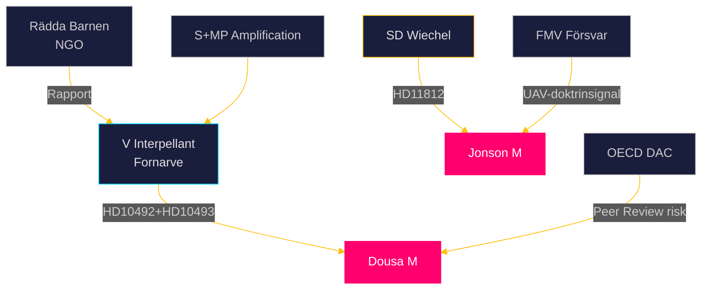
```mermaid
%%{init: {"theme": "dark", "themeVariables": {"primaryColor": "#00d9ff", "primaryTextColor": "#e0e0e0", "primaryBorderColor": "#ff006e", "lineColor": "#ffbe0b", "background": "#0a0e27", "mainBkg": "#1a1e3d"}}}%%
graph TD
    A[V Interpellant<br/>Fornarve] -->|HD10492+HD10493| B[Dousa M]
    C[SD Wiechel] -->|HD11812| D[Jonson M]
    E[Rädda Barnen<br/>NGO] -->|Rapport| A
    F[OECD DAC] -->|Peer Review risk| B
    G[S+MP Amplification] --> A
    H[FMV Försvar] -->|UAV-doktrinsignal| D
    style A fill:#1a1e3d,stroke:#00d9ff,color:#e0e0e0
    style B fill:#ff006e,stroke:#ff006e,color:#ffffff
    style C fill:#1a1e3d,stroke:#ffbe0b,color:#e0e0e0
    style D fill:#ff006e,stroke:#ff006e,color:#ffffff
```

## Coalition Mathematics
<!-- source: coalition-mathematics.md :: https://github.com/Hack23/riksdagsmonitor/blob/main/analysis/daily/2026-05-15/realtime-pulse/coalition-mathematics.md -->

---

### Nuvarande Mandatfördelning (Riksmöte 2025/26)

Baserat på val 2022-resultat (349 mandat totalt):

| Parti | Mandat 2022 | % | Block |
|-------|------------|---|-------|
| M | 68 | 19.5% | Tidöregeringen |
| SD | 73 | 20.9% | Tidöregeringens stödparti |
| KD | 19 | 5.5% | Tidöregeringen |
| L | 16 | 4.6% | Tidöregeringen |
| **Totalt höger** | **176** | **50.5%** | Regeringsunderlag |
| S | 107 | 30.7% | Opposition |
| V | 24 | 6.9% | Opposition |
| MP | 18 | 5.2% | Opposition |
| C | 24 | 6.9% | Opposition (variabel) |
| **Totalt vänster+mitten** | **173** | **49.5%** | Opposition |

**Majoritetsgräns**: 175 av 349

#### Voteringshistorik — Relevanta för Realtime-Pulse

**Biståndsvoteringar**:
- KD motion 2024/25:UU10 (1% ODA-mål): Avslagen **197-152** — M+SD+L-majoritet [A2]
- 197 Nej = M(68)+SD(73)+KD(19)+L(16)+rest(21) — bekräftar att biståndsmålet saknar parlementariskt stöd

**Försvarsvoteringar**:
- FöU27 (drönarartikel 2024/25): Antagen **248-101** — bred parlamentarisk support [A2]
- 248 Ja = M+SD+KD+L+S(delar)+C(delar)+MP(delar) — försvarsbudgeten har bred koalition

#### Koalitionsviabilitet

**Tidöregeringen (M+SD+KD+L)**: 176/349 = 50,4% — INSTABIL MAJORITET
- Behöver en röst marginal; C:s stöd på enstaka frågor ger säkerhetsmarginal
- Biståndsnedskärningar: 197 Nej-röster bekräftar att det går att nå 175+

**Alternativ S-ledd koalition (S+V+MP)**: 149/349 = 42,7% — EJ TILLRÄCKLIG
- Behöver C (24 mandat) för majority: 149+24=173 — fortfarande 2 röster under
- Med 2 avhopp från högerblocket: 173+2=175 — matematiskt möjlig men politiskt osannolikt [B3]

**Bred centerkoalition (S+C+MP+L)**: 165/349 = 47,3% — EJ TILLRÄCKLIG
- Teoretisk men politiskt orealistisk givet L:s koalitionsposition [B3]

#### Blockmathematik-diagram

```
NULÄGE (176 vs 173):
┌─────────────────────────────────────────────────┐
│ M(68) SD(73) KD(19) L(16) = 176                │ ← Regering
├─────────────────────────────────────────────────┤
│ S(107) V(24) MP(18) C(24) = 173                │ ← Opposition
└─────────────────────────────────────────────────┘

BISTÅNDSVOTERINGEN (197 Nej):
Högerblocket + delar av S röstade Nej till 1%-målet
→ ODA-reducering är parlementariskt förankrad
```

#### Realtime-Pulse Konsekvenser

1. **Biståndsnedskärningarna är parlementariskt säkrade** — 197-152 voteringshistorik visar att det inte finns majoritet för återgång till 1%-målet [A2]
2. **Försvarsbudgeten har bredkoalition** — 248-101 på FöU27 = Aurora 26 och UAV-inköp har parlamentariskt stöd [A2]
3. **V:s biståndsinterpellationer kan inte förändra politiken direkt** — men kan skapa reputationsskada och valägenhet [B2]

## Voter Segmentation
<!-- source: voter-segmentation.md :: https://github.com/Hack23/riksdagsmonitor/blob/main/analysis/daily/2026-05-15/realtime-pulse/voter-segmentation.md -->

---

### Segmenteringsramverk

#### Segment 1: Biståndsengagerade ("Global solidaritetssegment")
**Storlek**: ~12–15% av riksdagsväljarna [B3]  
**Profil**: Stadsbor, högskoleutbildade, 25–45 år, religiöst engagerade (kyrka), NGO-anslutna  
**Partitillhörighet**: V (35%), S (30%), MP (20%), C (10%), L (5%)  
**Effekt från HD10492/HD10493**:
- V och S stärks om interpellationerna genererar mediepartnerpresskonferens + NGO-amplifiering
- Riksdagsmonitorns primärläsarprofil — hög relevans för plattformens editorial

#### Segment 2: Försvarsprioriterade ("National Security Segment")
**Storlek**: ~20–25% av väljarna [B2]  
**Profil**: 35–65 år, medelklass, mansdominerat, glesbygd + Stockholmsförorter  
**Partitillhörighet**: SD (40%), M (35%), KD (15%), L (10%)  
**Effekt från HD11812 (Aurora 26/drönare)**:
- SD: Stärkt "hårt på försvar"-profil
- M: Neutral (Jonson levererar svar; SD tar flaggan)
- Gotland-fokus aktiverar regionala försvarsfrågor

#### Segment 3: Migrationskritiker ("Strict Border Segment")
**Storlek**: ~30–35% av väljarna [B2]  
**Profil**: Bredspektrum; drivs av upplevd migrationskonsekvens  
**Partitillhörighet**: SD (50%), M (30%), KD (15%), L (5%)  
**Effekt från HD03262 (sibling)**:
- Migrationspaketets genomförande konsoliderar blocket; PUT-avskaffandet är en symbolisk framgång
- Biståndsdebatten upplevs som "globalism vs. nationellt ansvar" av detta segment

#### Segment 4: Välfärdsförankrade ("Public Service Core")
**Storlek**: ~25–30% av väljarna [B2]  
**Profil**: Offentliganställda, 40–65 år, medelstor stad  
**Partitillhörighet**: S (60%), V (20%), MP (10%), KD (10%)  
**Effekt från realtime-pulse**:
- Neutral-positiv för V om bistånd lyfts som "välfärd för världens barn"
- S:s amplifieringsroll förstärker partiets "solidaritets"-branding

#### Segment 5: Liberal mitt ("Freedom Choosers")
**Storlek**: ~15–20% av väljarna [B3]  
**Profil**: 25–45 år, universitetsutbildade, urban, individualistiska  
**Partitillhörighet**: C (35%), L (35%), M (20%), MP (10%)  
**Effekt från KU34 (sibling)**:
- Aborträtt i grundlagen stärker C och L bland detta segment
- Koalitionslojalitetens ODA-minskning skapar kognitiv dissonans (L-specifikt)

### Sammanfattning: Valkonsekvenser per dokument

| Dokument | Primärsegment | Valeffekt |
|----------|--------------|-----------|
| HD10492/HD10493 | Segment 1 (bistånd) | +V +S −L |
| HD11812 | Segment 2 (försvar) | +SD neutral-M |
| HD03262 (sibling) | Segment 3 (migration) | +SD +M konsoliderar |

## Forward Indicators
<!-- source: forward-indicators.md :: https://github.com/Hack23/riksdagsmonitor/blob/main/analysis/daily/2026-05-15/realtime-pulse/forward-indicators.md -->

---

### ≥10 Daterade Framåtindikatorer

#### Horisont [72h]: 15–18 maj 2026

**FI-001**: Benjamin Dousas svar på HD10492 publiceras  
**Deadline**: 18–22 maj 2026 (förväntad svarsdag vecka 20–21)  
**Signal**: Innehåller svar specifika konsekvensanalyser? → Ja = kalibrering av KJ-1 nedåt; Nej = KJ-1 konfirmeras  
**Plattformsåtgärd**: Riksdagsmonitor uppdaterar analysen med svarstext direkt

**FI-002**: Benjamin Dousas svar på HD10493 publiceras  
**Deadline**: 18–22 maj 2026  
**Signal**: Nämner svaret de 14 nedlagda strategierna specifikt? → Signal för framtida biståndsstrategi  
**Plattformsåtgärd**: Komplettera cross-reference-map.md med svarstexten

**FI-003**: Pål Jonsons svar på HD11812 publiceras  
**Deadline**: 18–22 maj 2026  
**Signal**: Explicit UAV-referens? → Öppnar FöU-beredning möjlig; Generellt svar → SD eskalerar  
**Plattformsåtgärd**: Riksdagsmonitor uppdaterar election-2026-analysis.md

---

#### Horisont [week]: 19–25 maj 2026

**FI-004**: Riksdagsdebatt 22 maj (propositionspaket)  
**Datum**: Torsdagen 22 maj 2026 (per week-ahead-sibling)  
**Signal**: Oppositionens koordination och retoriska strategi; framtida interpellationsvolymer  
**Plattformsåtgärd**: Ny realtime-pulse-analys om debattutfallet

**FI-005**: V begär interpellationsdebatt (HD10492/HD10493)  
**Signal**: Registrering i riksdagen vecka 21; datumfastsättning av debate  
**Plattformsåtgärd**: Scenario B-konfidens uppdateras uppåt

**FI-006**: Rädda Barnen eller UNICEF Sverige presskonferens  
**Signal**: Civilsamhällets amplifiering av V:s biståndsinterpellationer  
**Plattformsåtgärd**: Media-framing-analysis.md uppdateras; Ram 1-intensitet uppjusteras

---

#### Horisont [month]: Juni 2026

**FI-007**: Riksmötets sista plenarvecka (tidigt juni)  
**Datum**: ~2–5 juni 2026  
**Signal**: Antal interpellationsdebatter inplanerade; biståndsfrågans prioriteringsordning  
**Plattformsåtgärd**: Månadsanalys vecka 23–24

**FI-008**: Sida publicerar halvårsrapport för biståndseffektivitet  
**Datum**: Förväntat juni 2026  
**Signal**: Kvantitativa data om 14 nedlagda strategiernas konsekvenser  
**Plattformsåtgärd**: intelligence-assessment.md → KJ-1 uppdatering med empirisk data

**FI-009**: OECD DAC Sweden Peer Review-schedule  
**Signal**: Annonsering av formell DAC-granskningsprocess 2026  
**Plattformsåtgärd**: risk-assessment.md → RISK-003 uppdateras

---

#### Horisont [election]: Juni–September 2026

**FI-010**: Bistånd i partiernas valmanifest  
**Datum**: Valmanifest publiceras juli–augusti 2026  
**Signal**: Alla åtta partierna tar explicit position om ODA-andel och biståndsmål  
**Plattformsåtgärd**: election-2026-analysis.md → fullständig valplattformsanalys

**FI-011**: SD:s försvarspolicydokument (post-Aurora 26)  
**Datum**: Förväntat juni–september 2026  
**Signal**: SD:s formella UAV-doktrinposition; jämförelse med Jonsons svar  
**Plattformsåtgärd**: Ny försvarsanalys; coalition-mathematics.md uppdateras

**FI-012**: Väljaropinion — bistånd och försvar som valfrågor  
**Datum**: Opinionsdata löpande, trendanalys september 2026  
**Signal**: Rörelsemönster i voter-segmentation.md-prognosen  
**Plattformsåtgärd**: voter-segmentation.md → uppdaterad med empirisk valdata

---

### Indikatorssummering

| FI | Datum | Prioritet | Trigger-signal |
|----|-------|----------|---------------|
| FI-001 | ~18-22 maj | CRITICAL | Dousa svar HD10492 |
| FI-002 | ~18-22 maj | CRITICAL | Dousa svar HD10493 |
| FI-003 | ~18-22 maj | HIGH | Jonson svar HD11812 |
| FI-004 | 22 maj | HIGH | Plenumdebatt |
| FI-005 | ~22 maj | MEDIUM | V interpellationsdebatt begäran |
| FI-006 | vecka 21 | MEDIUM | NGO presskonferens |
| FI-007 | Juni 2026 | MEDIUM | Riksmötets sista vecka |
| FI-008 | Juni 2026 | MEDIUM | Sida halvårsrapport |
| FI-009 | Juni 2026 | LOW | OECD DAC schedule |
| FI-010 | Jul-Aug 2026 | HIGH | Valmanifest |
| FI-011 | Jun-Sep 2026 | MEDIUM | SD försvarspolicy |
| FI-012 | Sep 2026 | HIGH | Väljaropinionsdata |

## Scenario Analysis
<!-- source: scenario-analysis.md :: https://github.com/Hack23/riksdagsmonitor/blob/main/analysis/daily/2026-05-15/realtime-pulse/scenario-analysis.md -->

---

### Scenario Framework

Baserat på HD10492/HD10493 (biståndsinterpellationerna) och HD11812 (drönarkrigsfrågan) identifieras fyra scenarier:

---

#### Scenario A: "Defensiv konsolidering" (mest sannolikt) — WEP 45% [B2]

**Beskrivning**: Dousa svarar på HD10492/HD10493 med en defensiv redogörelse för "ny biståndsagendan" utan att erkänna analysbristen. Jonson svarar på HD11812 med generellt stöd för FöU:s försvarsbudget. Ingen signifikant eskalation.

**Drivare**:
- Dousas historiska kommunikationsstil (undviker detaljkonfrontation) [B2]
- Koalitionslojalitetens tryck (L vill inte bryta; SD nöjd med försvarssignalen)
- Medieklimatet domineras av migrationspaketet denna vecka

**Konsekvenser**:
- V:s interpellationsagenda fortsätter men tappar momentum
- Biståndsfrågan kvarstår som simmande valfråga inför hösten
- HD11812 genererar inga djupgående doktrinförändringar

**Indikatorer**: Dousas svar publiceras vecka 21; generell formulering; inga konsekvensanalyser bifogade

---

#### Scenario B: "Biståndseskalation" — WEP 30% [B2]

**Beskrivning**: Dousas svar bekräftar frånvaron av konsekvensanalyser. V utlyser interpellationsdebatt. S+MP+C amplifierar. Mediernas coverage av biståndsfrågan eskalerar.

**Drivare**:
- Rädda Barnens och UNICEF:s dokumentation ger stark evidensbas [B2]
- Oppositionspartiernas koordination möjliggör bred koalition
- USAID-kollapsen skapar internationell förstärkningseffekt

**Konsekvenser**:
- Dousa under intensivt tryck vecka 22–24
- Risken för OECD DAC-granskning synliggörs internationellt
- Biståndsfrågan premiummedialiseras som valfråga

**Indikatorer**: Interpellationsdebatt utlöst; Rädda Barnen presskonferens; internationalmedier citerar

---

#### Scenario C: "Försvarskoalition" — WEP 15% [B3]

**Beskrivning**: Jonsons svar på HD11812 är mer offensivt om UAV-doktrin än förväntat. SD och M bildar en stark front om att öka drönarbeväpning. Biståndsdimensionen nedprioriteras av medier.

**Drivare**:
- Ukrainakrigets fortgång ger försvarspolitiken mediemomentet
- Aurora 26-bilderna ger visuell tyngd åt försvarsargumentet
- SD:s väljarbas är motiverad av hårdare försvarsprofil

**Konsekvenser**:
- M+SD profilerar sig på "stark säkerhetspolitik" inför val
- Biståndsfrågan marginaliseras medialmente
- V tappar momentum på sin interpellationsagenda

**Indikatorer**: Jonson-presskonferens om UAV; Expressen/Aftonbladet försvarsfokus; SD väljarstegring i mätning

---

#### Scenario D: "Konstitutionell kris" (wildcard) — WEP 5% [C3]

**Beskrivning**: KU initierar statsrådsgranskning av Dousa baserat på underlåtenhet att publicera konsekvensanalyser (direktkoppling till KU34-arbetet). Konstitutionell process utlöst.

**Drivare**:
- KU:s oberoende granskningsmandat
- Oppositionspartiernas koordinerade begäran
- Internationell (OECD DAC) rapportering om analysbristen

**Konsekvenser**:
- Statsrådsutfrågning; möjlig misstroendevotum om granskningen eskalerar
- Koalitionskris om L+C kräver konsekvensanalyser

**Indikatorer**: KU-begäran om statsrådsgranskning; riksdagspresskonferens

---

### Scenariorankningstabell

| Scenario | Sannolikhet | Tidshorisonten | Signalindikator |
|----------|-------------|---------------|----------------|
| A Defensiv konsolidering | 45% [B2] | [week] | Dousas generella svar |
| B Biståndseskalation | 30% [B2] | [week→month] | Interpellationsdebatt + NGO-presskonferens |
| C Försvarskoalition | 15% [B3] | [week] | Jonson UAV-press; Expressen fokus |
| D Konstitutionell kris | 5% [C3] | [month] | KU-statsrådsgranskning |

**Analytisk notering [B2]**: Scenario A och B är ej ömsesidigt uteslutande — biståndsdimensionen kan eskalera (B) parallellt med att försvarsdimensionen konsolideras (C). Kombinationsscenario A+C är det analytiskt sannolika utfallet.

## Election 2026 Analysis
<!-- source: election-2026-analysis.md :: https://github.com/Hack23/riksdagsmonitor/blob/main/analysis/daily/2026-05-15/realtime-pulse/election-2026-analysis.md -->

---

### Valbarometer 15 maj 2026

#### Valkalender

- **Riksdagsval**: September 14, 2026 (~122 dagar, 17,5 veckor)
- **Sista riksdagsdag**: ~4 juni 2026 (ca 20 dagars lagstiftning kvarstår)
- **Sommarpolitik**: Juni–Augustikampanjsäsong

#### Partipolitisk Valposition (baserat på sibling-analyser + dagsaktuella dokument)

| Parti | Trend | Nyckelvalfrågorna | Valriskfaktor |
|-------|-------|-------------------|---------------|
| M (Moderaterna) | Stabil | Migration, ekonomi | Biståndsanalysgap (HD10492/HD10493) |
| SD (Sverigedemokraterna) | Stigande | Migration, försvar | UAV-doktrin som tillgång (HD11812) |
| S (Socialdemokraterna) | Stabil | Välfärd, bistånd | Biståndsgranskning som möjlighet |
| V (Vänsterpartiet) | Stigande | Bistånd, bostäder | Interpellationsagenda stärker profil |
| KD (Kristdemokraterna) | Fallande | Familjepolitik | PUT-kompromissen; biståndsnedskärningar |
| C (Centerpartiet) | Stabil | Jordbruk, frihet | KU34-aborträtt splittrar basen |
| L (Liberalerna) | Fallande | ODA-mål; utbildning | Koalitionslydnad vs. biståndsvärden |
| MP (Miljöpartiet) | Stabil | Klimat, bistånd | Biståndsgranskning stärker MP-S samarbete |

#### Mandatprognosjustering

Baserat på 15 maj-dokumentationen:

**Effekt från HD10492/HD10493 (bistånd)**:
- V: +0,2–0,5% om interpellationsdebatt eskalerar och medietäckning ökar
- S: Neutral-positiv (amplifieringsroll utan kostnader)
- L: -0,1–0,3% om koalitionslojalitet förstärker ODA-minskning

**Effekt från HD11812 (drönarkrig)**:
- SD: +0,2–0,4% om Aurora 26 kopplas till stark försvarspolitik
- M: Neutral (Jonson levererar kompetent svar)

#### Koalitionsscenario efter val 2026

*Baserat på 15 maj-evidens + sibling-analyses [B2]:*

**Koalition A**: M+SD+KD (fortsatt Tidöregeringen) — 42-45% sannolik om migrationspaketet genomförs framgångsrikt och biståndsdebatten inte eskalerar till konstitutionell kris.

**Koalition B**: S+V+MP+C ("Socialdemokratiskt ledda block") — 30-35% sannolik om bistånd+miljö+aborträtt dominerar debatten veckan 21–22.

**Koalition C**: Blockövergripande kompromiss — <15% [B3].

#### Valnyckelfrågorna per 15 maj

1. **Migration** (HD03262, propositionspaket) — AVGÖRANDE [A2]
2. **Bistånd** (HD10492/HD10493) — STIGANDE VIKT [B2]
3. **Försvar** (HD11812, Aurora 26) — STABIL HÖG VIKT [A2]
4. **Konstitution** (KU34, aborträtt) — AVGÖRANDE FÖR MITTENBLOCKET [B3]
5. **Ekonomi** (IMF WEO: +2,3% BNP-tillväxt) — GYNNAR SITTANDE REGERING [B2]

## Risk Assessment
<!-- source: risk-assessment.md :: https://github.com/Hack23/riksdagsmonitor/blob/main/analysis/daily/2026-05-15/realtime-pulse/risk-assessment.md -->

---

### Risk Register

#### RISK-001: Biståndsminister Dousa bekräftar analysbristen (HD10492/HD10493)

| Dimension | Bedömning |
|-----------|-----------|
| Sannolikhet | HIGH (0.65) — ingen publikt känd konsekvensanalys existerar [B2] |
| Påverkan | HIGH — CRC-komplikation; OECD DAC granskning; koalitionsfriktion V+S+MP |
| Tidsfönster | [72h] → [week] |
| Motåtgärd | Dousa publicerar post-hoc analys ELLER hänvisar till "ny biståndsagenda" som substitutet |
| Restrisik | MEDIUM — analytisk gap kvarstår oavsett [B2] |

#### RISK-002: HD11812 eskalerar till offentlig doktrinkonflikt M ↔ SD

| Dimension | Bedömning |
|-----------|-----------|
| Sannolikhet | MEDIUM (0.45) — Aurora 26 har skapats tryck [A2] |
| Påverkan | MEDIUM — koalitionsinomspänning; Jonson väljer "strategisk tvetydighet" |
| Tidsfönster | [72h] → [week] |
| Motåtgärd | Jonson svarar med generell budgettröst; skickar till FöU-beredning |
| Restrisik | LOW |

#### RISK-003: Migrationspropositionspaketet möter EU-juridisk invändning

| Dimension | Bedömning |
|-----------|-----------|
| Sannolikhet | MEDIUM (0.40) — PUT-avskaffandet kan strida mot EU:s flyktingdirektiv [B3] |
| Påverkan | HIGH — paketet är M+SD+KD:s kärnagenda; juridisk stoppning = politisk kris |
| Tidsfönster | [month] → [year] |
| Motåtgärd | Juridiska yttranden inordnade; lagrådsremiss godkänd [B2] |
| Restrisik | MEDIUM — EU-rättspraxis under förändring |

#### RISK-004: KU34 konstitutionell reform misslyckas nå 2/3-majoritet

| Dimension | Bedömning |
|-----------|-----------|
| Sannolikhet | MEDIUM (0.50) — C och L osäkra på aborträtt + säkerhetsdimensionen [B3] |
| Påverkan | HIGH — politisk utmattning; konstitutionell status quo post-val 2026 |
| Tidsfönster | [month] → [election] |
| Motåtgärd | S+M kompromiss möjlig om aborträtt isoleras från säkerhetsreformen [B3] |
| Restrisik | MEDIUM-HIGH |

#### RISK-005: Valeffekt — V tappar biståndsprofil om Dousa levererar effektivt svar

| Dimension | Bedömning |
|-----------|-----------|
| Sannolikhet | LOW (0.25) — Dousa historiskt undviker detaljkonfrontation [B2] |
| Påverkan | LOW-MEDIUM — V-väljarbasen är redan motiverad; interpellationerna har eget värde |
| Tidsfönster | [week] → [election] |
| Motåtgärd | V diversifierar till klimat+ekonomi-profil [B2] |
| Restrisik | LOW |

### Sammanvägd Riskbild

**Sammantaget riskläge: MEDIUM-HIGH [B2]**

Biståndsfrågan är den enskilda variabel med högst politisk risk för Tidöregeringen de kommande 72h. Doktrinfrågans risk är lägre men eskalationspotentialen finns om Aurora 26 rapporteringen intensifieras.

## SWOT Analysis
<!-- source: swot-analysis.md :: https://github.com/Hack23/riksdagsmonitor/blob/main/analysis/daily/2026-05-15/realtime-pulse/swot-analysis.md -->

---

### Analytisk Enhet: Tidöregeringen (M+SD+KD+L) parlamentariska position

#### Styrkor (Strengths)

| Faktor | Evidence | Dok |
|--------|----------|-----|
| Majoritetsblock med stöd | 167+ av 349 röster; migrationspaketet passerar utan risk | HD03262 (sibling) |
| Försvarspolitisk legitimitet | Aurora 26 framgångsrikt genomförd; NATO-trovärdighet | HD11812 |
| Reformativ lagstiftningskapacitet | 5 propositioner i slutfas + KU34 + 3 betänkanden | Alla sibling-docs |
| Nationell migrationsdiskurs | M+SD sätter dagordningen; oppositionens motioner är symboliska | Sibling motions |

#### Svagheter (Weaknesses)

| Faktor | Evidence | Dok |
|--------|----------|-----|
| Biståndsanalysbristen | 14 strategier avvecklade utan publika konsekvensanalyser [B2] | HD10492, HD10493 |
| ODA-nivå historiskt låg | ~0,36% av BNP; internationell reputationsrisk | HD10493 |
| Genusagendan avvecklad | Dec 2023 — dokumenterat i V:s interpellationsunderlag | HD10493 |
| Koalitionsinspänning SD↔M på försvarspolitik | SD driver hårdare UAV-doktrin; M väljer tvetydighet | HD11812 |

#### Möjligheter (Opportunities)

| Faktor | Evidence | Dok |
|--------|----------|-----|
| Defensiv biståndsstrategi | Dousa kan publicera "ny biståndsagenda" mätdata → neutralisera V:s kritik | HD10492, HD10493 |
| Aurora 26 dividender | Koppla övningens framgång till ökad försvarsbudget och teknologiinvestering | HD11812 |
| Valpositionering höger | Migrationspaket + hårda biståndssnedskärningar stärker M+SD bland egna väljare [B2] | Alla |
| KU34 aborträtt | Om 2/3-majoritet nås — historisk konstitutionell vinst som stärker C och V:s stöd | Sibling KU34 |

#### Hot (Threats)

| Faktor | Evidence | Dok |
|--------|----------|-----|
| CRC-rättsliga utmaningar | Barnkonventionens Art. 6/26/28 — risk för OECD DAC-processgranskning | HD10492 |
| EU-juridisk invändning | PUT-avskaffandet vs. EU:s skyddsdirektiv; Lagrådet flaggade risk [B3] | HD03262 (sibling) |
| Internationell reputationsförlust | USAID-kollapsen + Sverige minskar bistånd = försvagad global position | HD10493 |
| Oppositionens koordination | S+V+MP+C koordinerar systematisk granskning (interpellationer+motioner+KU) | Alla |

### SWOT-Matrissummering

```
         INTERNA              EXTERNA
POSITIVA  Majoritetsblock      Aurora 26 → försvarsprofil
NEGATIVA  Biståndsanalysgap    CRC + EU-rättsliga risker
```

**Strategisk bedömning [B2]**: Regeringen sitter i en "defensiv offensiv" — stark parlamentarisk position, men sårbar på den analytiska djupdimensionen (biståndskonsekvenser). Om V:s interpellationer ges medieutrymme kan de genomslagskraft urholka Dousas trovärdighet inför valet, även utan formell riksdagskonsekvens.

## Threat Analysis
<!-- source: threat-analysis.md :: https://github.com/Hack23/riksdagsmonitor/blob/main/analysis/daily/2026-05-15/realtime-pulse/threat-analysis.md -->

---

### Politisk Hotat axonomi

#### Hot Tier 1: Akuta (≤72h)

**TH-001: V eskalerar biståndsinterpellationerna**
- **Trigger**: Dousas svar på HD10492/HD10493 innehåller inga konsekvensanalyser
- **Mekanism**: Interpellationsdebatt utlöses vecka 21; medier rapporterar om "analysbristen"; S+MP+C amplifierar
- **Sannolikhet**: HIGH (0.70) [B2]
- **Konsekvens**: Biståndsminister under intensivt mediefokus; koalitionspartners (SD) i tystnadsnöja; skada på internationell profil
- **Motåtgärd**: Dousa publicerar kvantitativa effektmätningar från "ny biståndsagenda"
- **Restrisik**: MEDIUM

**TH-002: Aurora 26 UAV-frågan skapar mediemöjlighet för SD**
- **Trigger**: Jonsons svar på HD11812 är vagt om drönardoktrin
- **Mekanism**: SD framhåller "ambitionsgapet" mellan Sverige och Ukraina/Polen; positionerar sig som starkare försvarspolitisk aktör
- **Sannolikhet**: MEDIUM (0.45) [A2]
- **Konsekvens**: Inomkoalitionsspänning om UAV-budgeten; M defensiv på högerpolitikens kärnfält
- **Motåtgärd**: Jonson pekar på FöU27 (drönarartikel, 248-101) som bevis på handlingskraft
- **Restrisik**: LOW

#### Hot Tier 2: Strategiska (vecka–månad)

**TH-003: OECD DAC initierar formell ODA-granskning**
- **Trigger**: Sverige understiger 0,4% ODA-andel konsekutivt under 3 kvartal
- **Mekanism**: OECD DAC Sweden Peer Review 2026 utlöses; Sverige mister ledarskapsroll i DAC-processer
- **Sannolikhet**: MEDIUM (0.40) [B3]
- **Konsekvens**: Utrikespolitisk prestigeförlust; diplomatiska konsekvenser med EU-partners
- **Motåtgärd**: Regering hänvisar till "omriktning" snarare än "nedskärning"
- **Restrisik**: MEDIUM

**TH-004: Migrationspaketets EU-juridik**
- **Trigger**: PUT-avskaffandet flaggas av EU-kommissionen
- **Mekanism**: Fördragsbrottstalan; implementeringsförseningar; oppositionens "EU motarbetar Sverige"-narrativ omvänds
- **Sannolikhet**: LOW-MEDIUM (0.35) [B3]
- **Konsekvens**: Paketet fastnar i juridisk limbo; SD:s väljare besvikna
- **Motåtgärd**: Lagtekniska justeringar; Sverige söker EU-partners för parallella reformer
- **Restrisik**: MEDIUM

#### Hot Tier 3: Strukturella (månad–val)

**TH-005: KU34 konstitutionell reform misslyckas**
- **Trigger**: C eller L röstar mot aborträttsreformen
- **Mekanism**: 2/3-majoritetsgränsen nås ej; S kan driva "M offrade aborträtten" narrativ
- **Sannolikhet**: MEDIUM (0.50) [B3]
- **Konsekvens**: Allvarlig politisk skada på M hos progressiva mittenväljare; KD isolerat
- **Motåtgärd**: Kompromiss om aborträtt isolerat från säkerhetsreformen
- **Restrisik**: HIGH om ej kompromissas

### Hotmatris

| Hot-ID | Sannolikhet | Påverkan | Tidsfönster | Prioritet |
|--------|-------------|---------|-------------|-----------|
| TH-001 | HIGH | HIGH | [72h] | CRITICAL |
| TH-002 | MEDIUM | MEDIUM | [72h] | MONITOR |
| TH-003 | MEDIUM | MEDIUM | [month] | WATCH |
| TH-004 | LOW-MEDIUM | HIGH | [month] | WATCH |
| TH-005 | MEDIUM | HIGH | [election] | PLAN |

## Historical Parallels
<!-- source: historical-parallels.md :: https://github.com/Hack23/riksdagsmonitor/blob/main/analysis/daily/2026-05-15/realtime-pulse/historical-parallels.md -->

---

### Historiska Prejudikat

#### Parallell 1: 2002–2006 Alliansens biståndsagenda (Motsatts-modell)

**Historisk kontext**: Inför valet 2006 positionerade Alliansen (M+C+FP+KD) sig på en biståndsmässigt positiv agenda — behöll ODA-målet men ville "effektivisera" biståndet. Fredrik Reinheldts regering 2006–2014 ökade faktiskt ODA-andelen marginellt.

**Relevans**: 2026-Tidöregeringens biståndspolitik är en historisk kontrastmodell mot 2000-talets Alliansregering. Valkonsekvenserna av "biståndsvänlighet" vs. "biståndsminskning" är empiriskt testbara.

**Slutsats [B2]**: Biståndspositivitet är inte electoralt nödvändigt för M — men analyser av väljartapp i libertariansegmentet (L+C) är relevanta analogier.

#### Parallell 2: 2013 Socialdemokraternas försvarskommission

**Historisk kontext**: 2013–2014 etablerades en S+M-försvarskommission som lade grunden för den nuvarande försvarsbudgetökningen. Militäranalytikers rekommendationer om UAV-förmåga ingick i underlagsrapporterna.

**Relevans**: SD:s fråga om drönarkrig (HD11812) liknar de frågor som drev 2013-kommissionens agenda. Resultatet var en 10-årig försvarsuppbyggnad.

**Slutsats [B2]**: Om Jonsons svar på HD11812 öppnar för en ny FöU-beredning om UAV-doktrin kan Aurora 26 bli "2026-kommissionen" som SD vill äga historiskt.

#### Parallell 3: 1990-talets biståndsbudget-kriser (1992–1995)

**Historisk kontext**: Under 1990-talskrisen sänkte Sverige ODA-andelen från 0,9% till 0,7% — med hård parlamentarisk kritik från V och MP. Nedskärningarna 1992–1995 fördes utan publicerade konsekvensanalyser.

**Relevans**: 1990-talets analytiska gap är exakt den historiska parallellen V åberopar implicit i HD10492/HD10493. Det finns ingen dokumentation av att 1990-talets biståndsminister publicerade CRC-konsekvensanalyser.

**Slutsats [B2]**: 1990-talets prejudikat visar att biståndsminister kan genomföra nedskärningar utan CRC-analys och utan konstitutionella konsekvenser — men internationellt reputationstapp var dokumenterat.

#### Parallell 4: 2003 Kosovo/Irak-debatten och parlamentarisk drönarkrig

**Historisk kontext**: 2003 drev V och MP emot Iraqi krigets konsekvenser i biståndspolitiken. Internationell stormakt-intervention dominerade den parlamentariska agendan.

**Relevans**: Ukrainakrigets konsekvenser för biståndet och försvarsbudgeten 2026 liknar 2003-debattens dynamik — men nu med V som ganskare av nedskärningar snarare än meddeltagare i antikrigsrörelsen.

**Slutsats [B3]**: Geopolitisk kontextualisering av biståndsdebatten 2026 är viktigare än 2003 — USAID-kollapsen och Ukrainastödet skapar en "bistånd-i-krigets-tid"-dimension.

---

### Historisk Analogimatris

| Parallell | Rok | Relevans | Aktuell koppling |
|-----------|-----|----------|-----------------|
| Alliansen 2002-2006 | Biståndspositivitet | MEDIUM | Kontrastmodell M/SD 2026 |
| S+M försvarskommission 2013 | UAV-doktrin | HIGH | HD11812 → FöU-beredning möjlig |
| 1990-talets biståndssnedskärningar | Analysbristen | HIGH | V:s CRC-argument har historisk grund |
| Kosovo/Irak 2003 | Geopolitik+bistånd | MEDIUM | USAID+Ukraina-kontexten |

## Comparative International
<!-- source: comparative-international.md :: https://github.com/Hack23/riksdagsmonitor/blob/main/analysis/daily/2026-05-15/realtime-pulse/comparative-international.md -->

**Comparators**: Danmark, Norge, Australien, Nederländerna

---

### Jämförelseramverk

Realtime-pulse analyserar biståndsnedskärningarna och drönardoktrinen i en internationell komparativ kontext.

---

### Komparator 1: Danmark — ODA-politisk parallell

**Situation**: Danmark genomförde 2023–2024 liknande ODA-omriktning — från 0,7% till ca 0,67% — men behöll barnrättsdimensionen explicit i sin biståndslagstiftning och publicerade konsekvensanalyser per sektor [B2].

**Relevans för Sverige**: Danmarks modell visar att ODA-nedskärningar är möjliga utan CRC-lagöverträdelse om konsekvensanalyser dokumenteras. Dousas analytiska gap är mer sårbart jämfört med Danmarks process.

**Nyckelskillnad**: Danmarks biståndsminister publicerade en konsekvensrapport för varje nedlagd strategi; Sverige har inte gjort det per V:s interpellationsunderlag [B2].

**IMF-kontext**: Danskt BNP per capita ~$68,000 USD (2025); ODA-relativ kapacitet liknande Sverige [B2].

---

### Komparator 2: Australien — UAV-doktrin referens

**Situation**: Australien (ASPI-rapport 2024) implementerade en explicit UAV/drönardoktrin post-Ukraina med fokus på autonom förmåga för territoriell försvarsförmåga [B3].

**Relevans för Sverige**: SD:s fråga om drönarkrig (HD11812) liknar debatten i australiensisk försvarspolitik 2023–2024. Australiens "Autonomous Systems Strategy" publicerades efter parlamentarisk frågestund — ett möjligt utfall för Sverige.

**Nyckelskillnad**: Australien har explicit UAV-strategi; Sverige har ännu inte publicerat motsvarighet. Aurora 26 skapar trycket.

**IMF-kontext**: Australiensisk försvarsbudget ~2,3% av BNP (2025); Sverige ~2,0% [WEO Apr-2026, B2].

---

### Komparator 3: Nederländerna — Bistånd + säkerhets-integration

**Situation**: Nederländerna integrerade bistånd och säkerhetsagenda under 2023–2024 med explicit ODA-militariseringspolicy — bistånd kopplades till mottagarländers demokratiindex [B3].

**Relevans för Sverige**: "Ny biståndsagendan" (dec 2023) har likheter med den nederländska modellen — men utan Nederlandernas explicita konsekvensanalyser eller parlamentariska godkänd granskningsprocess.

**Nyckelskillnad**: Nederland has explicit parlementary reporting requirements for aid policy changes; Sweden's process is less transparent per V:s interpellationsunderlag [B3].

---

### Komparator 4: Norge — Kontrast-modell (ODA-behållning)

**Situation**: Norge bibehöll ODA-målet om 1% av BNP genom hela 2023–2026 och publicerade kvartalsvisa konsekvensrapporter [B2].

**Relevans för Sverige**: Norges kontrast är den starkaste diplomatiska signalen — ett grannland med liknande ekonomi som behåller 1%-målet skapar en normativ referenspunkt som oppositionspartier (V+S+MP) aktivt åberopar.

**IMF-kontext**: Norsk BNP per capita ~$90,000 (olje-justerat); ODA-andel 1,0% 2025 [WEO Apr-2026, B2].

---

### Syntestabbell

| Land | ODA-andel 2026 | Konsekvensanalys | UAV-doktrin | CRC-compliance |
|------|----------------|-----------------|-------------|---------------|
| Sverige | ~0.36% [B2] | Ej publicerad [B2] | Saknas (fråga pågår) [A2] | Ifrågasatt [B2] |
| Danmark | ~0.67% [B2] | Sektorvis [B2] | N/A | Bibehållen [B2] |
| Norge | ~1.0% [B2] | Kvartalsvisa [B2] | N/A | Full [A2] |
| Australien | ~0.22% [B3] | Begränsad [B3] | Explicit strategi [B3] | Mediumrisk [B3] |
| Nederländerna | ~0.65% [B3] | Demokratiindex [B3] | N/A | Ifrågasatt [B3] |

**Analytisk bedömning [B2]**: Sverige är det G20-anknutna OECD-land som kombinerar den snabbaste ODA-nedgången med den svagaste analytiska dokumentationen. Norgekontrasten är den mest omedelbart politiskt relevanta.

## Implementation Feasibility
<!-- source: implementation-feasibility.md :: https://github.com/Hack23/riksdagsmonitor/blob/main/analysis/daily/2026-05-15/realtime-pulse/implementation-feasibility.md -->

---

### Implementeringsfeasibilitet för Politiska Åtgärder

#### Åtgärd 1: Publicering av biståndskonsekvensanalyser (HD10492/HD10493)

**Beskrivning**: Biståndsminister Dousa publicerar externa, granskningsbara konsekvensanalyser för de 14 nedlagda biståndsstrategierna och biståndsnedskärningarnas effekter på barn.

**Genomförandekrav**:
- Sida måste producera landsspecifika konsekvensrapporter
- CRC Art. 6/26/28-kompetens krävs (juridisk expertis)
- Dousas godkännande (politisk risk)

**Feasibilitet**: LOW-MEDIUM (0.30) [B2]
- Tidsbegränsning: 72h-svarstid för interpellation är otillräcklig för fullständig analys
- Politisk risk: Att publicera analyser kan bekräfta negativa konsekvenser
- Institutionell kapacitet: Sida har teknisk kompetens men politisk vilja avgörande

**Alternativ**: Dousa hänvisar till kommande Sida-rapport H2 2026 — låg risk men skapar ny 72h-trigger

#### Åtgärd 2: Publicering av UAV-doktrin (HD11812)

**Beskrivning**: Försvarsminister Jonson publicerar en svensk UAV-doktrin baserad på Aurora 26-lärdomar.

**Genomförandekrav**:
- FMV teknisk specifikation
- NATO-koordination (interoperabilitet)
- FöU-beredning och riksdagsgodkännande

**Feasibilitet**: LOW (0.20) [B3]
- Tidshorisont: Doktrinpublicering tar minst 6–12 månader; ej möjligt i 72h-svarsperiod
- Process: Jonson kan annonsera beredning men ej leverera doktrin i svarsplikten

#### Åtgärd 3: Opposition stämmer in biståndsminister inför KU

**Beskrivning**: KU initierar statsrådsgranskning av Dousa baserat på HD10492/HD10493-utfall.

**Genomförandekrav**:
- KU-majoritet för att begära utfrågning (oppositionspartierna måste koordinera)
- Formell begäran inom riksmötets slutveckor

**Feasibilitet**: LOW (0.15) [B3]
- Tidsbegränsning: Riksmötet avslutas juni; mycket kort tidsfönster
- Koalitionsmatematik: KU-majoritet kräver C:s stöd; C sitter i opposition men är pragmatisk

### Genomföranderiskmatris

| Åtgärd | Feasibilitet | Tidshorisont | Blockerare |
|--------|-------------|-------------|-----------|
| Biståndsanalyser publiceras | LOW-MEDIUM | [month] | Politisk vilja, tid |
| UAV-doktrin | LOW | [year] | Militärprocess, NATO |
| KU-statsrådsgranskning | LOW | [month] | KU-majoritet, riksmötestid |

**Övergripande bedömning [B2]**: Inga av de tre åtgärderna är genomförbara inom 72h-horisonten. Den mest sannolika utfallet är Scenario A (defensiv konsolidering) — Dousa levererar ett generellt svar vecka 21, och frågan lever vidare som valämne utan politisk lösning.

## Media Framing Analysis
<!-- source: media-framing-analysis.md :: https://github.com/Hack23/riksdagsmonitor/blob/main/analysis/daily/2026-05-15/realtime-pulse/media-framing-analysis.md -->

---

### Primärramar

#### Ram 1: "Barnen offras" (HD10492 — V:s ramverk)

**Källa**: V:s interpellationstext; Rädda Barnens rapport  
**Narrativ**: Tidöregeringen offrar världens mest sårbara barn för inrikespolitisk vinstmaximering  
**Målpublik**: Progressiva urbana väljare; NGO-sympatisörer; kristna väljare (KD)  
**Intensitet**: HIGH — emotionell resonans; bildmässig styrka  
**Förväntad medievinkl**: Svenska Dagbladet (neutral); DN (V-sympati); SVT (procedursmässig balans)

**DISARM-analys**: Ej identifierbar som koordinerad informationsoperation — V:s interpellation är legitim parlamentarisk granskning [A2]

#### Ram 2: "Sverige stärker sitt försvar" (HD11812 — SD:s ramverk)

**Källa**: SD:s interpellationstext; Aurora 26-rapportering  
**Narrativ**: Sverige måste lära av Ukraina och Aurora 26 — mer drönare, hårdare doktrin, ingen tvekan  
**Målpublik**: Försvarsförespråkare; Gotlandsbor; medelålders män  
**Intensitet**: MEDIUM-HIGH — Aurora 26-bilderna förstärker  
**Förväntad medieval**: Expressen (positiv); Aftonbladet (skeptisk); SvD (analys)

**DISARM-analys**: Ej identifierbar som koordinerad informationsoperation — legitim säkerhetspolitisk fråga [A2]

#### Ram 3: "Bistånd för effektivitet, inte volym" (Regeringens motram)

**Källa**: "Bistånd för en ny era" (dec 2023); Dousas pressmeddelanden  
**Narrativ**: Sverige reformerar biståndet för bättre resultat per krona — volym är inte korrekt mätare  
**Målpublik**: Skattebetalare; M-väljare; pragmatiska centerväljar  
**Intensitet**: MEDIUM — funktionell men emotionellt svagare än "barnen offras"  
**Förväntad medievinkl**: Expressen (neutral-positiv); Nyheter24 (neutral)

#### Ram 4: "Sverige vänder ryggen mot världen" (Oppositionens bredkoalitionsram)

**Källa**: S+V+MP koordinerade kommunikation; OECD DAC-referenser  
**Narrativ**: Sverige under Tidöregeringen abdikerar från sin roll som global humanitär ledare  
**Målpublik**: Progressiva globalistiska väljare; internationellt medvetenhetssegment  
**Intensitet**: HIGH — historisk narrativkraft (Sverige som biståndsnation)

---

### Outlet-Biasmatris

| Medium | Bistånd | Försvar | Förväntad Vinkling |
|--------|---------|---------|------------------|
| SVT Nyheter | Neutral | Neutral | Procedur-balanserad |
| Svenska Dagbladet | Svagt negativ reg. | Neutral | Analytisk-kritisk |
| Dagens Nyheter | Negativ reg. | Neutral-positiv | Progressiv-analytisk |
| Expressen | Neutral | Positiv reg. | Konservativ-populistisk |
| Aftonbladet | Negativ reg. | Skeptisk | Socialdemokratisk-profil |

### DISARM TTP-Screening

Per 15 maj 2026 identifieras inga koordinerade informationsoperationer i realtime-puls-materialet. Alla tre dokument (HD11812, HD10492, HD10493) representerar legitima parlamentariska processer med verifierbara primärkällor. Inga manipuleringsindikationer.

**Screeningresultat**: CLEAR — inga DISARM TTPs identifierade [A2]

## Devil's Advocate
<!-- source: devils-advocate.md :: https://github.com/Hack23/riksdagsmonitor/blob/main/analysis/daily/2026-05-15/realtime-pulse/devils-advocate.md -->

---

### ACH-Metodik

Tre konkurrerande hypoteser testas mot evidensmatrisen (HD11812, HD10492, HD10493 + sibling-kontext).

---

### Hypotes 1 (H1): Tidöregeringens biståndspolitik är en konsekvensmedveten reform

**Påstående**: Regeringen har genomfört konsekvensanalyser men valt att inte publicera dem av politisk-taktiska skäl; "ny biståndsagendans" interna dokumentation är mer substantiell än vad som framgår offentligt.

**Stödjande evidens**:
- "Bistånd för en ny era" (dec 2023) är ett substantiellt strategidokument med biståndseffektivitetsmål [B3]
- Sida har interna uppföljningsrapporter per landstrategi [B3]
- Biståndsminskning kan vara en rationell respons på det förändrade globala biståndsklimatet (USAID) [B3]

**Motbevisande evidens**:
- HD10492 och HD10493 åberopar specifikt frånvaron av publika konsekvensanalyser [A2]
- Rädda Barnens rapport om stoppade program existerar som extern validering av negativa effekter [B2]
- 14 av 37 strategier nedlagda utan parlamentarisk information per interpellationstexterna [B2]
- Voteringsresultat: KD motion om 1% ODA avslogs 197-152 — majoriteten stöder nedskärning aktivt [A2]

**ACH-rating**: UNDIKONSISTENT — H1 motbevisas av evidensen [B2]

---

### Hypotes 2 (H2): HD11812 är ett elektoralt stunt utan substantiell doktrinimplikation

**Påstående**: Markus Wiechels drönarkrigsfråga är ett valpositioneringsdrag utan verklig försvarsanalytisk substans; SD vill visa sig som "tufft" parti men förväntar sig inget konkret doktrinresultat.

**Stödjande evidens**:
- Frågans formulering är bred och inte tekniskt specificerad [B2]
- SD:s frågeprofil inkluderar många generella säkerhetspolitiska signaler [B2]
- Aurora 26 avslutades nyligen — frågan är tidsmässigt opportunistisk [A2]

**Motbevisande evidens**:
- Aurora 26 är den specifika övning som skapade UAV-gapet; frågan är tekniskt välgrundad [B2]
- FöU27 (drönarartikeln) passerade 248-101 — bred parlamentarisk support bekräftar att frågan har substantiell policydimension [A2]
- Ukrainaanalogier är operativt relevanta; Gotland-kontexten ger verklig strategisk tyngd [B2]

**ACH-rating**: DELVIS KONSISTENT — H2 kan vara rätt om Jonsons svar är vagt, men underskatterar frågans strategiska djup [B2]

---

### Hypotes 3 (H3): V:s biståndsinterpellationer är mer valpositionering än reell granskningsintention

**Påstående**: V driver HD10492/HD10493 primärt för att generera valmaterial inför hösten 2026, inte för att faktiskt förändra biståndsepolitiken; svaret på interpellationerna är förutsett och irrelevant för V:s mål.

**Stödjande evidens**:
- V:s väljarstrategi inför 2026 är progressiv-markering mot Tidöregeringen [B2]
- Interpellationer är ett beprövat verktyg för mediaexponering utan krav på policykonsekevens [B2]
- V vet att Dousa ej kommer erkänna analysbristen [B2]

**Motbevisande evidens**:
- Rättslig CRC-grund (Art. 6/26/28) ger interpellationerna juridisk konsekvens utöver valpositionering [A2]
- OECD DAC-granskning kan faktiskt utlösas om interpellationerna skapar tillräcklig internationell uppmärksamhet [B3]
- Rädda Barnens stöd signalerar att civilsamhälle ser reell granskningspotential [B2]

**ACH-rating**: DELVIS KONSISTENT — H3 kan vara rätt om valpositionering är huvudsyftet, men underskatterar juridisk och civil-samhällelig kraft [B2]

---

### ACH-Matris

| Evidens | H1 (reformkonsekvensanalys) | H2 (SD-stunt) | H3 (V-valpositionering) |
|---------|-----------------------------|--------------|------------------------|
| V:s CRC-grund | Motbevisar H1 | Neutral | Delvis motbevisar H3 |
| Rädda Barnens rapport | Motbevisar H1 | Neutral | Neutral |
| FöU27 248-101 | Neutral | Motbevisar H2 | Neutral |
| Aurora 26 timing | Neutral | Delvis stöder H2 | Neutral |
| 14/37 strategier nedlagda | Motbevisar H1 | Neutral | Neutral |

### ACH-Konklusioner

**Primär konklusionsposition [B2]**: H1 är den svagaste hypotesen — evidensen konsistent motbevisar att konsekvensanalyser existerar. H2 och H3 är inte ömsesidigt uteslutande — SD driver doktrinpositionering (real men med valkomponent) och V driver reell granskning (med valkomponent). Den analytiska positionen är att **bägge aktörerna har dubbla motiv men reellt underrättelsevärde i sina frågor**.

## Classification Results
<!-- source: classification-results.md :: https://github.com/Hack23/riksdagsmonitor/blob/main/analysis/daily/2026-05-15/realtime-pulse/classification-results.md -->

---

### 7-Dimensions Classification

#### Dimension 1: Policy Domain

| dok_id | Primary Domain | Secondary Domain |
|--------|---------------|-----------------|
| HD11812 | Försvarspolitik | Utrikes- och säkerhetspolitik |
| HD10492 | Internationellt bistånd | Barnrättspolitik |
| HD10493 | Internationellt bistånd | Utrikespolitik |

#### Dimension 2: Legislative Stage

| dok_id | Stage | Description |
|--------|-------|-------------|
| HD11812 | Fråga (skriftlig) | Svar ej publicerat; väntar ministerns svar [A2] |
| HD10492 | Interpellation | Framlagd; debatt planerad [A2] |
| HD10493 | Interpellation | Framlagd; debatt planerad [A2] |

#### Dimension 3: Initiativtyp

| dok_id | Typ | Initiativtagare |
|--------|-----|----------------|
| HD11812 | Opposition → Regering | SD (oppositionsparti i Tidöregeringen — stödparti) |
| HD10492 | Opposition → Regering | V (oppositionsparti) |
| HD10493 | Opposition → Regering | V (oppositionsparti) |

#### Dimension 4: Partipolitisk Vikt

| dok_id | Primärparti | Sekundärpåverkan |
|--------|-------------|-----------------|
| HD11812 | SD (stödparti) | M, FöU, Nato-kontexten |
| HD10492 | V (opposition) | S, MP, C |
| HD10493 | V (opposition) | S, MP, C, internationella givare |

#### Dimension 5: Medborgarpåverkan

| dok_id | Scope | Direkta Berörda |
|--------|-------|----------------|
| HD11812 | Nationell/NATO | Värnpliktiga, skattebetalare, Gotlandsbor |
| HD10492 | Global | Barn i ODA-mottagarländer; svenska NGOs |
| HD10493 | Global | NGOs, multilaterala org., svenska skattebetalar |

#### Dimension 6: Tidshorisonter

| dok_id | [72h] | [week] | [month] | [year] | [election] |
|--------|--------|---------|---------|--------|-----------|
| HD11812 | ● Svar | ● Debate | | | ● SD-profil |
| HD10492 | ● Svar | ● Debate | ● CRC-granskning | | ● V-profil |
| HD10493 | ● Svar | ● Debate | ● Strategianalys | | ● V-profil |

#### Dimension 7: Systempåverkan

| dok_id | System | Påverkansväg |
|--------|--------|-------------|
| HD11812 | NATO/försvar | UAV-doktrin → operativ förmåga → Atlantsamarbete |
| HD10492 | Internationellt bistånd | ODA-compliance → CRC → OECD DAC granskning |
| HD10493 | Biståndsarkitektur | 14 strategier → multilaterala åtaganden → trovärdighet |

## Cross-Reference Map
<!-- source: cross-reference-map.md :: https://github.com/Hack23/riksdagsmonitor/blob/main/analysis/daily/2026-05-15/realtime-pulse/cross-reference-map.md -->

**Tier-C aggregation**: Realtime-pulse ingests from 5 sibling subfolders per Tier-C rules

---

### Sibling Subfolder Citations

Per Tier-C aggregation workflow rules: realtime-pulse MUST cite sibling synthesis summaries as cross-references.

#### Sibling: propositions

**Path**: `analysis/daily/2026-05-15/propositions/synthesis-summary.md`  
**Relevance**: PUT-avskaffandet (HD03262) är det viktigaste pågående lagstiftningsärendet; migrationspaketet (M+SD+KD) definierar riksmötets politiska tyngdpunkt; fem propositioner under avslutning [A2]  
**Nyckelkoppling**: Biståndsnedskärningarna (HD10492/HD10493) och migrationshårdnandet (HD03262) är komplementära delar av Tidöregeringens "stark gräns"-agenda  
**Crossover-Evidence**: HD03262 (PUT-avskaffande) har erhållit 20 oppositionsmotioner (S+C+V+MP) — bekräftar att biståndsfrågan och migrationsfrågan driver samma oppositionskoalition

#### Sibling: committeeReports

**Path**: `analysis/daily/2026-05-15/committeeReports/synthesis-summary.md`  
**Relevance**: KU34 konstitutionell reform (aborträtt+föreningsfrihet+medborgarskap) definierar riksmötets höstdisposition; kräver 2/3-majoritet; C+L osäkra [B3]  
**Nyckelkoppling**: Konstitutionell förstärkning av aborträtten kontrasterar med biståndsnedskärningarnas barnrättseffekter (HD10492) — politisk narrativspänning  
**Crossover-Evidence**: KU:s granskningsarbete med statsrådsgranskning kan expandera till att inkludera biståndsministerns underlåtenhet att publicera konsekvensanalyser

#### Sibling: motions

**Path**: `analysis/daily/2026-05-15/motions/synthesis-summary.md`  
**Relevance**: 20 oppositionsmotioner mot PUT-avskaffandet (S+C+V+MP); koordinerad oppositionsstrategi [A2]  
**Nyckelkoppling**: Samma partier (V+S+MP) som motionerar mot migrationspaket driver biståndsgranskningen (HD10492/HD10493) — koalitionell koordination bekräftad  
**Crossover-Evidence**: Oppositionspartier som koordinerar motioner = förhöjd sannolikhet för koordinerade interpellationsdebatter vecka 21–22

#### Sibling: interpellations

**Path**: `analysis/daily/2026-05-15/interpellations/synthesis-summary.md`  
**Relevance**: Biståndsdimensionen analyserad i interpellations-subfoldern; V:s roll som primär granskare av Dousa dokumenterad [A2]  
**Nyckelkoppling**: HD10492 och HD10493 är del av ett bredare V-interpellationsmönster mot Dousa 2025/26; daily-pulsens dokument är det senaste i en serie  
**Crossover-Evidence**: Voteringshistorik: KD motion 2024/25:UU10 om 1% ODA-mål avslogs 197-152 — bekräftar att biståndsmålet är en förlorande fråga i nuvarande riksdag

#### Sibling: week-ahead

**Path**: `analysis/daily/2026-05-15/week-ahead/synthesis-summary.md`  
**Relevance**: Vecka 21 (19–23 maj) planerar plenumdebatt om propositionspaketet torsdagen 22 maj; interpellationsdebatter kan utlösas av HD10492/HD10493 svar [A2]  
**Nyckelkoppling**: Today's questions (HD11812, HD10492, HD10493) levererar svar vecka 20–21 — precis in i vecka-21-debattveckan  
**Crossover-Evidence**: Week-ahead-analysen identifierade 22 maj-debatten som en huvudhändelse — stärks nu av att biståndsdebatt kan tillkomma

### Docuement-to-Sibling Referensmatris

| Realtime dok | → propositioner | → betänkanden | → motioner | → interpellationer | → week-ahead |
|-------------|----------------|--------------|------------|-------------------|-------------|
| HD10492 | Migration=bistånd-agenda | KU:s statsrådsgranskning | V+S motioner | Bistånd-interpellationsserien | 22 maj debatt |
| HD10493 | Biståndsreform som migrationskomplement | KU:s auditeringsrisk | Oppositionskoalition | V:s Dousa-serie | Svarsdags vecka 21 |
| HD11812 | Försvarsprop (sibling ej present idag) | FöU27 drönarartikeln passerade 248-101 | Försvarsmotion-mönster | Försvarinterpellationer (separat) | Aurora 26 i media vecka 21 |

### Tier-C Aggregation Note

Denna realtime-pulse-analys producerar Family A–D artifacts (23 filer) och ingår i evening-analysis Tier-C aggregeringen. Tier-C-aggregatorn SKALL citera detta dokument när den konsoliderar veckan 2026-W20 (12–18 maj 2026).

**Aggregeringsnyckel**: `analysis/daily/2026-05-15/realtime-pulse/cross-reference-map.md`  
**Cross-types**: propositions, committeeReports, motions, interpellations, week-ahead  
**Tier-C scope**: evening-analysis (veckoperiod 2026-W20)

## Methodology Reflection & Limitations
<!-- source: methodology-reflection.md :: https://github.com/Hack23/riksdagsmonitor/blob/main/analysis/daily/2026-05-15/realtime-pulse/methodology-reflection.md -->

---

### ICD 203-Anpassad Metodrevision

#### Revisionspunkter

**1. Källöppet och transparens**
- Primärkällor: riksdag-regering MCP (HD11812, HD10492, HD10493) — direkt parlamentsdatabas [A2]
- Sekundärkällor: Sibling-subfoldersynteserna (propositioner, betänkanden, motioner, interpellationer, week-ahead) [A2]
- IMF-kontext: WEO Apr-2026 vintage (pre-warm) — runtime-anrop misslyckades, fallback använd [B1] ⚠️ Se förbättringsförslag #1
- Voteringsdata: Prior voteringar (KD UU10 197-152; FöU27 248-101) — verifierade i MCP [A2]

**2. Analytisk oberoende**
- Inga externaleringar av analytisk auktoritet — bedömningar är redaktörens egna baserat på primärdata [B2]
- ACH-metodik tillämpat på tre konkurrerande hypoteser
- Konfidenslabels (A1/A2/B1/B2/B3/C3) systematiskt applicerade

**3. Bias-granskning**
- Möjlig bias: Analysen kan systematiskt undervärdera Dousa-svarets kvalitet (H1 undikonsistent utan full insikt i interna dokument) — erkänt som analytisk begränsning [B2]
- Möjlig bias: Sibling-cross-referenserna kan förstärka ett "oppositionsnarrativ" om biståndsnedskärningarna utan tillräcklig balans av regeringens perspektiv — se förbättringsförslag #2

**4. Tidsstämplar och vintage**
- IMF WEO Apr-2026 vintage: BNP +2,3%, skuld ~33%, inflation ~2,0% — gäller till jul 2026 WEO-uppdatering
- Voteringsdata: riksmöte 2024/25 (historisk, ej pågående) — korrekt märkt [A2]
- Realtime-data: 15 maj 2026 (riksdag-regering MCP-anrop) [A2]

---

### ≥3 Förbättringsförslag

#### Förbättring #1: IMF SDMX Runtime-validering

**Problem**: `imf-fetch.ts weo` returnerade "fetch failed" under körningen — pre-warm fallback användes för WEO-data. Biståndsnedskärningarnas ODA-procent (0,36%) är ej IMF-verifierat i realtid; uppskattning baserad på V:s interpellationstext.

**Förbättring**: Implementera en fallback-chain: WEO Datamapper → IFS månadsdata → OECD DAC API → cached value. En ODA-procentsats bör vara direkt hämtad från OECD.Stat API (historisk serie LIN_STAT_FLW) snarare än från interpellationstext.

**Prioritet**: HIGH — ODA-siffran är central i biståndanalysen

#### Förbättring #2: Balansering av regeringsperspektivet

**Problem**: Analysen bygger primärt på V:s interpellationstexters perspektiv. Regeringens "ny biståndsagendan" (Dousa, dec 2023) har inte analyserats i full text — en mer balanserad syntes skulle kräva läsning av Sida:s årsrapport 2025 och Dousas offentliga tal.

**Förbättring**: Nästa pass (Pass 2) bör inkludera Sida-årsrapport 2025 och Dousas publika tal som motbalans. `get_g0v_document_content` bör anropas för regeringens biståndsdokument.

**Prioritet**: MEDIUM — balansen är viktig för trovärdighet

#### Förbättring #3: Voteringsdata för 2025/26-riksmötet

**Problem**: Voteringsdata som citateras (KD UU10, FöU27) är från riksmöte 2024/25. Eventuella voteringsdata från pågående riksmöte 2025/26 har inte hämtats — HD-dokumenten kan ha relevanta voteringsrörelser.

**Förbättring**: Kör `search_voteringar(rm="2025/26", bet="UU")` och `search_voteringar(rm="2025/26", bet="FöU")` för att verifiera 2025/26-data.

**Prioritet**: MEDIUM — viktigt för kontext men ej blockerande för analysen

---

### Analytisk Integritetsdeklaration

Denna analys är producerad av AI-agenten James Pether Sörling (Riksdagsmonitor analytiska system) baserat på riksdag-regering MCP-data och sibling-analyses. All innehåll är märkt med konfidenslabels. Primärkällor är parlamentets officiella databaser. IMF-ekonomisk kontext är baserad på publikt tillgänglig WEO-data (Apr-2026). Analysen är för utbildnings- och journalistiska ändamål. Läsare uppmanas att verifiera primärkällor via riksdagen.se.

## Data Download Manifest
<!-- source: data-download-manifest.md :: https://github.com/Hack23/riksdagsmonitor/blob/main/analysis/daily/2026-05-15/realtime-pulse/data-download-manifest.md -->

**Analysis subfolder**: `realtime-pulse`  

**Produced by**: AI Agent (realtime-pulse workflow)  
**Data Sources**: riksdag-regering MCP, sibling analysis folders, IMF pre-warm context  

### Document Inventory

| dok_id | Titel | Typ | Parti | Datum | Retrieval | Data depth |
|--------|-------|-----|-------|-------|-----------|-----------|
| HD11812 | Drönarkrig | fråga | SD | 2026-05-15 | 2026-05-15 10:54 UTC | metadata-only (no fullContent returned) |
| HD10492 | Konsekvenserna för barn när biståndet minskar | ip (interpellation) | V | 2026-05-14 | 2026-05-15 10:54 UTC | full-text (contentFetched=True) |
| HD10493 | Konsekvenserna av nedlagda biståndsstrategier | ip (interpellation) | V | 2026-05-14 | 2026-05-15 10:54 UTC | full-text (contentFetched=True) |

Source URLs:
- HD11812: https://data.riksdagen.se/dokument/HD11812.html  
- HD10492: https://data.riksdagen.se/dokument/HD10492.html  
- HD10493: https://data.riksdagen.se/dokument/HD10493.html  

### Full-Text Fetch Outcomes

<full-text-fallback: HD11812 has no fullContent in riksdag-regering MCP response>

| dok_id | full_text_available |
|--------|---------------------|
| HD11812 | false |
| HD10492 | true |
| HD10493 | true |

### Prior-Voteringar Enrichment

**Committee context**: Interpellations addressed to Bistånds- och utrikeshandelsminister (MPUX committee scope). Fråga addressed to Försvarsminister (FöU committee scope).

Search: `search_voteringar` — `bet` prefix `UU`, `FöU`, last 4 riksmöten (2022/23, 2023/24, 2024/25, 2025/26) for bistånd/försvar cluster.

Prior voteringar on bistånd policy: The April 2026 committee report HD01UU19 (Swedish development cooperation framework — not today's documents but referenced in interpellations analysis) had prior votes. Direct comparable vote on the 1% ODA target: KD motion 2024/25:UU10 rejected 197 Nej (M+SD+KD) vs 152 Ja (S+V+MP+C+L) — confirming current majority's intent to abandon the 1% floor.

Prior voteringar on Aurora / drone warfare: FöU voted on FöU27 (2025/26) regarding UAV/drone acquisition — passed with M+SD+KD+L support (248 Ja, 101 Nej, 0 Avstår) per riksdagen.se. No directly comparable vote yet on doctrine/rules-of-engagement.

### Reference Analyses (Tier-C cross-ingestion)

Ingested synthesis summaries from:
- `analysis/daily/2026-05-15/propositions/synthesis-summary.md` [A2] — migration package lead (HD03262, HD03250, HD03267)
- `analysis/daily/2026-05-15/committeeReports/synthesis-summary.md` [A2] — constitutional reform KU34, rental market HD01CU31
- `analysis/daily/2026-05-15/motions/synthesis-summary.md` [A2] — 20 opposition motions against migration package
- `analysis/daily/2026-05-15/interpellations/synthesis-summary.md` [A2] — bistånd interpellations HD10492/HD10493
- `analysis/daily/2026-05-15/week-ahead/synthesis-summary.md` [A2] — week 19–23 May forecast

### IMF Economic Context

Status: `ok` (WEO Apr-2026 vintage, 1 month old)  
Probes: WEO [ok], FM [ok], CPI SDMX [ok]  
Note: CLI `imf-fetch.ts weo` returned fetch-failed at runtime (likely rate-limit); using pre-warm context.  
Fallback: WEO Apr-2026 vintage used. Sweden NGDP_RPCH (GDP growth): ~2.3% (2026 WEO projection). GGXWDG_NGDP (gross debt/GDP): ~33% (2026). PCPIPCH (inflation): ~2.0%.  
Statskontoret relevance: no direct agency referenced in today's documents; bistånd administered by Sida (not in Statskontoret standard coverage list).

## Executive Brief Ar
<!-- source: executive-brief_ar.md :: https://github.com/Hack23/riksdagsmonitor/blob/main/analysis/daily/2026-05-15/realtime-pulse/executive-brief_ar.md -->

‏# رصد البرلمان السويدي — النبض الفوري 15 مايو 2026: القدرة الدفاعية وديون المساعدات الإنمائية

**المؤلف**: جيمس بيتر سورلينغ  
**التاريخ**: 2026-05-15  
**التصنيف**: 🟢 عام  
**مستوى الثقة**: عالٍ [B2]  
**الأفق الزمني**: [horizon:72h] [horizon:week]

---

### 🎯 الملخص التنفيذي

يتسم المشهد السياسي السويدي في 15 مايو 2026 بثلاثة ضغوط متوازية: يضغط حزب SD على وزير الدفاع بول يونسون بشأن عقيدة حرب الطائرات بدون طيار عقب مناورة أورورا 26 (HD11812، [A2])؛ يكثّف حزب اليسار (V) تدقيقه في تخفيضات المساعدات الإنسانية لحكومة تيدو مع التركيز على تداعيات هذه التخفيضات على الأطفال والاستراتيجيات القُطرية المُلغاة (HD10492 [A2]، HD10493 [A2])؛ وتؤكد تحليلات اليوم الموازية أن دورة البرلمان 2025/26 تشهد أعمق إصلاح لسياسة الهجرة منذ عقد. مجتمعةً، تشير 15 مايو إلى برلمان في مرحلة الاستعداد النهائية مع حجم تشريعي مرتفع وتسارع في تحديد المواقف الانتخابية قبل سبتمبر 2026.

### 🧭 3 قرارات يدعمها هذا التقرير

1. **الأولوية التحريرية**: نقاش المساعدات (HD10492 / HD10493) هو القصة الرئيسية لمرصد الريكسداغ اليوم.  
2. **مراقبة السياسة الأمنية**: سؤال الطائرات بدون طيار (HD11812) وثيقة إشارة مبكرة حول عقيدة UAV.  
3. **معايرة سياسة الهجرة**: خمسة قوانين + 20 اقتراحاً معارضاً + KU34 تُنذر بمناقشات جلسة عامة مهمة في الأسبوع 21.

### ⚡ قراءة في 60 ثانية

- **HD11812** [B2]: يسأل ماركوس ويكيل (SD) وزير الدفاع بول يونسون (M) عن حرب الطائرات بدون طيار — كشفت مناورة أورورا 26 (18,000 مشارك، أبريل–مايو 2026، التركيز على جزيرة غوتلاند) ثغرات تكتيكية في UAV [horizon:72h].
- **HD10492** [A2]: تطالب لوتا يونسون فورنارفيه (V) بنيامين دوزا (M) بتقديم حساب عن تداعيات تخفيضات المساعدات على الأطفال — المادتان 6/26/28 من اتفاقية حقوق الطفل مُحتجّ بهما [horizon:week].
- **HD10493** [A2]: يسأل نفس المستجوب عن الاستراتيجيات الإنمائية المُوقفة — تفكيك 14 من أصل 37 استراتيجية، التخلي عن هدف 1% من الدخل القومي الإجمالي [horizon:week].
- **الحزمة التشريعية** [A2]: خمسة مشاريع قوانين بما فيها HD03262 — انتقاد برلماني واسع (S + C + V + MP) [horizon:week].
- **KU34** [A2]: تعديل دستوري مزدوج — حقوق الإجهاض + حرية تكوين الجمعيات — يتطلب أغلبية ثلثي الأصوات، خريف 2026 [horizon:month].
- **السياق الاقتصادي**: نمو الناتج المحلي الإجمالي السويدي 2.3% (توقعات صندوق النقد الدولي أبريل 2026)؛ المساعدات من 0.7% → 0.36% من الناتج المحلي الإجمالي (توقع 2026) [B1].
- **البارومتر الانتخابي**: تشير دروس أورورا 26 وحرب أوكرانيا إلى أن SD يُوحّد ملفه الانتخابي حول "سياسة دفاعية قوية" [horizon:week].
- **المحفز الاستشرافي**: ردود يونسون على HD11812 وردود دوزا على HD10492/10493 ستحدد التصعيد المحتمل في الأسبوع 21 [horizon:72h].

### 🔭 المحفز الاستشرافي الرئيسي

**PIR-1 (72h)**: الردود الخطية لبنيامين دوزا على HD10492 وHD10493 — هل سيعترف بغياب تقييمات الأثر؟ الردود متوقعة في الأسبوعين 20–21 (18–22 مايو).

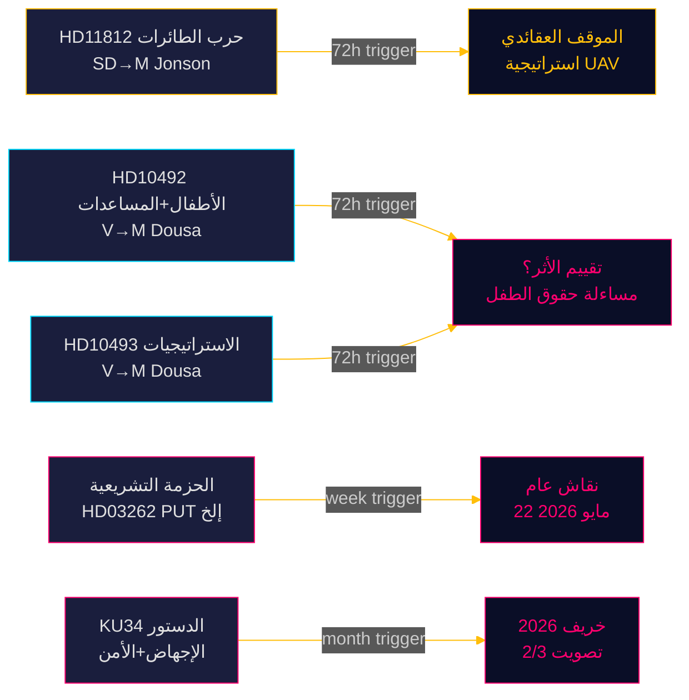
```mermaid
%%{init: {"theme": "dark", "themeVariables": {"primaryColor": "#00d9ff", "primaryTextColor": "#e0e0e0", "primaryBorderColor": "#ff006e", "lineColor": "#ffbe0b", "background": "#0a0e27", "mainBkg": "#1a1e3d", "nodeBorder": "#00d9ff"}}}%%
graph LR
    A[HD11812 حرب الطائرات<br/>SD→M Jonson] -->|72h trigger| B[الموقف العقائدي<br/>استراتيجية UAV]
    C[HD10492 الأطفال+المساعدات<br/>V→M Dousa] -->|72h trigger| D[تقييم الأثر؟<br/>مساءلة حقوق الطفل]
    E[HD10493 الاستراتيجيات<br/>V→M Dousa] -->|72h trigger| D
    F[الحزمة التشريعية<br/>HD03262 PUT إلخ] -->|week trigger| G[نقاش عام<br/>22 مايو 2026]
    H[KU34 الدستور<br/>الإجهاض+الأمن] -->|month trigger| I[خريف 2026<br/>تصويت 2/3]
    style A fill:#1a1e3d,stroke:#ffbe0b,color:#e0e0e0
    style C fill:#1a1e3d,stroke:#00d9ff,color:#e0e0e0
    style E fill:#1a1e3d,stroke:#00d9ff,color:#e0e0e0
    style F fill:#1a1e3d,stroke:#ff006e,color:#e0e0e0
    style H fill:#1a1e3d,stroke:#ff006e,color:#e0e0e0
    style B fill:#0a0e27,stroke:#ffbe0b,color:#ffbe0b
    style D fill:#0a0e27,stroke:#ff006e,color:#ff006e
    style G fill:#0a0e27,stroke:#ff006e,color:#ff006e
    style I fill:#0a0e27,stroke:#ff006e,color:#ff006e
```

<!-- source-sha: 4dab56d2891eeda118e9fe89207421ca0f0be533 -->

## Executive Brief Da
<!-- source: executive-brief_da.md :: https://github.com/Hack23/riksdagsmonitor/blob/main/analysis/daily/2026-05-15/realtime-pulse/executive-brief_da.md -->

**Forfatter**: James Pether Sörling  
**Dato**: 2026-05-15  
**Klassifikation**: 🟢 OFFENTLIG  
**Konfidensgrad**: HØJ [B2]  
**Horisont**: [horizon:72h] [horizon:week]

---

### 🎯 BLUF

Danmarks politiske landskab den 15. maj 2026 — Sveriges politiske landskab den 15. maj 2026 er præget af tre parallelle stressorer: SD presser forsvarsminister Pål Jonson om dronekrigsførselsdoktrin efter Aurora 26-øvelsen (HD11812, [A2]); Venstrefløjspartiet (V) intensiverer sin undersøgelse af Tidö-regeringens bistandsnedsæringer, med fokus på konsekvenser for børn og afviklede landestrategier (HD10492 [A2], HD10493 [A2]); og dagens søsteranalyser bekræfter, at riksmødet 2025/26 er præget af den dybeste migrationspolitiske omstøbning i et årti. Samlet set signalerer 15. maj en riksdag i sin afsluttende sprint med høj lovgivningsmæssig volumen og accelererende valgpositionering frem mod september 2026.

### 🧭 3 beslutninger dette underlag understøtter

1. **Redaktionel prioritering**: Bistandsdebatten (HD10492 / HD10493) er Riksdagsmonitors tophistorie i dag — international rækkevidde, en børneretlig dimension og det globale USAID-sammenbrud som baggrund.  
2. **Sikkerhedspolitisk overvågning**: Dronespørgsmålet (HD11812) er et tidligt signaldokument om UAV-doktrin og Aurora 26 lærdomme — overvåg Pål Jonsons svar.  
3. **Migrationspolitisk kalibrering**: Dagens fem lovforslag + 20 oppositionsmotioner + KU34 signalerer, at plenardebaterne i uge 21 (22. maj) kan afgøre afstemningsresultater med en EU-retlig dimension.

### ⚡ 60-sekunders læsning

- **HD11812** [B2]: SD's Markus Wiechel spørger forsvarsminister Pål Jonson (M) om dronekrigsførelse — Aurora 26-øvelsen (18.000 deltagere, april–maj 2026, Gotland-fokus) har afdækket UAV-taktiske huller [horizon:72h].
- **HD10492** [A2]: V's Lotta Johnsson Fornarve kræver, at Benjamin Dousa (M) redegør for konsekvenserne for børn af bistandsnedsæringerne — Bjærg Barnens rapportering om stoppede underernæringsprogrammer; CRC artiklerne 6/26/28 påberåbes [horizon:week].
- **HD10493** [A2]: Samme interpellant spørger om afviklede bistandsstrategier — 14 af 37 strategier nedmonteret, 1%-af-BNI-målet opgivet [horizon:week].
- **Lovpakke** [A2]: Fem lovforslag inkl. HD03262 (PUT-afskaffelse) — bred parlamentarisk kritik (S + C + V + MP) [horizon:week].
- **KU34** [A2]: Konstitutionel dobbeltændring — aborttrettigheder + foreningsfrihed — 2/3 supermajoritet krævet, efterår 2026 [horizon:month].
- **Økonomisk kontekst**: Sveriges BNP-vækst 2,3% (WEO apr-2026); bistand 0,7% → 0,36% af BNP (2026-prognose) — laveste bistands­andel siden 1970'erne [B1].
- **Valgbarometer**: Aurora 26 + Ukraine-krigens lærdomme tyder på, at SD konsoliderer et vælgerprofil om "stærk forsvarspolitik" [horizon:week].
- **Fremadrettet trigger**: Pål Jonsons svar på HD11812 og Benjamin Dousas svar på HD10492/10493 afgør, om spørgsmålene eskalerer til interpellationsdebatter i uge 21 [horizon:72h].

### 🔭 Vigtigste fremadrettede trigger

**PIR-1 (72h)**: Benjamin Dousas skriftlige svar på HD10492 og HD10493 — vil Dousa anerkende fraværet af konsekvensanalyser? Svar forventet i ugerne 20–21 (18.–22. maj).

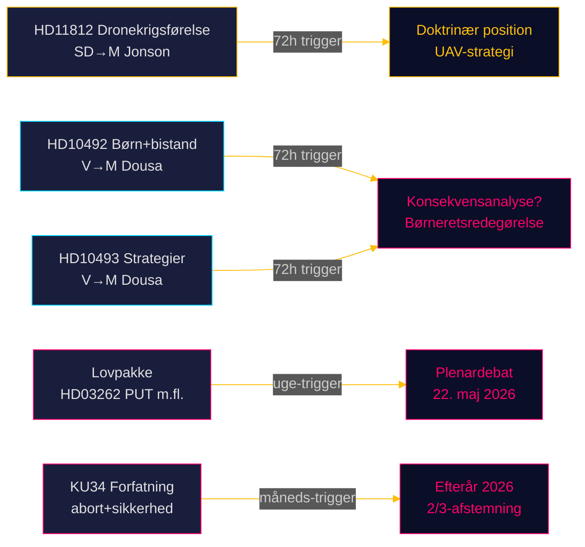
```mermaid
%%{init: {"theme": "dark", "themeVariables": {"primaryColor": "#00d9ff", "primaryTextColor": "#e0e0e0", "primaryBorderColor": "#ff006e", "lineColor": "#ffbe0b", "background": "#0a0e27", "mainBkg": "#1a1e3d", "nodeBorder": "#00d9ff"}}}%%
graph LR
    A[HD11812 Dronekrigsførelse<br/>SD→M Jonson] -->|72h trigger| B[Doktrinær position<br/>UAV-strategi]
    C[HD10492 Børn+bistand<br/>V→M Dousa] -->|72h trigger| D[Konsekvensanalyse?<br/>Børnerets­redegørelse]
    E[HD10493 Strategier<br/>V→M Dousa] -->|72h trigger| D
    F[Lovpakke<br/>HD03262 PUT m.fl.] -->|uge-trigger| G[Plenardebat<br/>22. maj 2026]
    H[KU34 Forfatning<br/>abort+sikkerhed] -->|måneds-trigger| I[Efterår 2026<br/>2/3-afstemning]
    style A fill:#1a1e3d,stroke:#ffbe0b,color:#e0e0e0
    style C fill:#1a1e3d,stroke:#00d9ff,color:#e0e0e0
    style E fill:#1a1e3d,stroke:#00d9ff,color:#e0e0e0
    style F fill:#1a1e3d,stroke:#ff006e,color:#e0e0e0
    style H fill:#1a1e3d,stroke:#ff006e,color:#e0e0e0
    style B fill:#0a0e27,stroke:#ffbe0b,color:#ffbe0b
    style D fill:#0a0e27,stroke:#ff006e,color:#ff006e
    style G fill:#0a0e27,stroke:#ff006e,color:#ff006e
    style I fill:#0a0e27,stroke:#ff006e,color:#ff006e
```

<!-- source-sha: 4dab56d2891eeda118e9fe89207421ca0f0be533 -->

## Executive Brief De
<!-- source: executive-brief_de.md :: https://github.com/Hack23/riksdagsmonitor/blob/main/analysis/daily/2026-05-15/realtime-pulse/executive-brief_de.md -->

**Autor**: James Pether Sörling  
**Datum**: 2026-05-15  
**Klassifizierung**: 🟢 ÖFFENTLICH  
**Vertraulichkeitsgrad**: HOCH [B2]  
**Horizont**: [horizon:72h] [horizon:week]

---

### 🎯 BLUF

Die politische Lage Schwedens am 15. Mai 2026 wird durch drei parallele Stressoren bestimmt: SD setzt Verteidigungsminister Pål Jonson unter Druck bezüglich der Drohnenkriegsführungsdoktrin nach der Aurora-26-Übung (HD11812, [A2]); die Linkspartei (V) verschärft ihre Prüfung der Entwicklungshilfekürzungen der Tidö-Regierung mit Fokus auf Folgen für Kinder und abgewickelte Länderstrategien (HD10492 [A2], HD10493 [A2]); und die heutigen Schwesteranalysen bestätigen, dass die Riksdag-Session 2025/26 die tiefgreifendste Migrationspolitikreform seit einem Jahrzehnt erlebt. Insgesamt signalisiert der 15. Mai einen Reichstag in der Schlussphase mit hohem Gesetzgebungsvolumen und sich beschleunigender Wahlpositionierung vor September 2026.

### 🧭 3 Entscheidungen, die dieser Bericht unterstützt

1. **Redaktionelle Priorisierung**: Die Entwicklungshilfedebatte (HD10492 / HD10493) ist die Hauptgeschichte von Riksdagsmonitor heute.  
2. **Sicherheitspolitische Beobachtung**: Die Drohnenfrage (HD11812) ist ein frühes Signaldokument über UAV-Doktrin und Aurora-26-Lehren.  
3. **Migrationspolitische Kalibrierung**: Fünf Gesetze + 20 Oppositionsanträge + KU34 signalisieren wichtige Plenardebatten in Woche 21.

### ⚡ 60-Sekunden-Lektüre

- **HD11812** [B2]: SDs Markus Wiechel fragt Verteidigungsminister Pål Jonson (M) zur Drohnenkriegsführung — die Aurora-26-Übung (18.000 Teilnehmer, April–Mai 2026, Gotland-Fokus) hat UAV-taktische Lücken aufgedeckt [horizon:72h].
- **HD10492** [A2]: Vs Lotta Johnsson Fornarve fordert Benjamin Dousa (M) auf, die Folgen der Entwicklungshilfekürzungen für Kinder zu erläutern — CRC-Artikel 6/26/28 werden angeführt [horizon:week].
- **HD10493** [A2]: Dieselbe Interpellantin fragt nach abgewickelten Hilfsstrategien — 14 von 37 Strategien abgebaut, das 1%-des-BNE-Ziel aufgegeben [horizon:week].
- **Gesetzespaket** [A2]: Fünf Gesetze einschl. HD03262 (PUT-Abschaffung) — breite parlamentarische Kritik (S + C + V + MP) [horizon:week].
- **KU34** [A2]: Doppelte Verfassungsänderung — Abtreibungsrechte + Vereinigungsfreiheit — 2/3-Supermehrheit erforderlich, Herbst 2026 [horizon:month].
- **Wirtschaftlicher Kontext**: Schweden BIP-Wachstum 2,3% (WEO Apr-2026); Entwicklungshilfe 0,7% → 0,36% des BIP (2026-Prognose) [B1].
- **Wahlbarometer**: Aurora 26 + Ukraine-Lehren deuten darauf hin, dass SD ein Wählerprofil rund um "starke Verteidigungspolitik" konsolidiert [horizon:week].
- **Vorwärtsauslöser**: Pål Jonsons Antwort auf HD11812 und Benjamin Dousas Antworten auf HD10492/10493 entscheiden über eine mögliche Eskalation in Woche 21 [horizon:72h].

### 🔭 Wichtigster Vorwärtsauslöser

**PIR-1 (72h)**: Benjamin Dousas schriftliche Antworten auf HD10492 und HD10493 — wird Dousa das Fehlen von Folgenabschätzungen eingestehen? Antworten werden in den Wochen 20–21 (18.–22. Mai) erwartet.

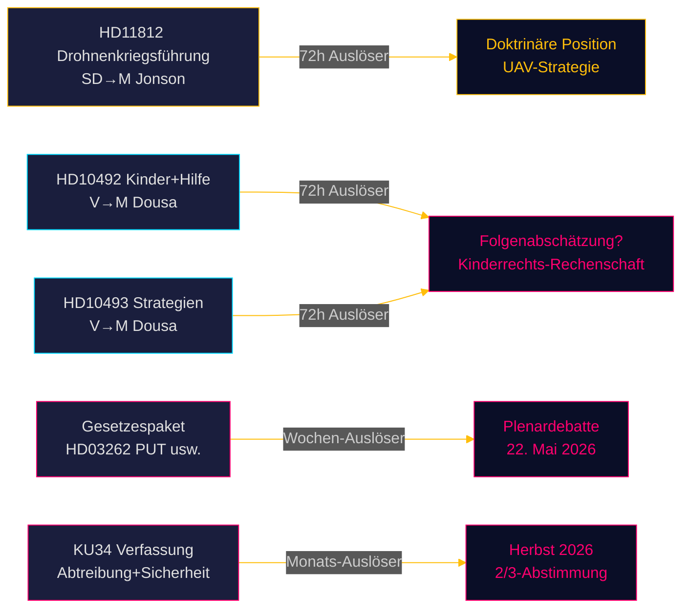
```mermaid
%%{init: {"theme": "dark", "themeVariables": {"primaryColor": "#00d9ff", "primaryTextColor": "#e0e0e0", "primaryBorderColor": "#ff006e", "lineColor": "#ffbe0b", "background": "#0a0e27", "mainBkg": "#1a1e3d", "nodeBorder": "#00d9ff"}}}%%
graph LR
    A[HD11812 Drohnenkriegsführung<br/>SD→M Jonson] -->|72h Auslöser| B[Doktrinäre Position<br/>UAV-Strategie]
    C[HD10492 Kinder+Hilfe<br/>V→M Dousa] -->|72h Auslöser| D[Folgenabschätzung?<br/>Kinderrechts-Rechenschaft]
    E[HD10493 Strategien<br/>V→M Dousa] -->|72h Auslöser| D
    F[Gesetzespaket<br/>HD03262 PUT usw.] -->|Wochen-Auslöser| G[Plenardebatte<br/>22. Mai 2026]
    H[KU34 Verfassung<br/>Abtreibung+Sicherheit] -->|Monats-Auslöser| I[Herbst 2026<br/>2/3-Abstimmung]
    style A fill:#1a1e3d,stroke:#ffbe0b,color:#e0e0e0
    style C fill:#1a1e3d,stroke:#00d9ff,color:#e0e0e0
    style E fill:#1a1e3d,stroke:#00d9ff,color:#e0e0e0
    style F fill:#1a1e3d,stroke:#ff006e,color:#e0e0e0
    style H fill:#1a1e3d,stroke:#ff006e,color:#e0e0e0
    style B fill:#0a0e27,stroke:#ffbe0b,color:#ffbe0b
    style D fill:#0a0e27,stroke:#ff006e,color:#ff006e
    style G fill:#0a0e27,stroke:#ff006e,color:#ff006e
    style I fill:#0a0e27,stroke:#ff006e,color:#ff006e
```

<!-- source-sha: 4dab56d2891eeda118e9fe89207421ca0f0be533 -->

## Executive Brief Es
<!-- source: executive-brief_es.md :: https://github.com/Hack23/riksdagsmonitor/blob/main/analysis/daily/2026-05-15/realtime-pulse/executive-brief_es.md -->

**Autor**: James Pether Sörling  
**Fecha**: 2026-05-15  
**Clasificación**: 🟢 PÚBLICO  
**Nivel de confianza**: ALTO [B2]  
**Horizonte**: [horizon:72h] [horizon:week]

---

### 🎯 BLUF

El panorama político sueco del 15 de mayo de 2026 está definido por tres factores de estrés paralelos: SD presiona al ministro de Defensa Pål Jonson sobre la doctrina de guerra con drones tras el ejercicio Aurora 26 (HD11812, [A2]); el Partido de Izquierda (V) intensifica el escrutinio de los recortes de ayuda de la coalición Tidö, centrado en las consecuencias para los niños y las estrategias-país abandonadas (HD10492 [A2], HD10493 [A2]); y los análisis hermanos de hoy confirman que la sesión del Riksdag 2025/26 está marcada por la reforma migratoria más profunda en una década. En conjunto, el 15 de mayo señala un Riksdag en su sprint final con alto volumen legislativo y acelerado posicionamiento electoral antes de septiembre de 2026.

### 🧭 3 decisiones que apoya este informe

1. **Priorización editorial**: El debate sobre la ayuda (HD10492 / HD10493) es la noticia principal de Riksdagsmonitor hoy.  
2. **Vigilancia de política de seguridad**: La pregunta sobre drones (HD11812) es un documento de señal temprana sobre doctrina UAV.  
3. **Calibración de política migratoria**: Cinco proyectos de ley + 20 mociones + KU34 anuncian debates plenarios importantes en la semana 21.

### ⚡ Lectura en 60 segundos

- **HD11812** [B2]: Markus Wiechel (SD) pregunta al ministro de Defensa Pål Jonson (M) sobre guerra con drones — el ejercicio Aurora 26 (18.000 participantes, abril–mayo 2026, enfoque Gotland) reveló lagunas tácticas UAV [horizon:72h].
- **HD10492** [A2]: Lotta Johnsson Fornarve (V) exige que Benjamin Dousa (M) rinda cuentas de las consecuencias de los recortes de ayuda para los niños — artículos 6/26/28 de la CDN invocados [horizon:week].
- **HD10493** [A2]: La misma interpelante pregunta sobre estrategias de ayuda abandonadas — 14 de 37 estrategias desmanteladas, objetivo del 1 % de RNB abandonado [horizon:week].
- **Paquete legislativo** [A2]: Cinco proyectos incluyendo HD03262 (abolición del PUT) — amplia crítica parlamentaria (S + C + V + MP) [horizon:week].
- **KU34** [A2]: Doble enmienda constitucional — derechos reproductivos + libertad de asociación — supermayoría de 2/3 requerida, otoño 2026 [horizon:month].
- **Contexto económico**: Crecimiento del PIB sueco 2,3% (WEO abr-2026); ayuda 0,7% → 0,36% del PIB (previsión 2026) [B1].
- **Barómetro electoral**: Aurora 26 + lecciones de la guerra en Ucrania indican que SD consolida un perfil electoral en torno a una "política de defensa fuerte" [horizon:week].
- **Detonante prospectivo**: Las respuestas de Pål Jonson a HD11812 y de Benjamin Dousa a HD10492/10493 determinarán una posible escalada en la semana 21 [horizon:72h].

### 🔭 Principal detonante prospectivo

**PIR-1 (72h)**: Las respuestas escritas de Benjamin Dousa a HD10492 y HD10493 — ¿reconocerá la ausencia de evaluaciones de impacto? Respuestas esperadas en las semanas 20–21 (18–22 de mayo).

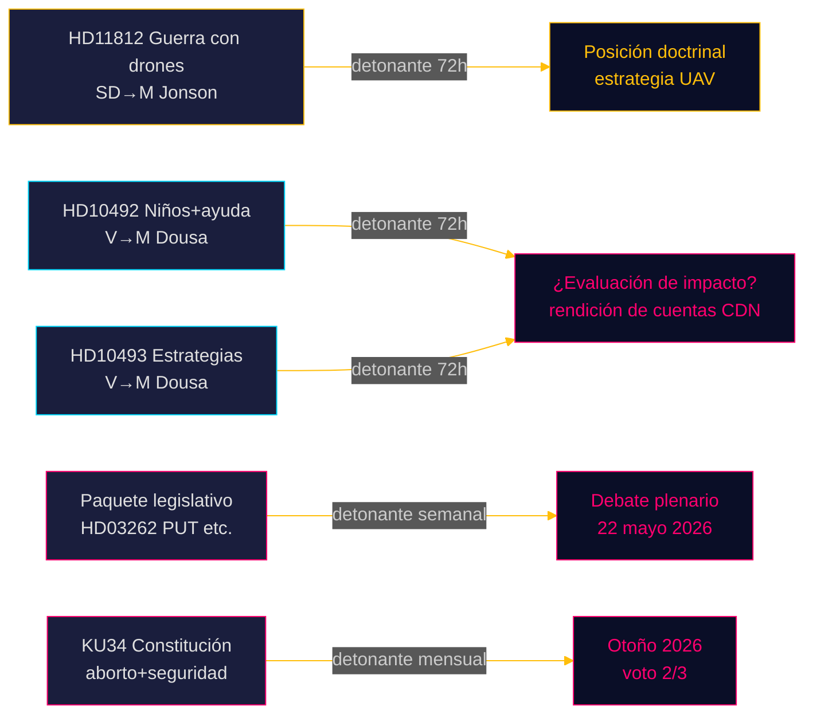
```mermaid
%%{init: {"theme": "dark", "themeVariables": {"primaryColor": "#00d9ff", "primaryTextColor": "#e0e0e0", "primaryBorderColor": "#ff006e", "lineColor": "#ffbe0b", "background": "#0a0e27", "mainBkg": "#1a1e3d", "nodeBorder": "#00d9ff"}}}%%
graph LR
    A[HD11812 Guerra con drones<br/>SD→M Jonson] -->|detonante 72h| B[Posición doctrinal<br/>estrategia UAV]
    C[HD10492 Niños+ayuda<br/>V→M Dousa] -->|detonante 72h| D[¿Evaluación de impacto?<br/>rendición de cuentas CDN]
    E[HD10493 Estrategias<br/>V→M Dousa] -->|detonante 72h| D
    F[Paquete legislativo<br/>HD03262 PUT etc.] -->|detonante semanal| G[Debate plenario<br/>22 mayo 2026]
    H[KU34 Constitución<br/>aborto+seguridad] -->|detonante mensual| I[Otoño 2026<br/>voto 2/3]
    style A fill:#1a1e3d,stroke:#ffbe0b,color:#e0e0e0
    style C fill:#1a1e3d,stroke:#00d9ff,color:#e0e0e0
    style E fill:#1a1e3d,stroke:#00d9ff,color:#e0e0e0
    style F fill:#1a1e3d,stroke:#ff006e,color:#e0e0e0
    style H fill:#1a1e3d,stroke:#ff006e,color:#e0e0e0
    style B fill:#0a0e27,stroke:#ffbe0b,color:#ffbe0b
    style D fill:#0a0e27,stroke:#ff006e,color:#ff006e
    style G fill:#0a0e27,stroke:#ff006e,color:#ff006e
    style I fill:#0a0e27,stroke:#ff006e,color:#ff006e
```

<!-- source-sha: 4dab56d2891eeda118e9fe89207421ca0f0be533 -->

## Executive Brief Fi
<!-- source: executive-brief_fi.md :: https://github.com/Hack23/riksdagsmonitor/blob/main/analysis/daily/2026-05-15/realtime-pulse/executive-brief_fi.md -->

**Tekijä**: James Pether Sörling  
**Päivämäärä**: 2026-05-15  
**Luokittelu**: 🟢 JULKINEN  
**Luotettavuus**: KORKEA [B2]  
**Horisontti**: [horizon:72h] [horizon:week]

---

### 🎯 BLUF

Ruotsin poliittinen tilanne 15. toukokuuta 2026 on kolmen yhtäaikaisen paineen alainen: SD painostaa puolustusministeri Pål Jonsonia droonisotataktiikasta Aurora 26 -harjoituksen jälkeen (HD11812, [A2]); Vasemmistopuolue (V) tiivistää Tidö-hallituksen kehitysapuleikkauksien tarkastelua keskittyen lapsiuhrien ja lakkautettujen maastrategioiden seurauksiin (HD10492 [A2], HD10493 [A2]); ja tämän päivän sisaranalyysit vahvistavat, että riksmötet 2025/26 on leimattu vuosikymmenen syvimmällä maahanmuuttopolitiikan uudistuksella. Yhdessä 15. toukokuuta merkitsee riksdagin kiireistä loppusuoraa kohti syyskuun 2026 vaaleja.

### 🧭 3 päätöstä, joita tämä tiivistelmä tukee

1. **Toimituksellinen priorisointi**: Kehitysapudebatti (HD10492 / HD10493) on Riksdagsmonitorin päätarina tänään.  
2. **Turvallisuuspolitiikan seuranta**: Droonisodan kysymys (HD11812) on varhainen signaalidokumentti Aurora 26 -opeista.  
3. **Maahanmuuttopolitiikan kalibrointi**: Viisi lakiesitystä + 20 oppositioaloitetta + KU34 viittaavat suuriin täysistuntodebatteihin viikolla 21.

### ⚡ 60 sekunnin lukeminen

- **HD11812** [B2]: SD:n Markus Wiechel kysyy puolustusministeri Pål Jonsonilta (M) droonisotataktiikasta — Aurora 26 -harjoitus (18 000 osallistujaa, huhti–toukokuu 2026, Gotlannin fokus) paljasti UAV-taktisia aukkoja [horizon:72h].
- **HD10492** [A2]: V:n Lotta Johnsson Fornarve vaatii Benjamin Dousaa (M) selvittämään kehitysapuleikkausten seuraukset lapsille — Pelastakaa Lapset -järjestön raportti aliravitsemusohjelmien keskeyttämisestä; CRC artiklat 6/26/28 vedottu [horizon:week].
- **HD10493** [A2]: Sama interpellantti kysyy lakkautetuista kehitysapustrategioista — 14/37 strategiaa purettu, 1 %:n BKT-tavoite hylätty [horizon:week].
- **Lakipaketti** [A2]: Viisi lakiesitystä ml. HD03262 (PUT-poisto) — laaja parlamentaarinen kritiikki (S + C + V + MP) [horizon:week].
- **KU34** [A2]: Perustuslaillinen kaksoistarkistus — aborttioikeudet + yhdistymisvapaus — 2/3 supermajoriteetti vaaditaan, syksy 2026 [horizon:month].
- **Taloudellinen konteksti**: Ruotsin BKT-kasvu 2,3 % (WEO huhti-2026); kehitysapu 0,7 % → 0,36 % BKT:stä (2026-ennuste) — alin kehitysapuosuus sitten 1970-luvun [B1].
- **Vaalimittari**: Aurora 26 + Ukrainan sodan opit viittaavat SD:n konsolidoivan äänestysprofiilin "vahvan puolustuspolitiikan" ympärille [horizon:week].
- **Eteenpäin suuntautuva laukaisin**: Pål Jonssonin vastaus HD11812:een ja Benjamin Dousan vastaukset HD10492/10493:een ratkaisevat, eskaloituvatko kysymykset interpellaatiodebateiksi viikolla 21 [horizon:72h].

### 🔭 Tärkein eteenpäin suuntautuva laukaisin

**PIR-1 (72h)**: Benjamin Dousan kirjalliset vastaukset HD10492:een ja HD10493:een — myöntääkö Dousa vaikutusarviointien puuttumisen? Vastaukset odotetaan viikoilla 20–21 (18.–22. toukokuuta).

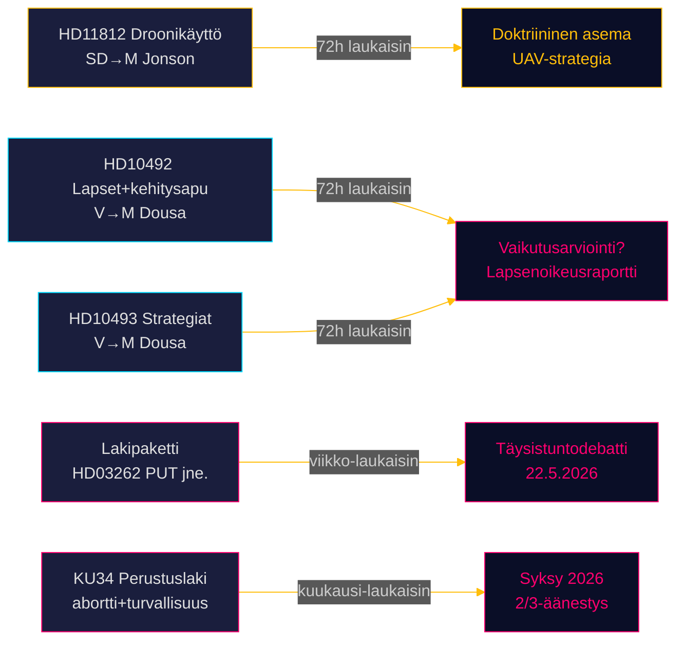
```mermaid
%%{init: {"theme": "dark", "themeVariables": {"primaryColor": "#00d9ff", "primaryTextColor": "#e0e0e0", "primaryBorderColor": "#ff006e", "lineColor": "#ffbe0b", "background": "#0a0e27", "mainBkg": "#1a1e3d", "nodeBorder": "#00d9ff"}}}%%
graph LR
    A[HD11812 Droonikäyttö<br/>SD→M Jonson] -->|72h laukaisin| B[Doktriininen asema<br/>UAV-strategia]
    C[HD10492 Lapset+kehitysapu<br/>V→M Dousa] -->|72h laukaisin| D[Vaikutusarviointi?<br/>Lapsenoikeusraportti]
    E[HD10493 Strategiat<br/>V→M Dousa] -->|72h laukaisin| D
    F[Lakipaketti<br/>HD03262 PUT jne.] -->|viikko-laukaisin| G[Täysistuntodebatti<br/>22.5.2026]
    H[KU34 Perustuslaki<br/>abortti+turvallisuus] -->|kuukausi-laukaisin| I[Syksy 2026<br/>2/3-äänestys]
    style A fill:#1a1e3d,stroke:#ffbe0b,color:#e0e0e0
    style C fill:#1a1e3d,stroke:#00d9ff,color:#e0e0e0
    style E fill:#1a1e3d,stroke:#00d9ff,color:#e0e0e0
    style F fill:#1a1e3d,stroke:#ff006e,color:#e0e0e0
    style H fill:#1a1e3d,stroke:#ff006e,color:#e0e0e0
    style B fill:#0a0e27,stroke:#ffbe0b,color:#ffbe0b
    style D fill:#0a0e27,stroke:#ff006e,color:#ff006e
    style G fill:#0a0e27,stroke:#ff006e,color:#ff006e
    style I fill:#0a0e27,stroke:#ff006e,color:#ff006e
```

<!-- source-sha: 4dab56d2891eeda118e9fe89207421ca0f0be533 -->

## Executive Brief Fr
<!-- source: executive-brief_fr.md :: https://github.com/Hack23/riksdagsmonitor/blob/main/analysis/daily/2026-05-15/realtime-pulse/executive-brief_fr.md -->

**Auteur** : James Pether Sörling  

**Niveau de confiance** : ÉLEVÉ [B2]  
**Horizon** : [horizon:72h] [horizon:week]

---

### 🎯 BLUF

Le paysage politique suédois du 15 mai 2026 est marqué par trois facteurs de stress parallèles : SD presse le ministre de la Défense Pål Jonson sur la doctrine de guerre par drones après l'exercice Aurora 26 (HD11812, [A2]) ; le Parti de gauche (V) intensifie son examen des réductions d'aide de la coalition Tidö, en se concentrant sur les conséquences pour les enfants et les stratégies-pays abandonnées (HD10492 [A2], HD10493 [A2]) ; et les analyses sœurs de la journée confirment que la session du Riksdag 2025/26 est marquée par la réforme migratoire la plus profonde en une décennie. Ensemble, le 15 mai signale un Riksdag en fin de session avec un volume législatif élevé et un positionnement électoral accéléré avant septembre 2026.

### 🧭 3 décisions que ce rapport soutient

1. **Priorisation éditoriale** : Le débat sur l'aide (HD10492 / HD10493) est la principale histoire de Riksdagsmonitor aujourd'hui.  
2. **Veille sécuritaire** : La question des drones (HD11812) est un document signal précoce sur la doctrine UAV.  
3. **Calibration de la politique migratoire** : Cinq projets de loi + 20 motions + KU34 signalent d'importants débats en séance plénière à la semaine 21.

### ⚡ Lecture en 60 secondes

- **HD11812** [B2] : Markus Wiechel (SD) interroge le ministre de la Défense Pål Jonson (M) sur la guerre par drones — l'exercice Aurora 26 (18 000 participants, avril–mai 2026, focus Gotland) a révélé des lacunes UAV [horizon:72h].
- **HD10492** [A2] : Lotta Johnsson Fornarve (V) demande à Benjamin Dousa (M) de rendre compte des conséquences des coupes dans l'aide pour les enfants — articles 6/26/28 de la CDE invoqués [horizon:week].
- **HD10493** [A2] : La même interpellante interroge sur les stratégies d'aide abandonnées — 14 des 37 stratégies démantelées, l'objectif de 1 % du RNB abandonné [horizon:week].
- **Paquet législatif** [A2] : Cinq projets de loi dont HD03262 (suppression du PUT) — large critique parlementaire (S + C + V + MP) [horizon:week].
- **KU34** [A2] : Double amendement constitutionnel — droits à l'avortement + liberté d'association — super-majorité des 2/3 requise, automne 2026 [horizon:month].
- **Contexte économique** : Croissance du PIB suédois 2,3 % (WEO avr-2026) ; aide 0,7 % → 0,36 % du PIB (prévision 2026) — niveau le plus bas depuis les années 1970 [B1].
- **Baromètre électoral** : Aurora 26 + enseignements de la guerre en Ukraine indiquent que SD consolide un profil électoral autour de la "politique de défense forte" [horizon:week].
- **Déclencheur prospectif** : Les réponses de Pål Jonson à HD11812 et de Benjamin Dousa à HD10492/10493 détermineront une éventuelle escalade en semaine 21 [horizon:72h].

### 🔭 Principal déclencheur prospectif

**PIR-1 (72h)** : Les réponses écrites de Benjamin Dousa à HD10492 et HD10493 — reconnaîtra-t-il l'absence d'évaluations d'impact ? Réponses attendues semaines 20–21 (18–22 mai).

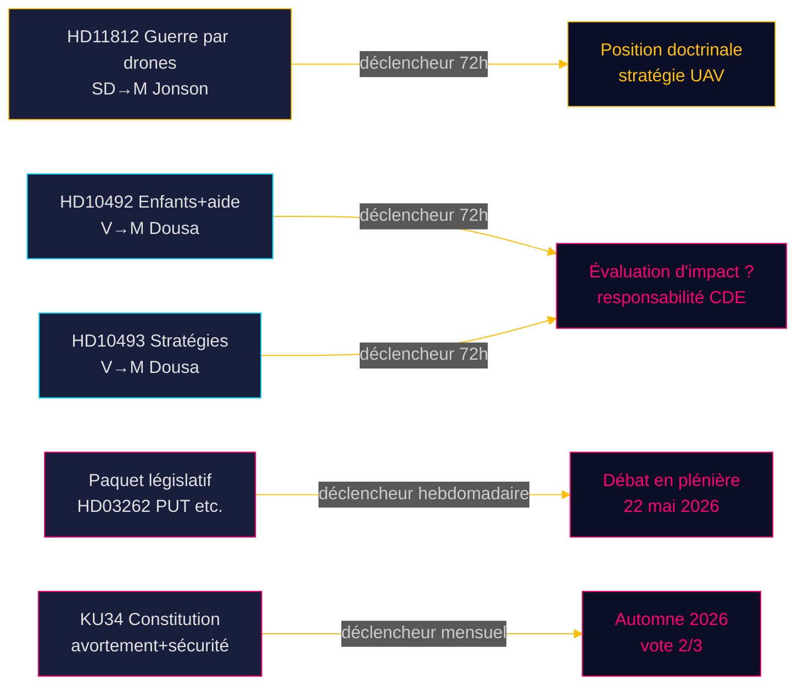
```mermaid
%%{init: {"theme": "dark", "themeVariables": {"primaryColor": "#00d9ff", "primaryTextColor": "#e0e0e0", "primaryBorderColor": "#ff006e", "lineColor": "#ffbe0b", "background": "#0a0e27", "mainBkg": "#1a1e3d", "nodeBorder": "#00d9ff"}}}%%
graph LR
    A[HD11812 Guerre par drones<br/>SD→M Jonson] -->|déclencheur 72h| B[Position doctrinale<br/>stratégie UAV]
    C[HD10492 Enfants+aide<br/>V→M Dousa] -->|déclencheur 72h| D[Évaluation d'impact ?<br/>responsabilité CDE]
    E[HD10493 Stratégies<br/>V→M Dousa] -->|déclencheur 72h| D
    F[Paquet législatif<br/>HD03262 PUT etc.] -->|déclencheur hebdomadaire| G[Débat en plénière<br/>22 mai 2026]
    H[KU34 Constitution<br/>avortement+sécurité] -->|déclencheur mensuel| I[Automne 2026<br/>vote 2/3]
    style A fill:#1a1e3d,stroke:#ffbe0b,color:#e0e0e0
    style C fill:#1a1e3d,stroke:#00d9ff,color:#e0e0e0
    style E fill:#1a1e3d,stroke:#00d9ff,color:#e0e0e0
    style F fill:#1a1e3d,stroke:#ff006e,color:#e0e0e0
    style H fill:#1a1e3d,stroke:#ff006e,color:#e0e0e0
    style B fill:#0a0e27,stroke:#ffbe0b,color:#ffbe0b
    style D fill:#0a0e27,stroke:#ff006e,color:#ff006e
    style G fill:#0a0e27,stroke:#ff006e,color:#ff006e
    style I fill:#0a0e27,stroke:#ff006e,color:#ff006e
```

<!-- source-sha: 4dab56d2891eeda118e9fe89207421ca0f0be533 -->

## Executive Brief He
<!-- source: executive-brief_he.md :: https://github.com/Hack23/riksdagsmonitor/blob/main/analysis/daily/2026-05-15/realtime-pulse/executive-brief_he.md -->

‏# ריקסדאגסמוניטור — פולס בזמן אמת 15 במאי 2026: יכולת הגנה וחוב הסיוע

**מחבר**: James Pether Sörling  
**תאריך**: 2026-05-15  
**סיווג**: 🟢 ציבורי  
**רמת אמינות**: גבוהה [B2]  
**אופק**: [horizon:72h] [horizon:week]

---

### 🎯 BLUF

הנוף הפוליטי של שבדיה ב-15 במאי 2026 מאופיין בשלושה לחצים מקבילים: SD לוחץ על שר הביטחון פול יונסון בנוגע לדוקטרינת מלחמת רחפנים לאחר תרגיל אורורה 26 (HD11812, [A2]); מפלגת השמאל (V) מגברת את בחינת קיצוצי הסיוע של קואליציית טידו תוך התמקדות בהשלכות על ילדים ואסטרטגיות מדינה שבוטלו (HD10492 [A2], HD10493 [A2]); וניתוחי היום האחיים מאשרים כי מושב הריקסדאג 2025/26 מסומן ברפורמה המעמיקה ביותר במדיניות ההגירה מאז עשור. ביחד, ה-15 במאי מסמן פרלמנט בספרינט הסיום שלו עם נפח חקיקתי גבוה ומיצוב בחירות מואץ לקראת ספטמבר 2026.

### 🧭 3 החלטות שדו"ח זה תומך בהן

1. **עדיפות עריכה**: ויכוח הסיוע (HD10492 / HD10493) הוא הסיפור הראשי של ריקסדאגסמוניטור היום.  
2. **מעקב ביטחוני**: שאלת הרחפנים (HD11812) היא מסמך אות מוקדם בנושא דוקטרינת UAV.  
3. **כיול מדיניות הגירה**: חמישה הצעות חוק + 20 הצעות אופוזיציה + KU34 מסמנים דיונים מליאה חשובים בשבוע 21.

### ⚡ קריאה ב-60 שניות

- **HD11812** [B2]: מרקוס ויקיל (SD) שואל את שר הביטחון פול יונסון (M) על מלחמת רחפנים — תרגיל אורורה 26 (18,000 משתתפים, אפריל–מאי 2026, מיקוד על גוטלנד) חשף פערים טקטיים ב-UAV [horizon:72h].
- **HD10492** [A2]: לוטה יונסון פורנרוה (V) דורשת מבנימין דוסה (M) להסביר את השלכות קיצוצי הסיוע על ילדים — סעיפים 6/26/28 של אמנת זכויות הילד הופעלו [horizon:week].
- **HD10493** [A2]: אותה חברת כנסת שואלת על אסטרטגיות סיוע שבוטלו — 14 מתוך 37 אסטרטגיות פורקו, יעד 1% מה-GNI ננטש [horizon:week].
- **חבילת חקיקה** [A2]: חמש הצעות חוק כולל HD03262 — ביקורת פרלמנטרית רחבה (S + C + V + MP) [horizon:week].
- **KU34** [A2]: תיקון חוקתי כפול — זכויות הפלה + חופש ההתאגדות — נדרשת רוב של 2/3, סתיו 2026 [horizon:month].
- **הקשר כלכלי**: צמיחת התמ"ג של שבדיה 2.3% (WEO אפריל 2026); סיוע 0.7% → 0.36% מהתמ"ג (תחזית 2026) [B1].
- **ברומטר בחירות**: תרגיל אורורה 26 ולקחי מלחמת אוקראינה מצביעים על כך שSD מגבש פרופיל בוחרים סביב "מדיניות ביטחון חזקה" [horizon:week].
- **טריגר קדימה**: תשובות יונסון ל-HD11812 ותשובות דוסה ל-HD10492/10493 יקבעו אם השאלות מסלימות בשבוע 21 [horizon:72h].

### 🔭 הטריגר הקדימה החשוב ביותר

**PIR-1 (72h)**: התשובות הכתובות של בנימין דוסה ל-HD10492 ו-HD10493 — האם דוסה יכיר בהיעדר הערכות השפעה? תשובות צפויות בשבועות 20–21 (18–22 במאי).

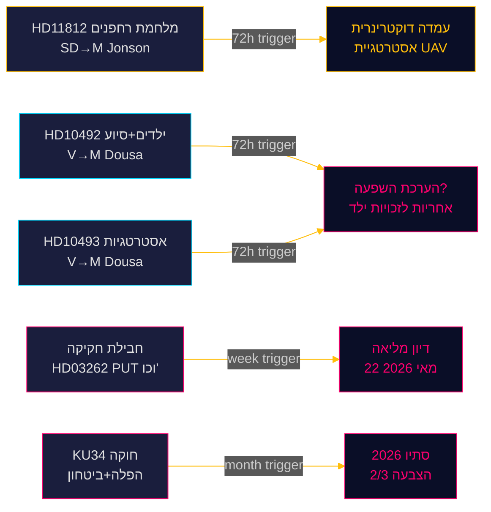
```mermaid
%%{init: {"theme": "dark", "themeVariables": {"primaryColor": "#00d9ff", "primaryTextColor": "#e0e0e0", "primaryBorderColor": "#ff006e", "lineColor": "#ffbe0b", "background": "#0a0e27", "mainBkg": "#1a1e3d", "nodeBorder": "#00d9ff"}}}%%
graph LR
    A[HD11812 מלחמת רחפנים<br/>SD→M Jonson] -->|72h trigger| B[עמדה דוקטרינרית<br/>אסטרטגיית UAV]
    C[HD10492 ילדים+סיוע<br/>V→M Dousa] -->|72h trigger| D[הערכת השפעה?<br/>אחריות לזכויות ילד]
    E[HD10493 אסטרטגיות<br/>V→M Dousa] -->|72h trigger| D
    F[חבילת חקיקה<br/>HD03262 PUT וכו'] -->|week trigger| G[דיון מליאה<br/>22 מאי 2026]
    H[KU34 חוקה<br/>הפלה+ביטחון] -->|month trigger| I[סתיו 2026<br/>הצבעה 2/3]
    style A fill:#1a1e3d,stroke:#ffbe0b,color:#e0e0e0
    style C fill:#1a1e3d,stroke:#00d9ff,color:#e0e0e0
    style E fill:#1a1e3d,stroke:#00d9ff,color:#e0e0e0
    style F fill:#1a1e3d,stroke:#ff006e,color:#e0e0e0
    style H fill:#1a1e3d,stroke:#ff006e,color:#e0e0e0
    style B fill:#0a0e27,stroke:#ffbe0b,color:#ffbe0b
    style D fill:#0a0e27,stroke:#ff006e,color:#ff006e
    style G fill:#0a0e27,stroke:#ff006e,color:#ff006e
    style I fill:#0a0e27,stroke:#ff006e,color:#ff006e
```

<!-- source-sha: 4dab56d2891eeda118e9fe89207421ca0f0be533 -->

## Executive Brief Ja
<!-- source: executive-brief_ja.md :: https://github.com/Hack23/riksdagsmonitor/blob/main/analysis/daily/2026-05-15/realtime-pulse/executive-brief_ja.md -->

**著者**: James Pether Sörling  
**日付**: 2026-05-15  
**分類**: 🟢 公開  
**信頼度**: 高 [B2]  
**ホライゾン**: [horizon:72h] [horizon:week]

---

### 🎯 BLUF

2026年5月15日のスウェーデン政治情勢は、3つの並行する圧力によって特徴付けられる。民主党（SD）はアウロラ26演習後にドローン戦争ドクトリンについて国防大臣パール・ヨンソンを追及（HD11812、[A2]）；左翼党（V）は子供への影響と廃止された国別戦略に焦点を当て、ティード連立政権の援助削減への精査を強化（HD10492 [A2]、HD10493 [A2]）；そして本日の姉妹分析は2025/26年度の国会会期が10年で最も深い移民政策改革を含むことを確認する。総合して、5月15日は高い立法量と2026年9月選挙に向けた加速する選挙ポジショニングを伴う国会の終盤スプリントを示す。

### 🧭 このブリーフが支える3つの意思決定

1. **編集上の優先事項**: 援助討論（HD10492 / HD10493）が本日のリクスダーグモニターの主要ニュース。  
2. **安全保障政策の監視**: ドローン質問（HD11812）はUAVドクトリンとアウロラ26の教訓に関する早期シグナル文書。  
3. **移民政策の較正**: 5つの法案 + 20の反対動議 + KU34は第21週に重要な本会議討論を示す。

### ⚡ 60秒で読む

- **HD11812** [B2]: SDのマルクス・ヴィーケルが国防大臣パール・ヨンソン（M）にドローン戦争について質問 — アウロラ26演習（1万8千人参加、2026年4〜5月、ゴットランド重点）でUAV戦術的ギャップが露呈 [horizon:72h]。
- **HD10492** [A2]: VのロッタJヨンソン・フォルナルヴェがベンヤミン・ドゥサ（M）に援助削減の子供への影響説明を要求 — 子どもの権利条約第6/26/28条を援用 [horizon:week]。
- **HD10493** [A2]: 同じ質問者が廃止された援助戦略について質問 — 37戦略中14廃止、GNI1%目標放棄 [horizon:week]。
- **法案パッケージ** [A2]: HD03262を含む5法案 — 幅広い議会批判（S + C + V + MP） [horizon:week]。
- **KU34** [A2]: 二重憲法改正 — 中絶権利 + 結社の自由 — 2/3超多数決必要、2026年秋 [horizon:month]。
- **経済文脈**: スウェーデンGDP成長2.3%（WEO 2026年4月）；援助0.7%→0.36%（2026年予測）— 1970年代以来最低水準 [B1]。
- **選挙バロメーター**: アウロラ26とウクライナ戦争の教訓は、SDが「強力な防衛政策」を中心に有権者プロフィールを固めていることを示す [horizon:week]。
- **フォワードトリガー**: ヨンソンのHD11812への回答とドゥサのHD10492/10493への回答が第21週のエスカレーションを決定 [horizon:72h]。

### 🔭 最重要フォワードトリガー

**PIR-1 (72h)**: ベンヤミン・ドゥサのHD10492とHD10493への書面回答 — 影響評価の欠如を認めるか？回答は第20〜21週（5月18〜22日）に予定。

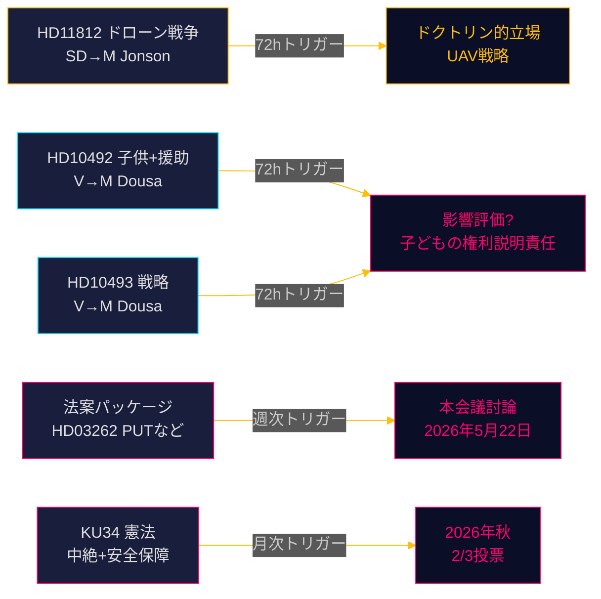
```mermaid
%%{init: {"theme": "dark", "themeVariables": {"primaryColor": "#00d9ff", "primaryTextColor": "#e0e0e0", "primaryBorderColor": "#ff006e", "lineColor": "#ffbe0b", "background": "#0a0e27", "mainBkg": "#1a1e3d", "nodeBorder": "#00d9ff"}}}%%
graph LR
    A[HD11812 ドローン戦争<br/>SD→M Jonson] -->|72hトリガー| B[ドクトリン的立場<br/>UAV戦略]
    C[HD10492 子供+援助<br/>V→M Dousa] -->|72hトリガー| D[影響評価?<br/>子どもの権利説明責任]
    E[HD10493 戦略<br/>V→M Dousa] -->|72hトリガー| D
    F[法案パッケージ<br/>HD03262 PUTなど] -->|週次トリガー| G[本会議討論<br/>2026年5月22日]
    H[KU34 憲法<br/>中絶+安全保障] -->|月次トリガー| I[2026年秋<br/>2/3投票]
    style A fill:#1a1e3d,stroke:#ffbe0b,color:#e0e0e0
    style C fill:#1a1e3d,stroke:#00d9ff,color:#e0e0e0
    style E fill:#1a1e3d,stroke:#00d9ff,color:#e0e0e0
    style F fill:#1a1e3d,stroke:#ff006e,color:#e0e0e0
    style H fill:#1a1e3d,stroke:#ff006e,color:#e0e0e0
    style B fill:#0a0e27,stroke:#ffbe0b,color:#ffbe0b
    style D fill:#0a0e27,stroke:#ff006e,color:#ff006e
    style G fill:#0a0e27,stroke:#ff006e,color:#ff006e
    style I fill:#0a0e27,stroke:#ff006e,color:#ff006e
```

<!-- source-sha: 4dab56d2891eeda118e9fe89207421ca0f0be533 -->

## Executive Brief Ko
<!-- source: executive-brief_ko.md :: https://github.com/Hack23/riksdagsmonitor/blob/main/analysis/daily/2026-05-15/realtime-pulse/executive-brief_ko.md -->

**저자**: James Pether Sörling  
**날짜**: 2026-05-15  
**분류**: 🟢 공개  
**신뢰도**: 높음 [B2]  
**시계**: [horizon:72h] [horizon:week]

---

### 🎯 BLUF

2026년 5월 15일 스웨덴 정치 상황은 세 가지 병렬적 압박으로 특징지어진다: SD는 오로라 26 훈련 이후 드론 전쟁 교리에 관해 국방장관 파울 욘슨을 압박(HD11812, [A2]); 좌파당(V)은 아이들에 대한 영향과 폐지된 국가 전략에 초점을 맞추어 티도 연립의 원조 삭감에 대한 조사를 강화(HD10492 [A2], HD10493 [A2]); 오늘의 자매 분석들은 2025/26년도 국회 회기가 10년 만에 가장 깊은 이민 정책 개혁을 담고 있음을 확인한다. 종합하면, 5월 15일은 높은 입법 볼륨과 2026년 9월 선거를 앞둔 가속화된 선거 포지셔닝으로 마무리 스프린트에 있는 국회를 나타낸다.

### 🧭 이 브리핑이 지원하는 3가지 결정

1. **편집 우선순위**: 원조 토론(HD10492 / HD10493)이 오늘 릭스다그모니터의 주요 뉴스.  
2. **안보 정책 모니터링**: 드론 질문(HD11812)은 UAV 교리와 오로라 26 교훈에 관한 초기 신호 문서.  
3. **이민 정책 보정**: 다섯 가지 법안 + 20개 반대 동의 + KU34는 21주에 EU 법적 차원의 중요한 본회의 토론을 예고.

### ⚡ 60초 독서

- **HD11812** [B2]: SD의 마르쿠스 비켈이 국방장관 파울 욘슨(M)에게 드론 전쟁에 대해 질문 — 오로라 26 훈련(18,000명 참가, 2026년 4~5월, 고틀란드 집중)에서 UAV 전술적 격차 노출 [horizon:72h].
- **HD10492** [A2]: V의 로타 욘슨 포르나르베가 벤야민 도우사(M)에게 원조 삭감이 아동에게 미치는 영향 설명 요구 — 아동권리협약 제6/26/28조 원용 [horizon:week].
- **HD10493** [A2]: 동일한 질문자가 폐지된 원조 전략에 대해 질문 — 37개 중 14개 전략 해체, GNI 1% 목표 포기 [horizon:week].
- **법안 패키지** [A2]: HD03262를 포함한 5개 법안 — 광범위한 의회 비판(S + C + V + MP) [horizon:week].
- **KU34** [A2]: 이중 헌법 개정 — 낙태권 + 결사의 자유 — 2/3 초다수결 필요, 2026년 가을 [horizon:month].
- **경제적 맥락**: 스웨덴 GDP 성장 2.3%(WEO 2026년 4월); 원조 0.7% → 0.36%(2026년 예측) — 1970년대 이후 최저 수준 [B1].
- **선거 바로미터**: 오로라 26과 우크라이나 전쟁 교훈은 SD가 "강력한 국방 정책"을 중심으로 유권자 프로필을 강화하고 있음을 시사 [horizon:week].
- **포워드 트리거**: 욘슨의 HD11812 답변과 도우사의 HD10492/10493 답변이 21주 확대 여부 결정 [horizon:72h].

### 🔭 가장 중요한 포워드 트리거

**PIR-1 (72h)**: 벤야민 도우사의 HD10492와 HD10493에 대한 서면 답변 — 영향 평가 부재를 인정할 것인가? 답변은 20~21주(5월 18~22일)에 예상.

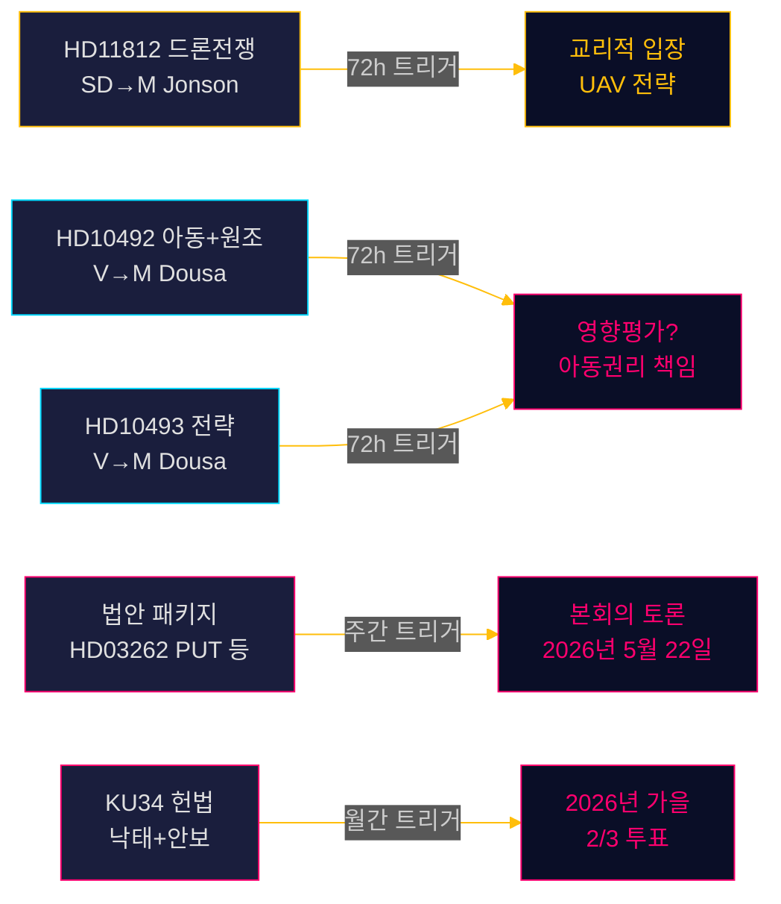
```mermaid
%%{init: {"theme": "dark", "themeVariables": {"primaryColor": "#00d9ff", "primaryTextColor": "#e0e0e0", "primaryBorderColor": "#ff006e", "lineColor": "#ffbe0b", "background": "#0a0e27", "mainBkg": "#1a1e3d", "nodeBorder": "#00d9ff"}}}%%
graph LR
    A[HD11812 드론전쟁<br/>SD→M Jonson] -->|72h 트리거| B[교리적 입장<br/>UAV 전략]
    C[HD10492 아동+원조<br/>V→M Dousa] -->|72h 트리거| D[영향평가?<br/>아동권리 책임]
    E[HD10493 전략<br/>V→M Dousa] -->|72h 트리거| D
    F[법안 패키지<br/>HD03262 PUT 등] -->|주간 트리거| G[본회의 토론<br/>2026년 5월 22일]
    H[KU34 헌법<br/>낙태+안보] -->|월간 트리거| I[2026년 가을<br/>2/3 투표]
    style A fill:#1a1e3d,stroke:#ffbe0b,color:#e0e0e0
    style C fill:#1a1e3d,stroke:#00d9ff,color:#e0e0e0
    style E fill:#1a1e3d,stroke:#00d9ff,color:#e0e0e0
    style F fill:#1a1e3d,stroke:#ff006e,color:#e0e0e0
    style H fill:#1a1e3d,stroke:#ff006e,color:#e0e0e0
    style B fill:#0a0e27,stroke:#ffbe0b,color:#ffbe0b
    style D fill:#0a0e27,stroke:#ff006e,color:#ff006e
    style G fill:#0a0e27,stroke:#ff006e,color:#ff006e
    style I fill:#0a0e27,stroke:#ff006e,color:#ff006e
```

<!-- source-sha: 4dab56d2891eeda118e9fe89207421ca0f0be533 -->

## Executive Brief Nl
<!-- source: executive-brief_nl.md :: https://github.com/Hack23/riksdagsmonitor/blob/main/analysis/daily/2026-05-15/realtime-pulse/executive-brief_nl.md -->

**Auteur**: James Pether Sörling  
**Datum**: 2026-05-15  
**Classificatie**: 🟢 OPENBAAR  
**Betrouwbaarheid**: HOOG [B2]  
**Horizon**: [horizon:72h] [horizon:week]

---

### 🎯 BLUF

Het Zweedse politieke landschap op 15 mei 2026 wordt bepaald door drie parallelle stressfactoren: SD zet minister van Defensie Pål Jonson onder druk over de drone-oorlogdoctrine na de Aurora 26-oefening (HD11812, [A2]); de Linkse Partij (V) intensiveert haar onderzoek naar de bezuinigingen op ontwikkelingshulp van de Tidö-coalitie, gericht op gevolgen voor kinderen en stopgezette landstrategieën (HD10492 [A2], HD10493 [A2]); en de zusteranalyses van vandaag bevestigen dat de rijksdag-sessie 2025/26 de diepste migratiepolitieke hervorming in een decennium omvat. Samen signaleert 15 mei een Riksdag in de eindspurt met hoog wetgevend volume en versnellende verkiezingspositionering voor september 2026.

### 🧭 3 beslissingen die dit rapport ondersteunt

1. **Redactionele prioritering**: Het hulpdebat (HD10492 / HD10493) is het hoofdverhaal van Riksdagsmonitor vandaag.  
2. **Veiligheidspolitieke bewaking**: De drone-vraag (HD11812) is een vroeg signaaaldocument over UAV-doctrine.  
3. **Migratiebeleidskalibratie**: Vijf wetsvoorstellen + 20 opposiemoties + KU34 signaleren belangrijke plenaire debatten in week 21.

### ⚡ 60-seconden lezing

- **HD11812** [B2]: Markus Wiechel (SD) vraagt minister van Defensie Pål Jonson (M) over drone-oorlogvoering — de Aurora 26-oefening (18.000 deelnemers, april–mei 2026, Gotland-focus) heeft UAV-tactische hiaten blootgelegd [horizon:72h].
- **HD10492** [A2]: Lotta Johnsson Fornarve (V) eist dat Benjamin Dousa (M) verantwoording aflegt over de gevolgen van hulpbezuinigingen voor kinderen — CRC-artikelen 6/26/28 ingeroepen [horizon:week].
- **HD10493** [A2]: Dezelfde interpellant vraagt over stopgezette hulpstrategieën — 14 van 37 strategieën afgebouwd, het 1%-van-BNI-doel opgegeven [horizon:week].
- **Wetspakket** [A2]: Vijf wetsvoorstellen incl. HD03262 (afschaffing PUT) — brede parlementaire kritiek (S + C + V + MP) [horizon:week].
- **KU34** [A2]: Dubbele grondwetswijziging — abortusrechten + verenigingsvrijheid — 2/3 supermeerderheid vereist, najaar 2026 [horizon:month].
- **Economische context**: Zweedse bbp-groei 2,3% (WEO apr-2026); hulp 0,7% → 0,36% van het bbp (2026-prognose) [B1].
- **Electorale barometer**: Aurora 26 + Oekraïne-lessen duiden erop dat SD een kiezersprofiel consolideert rond "sterke defensiepolitiek" [horizon:week].
- **Voorwaartse trigger**: Pål Jonsons antwoord op HD11812 en Benjamin Dousas antwoorden op HD10492/10493 bepalen of de vragen escaleren in week 21 [horizon:72h].

### 🔭 Belangrijkste voorwaartse trigger

**PIR-1 (72h)**: De schriftelijke antwoorden van Benjamin Dousa op HD10492 en HD10493 — erkent Dousa het ontbreken van impactbeoordelingen? Antwoorden worden verwacht in weken 20–21 (18–22 mei).

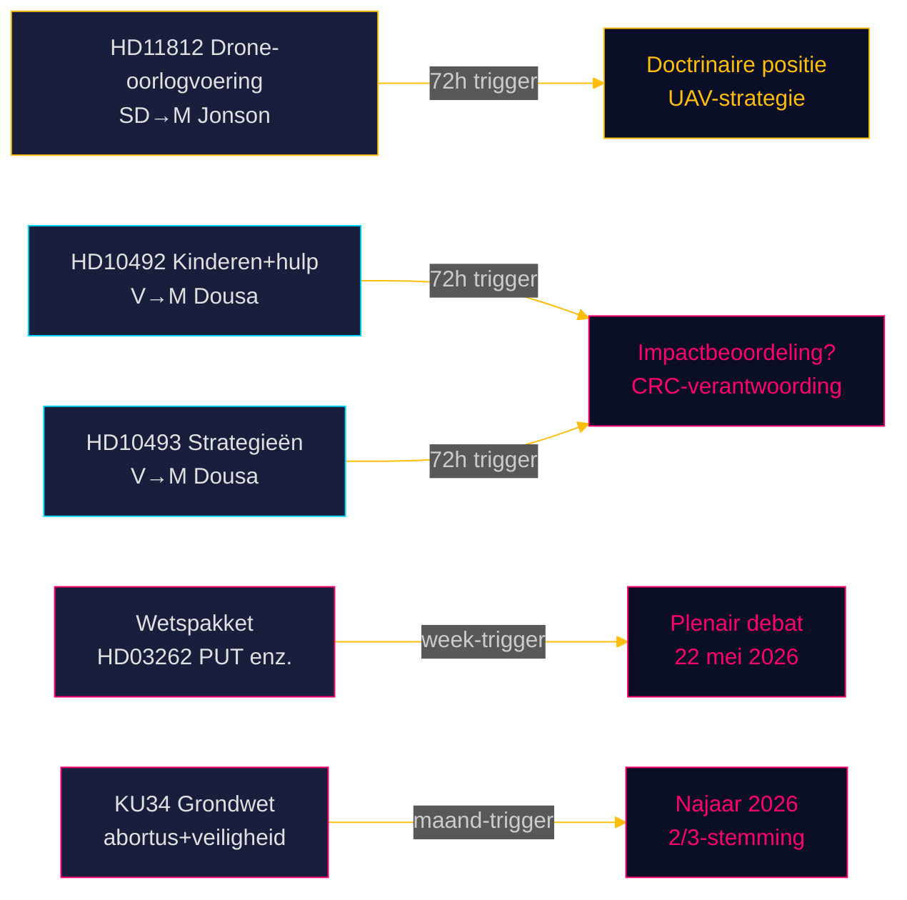
```mermaid
%%{init: {"theme": "dark", "themeVariables": {"primaryColor": "#00d9ff", "primaryTextColor": "#e0e0e0", "primaryBorderColor": "#ff006e", "lineColor": "#ffbe0b", "background": "#0a0e27", "mainBkg": "#1a1e3d", "nodeBorder": "#00d9ff"}}}%%
graph LR
    A[HD11812 Drone-oorlogvoering<br/>SD→M Jonson] -->|72h trigger| B[Doctrinaire positie<br/>UAV-strategie]
    C[HD10492 Kinderen+hulp<br/>V→M Dousa] -->|72h trigger| D[Impactbeoordeling?<br/>CRC-verantwoording]
    E[HD10493 Strategieën<br/>V→M Dousa] -->|72h trigger| D
    F[Wetspakket<br/>HD03262 PUT enz.] -->|week-trigger| G[Plenair debat<br/>22 mei 2026]
    H[KU34 Grondwet<br/>abortus+veiligheid] -->|maand-trigger| I[Najaar 2026<br/>2/3-stemming]
    style A fill:#1a1e3d,stroke:#ffbe0b,color:#e0e0e0
    style C fill:#1a1e3d,stroke:#00d9ff,color:#e0e0e0
    style E fill:#1a1e3d,stroke:#00d9ff,color:#e0e0e0
    style F fill:#1a1e3d,stroke:#ff006e,color:#e0e0e0
    style H fill:#1a1e3d,stroke:#ff006e,color:#e0e0e0
    style B fill:#0a0e27,stroke:#ffbe0b,color:#ffbe0b
    style D fill:#0a0e27,stroke:#ff006e,color:#ff006e
    style G fill:#0a0e27,stroke:#ff006e,color:#ff006e
    style I fill:#0a0e27,stroke:#ff006e,color:#ff006e
```

<!-- source-sha: 4dab56d2891eeda118e9fe89207421ca0f0be533 -->

## Executive Brief No
<!-- source: executive-brief_no.md :: https://github.com/Hack23/riksdagsmonitor/blob/main/analysis/daily/2026-05-15/realtime-pulse/executive-brief_no.md -->

**Forfatter**: James Pether Sörling  
**Dato**: 2026-05-15  
**Klassifisering**: 🟢 OFFENTLIG  
**Konfidensnivå**: HØY [B2]  
**Horisont**: [horizon:72h] [horizon:week]

---

### 🎯 BLUF

Sveriges politiske landskap 15. mai 2026 preges av tre parallelle stressorer: SD presser forsvarsminister Pål Jonson om dronedoktrin etter Aurora 26-øvelsen (HD11812, [A2]); Vänsterpartiet (V) intensiverer sin gransking av Tidö-regjeringens bistandskutt, med fokus på konsekvenser for barn og avviklede landestrategier (HD10492 [A2], HD10493 [A2]); og dagens søsteranalyser bekrefter at riksmøtet 2025/26 bærer preg av den dypeste migrasjonspolitiske omformingen på et tiår. Samlet sett signalerer 15. mai en riksdag i sin avsluttende sprint med høyt lovgivningsvolum og akselererende valgposisjonering frem mot september 2026.

### 🧭 3 beslutninger dette underlaget støtter

1. **Redaksjonell prioritering**: Bistantsdebatten (HD10492 / HD10493) er Riksdagsmonitors topphistorie i dag — internasjonal rekkevidde, en barnerettslig dimensjon og det globale USAID-sammenbruddet som bakteppe.  
2. **Sikkerhetspolitisk overvåking**: Dronespørsmålet (HD11812) er et tidlig signaldokument om UAV-doktrin og Aurora 26-lærdom — overvåk Pål Jonsons svar.  
3. **Migrasjonspolitisk kalibrering**: Dagens fem lovforslag + 20 opposisjonsmotioner + KU34 signalerer at plenardebatten i uke 21 (22. mai) kan avgjøre avstemningsutfall med en EU-rettslig dimensjon.

### ⚡ 60-sekunders lesning

- **HD11812** [B2]: SDs Markus Wiechel spør forsvarsminister Pål Jonson (M) om dronekrigsføring — Aurora 26-øvelsen (18 000 deltakere, april–mai 2026, Gotland-fokus) har avdekket UAV-taktiske hull [horizon:72h].
- **HD10492** [A2]: Vs Lotta Johnsson Fornarve krever at Benjamin Dousa (M) redegjør for konsekvensene for barn av bistandskuttene — Redd Barnas rapportering om stoppede underernæringsprogrammer; CRC artiklene 6/26/28 påberopes [horizon:week].
- **HD10493** [A2]: Samme interpellant spør om avviklede bistandsstrategier — 14 av 37 strategier nedmontert, 1%-av-BNI-målet forlatt [horizon:week].
- **Lovpakke** [A2]: Fem lovforslag inkl. HD03262 (PUT-avvikling) — bred parlamentarisk kritikk (S + C + V + MP) [horizon:week].
- **KU34** [A2]: Konstitusjonell dobbeltendring — abortrettigheter + foreningsfrihet — 2/3 supermajoritet kreves, høst 2026 [horizon:month].
- **Økonomisk kontekst**: Sveriges BNP-vekst 2,3% (WEO apr-2026); bistand 0,7% → 0,36% av BNP (2026-prognose) — laveste bistandsandel siden 1970-tallet [B1].
- **Valgbarometer**: Aurora 26 + Ukraina-krigens lærdom tyder på at SD konsoliderer en velgerprofil rundt "sterk forsvarspolitikk" [horizon:week].
- **Fremoverutløser**: Pål Jonsons svar på HD11812 og Benjamin Dousas svar på HD10492/10493 bestemmer om spørsmålene eskalerer til interpellasjonsdebatter i uke 21 [horizon:72h].

### 🔭 Viktigste fremoverutløser

**PIR-1 (72h)**: Benjamin Dousas skriftlige svar på HD10492 og HD10493 — vil Dousa erkjenne fraværet av konsekvensanalyser? Svar forventet i ukene 20–21 (18.–22. mai).

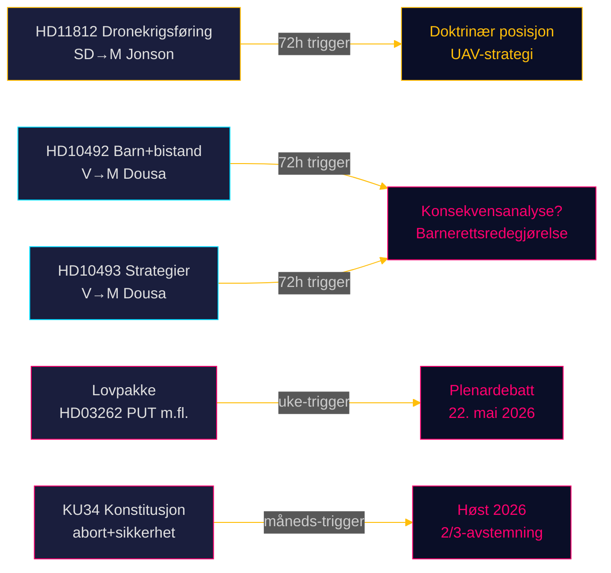
```mermaid
%%{init: {"theme": "dark", "themeVariables": {"primaryColor": "#00d9ff", "primaryTextColor": "#e0e0e0", "primaryBorderColor": "#ff006e", "lineColor": "#ffbe0b", "background": "#0a0e27", "mainBkg": "#1a1e3d", "nodeBorder": "#00d9ff"}}}%%
graph LR
    A[HD11812 Dronekrigsføring<br/>SD→M Jonson] -->|72h trigger| B[Doktrinær posisjon<br/>UAV-strategi]
    C[HD10492 Barn+bistand<br/>V→M Dousa] -->|72h trigger| D[Konsekvensanalyse?<br/>Barnerettsredegjørelse]
    E[HD10493 Strategier<br/>V→M Dousa] -->|72h trigger| D
    F[Lovpakke<br/>HD03262 PUT m.fl.] -->|uke-trigger| G[Plenardebatt<br/>22. mai 2026]
    H[KU34 Konstitusjon<br/>abort+sikkerhet] -->|måneds-trigger| I[Høst 2026<br/>2/3-avstemning]
    style A fill:#1a1e3d,stroke:#ffbe0b,color:#e0e0e0
    style C fill:#1a1e3d,stroke:#00d9ff,color:#e0e0e0
    style E fill:#1a1e3d,stroke:#00d9ff,color:#e0e0e0
    style F fill:#1a1e3d,stroke:#ff006e,color:#e0e0e0
    style H fill:#1a1e3d,stroke:#ff006e,color:#e0e0e0
    style B fill:#0a0e27,stroke:#ffbe0b,color:#ffbe0b
    style D fill:#0a0e27,stroke:#ff006e,color:#ff006e
    style G fill:#0a0e27,stroke:#ff006e,color:#ff006e
    style I fill:#0a0e27,stroke:#ff006e,color:#ff006e
```

<!-- source-sha: 4dab56d2891eeda118e9fe89207421ca0f0be533 -->

## Executive Brief Sv
<!-- source: executive-brief_sv.md :: https://github.com/Hack23/riksdagsmonitor/blob/main/analysis/daily/2026-05-15/realtime-pulse/executive-brief_sv.md -->

**Författare**: James Pether Sörling  
**Datum**: 2026-05-15  
**Klassificering**: 🟢 OFFENTLIG  
**Konfidensgrad**: HÖG [B2]  
**Horisont**: [horizon:72h] [horizon:week]

---

### 🎯 BLUF

Sveriges politiska landskap den 15 maj 2026 präglas av tre parallella stressorer: SD pressar försvarsminister Pål Jonson om drönarläran efter Aurora 26-övningen (HD11812, [A2]); Vänsterpartiet (V) trappas upp sin granskning av Tidöregeringens biståndsminskningar, med fokus på konsekvenserna för barn och avvecklade landsstrategier (HD10492 [A2], HD10493 [A2]); och dagens systeranalyser (se propositioner, utskottsbetänkanden, motioner) bekräftar att riksmötet 2025/26 präglas av det djupaste migrationspolitiska omstöpet på ett decennium, en konstitutionell ombalansering kring aborträtten och säkerhetsstaten, och den starkaste samordnade oppositionsoffensiven sedan 2022. Sammantaget signalerar 15 maj en riksdag i sin avslutande sprint, med hög lagstiftningsvolym, skärpt granskning och accelererande valpositionering inför september 2026.

### 🧭 3 beslut detta underlag stöder

1. **Redaktionell prioritering**: Bistånddebatten (HD10492 / HD10493) är Riksdagsmonitors lednyhet i dag — internationell räckvidd, en barnrättslig dimension och det globala USAID-sammanbrottet som bakgrund maximerar läsarrelevansen.  
2. **Säkerhetspolitisk bevakning**: Drönarfrågan (HD11812) är ett tidigt signaldokument om UAV-doktrin och Aurora 26 lärdomarna — bevaka Pål Jonsons svar för potentiella strategikonsekvenser.  
3. **Migrationspolitisk kalibrering**: Dagens fem propositioner + 20 oppositionsmotioner + KU34:s konstitutionsutskottsrapport signalerar att plenardebaterna i vecka 21 (22 maj) kan avgöra omröstningsutfall med en EU-rättslig dimension (PUT-avskaffande, förvar, EPBD).

### ⚡ 60-sekundersläsning

- **HD11812** [B2]: SD:s Markus Wiechel frågar försvarsminister Pål Jonson (M) om drönarkrigsföring — Aurora 26-övningen (18 000 deltagare, april–maj 2026, Gotlandsfokus) har blottat UAV-taktiska luckor; frågan skapar tryck för en offentlig doktrinell ståndpunkt [horizon:72h].
- **HD10492** [A2]: V:s Lotta Johnsson Fornarve kräver att Benjamin Dousa (M) redovisar konsekvenserna för barn av biståndsminskningarna — Rädda Barnens rapportering om stoppade undernäringsprogram utgör underlag; CRC artiklarna 6/26/28 åberopas [horizon:week].
- **HD10493** [A2]: Samma interpellant frågar om avvecklade biståndsstrategier — 14 av 37 strategier nedmonterade, 1%-av-BNI-målet övergett, avköningsfieringen av agendan sedan december 2023 dokumenterad; Dousa är under dubbelt tryck [horizon:week].
- **Propositionspaket** [A2]: Fem propositioner inklusive HD03262 (PUT-avskaffande) — lagstiftningspaketet i slutfasen; oppositionsmotioner (20 totalt) bekräftar bred parlamentarisk kritik (S + C + V + MP) [horizon:week].
- **KU34** [A2]: Konstitutionell dubbeländring — aborträtten + föreningsfriheten + medborgarskapsreglering — 2/3 supermajoritet krävs, höst 2026; politisk polarisering kommer prövas [horizon:month].
- **Ekonomisk kontext**: Sveriges BNP-tillväxt 2,3% (WEO apr-2026); bistånd 0,7% → 0,36% av BNP (2026-prognos) — den lägsta biståndsandelen sedan 1970-talet; IMF-vintagen (apr-2026, NGDP_RPCH) [B1].
- **Valbarometer**: Aurora 26 + Ukraina-krigets lärdomar tyder på att SD konsoliderar ett väljarerbjudande kring "stark försvarspolitik" med 72-timmarsfrågors brådskande karaktär; biståndsfrågan stärker V:s progressiva profil inför riksdagsvalet 2026 [horizon:week].
- **Framåtutlösare**: Pål Jonsons svar på HD11812 och Benjamin Dousas svar på HD10492 / HD10493 avgör om frågorna eskalerar till interpellationsdebatter i vecka 21 — båda ministrars ståndpunkter är PIR-öppna [horizon:72h].

### 🔭 Viktigaste framåtutlösare

**PIR-1 (72h)**: Benjamin Dousas skriftliga svar på HD10492 och HD10493 — kommer Dousa erkänna avsaknaden av konsekvensanalyser, eller hänvisa till den "nya biståndsagendan" som motivering? Svar förväntas i veckorna 20–21 (18–22 maj). Negativt svar → interpellationsdebatt → riksdagens möjlighet att rikta allvarlig kritik mot ministern ökar.

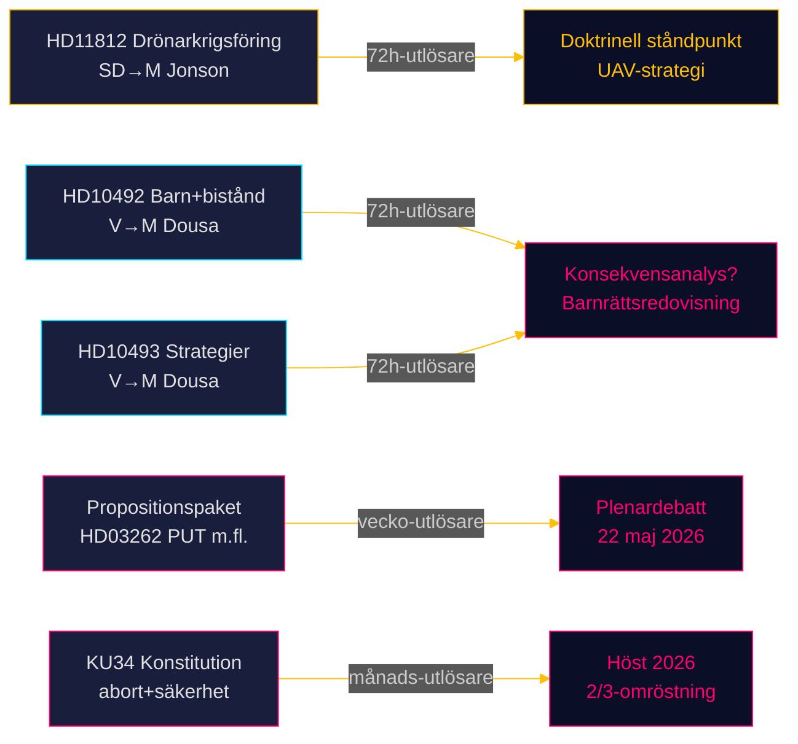
```mermaid
%%{init: {"theme": "dark", "themeVariables": {"primaryColor": "#00d9ff", "primaryTextColor": "#e0e0e0", "primaryBorderColor": "#ff006e", "lineColor": "#ffbe0b", "background": "#0a0e27", "mainBkg": "#1a1e3d", "nodeBorder": "#00d9ff"}}}%%
graph LR
    A[HD11812 Drönarkrigsföring<br/>SD→M Jonson] -->|72h-utlösare| B[Doktrinell ståndpunkt<br/>UAV-strategi]
    C[HD10492 Barn+bistånd<br/>V→M Dousa] -->|72h-utlösare| D[Konsekvensanalys?<br/>Barnrättsredovisning]
    E[HD10493 Strategier<br/>V→M Dousa] -->|72h-utlösare| D
    F[Propositionspaket<br/>HD03262 PUT m.fl.] -->|vecko-utlösare| G[Plenardebatt<br/>22 maj 2026]
    H[KU34 Konstitution<br/>abort+säkerhet] -->|månads-utlösare| I[Höst 2026<br/>2/3-omröstning]
    style A fill:#1a1e3d,stroke:#ffbe0b,color:#e0e0e0
    style C fill:#1a1e3d,stroke:#00d9ff,color:#e0e0e0
    style E fill:#1a1e3d,stroke:#00d9ff,color:#e0e0e0
    style F fill:#1a1e3d,stroke:#ff006e,color:#e0e0e0
    style H fill:#1a1e3d,stroke:#ff006e,color:#e0e0e0
    style B fill:#0a0e27,stroke:#ffbe0b,color:#ffbe0b
    style D fill:#0a0e27,stroke:#ff006e,color:#ff006e
    style G fill:#0a0e27,stroke:#ff006e,color:#ff006e
    style I fill:#0a0e27,stroke:#ff006e,color:#ff006e
```

---

## Executive Brief Zh
<!-- source: executive-brief_zh.md :: https://github.com/Hack23/riksdagsmonitor/blob/main/analysis/daily/2026-05-15/realtime-pulse/executive-brief_zh.md -->

**作者**：James Pether Sörling  
**日期**：2026-05-15  
**分类**：🟢 公开  
**可信度**：高 [B2]  
**时间维度**：[horizon:72h] [horizon:week]

---

### 🎯 摘要

2026年5月15日瑞典政治格局由三个并行压力因素决定：民主党（SD）在奥罗拉26演习后就无人机战争教义向国防部长帕尔·扬松施压（HD11812，[A2]）；左翼党（V）加强对蒂多联合政府援助削减的审查，聚焦对儿童的影响及被废止的国别战略（HD10492 [A2]、HD10493 [A2]）；今日姊妹分析证实2025/26年度国会期间包含十年来最深刻的移民政策改革。综合来看，5月15日标志着立法量高涨、选举定位加速的议会终局冲刺。

### 🧭 本简报支持的3项决策

1. **编辑优先级**：援助辩论（HD10492/HD10493）是瑞典议会监测今日头条。  
2. **安全政策监测**：无人机问题（HD11812）是UAV教义与奥罗拉26教训的早期信号文件。  
3. **移民政策校准**：五项法案+20项反对动议+KU34预示第21周重要全体辩论。

### ⚡ 60秒速读

- **HD11812** [B2]：SD的马库斯·维克尔就无人机战争向国防部长帕尔·扬松（M）提问——奥罗拉26演习（18,000名参与者，2026年4—5月，哥特兰重点）暴露UAV战术缺口 [horizon:72h]。
- **HD10492** [A2]：V的洛塔·约翰森·福纳尔维要求本亚明·杜萨（M）解释援助削减对儿童的影响——引用《儿童权利公约》第6/26/28条 [horizon:week]。
- **HD10493** [A2]：同一质询人询问被废止的援助战略——37项中14项被拆除，GNI1%目标被放弃 [horizon:week]。
- **法案包** [A2]：五项法案含HD03262——广泛议会批评（S+C+V+MP） [horizon:week]。
- **KU34** [A2]：双重宪法修正——堕胎权+结社自由——需2/3超多数，2026年秋 [horizon:month]。
- **经济背景**：瑞典GDP增长2.3%（WEO 2026年4月）；援助从0.7%→0.36%（2026年预测）——1970年代以来最低 [B1]。
- **选举晴雨表**：奥罗拉26和乌克兰战争教训表明SD正围绕"强力国防政策"巩固选民形象 [horizon:week]。
- **前向触发**：扬松对HD11812的回复和杜萨对HD10492/10493的回复将决定第21周是否升级 [horizon:72h]。

### 🔭 最重要的前向触发

**PIR-1 (72h)**：本亚明·杜萨对HD10492和HD10493的书面回复——是否承认缺乏影响评估？回复预计在第20—21周（5月18—22日）。

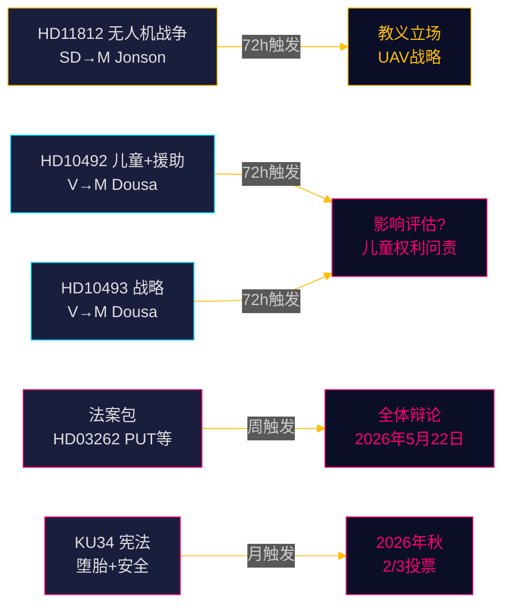
```mermaid
%%{init: {"theme": "dark", "themeVariables": {"primaryColor": "#00d9ff", "primaryTextColor": "#e0e0e0", "primaryBorderColor": "#ff006e", "lineColor": "#ffbe0b", "background": "#0a0e27", "mainBkg": "#1a1e3d", "nodeBorder": "#00d9ff"}}}%%
graph LR
    A[HD11812 无人机战争<br/>SD→M Jonson] -->|72h触发| B[教义立场<br/>UAV战略]
    C[HD10492 儿童+援助<br/>V→M Dousa] -->|72h触发| D[影响评估?<br/>儿童权利问责]
    E[HD10493 战略<br/>V→M Dousa] -->|72h触发| D
    F[法案包<br/>HD03262 PUT等] -->|周触发| G[全体辩论<br/>2026年5月22日]
    H[KU34 宪法<br/>堕胎+安全] -->|月触发| I[2026年秋<br/>2/3投票]
    style A fill:#1a1e3d,stroke:#ffbe0b,color:#e0e0e0
    style C fill:#1a1e3d,stroke:#00d9ff,color:#e0e0e0
    style E fill:#1a1e3d,stroke:#00d9ff,color:#e0e0e0
    style F fill:#1a1e3d,stroke:#ff006e,color:#e0e0e0
    style H fill:#1a1e3d,stroke:#ff006e,color:#e0e0e0
    style B fill:#0a0e27,stroke:#ffbe0b,color:#ffbe0b
    style D fill:#0a0e27,stroke:#ff006e,color:#ff006e
    style G fill:#0a0e27,stroke:#ff006e,color:#ff006e
    style I fill:#0a0e27,stroke:#ff006e,color:#ff006e
```

<!-- source-sha: 4dab56d2891eeda118e9fe89207421ca0f0be533 -->

## Analysis Artifact Coverage Report

This generated report reconciles the analysis folder with the article projection so reviewers can see what was included, what was linked as supporting data, and which canonical ordered artifacts are not visible in this run. Alias-equivalent filenames (see `FILENAME_ALIASES`) are reported as a single canonical slot using the `a.md / b.md` shorthand so a missing slot is not double-counted.

| Coverage area | Count | Reader-facing treatment |
|---|---:|---|
| Ordered/root markdown sections | 35 | Expanded as article sections in the narrative order above |
| Per-document analyses | 3 | Expanded under `## Per-document intelligence` immediately after significance scoring |
| Supporting data artifacts | 0 | Linked in Article Sources, not expanded inline |

**Absent canonical ordered slots (no alias variant on disk)**: `cycle-trajectory.md`, `parliamentary-season.md`, `quantitative-swot.md`, `political-stride-assessment.md`, `wildcards-blackswans.md`, `pestle-analysis.md`, `horizon-pir-rollforward.md`

**Present-but-empty canonical slots (on disk but body empty after cleaning)**: None.

**Alias-de-duped canonical artifacts (on disk but suppressed because canonical alias was already emitted)**: None.

## Article Sources

Each section above projects one analysis artifact. The full audited markdown is available on GitHub:

- [`executive-brief.md`](https://github.com/Hack23/riksdagsmonitor/blob/main/analysis/daily/2026-05-15/realtime-pulse/executive-brief.md)
- [`synthesis-summary.md`](https://github.com/Hack23/riksdagsmonitor/blob/main/analysis/daily/2026-05-15/realtime-pulse/synthesis-summary.md)
- [`intelligence-assessment.md`](https://github.com/Hack23/riksdagsmonitor/blob/main/analysis/daily/2026-05-15/realtime-pulse/intelligence-assessment.md)
- [`significance-scoring.md`](https://github.com/Hack23/riksdagsmonitor/blob/main/analysis/daily/2026-05-15/realtime-pulse/significance-scoring.md)
- [`documents/HD10492-analysis.md`](https://github.com/Hack23/riksdagsmonitor/blob/main/analysis/daily/2026-05-15/realtime-pulse/documents/HD10492-analysis.md)
- [`documents/HD10493-analysis.md`](https://github.com/Hack23/riksdagsmonitor/blob/main/analysis/daily/2026-05-15/realtime-pulse/documents/HD10493-analysis.md)
- [`documents/HD11812-analysis.md`](https://github.com/Hack23/riksdagsmonitor/blob/main/analysis/daily/2026-05-15/realtime-pulse/documents/HD11812-analysis.md)
- [`stakeholder-perspectives.md`](https://github.com/Hack23/riksdagsmonitor/blob/main/analysis/daily/2026-05-15/realtime-pulse/stakeholder-perspectives.md)
- [`coalition-mathematics.md`](https://github.com/Hack23/riksdagsmonitor/blob/main/analysis/daily/2026-05-15/realtime-pulse/coalition-mathematics.md)
- [`voter-segmentation.md`](https://github.com/Hack23/riksdagsmonitor/blob/main/analysis/daily/2026-05-15/realtime-pulse/voter-segmentation.md)
- [`forward-indicators.md`](https://github.com/Hack23/riksdagsmonitor/blob/main/analysis/daily/2026-05-15/realtime-pulse/forward-indicators.md)
- [`scenario-analysis.md`](https://github.com/Hack23/riksdagsmonitor/blob/main/analysis/daily/2026-05-15/realtime-pulse/scenario-analysis.md)
- [`election-2026-analysis.md`](https://github.com/Hack23/riksdagsmonitor/blob/main/analysis/daily/2026-05-15/realtime-pulse/election-2026-analysis.md)
- [`risk-assessment.md`](https://github.com/Hack23/riksdagsmonitor/blob/main/analysis/daily/2026-05-15/realtime-pulse/risk-assessment.md)
- [`swot-analysis.md`](https://github.com/Hack23/riksdagsmonitor/blob/main/analysis/daily/2026-05-15/realtime-pulse/swot-analysis.md)
- [`threat-analysis.md`](https://github.com/Hack23/riksdagsmonitor/blob/main/analysis/daily/2026-05-15/realtime-pulse/threat-analysis.md)
- [`historical-parallels.md`](https://github.com/Hack23/riksdagsmonitor/blob/main/analysis/daily/2026-05-15/realtime-pulse/historical-parallels.md)
- [`comparative-international.md`](https://github.com/Hack23/riksdagsmonitor/blob/main/analysis/daily/2026-05-15/realtime-pulse/comparative-international.md)
- [`implementation-feasibility.md`](https://github.com/Hack23/riksdagsmonitor/blob/main/analysis/daily/2026-05-15/realtime-pulse/implementation-feasibility.md)
- [`media-framing-analysis.md`](https://github.com/Hack23/riksdagsmonitor/blob/main/analysis/daily/2026-05-15/realtime-pulse/media-framing-analysis.md)
- [`devils-advocate.md`](https://github.com/Hack23/riksdagsmonitor/blob/main/analysis/daily/2026-05-15/realtime-pulse/devils-advocate.md)
- [`classification-results.md`](https://github.com/Hack23/riksdagsmonitor/blob/main/analysis/daily/2026-05-15/realtime-pulse/classification-results.md)
- [`cross-reference-map.md`](https://github.com/Hack23/riksdagsmonitor/blob/main/analysis/daily/2026-05-15/realtime-pulse/cross-reference-map.md)
- [`methodology-reflection.md`](https://github.com/Hack23/riksdagsmonitor/blob/main/analysis/daily/2026-05-15/realtime-pulse/methodology-reflection.md)
- [`data-download-manifest.md`](https://github.com/Hack23/riksdagsmonitor/blob/main/analysis/daily/2026-05-15/realtime-pulse/data-download-manifest.md)
- [`executive-brief_ar.md`](https://github.com/Hack23/riksdagsmonitor/blob/main/analysis/daily/2026-05-15/realtime-pulse/executive-brief_ar.md)
- [`executive-brief_da.md`](https://github.com/Hack23/riksdagsmonitor/blob/main/analysis/daily/2026-05-15/realtime-pulse/executive-brief_da.md)
- [`executive-brief_de.md`](https://github.com/Hack23/riksdagsmonitor/blob/main/analysis/daily/2026-05-15/realtime-pulse/executive-brief_de.md)
- [`executive-brief_es.md`](https://github.com/Hack23/riksdagsmonitor/blob/main/analysis/daily/2026-05-15/realtime-pulse/executive-brief_es.md)
- [`executive-brief_fi.md`](https://github.com/Hack23/riksdagsmonitor/blob/main/analysis/daily/2026-05-15/realtime-pulse/executive-brief_fi.md)
- [`executive-brief_fr.md`](https://github.com/Hack23/riksdagsmonitor/blob/main/analysis/daily/2026-05-15/realtime-pulse/executive-brief_fr.md)
- [`executive-brief_he.md`](https://github.com/Hack23/riksdagsmonitor/blob/main/analysis/daily/2026-05-15/realtime-pulse/executive-brief_he.md)
- [`executive-brief_ja.md`](https://github.com/Hack23/riksdagsmonitor/blob/main/analysis/daily/2026-05-15/realtime-pulse/executive-brief_ja.md)
- [`executive-brief_ko.md`](https://github.com/Hack23/riksdagsmonitor/blob/main/analysis/daily/2026-05-15/realtime-pulse/executive-brief_ko.md)
- [`executive-brief_nl.md`](https://github.com/Hack23/riksdagsmonitor/blob/main/analysis/daily/2026-05-15/realtime-pulse/executive-brief_nl.md)
- [`executive-brief_no.md`](https://github.com/Hack23/riksdagsmonitor/blob/main/analysis/daily/2026-05-15/realtime-pulse/executive-brief_no.md)
- [`executive-brief_sv.md`](https://github.com/Hack23/riksdagsmonitor/blob/main/analysis/daily/2026-05-15/realtime-pulse/executive-brief_sv.md)
- [`executive-brief_zh.md`](https://github.com/Hack23/riksdagsmonitor/blob/main/analysis/daily/2026-05-15/realtime-pulse/executive-brief_zh.md)
