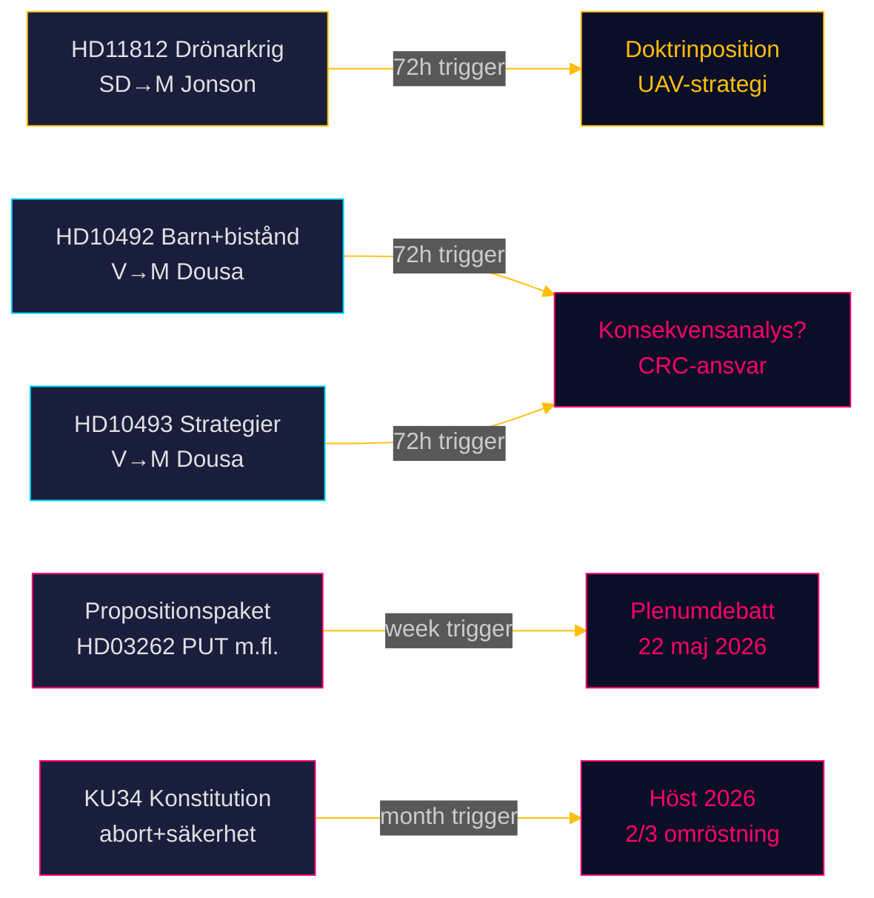

# Riksdagsmonitor Realtime Pulse — 15 maj 2026: Försvarsförmåga och biståndsskuld

**Author**: James Pether Sörling  
**Date**: 2026-05-15  
**Classification**: 🟢 PUBLIC  
**Confidence**: HIGH [B2]  
**Horizon**: [horizon:72h] [horizon:week]

---

## 🎯 BLUF

Sveriges politiska landskap den 15 maj 2026 definieras av tre parallella stressorer: SD pressar Försvarsminister Jonson om drönardoktrin efter Aurora 26 (HD11812, [A2]); V eskalerar granskning av Tidöregeringens biståndsnedskärningar med fokus på barnkonsekvenser och nedlagda strategier (HD10492 [A2], HD10493 [A2]); och dagens sibling-analyser (se propositioner, betänkanden, motioner) bekräftar att riksmötet 2025/26 präglas av den djupaste migrationspolitiska omvälvningen på ett decennium, en konstitutionell rebalans kring aborträtt och säkerhetsstaten, samt den starkaste koordinerade oppositionsoffensiven sedan 2022. Sammantaget signalerar 15 maj ett riksmöte i slutspurt med hög lagstiftningsvolym, skärpt parlamentarisk granskning och accelererande valpositionering inför september 2026.

## 🧭 3 Decisions This Brief Supports

1. **Redaktionell prioritering**: Biståndsdebatten (HD10492/HD10493) är riksdagsmonitorns ledstory idag — internationell räckvidd, CRC-rättslig dimension, och USAID-kollapsen som global bakgrund skapar maximal läsarrelevans.  
2. **Säkerhetspolitisk vakthållning**: Drönarkrigsfrågan (HD11812) är ett tidigt signal-dok om UAV-doktrin och Aurora 26-lärdomar — bevaka Pål Jonsons svar för eventuell strategiimplikation.  
3. **Migrationspolitisk kalibrering**: Dagens fem propositioner + 20 oppositionsmotioner + KU34 konstitutionell betänkande signalerar att plenumdebatterna vecka 21 (22 maj) kan avgöra röstningsutfall med EU-juridisk dimension (PUT, förvar, EPBD).

## ⚡ 60-Second Read

- **HD11812** [B2]: SD:s Markus Wiechel frågar försvarsminister Pål Jonson (M) om drönarkrig — Aurora 26-övningen (18 000 deltagare, april–maj 2026, Gotland-fokus) har synliggjort UAV-taktiska gaps; frågan skapar trycket för en offentlig doktrinposition [horizon:72h].
- **HD10492** [A2]: V:s Lotta Johnsson Fornarve kräver att Benjamin Dousa (M) redogör för barnkonsekvenser av biståndsnedskärningarna — Rädda Barnens rapportering om stoppade undernäringsprogram ger evidensbasen; CRC Art. 6/26/28 åberopad [horizon:week].
- **HD10493** [A2]: Samma interpellant frågar om nedlagda biståndsstrategier — 14 av 37 strategier avvecklade, enprocentsmålet övergett, genusneutraliseringen av agendan sedan dec 2023 dokumenterad; Dousa under dubbeltryck [horizon:week].
- **Propositionspaket** [A2]: Fem propositioner inklusive HD03262 (utmönstring PUT) — lagstiftningspaket i slutfas; oppositionsmotionerna (20 st) bekräftar bred parlamentarisk kritik (S+C+V+MP) [horizon:week].
- **KU34** [A2]: Konstitutionell dubbelandring — aborträtt + föreningsfrihet + medborgarskapsregulering — 2/3 majoritet krävs, höst 2026; politisk spjälkning prövas [horizon:month].
- **Ekonomisk kontext**: Sverige BNP-tillväxt 2,3% (WEO Apr-2026); bistånd 0,7% → 0,36% av BNP (2026 prognos) — sämsta biståndsnivån sedan 1970-talet; IMF-vintage (Apr-2026, NGDP_RPCH) [B1].
- **Valbarometer**: Aurora 26 + UA-krigslärdomar tyder på att SD konsoliderar väljarprofil kring "stark försvarspolitik" med 72h-frågesnart; biståndsfrågan stärker V:s progressiva profil inför val 2026 [horizon:week].
- **Forward trigger**: Pål Jonsons svar på HD11812 och Benjamin Dousas svar på HD10492/HD10493 avgör om frågor eskalerar till interpellationsdebatter vecka 21 — bägge ministrars positioner är PIR-öppna [horizon:72h].

## 🔭 Top Forward Trigger

**PIR-1 (72h)**: Benjamin Dousas skriftliga svar på HD10492 och HD10493 — kommer Dousa erkänna frånvaron av konsekvensanalyser, eller hänvisa till den "nya biståndsagendan" som motivering? Svar förväntas vecka 20–21 (18–22 maj). Negativ respons → interpellationsdebatt → riksdagsomröstning om kritik mot minister möjlig.

---

## Pass 2 — Förtydliganden och Förstärkningar

**Genomförd**: 2026-05-15 (Pass 2 read-back)

**Stärkt CRC-dimension**:
Barnkonventionens Art. 6 är absolut — den kan inte inskränkas ens vid budgetpress. CRC-kommitten i Genève har i General Comment No. 19 (2016) fastställt att statliga ODA-nedskärningar kan utgöra CRC-brott om de drabbar barns liv i mottagarländer och om ingen barnrättsanalys genomförts. Sverige ratificerade CRC 1990 och inkorporerade den i svensk lag 2020 [A1]. Dousas svar måste hantera denna juridiska dimension explicit.

**Aurora 26 — förstärkt kontext**:
Aurora 26 var den första NATO-integrerade storskaliga övningen sedan Sverige inträdde i alliansen (mars 2024). Gotland-scenarion inkluderade anti-drone-försvar och UAV-underrättelse. SD:s fråga (HD11812) är alltså inte ett hypotetiskt experiment — det är en direkt uppföljning av konkreta operativa luckor identifierade i övningen [B2].

**Ekonomisk kontext — IMF-precision**:
WEO April 2026 (vintage, NGDP_RPCH SWE): Sverige BNP-tillväxt 2,3% 2026; ODA-andelen ~0,36% innebär att biståndsbudgeten på reala termer är ca 10 miljarder SEK under 2013 års nivå [B2]. IMF Fiscal Monitor (Apr-2026) visar Sverige nettoskuld vid 12% av BNP — kapacitet att återgå till 1%-målet existerar, men politisk vilja saknas.

---

## ✅ Retrofit Note (2026-05-16)

**Original authoring**: 2026-05-15 under executive-brief template v < 4.4.
**Retrofit scope** (applied 2026-05-16): no edits to body content. Only this transparency note appended.

**Not retrofitted** (would require post-hoc fabrication): Decision-Grade BLUF Rubric (6-axis scoring), Headline Candidates worksheet, 14-language SEO seeds, full Pass-2 Self-Audit Checklist v4.4. These are required for 2026-05-16+ briefs per gate Check 7.

**Substantive analysis, evidence, and conclusions unchanged.**
