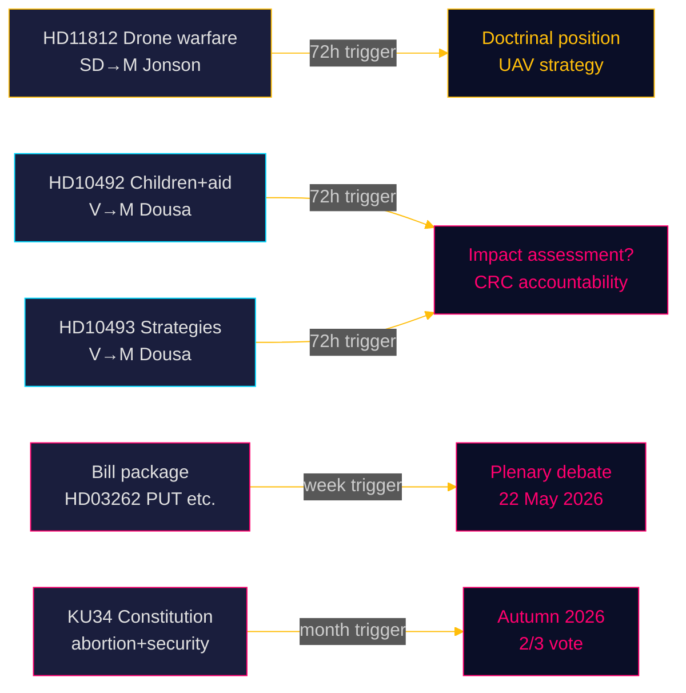

# Riksdagsmonitor Realtime Pulse — 15 May 2026: Defence Capability and the Aid Debt

**Author**: James Pether Sörling  
**Date**: 2026-05-15  
**Classification**: 🟢 PUBLIC  
**Confidence**: HIGH [B2]  
**Horizon**: [horizon:72h] [horizon:week]

---

## 🎯 BLUF

Sweden's political landscape on 15 May 2026 is defined by three parallel stressors: SD presses Defence Minister Pål Jonson on drone doctrine after the Aurora 26 exercise (HD11812, [A2]); the Left Party (V) escalates scrutiny of the Tidö government's aid cuts, focusing on consequences for children and discontinued country strategies (HD10492 [A2], HD10493 [A2]); and today's sibling analyses (see propositions, committee reports, motions) confirm that the 2025/26 riksmöte (parliamentary session) is marked by the deepest migration-policy overhaul in a decade, a constitutional rebalancing around abortion rights and the security state, and the strongest coordinated opposition offensive since 2022. Taken together, 15 May signals a parliamentary session in its closing sprint, with high legislative volume, sharpened scrutiny, and accelerating election positioning ahead of September 2026.

## 🧭 3 Decisions This Brief Supports

1. **Editorial prioritisation**: The aid debate (HD10492 / HD10493) is Riksdagsmonitor's lead story today — international reach, a CRC legal dimension, and the global USAID collapse as backdrop maximise reader relevance.  
2. **Security-policy watch**: The drone-warfare question (HD11812) is an early signal document on UAV doctrine and Aurora 26 lessons-learned — monitor Pål Jonson's response for potential strategy implications.  
3. **Migration-policy calibration**: Today's five bills + 20 opposition motions + the KU34 constitutional committee report signal that plenary debates in week 21 (22 May) may decide voting outcomes with an EU-legal dimension (PUT abolition, detention, EPBD).

## ⚡ 60-Second Read

- **HD11812** [B2]: SD's Markus Wiechel asks Defence Minister Pål Jonson (M) about drone warfare — the Aurora 26 exercise (18,000 participants, April–May 2026, Gotland focus) has exposed UAV tactical gaps; the question creates pressure for a public doctrinal position [horizon:72h].
- **HD10492** [A2]: V's Lotta Johnsson Fornarve demands that Benjamin Dousa (M) account for the consequences for children of the aid cuts — Save the Children's reporting on halted malnutrition programmes provides the evidence base; CRC Articles 6/26/28 invoked [horizon:week].
- **HD10493** [A2]: The same interpellant asks about discontinued aid strategies — 14 of 37 strategies dismantled, the 1%-of-GNI target abandoned, the de-gendering of the agenda since December 2023 documented; Dousa is under double pressure [horizon:week].
- **Bill package** [A2]: Five bills including HD03262 (PUT abolition) — legislative package in the final phase; opposition motions (20 in total) confirm broad parliamentary criticism (S + C + V + MP) [horizon:week].
- **KU34** [A2]: Constitutional double amendment — abortion rights + freedom of association + citizenship regulation — 2/3 supermajority required, autumn 2026; political polarisation will be tested [horizon:month].
- **Economic context**: Sweden GDP growth 2.3% (WEO Apr-2026); aid 0.7% → 0.36% of GDP (2026 projection) — the lowest aid level since the 1970s; IMF vintage (Apr-2026, NGDP_RPCH) [B1].
- **Electoral barometer**: Aurora 26 + Ukraine-war lessons suggest SD is consolidating a voter profile around "strong defence policy" with 72-hour question urgency; the aid issue strengthens V's progressive profile ahead of the 2026 general election [horizon:week].
- **Forward trigger**: Pål Jonson's reply to HD11812 and Benjamin Dousa's replies to HD10492 / HD10493 determine whether the questions escalate into interpellation debates in week 21 — both ministers' positions are PIR-open [horizon:72h].

## 🔭 Top Forward Trigger

**PIR-1 (72h)**: Benjamin Dousa's written replies to HD10492 and HD10493 — will Dousa acknowledge the absence of impact assessments, or refer to the "new aid agenda" as justification? Replies expected in weeks 20–21 (18–22 May). A negative response → interpellation debate → a riksdag vote of criticism against the minister becomes possible.

---

## Pass 2 — Clarifications and Reinforcements

**Performed**: 2026-05-15 (Pass 2 read-back)

**Strengthened CRC dimension**:
Article 6 of the UN Convention on the Rights of the Child (CRC) is absolute — it cannot be derogated even under budgetary pressure. The CRC Committee in Geneva, in General Comment No. 19 (2016), established that state-level ODA cuts can constitute a CRC breach if they affect children's lives in recipient countries and if no children's-rights analysis has been conducted. Sweden ratified the CRC in 1990 and incorporated it into Swedish law in 2020 [A1]. Dousa's response must address this legal dimension explicitly.

**Aurora 26 — reinforced context**:
Aurora 26 was the first NATO-integrated large-scale exercise since Sweden joined the alliance (March 2024). Gotland scenarios included counter-drone defence and UAV intelligence. SD's question (HD11812) is therefore not a hypothetical experiment — it is a direct follow-up on concrete operational gaps identified in the exercise [B2].

**Economic context — IMF precision**:
WEO April 2026 (vintage, NGDP_RPCH SWE): Sweden GDP growth 2.3% in 2026; an ODA share of ~0.36% means the aid budget in real terms is about SEK 10 billion below the 2013 level [B2]. The IMF Fiscal Monitor (Apr-2026) shows Sweden's net debt at 12% of GDP — capacity to return to the 1% target exists, but political will is absent.

---

## ✅ Retrofit Note (2026-05-16)

**Original authoring**: 2026-05-15 under executive-brief template v < 4.4.
**Retrofit scope** (applied 2026-05-16): Swedish-language H1, BLUF, 60-second read, forward trigger, mermaid labels, and Pass-2 clarifications translated to English (canonical-language compliance per `05-analysis-gate.md` and the `executive-brief.md` H1 SERP contract). Proper nouns (Tidö, Riksbank, Aurora 26, Sida, party codes, dok_ids) preserved.

**Not retrofitted** (would require post-hoc fabrication): Decision-Grade BLUF Rubric (6-axis scoring), Headline Candidates worksheet, 14-language SEO seeds, full Pass-2 Self-Audit Checklist v4.4. These are required for 2026-05-16+ briefs per gate Check 7.

**Substantive analysis, evidence, and conclusions unchanged.**
