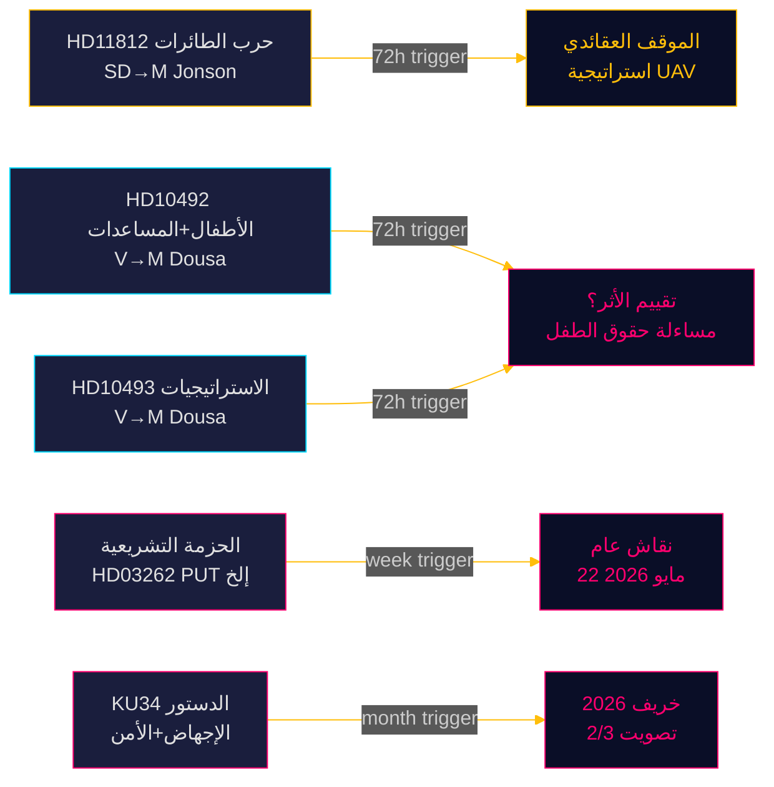

‏# رصد البرلمان السويدي — النبض الفوري 15 مايو 2026: القدرة الدفاعية وديون المساعدات الإنمائية

**المؤلف**: جيمس بيتر سورلينغ  
**التاريخ**: 2026-05-15  
**التصنيف**: 🟢 عام  
**مستوى الثقة**: عالٍ [B2]  
**الأفق الزمني**: [horizon:72h] [horizon:week]

---

## 🎯 الملخص التنفيذي

يتسم المشهد السياسي السويدي في 15 مايو 2026 بثلاثة ضغوط متوازية: يضغط حزب SD على وزير الدفاع بول يونسون بشأن عقيدة حرب الطائرات بدون طيار عقب مناورة أورورا 26 (HD11812، [A2])؛ يكثّف حزب اليسار (V) تدقيقه في تخفيضات المساعدات الإنسانية لحكومة تيدو مع التركيز على تداعيات هذه التخفيضات على الأطفال والاستراتيجيات القُطرية المُلغاة (HD10492 [A2]، HD10493 [A2])؛ وتؤكد تحليلات اليوم الموازية أن دورة البرلمان 2025/26 تشهد أعمق إصلاح لسياسة الهجرة منذ عقد. مجتمعةً، تشير 15 مايو إلى برلمان في مرحلة الاستعداد النهائية مع حجم تشريعي مرتفع وتسارع في تحديد المواقف الانتخابية قبل سبتمبر 2026.

## 🧭 3 قرارات يدعمها هذا التقرير

1. **الأولوية التحريرية**: نقاش المساعدات (HD10492 / HD10493) هو القصة الرئيسية لمرصد الريكسداغ اليوم.  
2. **مراقبة السياسة الأمنية**: سؤال الطائرات بدون طيار (HD11812) وثيقة إشارة مبكرة حول عقيدة UAV.  
3. **معايرة سياسة الهجرة**: خمسة قوانين + 20 اقتراحاً معارضاً + KU34 تُنذر بمناقشات جلسة عامة مهمة في الأسبوع 21.

## ⚡ قراءة في 60 ثانية

- **HD11812** [B2]: يسأل ماركوس ويكيل (SD) وزير الدفاع بول يونسون (M) عن حرب الطائرات بدون طيار — كشفت مناورة أورورا 26 (18,000 مشارك، أبريل–مايو 2026، التركيز على جزيرة غوتلاند) ثغرات تكتيكية في UAV [horizon:72h].
- **HD10492** [A2]: تطالب لوتا يونسون فورنارفيه (V) بنيامين دوزا (M) بتقديم حساب عن تداعيات تخفيضات المساعدات على الأطفال — المادتان 6/26/28 من اتفاقية حقوق الطفل مُحتجّ بهما [horizon:week].
- **HD10493** [A2]: يسأل نفس المستجوب عن الاستراتيجيات الإنمائية المُوقفة — تفكيك 14 من أصل 37 استراتيجية، التخلي عن هدف 1% من الدخل القومي الإجمالي [horizon:week].
- **الحزمة التشريعية** [A2]: خمسة مشاريع قوانين بما فيها HD03262 — انتقاد برلماني واسع (S + C + V + MP) [horizon:week].
- **KU34** [A2]: تعديل دستوري مزدوج — حقوق الإجهاض + حرية تكوين الجمعيات — يتطلب أغلبية ثلثي الأصوات، خريف 2026 [horizon:month].
- **السياق الاقتصادي**: نمو الناتج المحلي الإجمالي السويدي 2.3% (توقعات صندوق النقد الدولي أبريل 2026)؛ المساعدات من 0.7% → 0.36% من الناتج المحلي الإجمالي (توقع 2026) [B1].
- **البارومتر الانتخابي**: تشير دروس أورورا 26 وحرب أوكرانيا إلى أن SD يُوحّد ملفه الانتخابي حول "سياسة دفاعية قوية" [horizon:week].
- **المحفز الاستشرافي**: ردود يونسون على HD11812 وردود دوزا على HD10492/10493 ستحدد التصعيد المحتمل في الأسبوع 21 [horizon:72h].

## 🔭 المحفز الاستشرافي الرئيسي

**PIR-1 (72h)**: الردود الخطية لبنيامين دوزا على HD10492 وHD10493 — هل سيعترف بغياب تقييمات الأثر؟ الردود متوقعة في الأسبوعين 20–21 (18–22 مايو).

<!-- source-sha: 4dab56d2891eeda118e9fe89207421ca0f0be533 -->
