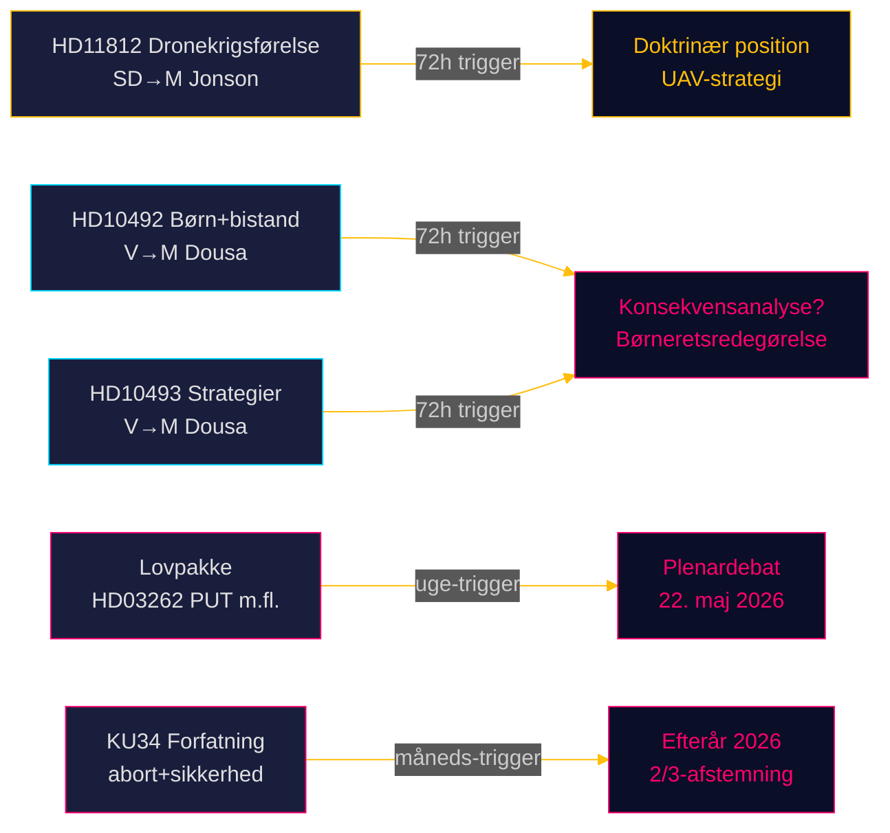

# Riksdagsmonitor Realtidspuls — 15. maj 2026: Forsvarskapacitet og bistands­gælden

**Forfatter**: James Pether Sörling  
**Dato**: 2026-05-15  
**Klassifikation**: 🟢 OFFENTLIG  
**Konfidensgrad**: HØJ [B2]  
**Horisont**: [horizon:72h] [horizon:week]

---

## 🎯 BLUF

Danmarks politiske landskab den 15. maj 2026 — Sveriges politiske landskab den 15. maj 2026 er præget af tre parallelle stressorer: SD presser forsvarsminister Pål Jonson om dronekrigsførselsdoktrin efter Aurora 26-øvelsen (HD11812, [A2]); Venstrefløjspartiet (V) intensiverer sin undersøgelse af Tidö-regeringens bistandsnedsæringer, med fokus på konsekvenser for børn og afviklede landestrategier (HD10492 [A2], HD10493 [A2]); og dagens søsteranalyser bekræfter, at riksmødet 2025/26 er præget af den dybeste migrationspolitiske omstøbning i et årti. Samlet set signalerer 15. maj en riksdag i sin afsluttende sprint med høj lovgivningsmæssig volumen og accelererende valgpositionering frem mod september 2026.

## 🧭 3 beslutninger dette underlag understøtter

1. **Redaktionel prioritering**: Bistandsdebatten (HD10492 / HD10493) er Riksdagsmonitors tophistorie i dag — international rækkevidde, en børneretlig dimension og det globale USAID-sammenbrud som baggrund.  
2. **Sikkerhedspolitisk overvågning**: Dronespørgsmålet (HD11812) er et tidligt signaldokument om UAV-doktrin og Aurora 26 lærdomme — overvåg Pål Jonsons svar.  
3. **Migrationspolitisk kalibrering**: Dagens fem lovforslag + 20 oppositionsmotioner + KU34 signalerer, at plenardebaterne i uge 21 (22. maj) kan afgøre afstemningsresultater med en EU-retlig dimension.

## ⚡ 60-sekunders læsning

- **HD11812** [B2]: SD's Markus Wiechel spørger forsvarsminister Pål Jonson (M) om dronekrigsførelse — Aurora 26-øvelsen (18.000 deltagere, april–maj 2026, Gotland-fokus) har afdækket UAV-taktiske huller [horizon:72h].
- **HD10492** [A2]: V's Lotta Johnsson Fornarve kræver, at Benjamin Dousa (M) redegør for konsekvenserne for børn af bistandsnedsæringerne — Bjærg Barnens rapportering om stoppede underernæringsprogrammer; CRC artiklerne 6/26/28 påberåbes [horizon:week].
- **HD10493** [A2]: Samme interpellant spørger om afviklede bistandsstrategier — 14 af 37 strategier nedmonteret, 1%-af-BNI-målet opgivet [horizon:week].
- **Lovpakke** [A2]: Fem lovforslag inkl. HD03262 (PUT-afskaffelse) — bred parlamentarisk kritik (S + C + V + MP) [horizon:week].
- **KU34** [A2]: Konstitutionel dobbeltændring — aborttrettigheder + foreningsfrihed — 2/3 supermajoritet krævet, efterår 2026 [horizon:month].
- **Økonomisk kontekst**: Sveriges BNP-vækst 2,3% (WEO apr-2026); bistand 0,7% → 0,36% af BNP (2026-prognose) — laveste bistands­andel siden 1970'erne [B1].
- **Valgbarometer**: Aurora 26 + Ukraine-krigens lærdomme tyder på, at SD konsoliderer et vælgerprofil om "stærk forsvarspolitik" [horizon:week].
- **Fremadrettet trigger**: Pål Jonsons svar på HD11812 og Benjamin Dousas svar på HD10492/10493 afgør, om spørgsmålene eskalerer til interpellationsdebatter i uge 21 [horizon:72h].

## 🔭 Vigtigste fremadrettede trigger

**PIR-1 (72h)**: Benjamin Dousas skriftlige svar på HD10492 og HD10493 — vil Dousa anerkende fraværet af konsekvensanalyser? Svar forventet i ugerne 20–21 (18.–22. maj).

<!-- source-sha: 4dab56d2891eeda118e9fe89207421ca0f0be533 -->
