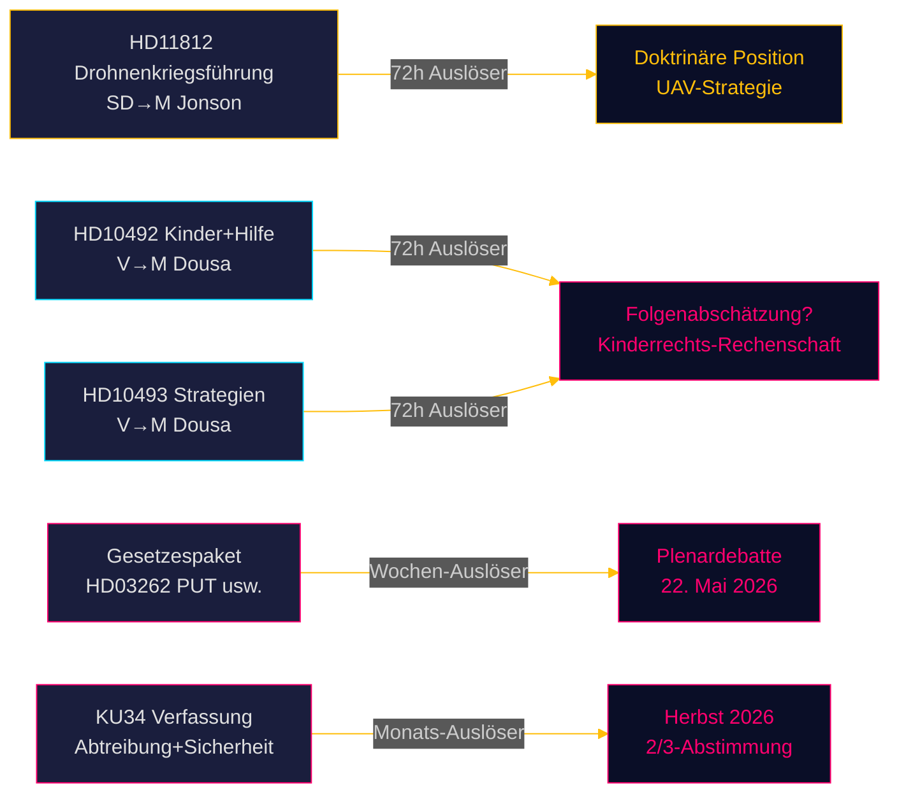

# Riksdagsmonitor Echtzeit-Puls — 15. Mai 2026: Verteidigungskapazität und die Entwicklungshilfeschuld

**Autor**: James Pether Sörling  
**Datum**: 2026-05-15  
**Klassifizierung**: 🟢 ÖFFENTLICH  
**Vertraulichkeitsgrad**: HOCH [B2]  
**Horizont**: [horizon:72h] [horizon:week]

---

## 🎯 BLUF

Die politische Lage Schwedens am 15. Mai 2026 wird durch drei parallele Stressoren bestimmt: SD setzt Verteidigungsminister Pål Jonson unter Druck bezüglich der Drohnenkriegsführungsdoktrin nach der Aurora-26-Übung (HD11812, [A2]); die Linkspartei (V) verschärft ihre Prüfung der Entwicklungshilfekürzungen der Tidö-Regierung mit Fokus auf Folgen für Kinder und abgewickelte Länderstrategien (HD10492 [A2], HD10493 [A2]); und die heutigen Schwesteranalysen bestätigen, dass die Riksdag-Session 2025/26 die tiefgreifendste Migrationspolitikreform seit einem Jahrzehnt erlebt. Insgesamt signalisiert der 15. Mai einen Reichstag in der Schlussphase mit hohem Gesetzgebungsvolumen und sich beschleunigender Wahlpositionierung vor September 2026.

## 🧭 3 Entscheidungen, die dieser Bericht unterstützt

1. **Redaktionelle Priorisierung**: Die Entwicklungshilfedebatte (HD10492 / HD10493) ist die Hauptgeschichte von Riksdagsmonitor heute.  
2. **Sicherheitspolitische Beobachtung**: Die Drohnenfrage (HD11812) ist ein frühes Signaldokument über UAV-Doktrin und Aurora-26-Lehren.  
3. **Migrationspolitische Kalibrierung**: Fünf Gesetze + 20 Oppositionsanträge + KU34 signalisieren wichtige Plenardebatten in Woche 21.

## ⚡ 60-Sekunden-Lektüre

- **HD11812** [B2]: SDs Markus Wiechel fragt Verteidigungsminister Pål Jonson (M) zur Drohnenkriegsführung — die Aurora-26-Übung (18.000 Teilnehmer, April–Mai 2026, Gotland-Fokus) hat UAV-taktische Lücken aufgedeckt [horizon:72h].
- **HD10492** [A2]: Vs Lotta Johnsson Fornarve fordert Benjamin Dousa (M) auf, die Folgen der Entwicklungshilfekürzungen für Kinder zu erläutern — CRC-Artikel 6/26/28 werden angeführt [horizon:week].
- **HD10493** [A2]: Dieselbe Interpellantin fragt nach abgewickelten Hilfsstrategien — 14 von 37 Strategien abgebaut, das 1%-des-BNE-Ziel aufgegeben [horizon:week].
- **Gesetzespaket** [A2]: Fünf Gesetze einschl. HD03262 (PUT-Abschaffung) — breite parlamentarische Kritik (S + C + V + MP) [horizon:week].
- **KU34** [A2]: Doppelte Verfassungsänderung — Abtreibungsrechte + Vereinigungsfreiheit — 2/3-Supermehrheit erforderlich, Herbst 2026 [horizon:month].
- **Wirtschaftlicher Kontext**: Schweden BIP-Wachstum 2,3% (WEO Apr-2026); Entwicklungshilfe 0,7% → 0,36% des BIP (2026-Prognose) [B1].
- **Wahlbarometer**: Aurora 26 + Ukraine-Lehren deuten darauf hin, dass SD ein Wählerprofil rund um "starke Verteidigungspolitik" konsolidiert [horizon:week].
- **Vorwärtsauslöser**: Pål Jonsons Antwort auf HD11812 und Benjamin Dousas Antworten auf HD10492/10493 entscheiden über eine mögliche Eskalation in Woche 21 [horizon:72h].

## 🔭 Wichtigster Vorwärtsauslöser

**PIR-1 (72h)**: Benjamin Dousas schriftliche Antworten auf HD10492 und HD10493 — wird Dousa das Fehlen von Folgenabschätzungen eingestehen? Antworten werden in den Wochen 20–21 (18.–22. Mai) erwartet.

<!-- source-sha: 4dab56d2891eeda118e9fe89207421ca0f0be533 -->
