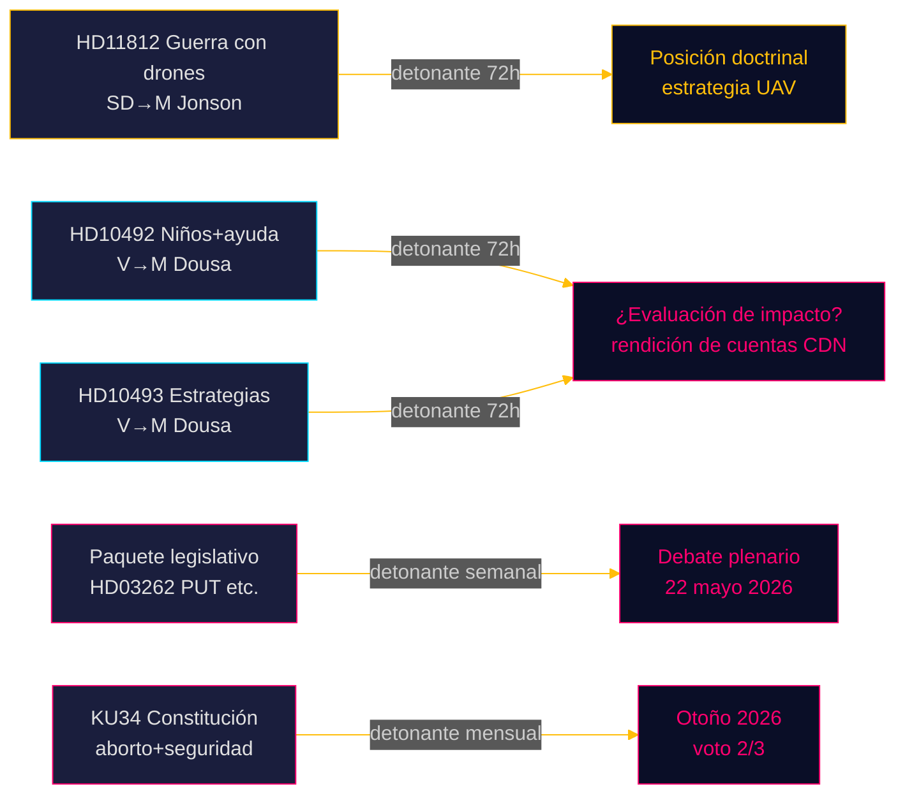

# Riksdagsmonitor Pulso en Tiempo Real — 15 de mayo de 2026: Capacidad defensiva y la deuda de ayuda al desarrollo

**Autor**: James Pether Sörling  
**Fecha**: 2026-05-15  
**Clasificación**: 🟢 PÚBLICO  
**Nivel de confianza**: ALTO [B2]  
**Horizonte**: [horizon:72h] [horizon:week]

---

## 🎯 BLUF

El panorama político sueco del 15 de mayo de 2026 está definido por tres factores de estrés paralelos: SD presiona al ministro de Defensa Pål Jonson sobre la doctrina de guerra con drones tras el ejercicio Aurora 26 (HD11812, [A2]); el Partido de Izquierda (V) intensifica el escrutinio de los recortes de ayuda de la coalición Tidö, centrado en las consecuencias para los niños y las estrategias-país abandonadas (HD10492 [A2], HD10493 [A2]); y los análisis hermanos de hoy confirman que la sesión del Riksdag 2025/26 está marcada por la reforma migratoria más profunda en una década. En conjunto, el 15 de mayo señala un Riksdag en su sprint final con alto volumen legislativo y acelerado posicionamiento electoral antes de septiembre de 2026.

## 🧭 3 decisiones que apoya este informe

1. **Priorización editorial**: El debate sobre la ayuda (HD10492 / HD10493) es la noticia principal de Riksdagsmonitor hoy.  
2. **Vigilancia de política de seguridad**: La pregunta sobre drones (HD11812) es un documento de señal temprana sobre doctrina UAV.  
3. **Calibración de política migratoria**: Cinco proyectos de ley + 20 mociones + KU34 anuncian debates plenarios importantes en la semana 21.

## ⚡ Lectura en 60 segundos

- **HD11812** [B2]: Markus Wiechel (SD) pregunta al ministro de Defensa Pål Jonson (M) sobre guerra con drones — el ejercicio Aurora 26 (18.000 participantes, abril–mayo 2026, enfoque Gotland) reveló lagunas tácticas UAV [horizon:72h].
- **HD10492** [A2]: Lotta Johnsson Fornarve (V) exige que Benjamin Dousa (M) rinda cuentas de las consecuencias de los recortes de ayuda para los niños — artículos 6/26/28 de la CDN invocados [horizon:week].
- **HD10493** [A2]: La misma interpelante pregunta sobre estrategias de ayuda abandonadas — 14 de 37 estrategias desmanteladas, objetivo del 1 % de RNB abandonado [horizon:week].
- **Paquete legislativo** [A2]: Cinco proyectos incluyendo HD03262 (abolición del PUT) — amplia crítica parlamentaria (S + C + V + MP) [horizon:week].
- **KU34** [A2]: Doble enmienda constitucional — derechos reproductivos + libertad de asociación — supermayoría de 2/3 requerida, otoño 2026 [horizon:month].
- **Contexto económico**: Crecimiento del PIB sueco 2,3% (WEO abr-2026); ayuda 0,7% → 0,36% del PIB (previsión 2026) [B1].
- **Barómetro electoral**: Aurora 26 + lecciones de la guerra en Ucrania indican que SD consolida un perfil electoral en torno a una "política de defensa fuerte" [horizon:week].
- **Detonante prospectivo**: Las respuestas de Pål Jonson a HD11812 y de Benjamin Dousa a HD10492/10493 determinarán una posible escalada en la semana 21 [horizon:72h].

## 🔭 Principal detonante prospectivo

**PIR-1 (72h)**: Las respuestas escritas de Benjamin Dousa a HD10492 y HD10493 — ¿reconocerá la ausencia de evaluaciones de impacto? Respuestas esperadas en las semanas 20–21 (18–22 de mayo).

<!-- source-sha: 4dab56d2891eeda118e9fe89207421ca0f0be533 -->
