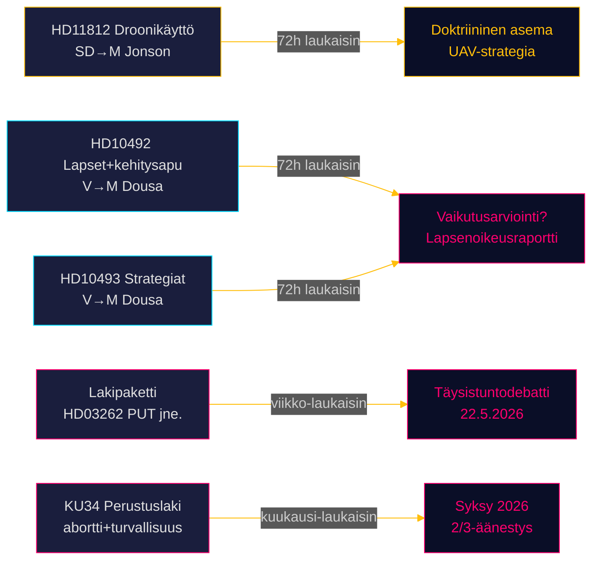

# Riksdagsmonitor Reaaliaikapulssi — 15. toukokuuta 2026: Puolustuskyky ja kehitysyhteistyövelka

**Tekijä**: James Pether Sörling  
**Päivämäärä**: 2026-05-15  
**Luokittelu**: 🟢 JULKINEN  
**Luotettavuus**: KORKEA [B2]  
**Horisontti**: [horizon:72h] [horizon:week]

---

## 🎯 BLUF

Ruotsin poliittinen tilanne 15. toukokuuta 2026 on kolmen yhtäaikaisen paineen alainen: SD painostaa puolustusministeri Pål Jonsonia droonisotataktiikasta Aurora 26 -harjoituksen jälkeen (HD11812, [A2]); Vasemmistopuolue (V) tiivistää Tidö-hallituksen kehitysapuleikkauksien tarkastelua keskittyen lapsiuhrien ja lakkautettujen maastrategioiden seurauksiin (HD10492 [A2], HD10493 [A2]); ja tämän päivän sisaranalyysit vahvistavat, että riksmötet 2025/26 on leimattu vuosikymmenen syvimmällä maahanmuuttopolitiikan uudistuksella. Yhdessä 15. toukokuuta merkitsee riksdagin kiireistä loppusuoraa kohti syyskuun 2026 vaaleja.

## 🧭 3 päätöstä, joita tämä tiivistelmä tukee

1. **Toimituksellinen priorisointi**: Kehitysapudebatti (HD10492 / HD10493) on Riksdagsmonitorin päätarina tänään.  
2. **Turvallisuuspolitiikan seuranta**: Droonisodan kysymys (HD11812) on varhainen signaalidokumentti Aurora 26 -opeista.  
3. **Maahanmuuttopolitiikan kalibrointi**: Viisi lakiesitystä + 20 oppositioaloitetta + KU34 viittaavat suuriin täysistuntodebatteihin viikolla 21.

## ⚡ 60 sekunnin lukeminen

- **HD11812** [B2]: SD:n Markus Wiechel kysyy puolustusministeri Pål Jonsonilta (M) droonisotataktiikasta — Aurora 26 -harjoitus (18 000 osallistujaa, huhti–toukokuu 2026, Gotlannin fokus) paljasti UAV-taktisia aukkoja [horizon:72h].
- **HD10492** [A2]: V:n Lotta Johnsson Fornarve vaatii Benjamin Dousaa (M) selvittämään kehitysapuleikkausten seuraukset lapsille — Pelastakaa Lapset -järjestön raportti aliravitsemusohjelmien keskeyttämisestä; CRC artiklat 6/26/28 vedottu [horizon:week].
- **HD10493** [A2]: Sama interpellantti kysyy lakkautetuista kehitysapustrategioista — 14/37 strategiaa purettu, 1 %:n BKT-tavoite hylätty [horizon:week].
- **Lakipaketti** [A2]: Viisi lakiesitystä ml. HD03262 (PUT-poisto) — laaja parlamentaarinen kritiikki (S + C + V + MP) [horizon:week].
- **KU34** [A2]: Perustuslaillinen kaksoistarkistus — aborttioikeudet + yhdistymisvapaus — 2/3 supermajoriteetti vaaditaan, syksy 2026 [horizon:month].
- **Taloudellinen konteksti**: Ruotsin BKT-kasvu 2,3 % (WEO huhti-2026); kehitysapu 0,7 % → 0,36 % BKT:stä (2026-ennuste) — alin kehitysapuosuus sitten 1970-luvun [B1].
- **Vaalimittari**: Aurora 26 + Ukrainan sodan opit viittaavat SD:n konsolidoivan äänestysprofiilin "vahvan puolustuspolitiikan" ympärille [horizon:week].
- **Eteenpäin suuntautuva laukaisin**: Pål Jonssonin vastaus HD11812:een ja Benjamin Dousan vastaukset HD10492/10493:een ratkaisevat, eskaloituvatko kysymykset interpellaatiodebateiksi viikolla 21 [horizon:72h].

## 🔭 Tärkein eteenpäin suuntautuva laukaisin

**PIR-1 (72h)**: Benjamin Dousan kirjalliset vastaukset HD10492:een ja HD10493:een — myöntääkö Dousa vaikutusarviointien puuttumisen? Vastaukset odotetaan viikoilla 20–21 (18.–22. toukokuuta).

<!-- source-sha: 4dab56d2891eeda118e9fe89207421ca0f0be533 -->
