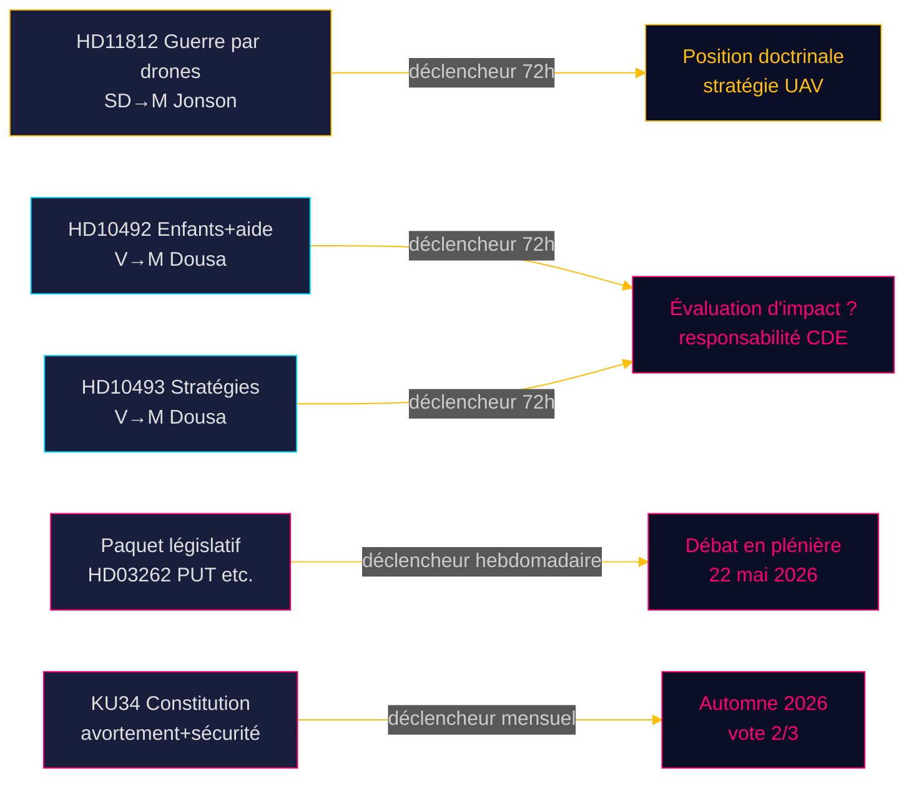

# Riksdagsmonitor Pouls en Temps Réel — 15 mai 2026 : Capacité défensive et la dette humanitaire

**Auteur** : James Pether Sörling  
**Date** : 2026-05-15  
**Classification** : 🟢 PUBLIC  
**Niveau de confiance** : ÉLEVÉ [B2]  
**Horizon** : [horizon:72h] [horizon:week]

---

## 🎯 BLUF

Le paysage politique suédois du 15 mai 2026 est marqué par trois facteurs de stress parallèles : SD presse le ministre de la Défense Pål Jonson sur la doctrine de guerre par drones après l'exercice Aurora 26 (HD11812, [A2]) ; le Parti de gauche (V) intensifie son examen des réductions d'aide de la coalition Tidö, en se concentrant sur les conséquences pour les enfants et les stratégies-pays abandonnées (HD10492 [A2], HD10493 [A2]) ; et les analyses sœurs de la journée confirment que la session du Riksdag 2025/26 est marquée par la réforme migratoire la plus profonde en une décennie. Ensemble, le 15 mai signale un Riksdag en fin de session avec un volume législatif élevé et un positionnement électoral accéléré avant septembre 2026.

## 🧭 3 décisions que ce rapport soutient

1. **Priorisation éditoriale** : Le débat sur l'aide (HD10492 / HD10493) est la principale histoire de Riksdagsmonitor aujourd'hui.  
2. **Veille sécuritaire** : La question des drones (HD11812) est un document signal précoce sur la doctrine UAV.  
3. **Calibration de la politique migratoire** : Cinq projets de loi + 20 motions + KU34 signalent d'importants débats en séance plénière à la semaine 21.

## ⚡ Lecture en 60 secondes

- **HD11812** [B2] : Markus Wiechel (SD) interroge le ministre de la Défense Pål Jonson (M) sur la guerre par drones — l'exercice Aurora 26 (18 000 participants, avril–mai 2026, focus Gotland) a révélé des lacunes UAV [horizon:72h].
- **HD10492** [A2] : Lotta Johnsson Fornarve (V) demande à Benjamin Dousa (M) de rendre compte des conséquences des coupes dans l'aide pour les enfants — articles 6/26/28 de la CDE invoqués [horizon:week].
- **HD10493** [A2] : La même interpellante interroge sur les stratégies d'aide abandonnées — 14 des 37 stratégies démantelées, l'objectif de 1 % du RNB abandonné [horizon:week].
- **Paquet législatif** [A2] : Cinq projets de loi dont HD03262 (suppression du PUT) — large critique parlementaire (S + C + V + MP) [horizon:week].
- **KU34** [A2] : Double amendement constitutionnel — droits à l'avortement + liberté d'association — super-majorité des 2/3 requise, automne 2026 [horizon:month].
- **Contexte économique** : Croissance du PIB suédois 2,3 % (WEO avr-2026) ; aide 0,7 % → 0,36 % du PIB (prévision 2026) — niveau le plus bas depuis les années 1970 [B1].
- **Baromètre électoral** : Aurora 26 + enseignements de la guerre en Ukraine indiquent que SD consolide un profil électoral autour de la "politique de défense forte" [horizon:week].
- **Déclencheur prospectif** : Les réponses de Pål Jonson à HD11812 et de Benjamin Dousa à HD10492/10493 détermineront une éventuelle escalade en semaine 21 [horizon:72h].

## 🔭 Principal déclencheur prospectif

**PIR-1 (72h)** : Les réponses écrites de Benjamin Dousa à HD10492 et HD10493 — reconnaîtra-t-il l'absence d'évaluations d'impact ? Réponses attendues semaines 20–21 (18–22 mai).

<!-- source-sha: 4dab56d2891eeda118e9fe89207421ca0f0be533 -->
