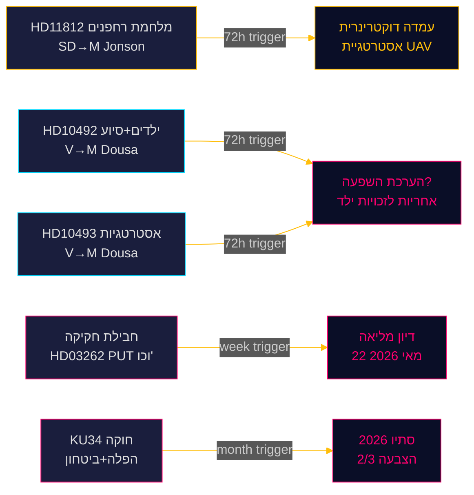

‏# ריקסדאגסמוניטור — פולס בזמן אמת 15 במאי 2026: יכולת הגנה וחוב הסיוע

**מחבר**: James Pether Sörling  
**תאריך**: 2026-05-15  
**סיווג**: 🟢 ציבורי  
**רמת אמינות**: גבוהה [B2]  
**אופק**: [horizon:72h] [horizon:week]

---

## 🎯 BLUF

הנוף הפוליטי של שבדיה ב-15 במאי 2026 מאופיין בשלושה לחצים מקבילים: SD לוחץ על שר הביטחון פול יונסון בנוגע לדוקטרינת מלחמת רחפנים לאחר תרגיל אורורה 26 (HD11812, [A2]); מפלגת השמאל (V) מגברת את בחינת קיצוצי הסיוע של קואליציית טידו תוך התמקדות בהשלכות על ילדים ואסטרטגיות מדינה שבוטלו (HD10492 [A2], HD10493 [A2]); וניתוחי היום האחיים מאשרים כי מושב הריקסדאג 2025/26 מסומן ברפורמה המעמיקה ביותר במדיניות ההגירה מאז עשור. ביחד, ה-15 במאי מסמן פרלמנט בספרינט הסיום שלו עם נפח חקיקתי גבוה ומיצוב בחירות מואץ לקראת ספטמבר 2026.

## 🧭 3 החלטות שדו"ח זה תומך בהן

1. **עדיפות עריכה**: ויכוח הסיוע (HD10492 / HD10493) הוא הסיפור הראשי של ריקסדאגסמוניטור היום.  
2. **מעקב ביטחוני**: שאלת הרחפנים (HD11812) היא מסמך אות מוקדם בנושא דוקטרינת UAV.  
3. **כיול מדיניות הגירה**: חמישה הצעות חוק + 20 הצעות אופוזיציה + KU34 מסמנים דיונים מליאה חשובים בשבוע 21.

## ⚡ קריאה ב-60 שניות

- **HD11812** [B2]: מרקוס ויקיל (SD) שואל את שר הביטחון פול יונסון (M) על מלחמת רחפנים — תרגיל אורורה 26 (18,000 משתתפים, אפריל–מאי 2026, מיקוד על גוטלנד) חשף פערים טקטיים ב-UAV [horizon:72h].
- **HD10492** [A2]: לוטה יונסון פורנרוה (V) דורשת מבנימין דוסה (M) להסביר את השלכות קיצוצי הסיוע על ילדים — סעיפים 6/26/28 של אמנת זכויות הילד הופעלו [horizon:week].
- **HD10493** [A2]: אותה חברת כנסת שואלת על אסטרטגיות סיוע שבוטלו — 14 מתוך 37 אסטרטגיות פורקו, יעד 1% מה-GNI ננטש [horizon:week].
- **חבילת חקיקה** [A2]: חמש הצעות חוק כולל HD03262 — ביקורת פרלמנטרית רחבה (S + C + V + MP) [horizon:week].
- **KU34** [A2]: תיקון חוקתי כפול — זכויות הפלה + חופש ההתאגדות — נדרשת רוב של 2/3, סתיו 2026 [horizon:month].
- **הקשר כלכלי**: צמיחת התמ"ג של שבדיה 2.3% (WEO אפריל 2026); סיוע 0.7% → 0.36% מהתמ"ג (תחזית 2026) [B1].
- **ברומטר בחירות**: תרגיל אורורה 26 ולקחי מלחמת אוקראינה מצביעים על כך שSD מגבש פרופיל בוחרים סביב "מדיניות ביטחון חזקה" [horizon:week].
- **טריגר קדימה**: תשובות יונסון ל-HD11812 ותשובות דוסה ל-HD10492/10493 יקבעו אם השאלות מסלימות בשבוע 21 [horizon:72h].

## 🔭 הטריגר הקדימה החשוב ביותר

**PIR-1 (72h)**: התשובות הכתובות של בנימין דוסה ל-HD10492 ו-HD10493 — האם דוסה יכיר בהיעדר הערכות השפעה? תשובות צפויות בשבועות 20–21 (18–22 במאי).

<!-- source-sha: 4dab56d2891eeda118e9fe89207421ca0f0be533 -->
